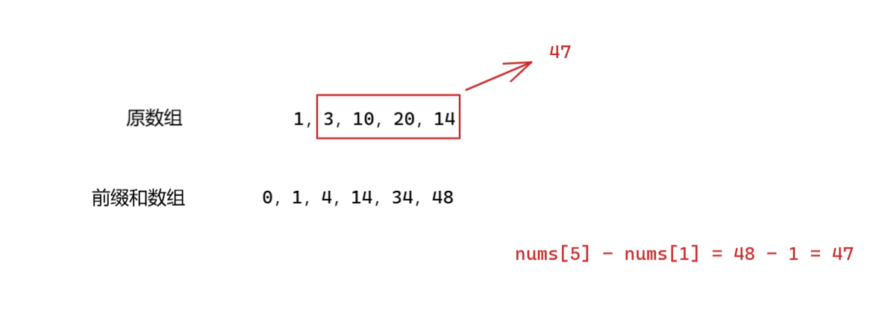
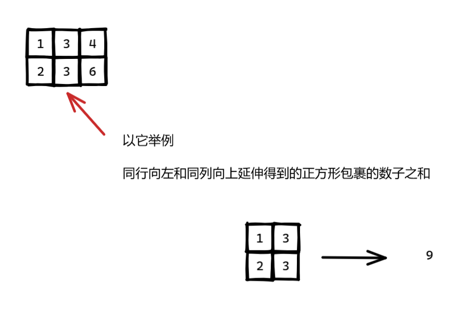
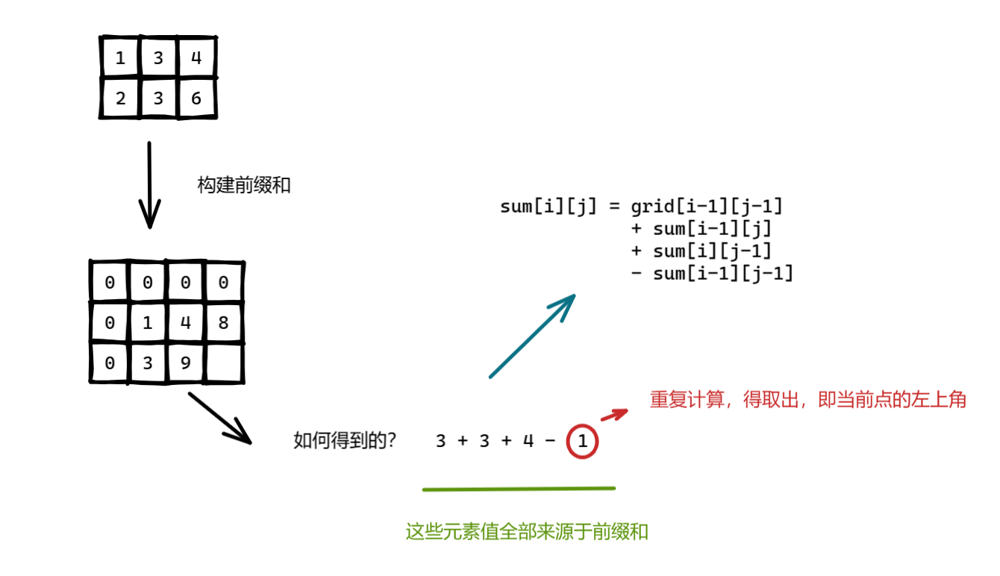
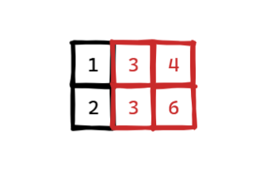
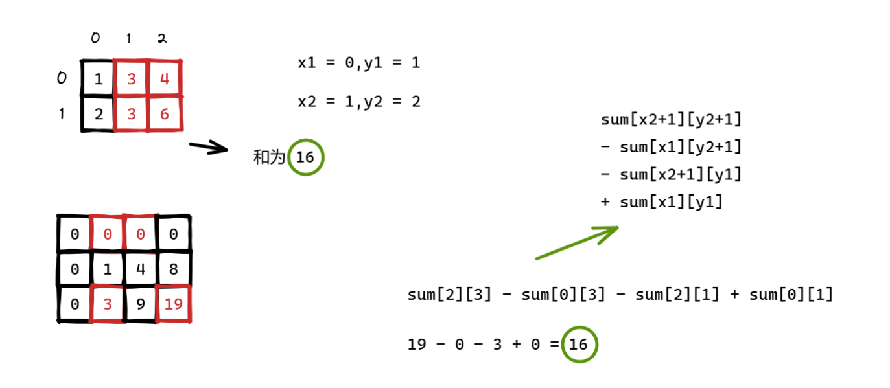

[TOC]

## 怎么判断这道题是不是要用到前缀和？


## 一维前缀和

前缀和（Prefix Sum）是一种常见的算法技巧，通常用于解决一些与**区间求和**相关的问题。其核心思想是，通过预处理原始数组，生成一个新的数组，使得可以快速计算任意区间的和。

```C++
    int n = nums.size();
    vector<int> prefixSum(n + 1, 0); // prefixSum[i] 是 nums[0] 到 nums[i-1] 的和
    
    // 构建前缀和，其中 nums 是原数组，而 prefixSum 是前缀和数组
    for (int i = 1; i <= n; ++i) {
        prefixSum[i] = prefixSum[i - 1] + nums[i - 1];
    }
```

适用场景：

- 多次查询某个数组区间 `[l,r]` 的和
- 提高区间求和的效率，从 `O(n)` 降到 `O(1)`

&nbsp;

如果我们要求某个区间内的和，比如 [1,4] 内的和：

```C++
sum = prefixSum[4 + 1] - prefixSum[1]
```

示意图：



## 二维前缀和

对于一个矩阵 `grid[m][n]`，我们构建一个新矩阵 `sum[m+1][n+1]`，让它满足：

```c++
sum[i][j] 表示从 (0,0) 到 (i-1,j-1) 的矩形区域的总和
```

> 注意：`sum` 多了一行一列，用来避免越界，方便计算。

构建公式：`i > 0 且 j > 0`，i 和 j 指前缀和的下标

```c++
vector<vector<int>> sum(m + 1, vector<int>(n + 1, 0));
for (int i = 1; i <= m; ++i) {
    for (int j = 1; j <= n; ++j) {
        sum[i][j] = grid[i - 1][j - 1]
                    + sum[i - 1][j]
                    + sum[i][j - 1]
                    - sum[i - 1][j - 1];
    }
}
```

**含义解释：**

- `grid[i-1][j-1]` 是当前格子值**（切记这里是原数组，且要让两边下标 - 1）**
- `sum[i-1][j]` 是上面矩形
- `sum[i][j-1]` 是左边矩形
- `sum[i-1][j-1]` 是重复计算的左上角，要减掉一次

详细示例：

```
grid =
1 3 4
2 3 6
```

我们构建一个 `sum[3][4]`（因为原始是 2x3）：

初始都是 0：

```
0 0 0 0
0 1 4 8
0 3 9 19
```

例子：`sum[2][3]` 是 grid 中从 `(0,0)` 到 `(1,2)` 的矩形区域的总和：

```
1 3 4
2 3 6
→ 总和 = 1+3+4+2+3+6 = 19
```

简单来说，从原数组当前点在同行向左和同列向上延伸得到的正方形包裹的数子之和：



我们不可能每次都去足以获得去计算，可以利用前缀和信息来辅助：



在一维前缀和中，我们能够轻松利用构建的前缀和信息获得任意连续的元素的和。

那么二维前缀和中，如何利用构建的前缀和信息求出任意矩形区域的元素和？比如说下面指定的这块区域：



弄清楚 `(x1, y1)` 和 `(x2, y2)` 的含义，是正确使用二维前缀和查询公式的关键。

在一个二维矩阵（指原原数组的下标，而不是前缀和数组）中：

- `x1, y1` 是你要查询的矩形区域的**左上角坐标**
- `x2, y2` 是你要查询的矩形区域的**右下角坐标**

也就是说：你要的是从第 `x1` 行到 `x2` 行，以及第 `y1` 列到 `y2` 列这个矩形区域中所有元素的和。

```c++
int getRectSum(const vector<vector<int>>& sum, int x1, int y1, int x2, int y2) {
    return sum[x2 + 1][y2 + 1]
           - sum[x1][y2 + 1]
           - sum[x2 + 1][y1]
           + sum[x1][y1];
}
```

示意图如下：



