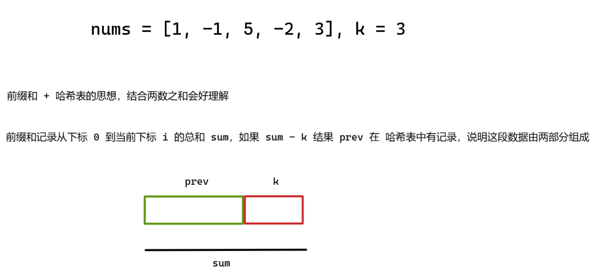
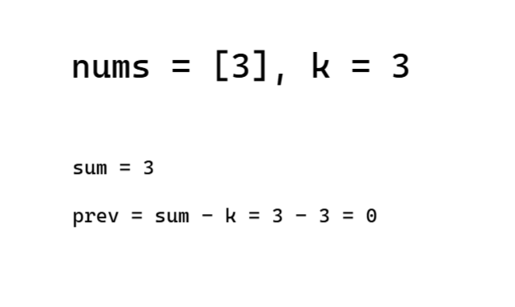

平台：炼码

```c++
int maxSubArrayLen(vector<int> &nums, int k) {
	int prefix_size = nums.size() + 1;
	vector<int> prefix(prefix_size, 0);
	for (int i = 1; i < prefix_size; i++) {
		prefix[i] = nums[i - 1] + prefix[i - 1];
	}
	int len = 0;
	// 记录最长长度
	for (int i = 0; i < prefix_size; i++) {
		for (int j = i + 1; j < prefix_size; j++) {
			auto sum = prefix[j] - prefix[i];
			if (sum == k) {
				len = max(len, j - i);
			}
		}
	}
	return len;
}
```

目前这段代码是 **O(n²)** 的复杂度，可以使用 **哈希表（unordered_map）** 将其优化为 **O(n)**。

- 设当前的前缀和为 `sum`，我们想找满足 `sum - k` 出现过的位置
- 如果在 `i` 位置的前缀和是 `sum`，而之前在 `j` 位置前缀和是 `sum - k`，说明从 `j+1` 到 `i` 之间的子数组和是 `k`
- 我们用一个 `unordered_map<int, int>` 来记录某个前缀和第一次出现的位置，以便能找到最长的子数组

```c++
int maxSubArrayLen(vector<int>& nums, int k) {
    // 用于记录前缀和的值（sum）第一次出现的位置（索引 i）
	unordered_map<int, int> prefix_index;
	int sum = 0;
	int max_len = 0;
    prefix_index[0] = -1;	// 必须
	for (int i = 0; i < nums.size(); ++i) {
		sum += nums[i];
		if (prefix_index.count(sum - k)) {
			max_len = max(max_len, i - prefix_index[sum - k]);
		}
		if (!prefix_index.count(sum)) {
			prefix_index[sum] = i;
		}
	}
	return max_len;
}
```

举例说明：



我们肯定希望 prev 之后记录的下标尽可能的小，那么目标 k 的长度就尽可能长了。

这也是为什么在代码中，我们只在 map 中记录一次 prev 出现的位置：

```c++
// 只记录第一次出现的位置，保留最早的，从而保证子数组最长
if (!prefix_index.count(sum)) {
	prefix_index[sum] = i;
}
```

因此，如果我们 sum - k 在 map 中有记录的话，就得考虑是否需要更新 max_len 了：

```c++
if (prefix_index.count(sum - k)) {
	max_len = max(max_len, i - prefix_index[sum - k]);
}
```

还有个疑问，为什么开始之前，必须给 map 容器一个记录呢？即 `prefix_index[0] = -1`

我们要考虑数组中第一个元素就满足 k 的情况，如果没有这条记录代码就会出错：



考虑 map 不提前有一个记录：

它会走下面这个代码加入到 map 中，但是你会发现，后面的前缀和不可能等于 k，返回 max_len = 0，这显然是错误的。

```c++
if (!prefix_index.count(sum)) {
	prefix_index[sum] = i;
}
```

考虑 map 提前有一个记录：

它会走下面这个代码，当前 i 为 0，那么 `i - prefix_index[sum - k] ` 就等于 1，刚好 max_len 就等于 1，完全正确。

```c++
if (prefix_index.count(sum - k)) {
	max_len = max(max_len, i - prefix_index[sum - k]);
}
```

因此，**prefix_index[0] 究竟应该为多少，要根据题意来。**

比方说下面这到道类似的其他题目：[560. 和为 K 的子数组](https://leetcode.cn/problems/subarray-sum-equals-k/)

```c++
int subarraySum(vector<int>& nums, int k) {
    unordered_map<int, int> prefix_count;
    prefix_count[0] = 1; // 初始化前缀和为0出现1次，处理从头开始的子数组
    int sum = 0;
    int count = 0;

    for (int num : nums) {
        sum += num;
        if (prefix_count.count(sum - k)) {
            count += prefix_count[sum - k];
        }
        prefix_count[sum]++;
    }

    return count;
}
```