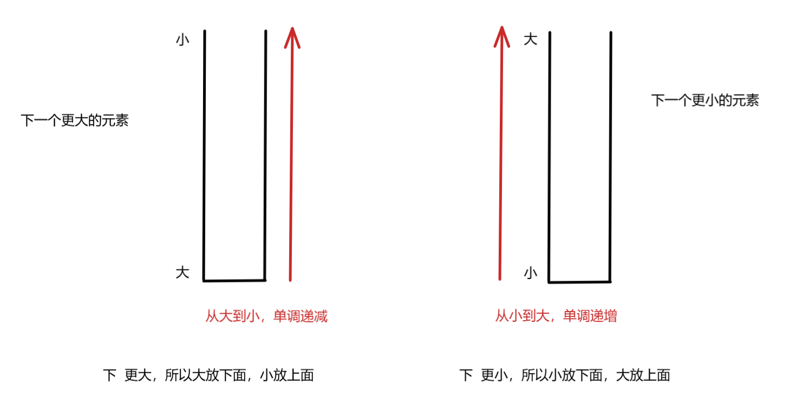

[TOC]

## 如何识别这道算法题是考察单调栈？

经典的单调栈问题通常会涉及到寻找一个元素的下一个比它大的元素、下一个比它小的元素，或前一个比它大的元素、前一个比它小的元素等。比如：

- **下一个更大元素**（单调递减栈处理）：给定一个数组，对于每个元素，求它右边第一个比它大的元素。
- **下一个更小元素**（单调递增栈处理）：给定一个数组，对于每个元素，求它右边第一个比它小的元素。

单调栈在处理过程中，通常会使用栈进行元素的逐个“压入”和“弹出”操作，满足一定的单调性条件。比如：

- 对于**递增单调栈**，栈中存储的元素永远是递增的。如果遇到比栈顶元素小的元素，就需要弹出栈顶元素。
- 对于**递减单调栈**，栈中存储的元素永远是递减的。如果遇到比栈顶元素大的元素，就需要弹出栈顶元素。

## 数组无重复值的情况

## 数组有重复值的情况

