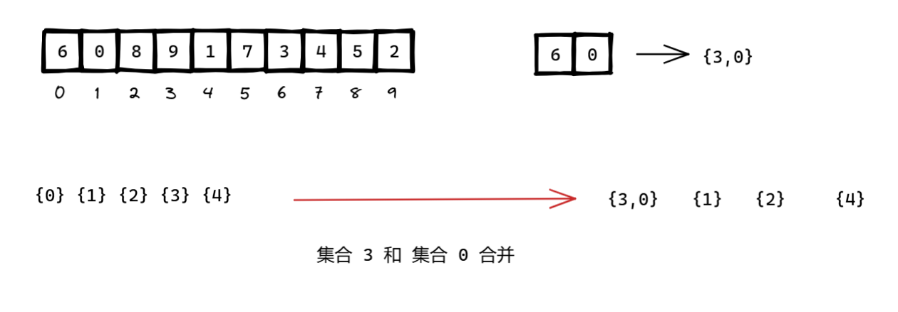

平台：力扣

题目地址：

```c++
class Solution {
private:
    class Union {
    public:
        Union(int n) : parent(n) {
            for (int i = 0; i < n; ++i) parent[i] = i;
        }

        int find(int x) {
            if (parent[x] != x)
                parent[x] = find(parent[x]);
            return parent[x];
        }

        void merge(int x, int y) {
            int px = find(x);
            int py = find(y);
            if (px != py) {
                parent[px] = py;
                --components;
            }
        }

        int getComponents() const { return components; }

    private:
        vector<int> parent;
        int components = parent.size();
    };

public:
    int minSwapsCouples(vector<int>& row) {
        int n = row.size() / 2;
        Union u(n);

        for (int i = 0; i < row.size(); i += 2) {
            int a = row[i] / 2;
            int b = row[i + 1] / 2;
            u.merge(a, b);
        }

        return n - u.getComponents();
    }
};

```

思路：

- 假设有 `n` 对情侣，我们将情侣对编号为 `0` 到 `n-1`
- 每两个座位是一个组，我们看谁该坐在一起
- 构造一个并查集，统计有多少组情侣被打散了
- 最小交换次数就是：n - 集合个数

&nbsp;

一开始的时候，初始化并查集集合，有五对情侣集合。


6 属于 集合 3，0 属于集合 0，合并集合 3 和 0 为一个集合。



8 和 9 本来就属于同一个集合，无需重复合并。


7 属于 集合 3，1 属于集合 0，合并集合 3 和 0 为一个集合，但是该集合已经为一个集合，无需重复合并。


3 和 4 本来就属于同一个集合，无需重复合并。


5 属于 集合 2，2 属于集合 1，合并集合 2 和 1 为一个集合。


现在，总共有三个集合，根据集合的情侣对，计算最少交换的次数 = K 对 - 1


