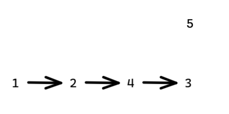

平台：洛谷

地址：https://www.luogu.com.cn/problem/U107394

```c++
#include <iostream>
#include <vector>
#include <queue>
using namespace std;

int main() {
    int n, m;
    cin >> n >> m;

    vector<vector<int>> graph(n + 1);	// 邻接矩阵构建图
    vector<int> indegree(n + 1, 0);		// 入度表

    for (int i = 0; i < m; ++i) {
        int u, v;
        cin >> u >> v;
        graph[u].push_back(v);
        indegree[v]++;
    }

    // 小根堆，保证字典序最小
    priority_queue<int, vector<int>, greater<int>> pq;
    for (int i = 1; i <= n; ++i) {
        if (indegree[i] == 0) pq.push(i);
    }

    vector<int> result;
    while (!pq.empty()) {
        int u = pq.top(); pq.pop();
        result.push_back(u);

        for (int v : graph[u]) {
            if (--indegree[v] == 0) {
                pq.push(v);
            }
        }
    }

    for (int i = 0; i < result.size(); ++i) {
        if (i > 0) cout << " ";
        cout << result[i];
    }
    cout << endl;

    return 0;
}

```

理解题意：

第一行，第一个数代表有 5 个点 [1,5]，第二个数代表有三行数据输入，也就是图的关系。

```c++
5 3
1 2
2 4
4 3
```

图结构：



字典序最小指希望排好序的结果中，比较靠前的数字尽可能小。但同时你有不能打乱顺序的限制。

1 2 4 3 受到依赖的限制，不能变更，但是节点 5 不依赖谁，也不被谁依赖，可以随意放。可是题目说 “字典序最小指希望排好序的结果中，比较靠前的数字尽可能小” ，所以，节点 5 应该放在最后面。

巧妙解决问题可以利用优先级队列（小顶堆）。

