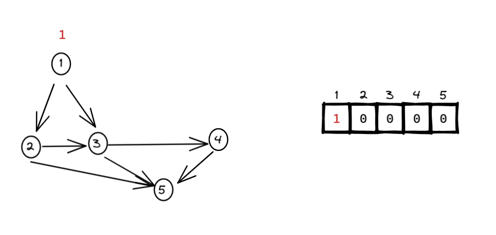
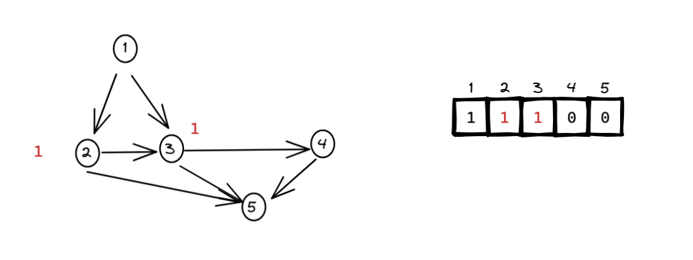
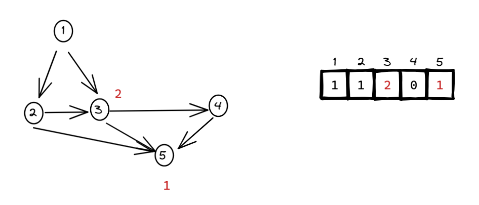
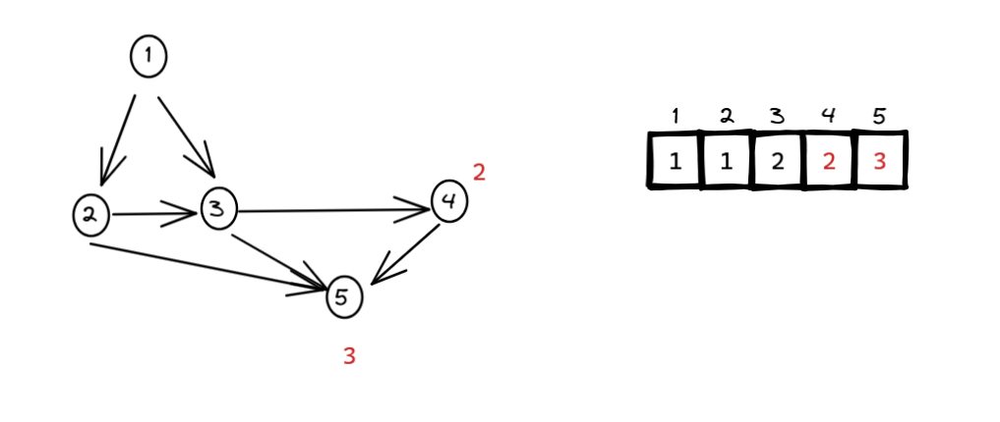
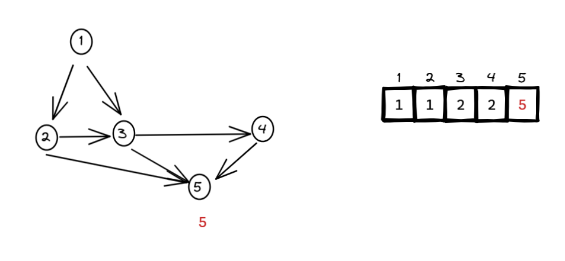

平台：洛谷

地址：https://www.luogu.com.cn/problem/P4017

```c++
#include <iostream>
#include <vector>
#include <queue>
using namespace std;

const int MOD = 80112002;

int main() {
    int n, m;
    cin >> n >> m;

    vector<vector<int>> graph(n + 1); // 邻接表
    vector<int> inDegree(n + 1, 0);
    vector<int> outDegree(n + 1, 0);
    vector<int> dp(n + 1, 0); // dp[i] 表示到达 i 的路径数

    for (int i = 0; i < m; ++i) {
        int a, b;
        cin >> a >> b;
        graph[a].push_back(b);
        inDegree[b]++;
        outDegree[a]++;
    }

    // 初始化入度为 0 的点
    queue<int> q;
    for (int i = 1; i <= n; ++i) {
        if (inDegree[i] == 0) {
            q.push(i);
            dp[i] = 1; // 起点路径数为 1
        }
    }

    // 拓扑排序 + 动态规划
    while (!q.empty()) {
        int u = q.front(); q.pop();
        for (int v : graph[u]) {
            dp[v] = (dp[v] + dp[u]) % MOD;	// 题目说：模上 80112002
            inDegree[v]--;
            if (inDegree[v] == 0) {
                q.push(v);
            }
        }
    }

    // 所有出度为 0 的点是消费者
    int result = 0;
    for (int i = 1; i <= n; ++i) {
        if (outDegree[i] == 0) {
            result = (result + dp[i]) % MOD;
        }
    }

    cout << result << endl;
    return 0;
}
```

理解题意：



节点 1 把信息传递给 节点 2 和 节点 3：



节点 2 把信息传递给 节点 5 和 节点 3：



节点 3 把信息传递给 节点 5 和 节点 4：



节点 4 把信息传递给 节点 5：



如题目所说：**最左端是不会捕食其他生物的生产者，最右端是不会被其他生物捕食的消费者**。

所以，我们找到出度为 0 的节点（只是我前面的图示中只有一个消费者），并把结果加起来：

```c++
int result = 0;
for (int i = 1; i <= n; ++i) {
	if (outDegree[i] == 0) {
		result = (result + dp[i]) % MOD;	// 题目说：模上 80112002
	}
}
```

对于所有出度为 0 的节点（即**消费者**），累加从起点（生产者）能走到它的路径数。