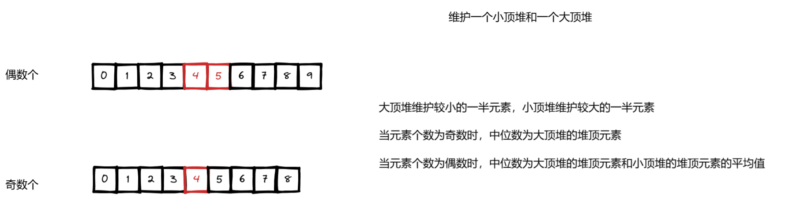
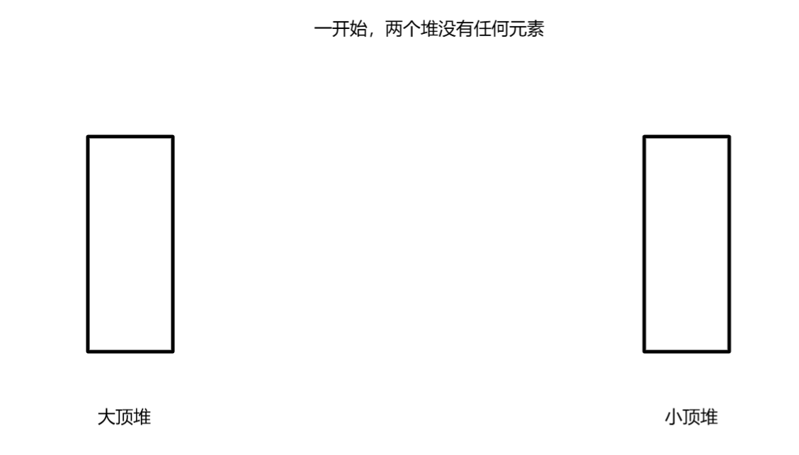
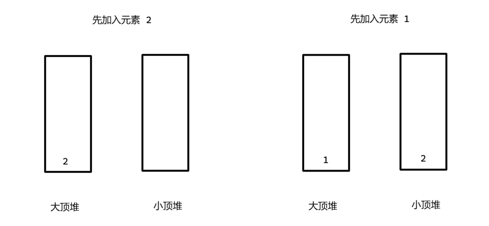
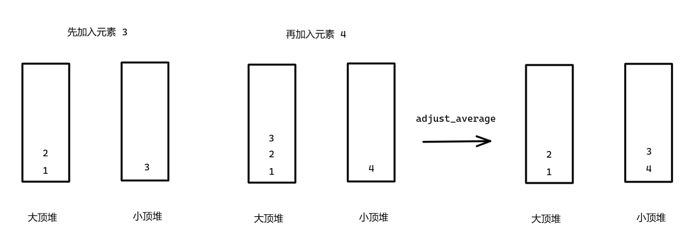

平台：力扣

```c++
class MedianFinder {
 public:
  MedianFinder() {

  }

  void addNum(int num) {
      // 确保两个堆都至少有一个元素
	  if (ensure_two_heap_no_empty(num)) return;
	  
	  // 先加入，再调整两个堆元素的平均性质

	  if (num > minHeap.top()) {
		  maxHeap.push(minHeap.top());
		  minHeap.pop();
		  minHeap.push(num);
	  } else {
		  maxHeap.push(num);
	  }
	  adjust_average();
  }

  double findMedian() {
	  if (minHeap.size() == maxHeap.size()) {
		  return (minHeap.top() + maxHeap.top()) / 2.0;
	  } else {
		  return maxHeap.top();
	  }
  }

 private:

  bool ensure_two_heap_no_empty(int num) {
	  if (maxHeap.empty()) {
		  maxHeap.push(num);
		  return true;
	  }
	  if (minHeap.empty()) {
		  if (num < maxHeap.top()) {
			  minHeap.push(maxHeap.top());
			  maxHeap.pop();
			  maxHeap.push(num);
		  } else {
			  minHeap.push(num);
		  }
		  return true;
	  }
	  return false;
  }

  void adjust_average() {    // 调整两个堆元素的平均性
	  if (minHeap.size() > maxHeap.size() + 1) {
		  maxHeap.push(minHeap.top());
		  minHeap.pop();
	  } else if (maxHeap.size() > minHeap.size() + 1) {
		  minHeap.push(maxHeap.top());
		  maxHeap.pop();
	  }
  }

 private:
  priority_queue<int, vector<int>, greater<>> minHeap;        // 小顶堆，维护较大的一半元素，最小的靠前
  priority_queue<int, vector<int>, less<>> maxHeap;           // 大顶堆，维护较小的一半元素，最大的靠前
};
```

思路：



如果两个堆的元素个数相差大于等于 2，就得让两边元素持平。

下面通过测试用例，来说明题解中部分代码的意义：



先加入元素 2，再加入元素 1：



两个堆都是空的情况下，先加入大顶堆，可以看看 findMedian 的实现。

现在大顶堆已经有元素 2，接着加入元素 1，可不是啥都不考虑就加入小顶堆了。

```c++
if (minHeap.empty()) {
	if (num < maxHeap.top()) {
		// 确保 大顶堆的堆顶元素维护较小的元素，小顶堆的堆顶元素维护较大的元素
		minHeap.push(maxHeap.top());
		maxHeap.pop();
		maxHeap.push(num);
	} else {
		minHeap.push(num);
	}
}
```

现在，我们都确保大顶堆和小顶堆至少有一个元素了，继续添加元素。

添加元素 3，再添加元素 4：



添加元素 3，发现比之前小顶堆的堆顶元素 2 大，故而把小顶堆的堆顶元素 2 加入到大顶堆，再把 3 加入到小顶堆。

```c++
if (num > minHeap.top()) {
	maxHeap.push(minHeap.top());
	minHeap.pop();
	minHeap.push(num);
} else {
	maxHeap.push(num);
}
```

添加元素 4，原理同上。但是明显两边元素个数之差大于 1，要进行调整：

```c++
void adjust_average() {
	// 调整两个堆元素的平均性
	if (minHeap.size() > maxHeap.size() + 1) {
		maxHeap.push(minHeap.top());
		minHeap.pop();
	} else if (maxHeap.size() > minHeap.size() + 1) {
		minHeap.push(maxHeap.top());
		maxHeap.pop();
	}
}
```


---

可以看到两次不同状态下添加元素，调整的策略不一样，这点要特别注意，容易犯错。

两个堆中，小顶堆没有元素：

```c++
if (minHeap.empty()) {
	if (num < maxHeap.top()) {
		minHeap.push(maxHeap.top());
		maxHeap.pop();
		maxHeap.push(num);
	} else {
		minHeap.push(num);
	}
}
```

两个堆中，小顶堆有元素：

```c++
if (num > minHeap.top()) {
	maxHeap.push(minHeap.top());
	minHeap.pop();
	minHeap.push(num);
} else {
	maxHeap.push(num);
}
```
