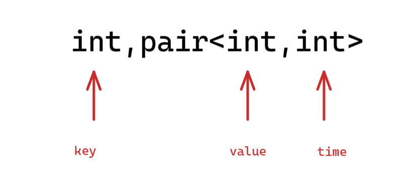
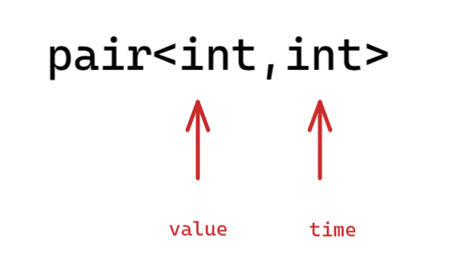

平台：牛客网

```c++
#include <iostream>
#include <string>
#include <unordered_map>
using namespace std;

int main() {

	int size;
	cin >> size;
	cin.ignore();

	unordered_map<int, pair<int, int>> mp;
	std::string command;
	pair<int, int> record = {-1, -1};
	for (int i = 0; i < size; ++i) {
		int cmd;
		cin >> cmd;
		if (cmd == 1) { // add
			int key, value;
			cin >> key >> value;
			mp[key] = make_pair(value, i);
		} else if (cmd == 2) { // get
			int key;
			cin >> key;
			auto it = mp.find(key);
			if (it != mp.end()) {
				if (it->second.second <= record.second) {
					cout << record.first << endl;
				} else {
					cout << it->second.first << endl;
				}
			} else {
				cout << "-1" << endl;
			}
		} else if (cmd == 3) {    // setAll
			int value;
			cin >> value;
			record.first = value;
			record.second = i;
		}
	}

	return 0;
}
```

题目思路：

opt = 3 要求我们把哈希表中所有 key 对应的 value 设置为新的 value，且时间复杂度得为 O(1)

我们存储的结构是：



每次新加入 key，不仅要记录 value，还得记录加入的次序，以便后续的设计。

同时，设置一个全局的 record，来记录调用 setAll 操作时候的 value，以及 time，达到把哈希表中所有 key 对应的 value 设置为新的 value：



等到用户 get 查询的时候，先检查查询的 key 的 time 是否小于等于 record 记录的 time：

- 如果小于等于 record 记录的 time，表面已经被修改，返回 record 的 value
- 否则，返回 key 对应的实际的 value 即可

```c++
auto it = mp.find(key);
if (it != mp.end()) {
	if (it->second.second <= record.second) {
		cout << record.first << endl;
	} else {
		cout << it->second.first << endl;
	}
} else {
	cout << "-1" << endl;
}
```

