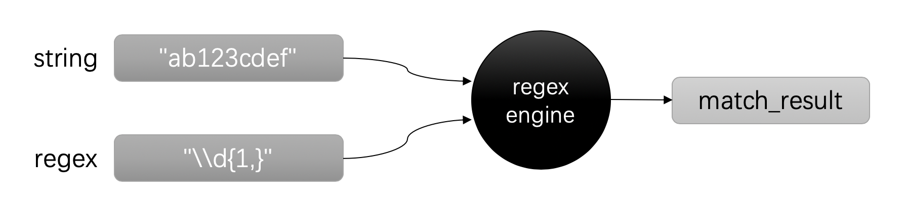
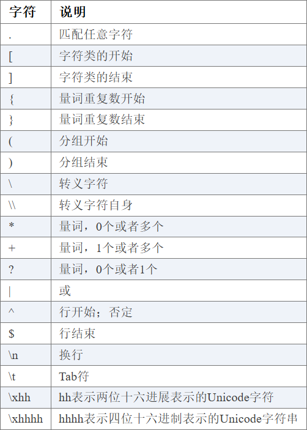
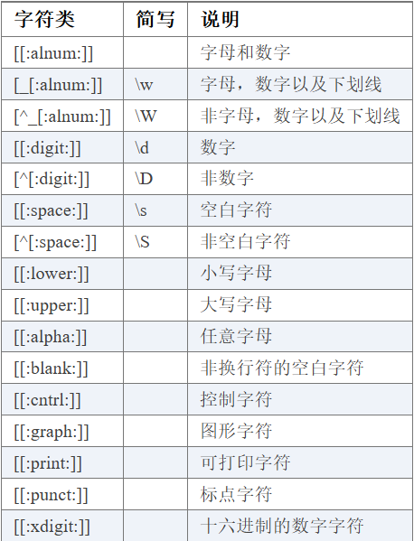
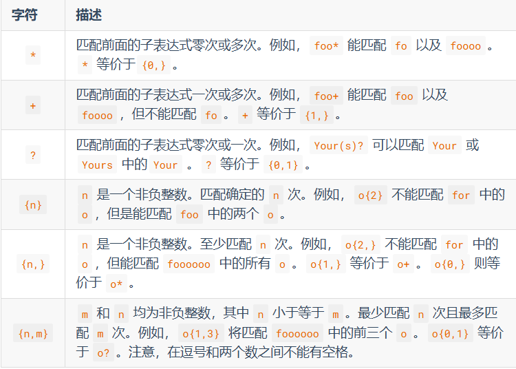
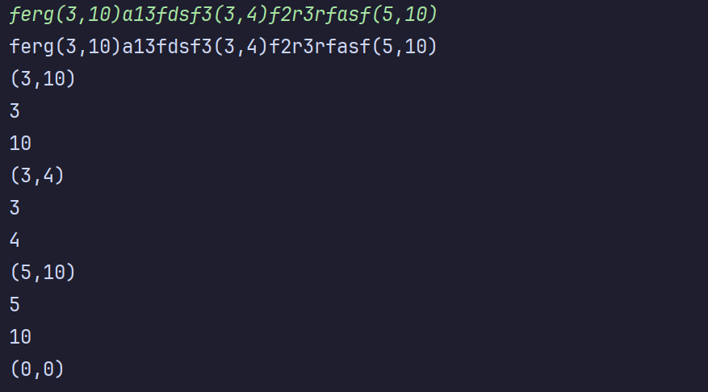

正则表达式描述了一种字符串匹配的模式。一般使用正则表达式主要是实现下面三个需求：

1. 检查一个串是否包含某种形式的子串；
2. 将匹配的子串替换；
3. 从某个串中取出符合条件的子串。



# 正则表达式基本单元

## 特殊字符



## 字符类



## 量词



# C++正则替换与捕获

- `std::regex`：表示一个正则表达式对象。
- `std::regex_match`：检查**整个字符串**是否与正则表达式匹配。匹配成功返回 true，否则返回 false。
- `std::regex_search`：在字符串中搜索与正则表达式匹配的部分。匹配的结果会保存到数组中，smatch 定义数组，以 string 字符串形式存储。cmatch 就是以 const char* 形式存储。
- `std::regex_replace`：替换字符串中与正则表达式匹配的部分。

注意：最多只能匹配到第一个结果，如果想要匹配多个，需要配合迭代器。

## std::regex_match

```c++
string s1 = "ab123cdef"; 
string s2 = "123456789"; 

regex ex("\\d+"); 

cout << s1 << " is all digit: " << regex_match(s1, ex) << endl; //  0
cout << s2 << " is all digit: " << regex_match(s2, ex) << endl; //  1
```

整个字符串必须完全匹配正则表达式才返回 true，否则返回 false。

## std::regex_search

```c++
string s = "ab123cdef"; 
regex ex("\\d+");    

smatch match; 
regex_search(s, match, ex); 

cout << s << " contains digit: " << match[0] << endl; // 123
```

将匹配到的结果存储在 smatch 定义的对象中，访问结果就像数组形式那样。

## std::regex_replace

```c++
string s = "ab123cdef"; 
regex ex("\\d+");   

string r = regex_replace(s, ex, "xxx"); 

cout << r << endl; // abxxxcdef
```

但凡能匹配成功的机会被替换。

## 匹配结果与分组

匹配结果有四种类型：

| 类型         | 定义                                               |
| :----------- | :------------------------------------------------- |
| std::cmatch  | `std::match_results<const char*>`                  |
| std::wcmatch | `std::match_results<const wchar_t*>`               |
| std::smatch  | `std::match_results<std::string::const_iterator`>  |
| std::wsmatch | `std::match_results<std::wstring::const_iterator`> |

当我们使用正则表达式时，我们的目标常常不单单是判断或者查找完整匹配的内容。而是需要捕获匹配结果中的子串。例如：我们不仅要匹配出日期，还要捕获日期中的年份，月份等信息。这个时候就要使用分组功能。

我们在介绍正则表达式特殊字符的时候，提到过圆括号`(`和`)`。它们的作用就是分组。当你在正则表达式中配对的使用圆括号时，就会形成一个分组，一个正则表达式中可以包含多个分组。

```c++
#include <iostream>
#include <regex>
#include <string>

int main() {
    std::string text = "Name: Alice, Age: 30";
    std::regex pattern(R"(Name:\s+(\w+),\s+Age:\s+(\d+))");
    std::smatch results;

    if (std::regex_search(text, results, pattern)) {
        std::cout << "完整匹配: " << results[0] << std::endl;
        std::cout << "姓名: " << results[1] << std::endl;
        std::cout << "年龄: " << results[2] << std::endl;
    } else {
        std::cout << "没有匹配。" << std::endl;
    }

    return 0;
}
```

匹配到结果，可用 API ：

| API         | 说明                                     |
| :---------- | :--------------------------------------- |
| empty       | 检查匹配是否成功                         |
| size        | 返回完成建立的结果状态中的匹配数         |
| max_size    | 返回子匹配的最大可能数量                 |
| length      | 返回特定分组的长度                       |
| position    | 返回特定分组首字符的位置                 |
| str         | 返回特定分组的字符序列                   |
| operation[] | 返回指定的分组                           |
| prefix      | 返回目标序列起始和完整匹配起始之间的分组 |
| suffix      | 返回完整匹配结果和目标序列结尾之间的分组 |

## 配合迭代器匹配到多个结果

如果不配合迭代器，下面这个代码只能匹配到第一个结果。

```c++
int main() {

	std::string line;
	getline(cin,line);

	regex re(R"(\(\d*,\d*\))");
	smatch arr;
	regex_search(line,arr,re);

	for (int i = 0; i < arr.size(); ++i) {
		cout << arr[i] << endl;
	}
	return 0;
}
```

因为`std::regex_search()` 默认只查找**第一个**匹配项（其他方法也是如此），并将结果保存在 `arr` 中。如果你想查找多个匹配项，需要使用循环，并更新搜索起点。

```c++
int main() {
    string line;
    getline(cin, line);

    regex re(R"(\(\d*,\d*\))");
    smatch match;
    auto begin = line.cbegin();
    auto end = line.cend();

    while (regex_search(begin, end, match, re)) {
        cout << match[0] << endl;
        begin = match.suffix().first;  // 更新搜索位置
    }

    return 0;
}
```

`cbegin()` 和 `cend()` 是 C++ 中用于获取容器或字符串的**常量迭代器**的函数。它们是 `std::string`（和大多数标准容器）的方法，用于只读访问数据。

# 迭代器

| 类型             | 定义                                           |
| :--------------- | :--------------------------------------------- |
| cregex_iterator  | `regex_iterator<const char*>`                  |
| wcregex_iterator | `regex_iterator<const wchar_t*>`               |
| sregex_iterator  | `regex_iterator<std::string::const_iterator`>  |
| wsregex_iterator | `regex_iterator<std::wstring::const_iterator>` |

前面介绍的那种一个一个获取匹配结果的方式有点麻烦，下面这种可能更为合适且常用：

```c++
int main() {
	string line;
	getline(cin, line);

	regex re(R"(\(\d*,\d*\))");
	auto begin = sregex_iterator(line.begin(), line.end(), re);
	auto end = sregex_iterator();

	for (auto it = begin; it != end; ++it) {
		cout << it->str() << endl;
	}

	return 0;
}
```

至于代码得到的迭代器（it），可调用的方式和前面一样：

| API         | 说明                                     |
| :---------- | :--------------------------------------- |
| empty       | 检查匹配是否成功                         |
| size        | 返回完成建立的结果状态中的匹配数         |
| max_size    | 返回子匹配的最大可能数量                 |
| length      | 返回特定分组的长度                       |
| position    | 返回特定分组首字符的位置                 |
| str         | 返回特定分组的字符序列                   |
| operation[] | 返回指定的分组                           |
| prefix      | 返回目标序列起始和完整匹配起始之间的分组 |
| suffix      | 返回完整匹配结果和目标序列结尾之间的分组 |

# 子匹配

结合前面的代码来匹配这个字符串：`ferg(3,10)a13fdsf3(3,4)f2r3rfasf(5,10)`

会依次得到：(3,10)，(3,4)，(5,10)

一共是三个分组，我们自身还要去检查里面的数字是否合法，即数字形式是否合法，比如 (01,1) (1,01) (01,01)都不合法。

我们可以在匹配一个分组中，里面再进行匹配即子匹配。

```c++
int main() {
	string line;
	getline(cin, line);

	regex re(R"(\((\d*),(\d*)\))");
	auto begin = sregex_iterator(line.begin(), line.end(), re);
	auto end = sregex_iterator();

	int count = 0;
	for (auto it = begin; it != end; ++it) {
		// 如果匹配到的字符串是 (1,2)
		cout << it->str(0) << endl;    // (1,2)
		cout << it->str(1) << endl;    // 1
		cout << it->str(2) << endl;    //2
	}

	return 0;
}
```

结果：




# 推荐文章

C++ 正则表达式还有很多内容，比方说支持匹配之后返回迭代器，分组等功能，推荐文章：

https://paul.pub/cpp-regex

# 推荐

复杂的正则表达式常常很难理解，下面两个工具也许能帮上忙：

- [https://regex101.com](https://regex101.com/)
- [https://www.debuggex.com](https://www.debuggex.com/)