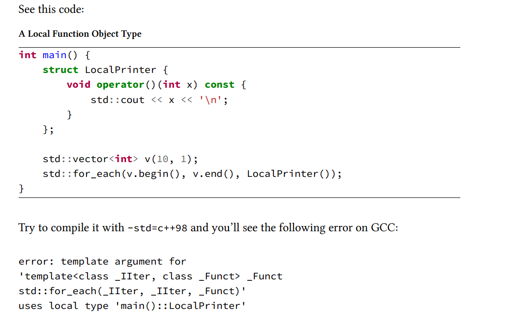

在本章中，你将学习：

- 如何以“旧方式”将函数对象传递给标准库中的算法；
- 函数对象类类型的局限性；
- 为什么函数式辅助工具并不够好；
- C++0x/C++11 引入 lambda 表达式的动机。

# C++98/03 中的可调用对象

标准库函数如 sort，for_each 等函数支持传递一个可调用对象，C++ 98/03 是如何传递的？

普通函数：

```c++
void PrintFunc(int x) {
    std::cout << x << '\n';
}

int main() {
    std::vector<int> v;
    v.push_back(1); 
    v.push_back(2); 
    std::for_each(v.begin(), v.end(), PrintFunc); 
}
```

重载()：

```c++
struct Printer {
    void operator()(int x) const {
        std::cout << x << '\n';
    }
};

int main() {
    std::vector<int> v;
    v.push_back(1);
    v.push_back(2);
    std::for_each(v.begin(), v.end(), Printer());   
}
```

# 函数对象类类型的问题以及解决

正如您所看到的，使用调用操作符创建类类型的功能非常强大。您可以完全控制，并以任何方式设计它们。

然而，在 C++98/03 中，问题在于您必须在与调用算法不同的地方定义函数对象类型。这可能意味着，可调用类型可能在源文件的更前或更远的几十或几百行，甚至在不同的编译单元中。

作为一种潜在的解决方案，你可能会尝试编写本地类，因为 C++ 总是支持这种语法。但这**对模板不起作用**。



`std::for_each` 是一个 **模板函数**，它需要在编译时知道传入的类型是否符合要求。由于 `LocalPrinter` 是一个局部类，它的作用域仅限于 `main()` 函数内部，**不能作为模板参数进行类型推导或实例化**。

那么，C++98/03 如何解决这个问题的？使用一些辅助工具和预定义的函数对象。

例如：

- `std::plus<T>()` —— 接受两个参数并返回它们的和；
- `std::minus<T>()` —— 接受两个参数并返回它们的差；
- `std::less<T>()` —— 接受两个参数并判断第一个是否小于第二个；
- `std::greater_equal<T>()` —— 接受两个参数并判断第一个是否大于或等于第二个；
- `std::bind1st` —— 创建一个可调用对象，将第一个参数固定为指定的值；
- `std::bind2nd` —— 创建一个可调用对象，将第二个参数固定为指定的值；
- `std::mem_fun` —— 创建一个成员函数的包装器对象；
- 还有很多其他的辅助工具。

```c++
int main() {
    std::vector<int> v;
    v.push_back(1);
    v.push_back(2);
    const size_t smaller5 = std::count_if(v.begin(), v.end(),
                                        std::bind2nd(std::less<int>(), 5));
        
    return smaller5;                                        
}
```

# 总结

如你所见，在 C++98/03 中，有多种方式可以声明并将可调用对象传递给标准库中的算法和工具。然而，这些方式都存在一些限制。例如，你无法声明局部的函数对象类型，或者使用函数式辅助工具组合函数时会变得很复杂。

幸运的是，随着 C++11 的到来，这些问题得到了很大的改进！

首先，C++ 标准委员会取消了使用局部类型进行模板实例化的限制。从 C++11 开始，你可以在需要的地方本地编写带有调用运算符（`operator()`）的类类型，也就是可以直接在函数内部定义临时的函数对象类型，从而更方便地进行函数式编程。