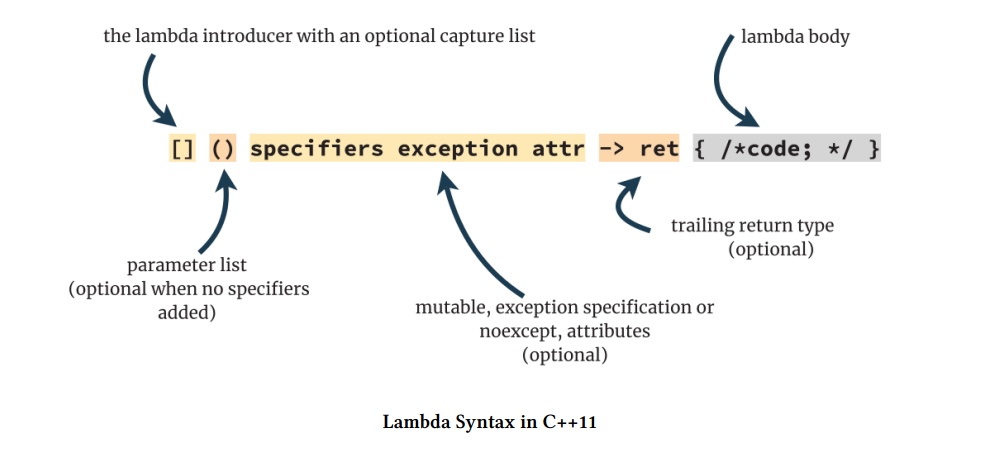
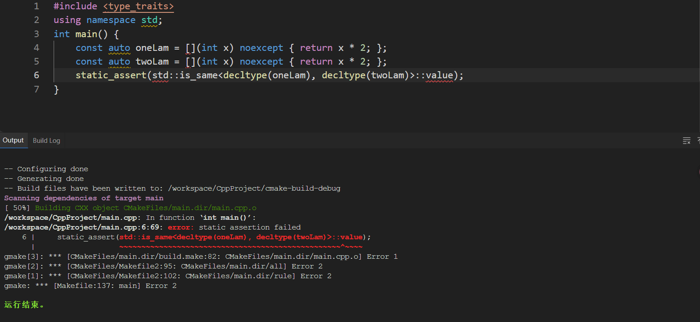
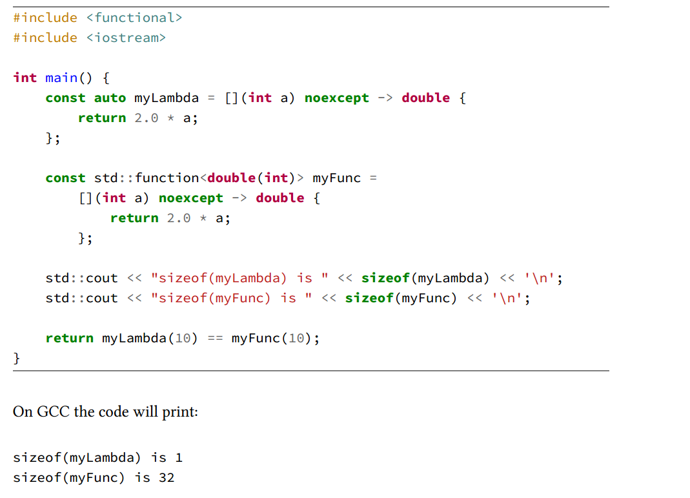
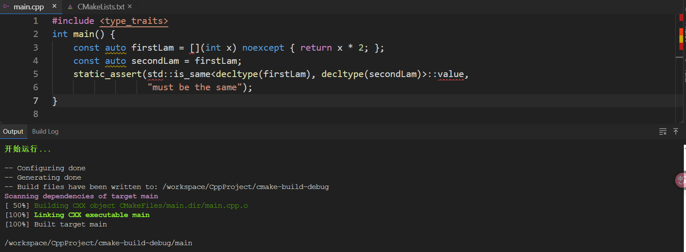
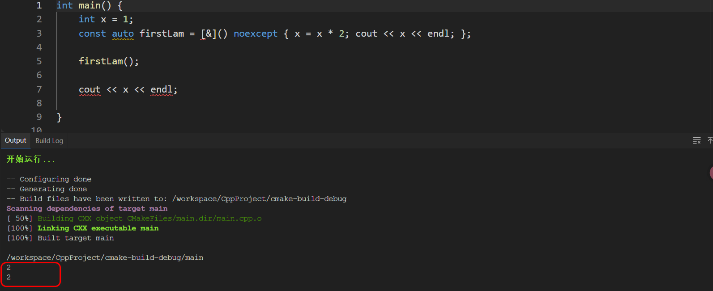

在本章中，你将学习：

- Lambda 表达式的基本语法；
- 如何捕获变量；
- 如何捕获类中的非静态数据成员；
- Lambda 表达式的返回类型；
- 什么是闭包对象（closure object）；
- 如何将 Lambda 转换为函数指针，并与 C 风格的 API 一起使用；
- 什么是 IIFE（立即调用的函数表达式），以及它为何有用；
- 如何从 Lambda 表达式中继承。

# Lambda表达式语法



## 几个 Lambda 表达式示例

1-最简单的 lambda：

```c++
[]{};
```

从这个最简单的 lambda 表达式可以看出捕获列表`[]`和函数体`{}`是必选的，其余都是可选。

2-传递两个参数：

```c++
[](float f, int a) { return a * f; };
[](int a, int b) { return a < b; };
```

可以看到参数被传入`()`部分，就像普通函数一样。不需要返回类型，因为编译器会自动推导出来。

3-尾部返回类型：

```c++
[](MyClass t) -> int { auto a = t.compute(); print(a); return a; };
```

我们明确设置了返回类型，不设置就会自动推导。

4-附加说明：

```c++
[x](int a, int b) mutable { ++x; return a < b; };
[](float param) noexcept { return param*param; };
[x](int a, int b) mutable noexcept { ++x; return a < b; };
```

上面的例子说明在 Lambda 表达式的函数体之前，你可以使用其他修饰符。

在代码中，我们使用了 `mutable`（允许在 Lambda 内部修改捕获的变量）以及 `noexcept`（声明该 Lambda 不会抛出异常）。

第三个 Lambda 同时使用了 `mutable` 和 `noexcept`，并且它们必须以这个顺序出现（即先写 `mutable`，再写 `noexcept`）。如果你写成 `noexcept mutable`，编译器会报错并拒绝编译。

5-可选`()`：

```c++
[x] { std::cout << x; }; // no () needed

// 不能编译
// mutable 是修饰 lambda 的实现体的，但它必须紧跟在参数列表后面
[x] mutable { ++x; };
// 可编译
[x]() mutable { ++x; };

// 不能编译
[] noexcept { };
// 可编译
[]() noexcept { }; // fine
```

同样的模式也适用于其他可以应用于 Lambda 表达式的修饰符，比如 C++17 中引入的 `constexpr`，以及 C++20 中的 `consteval`。这些修饰符的位置和顺序也需要遵循特定的语法规则。

因此，虽然说参数列表 `()` 是可选的，但如果你加有其他必须跟在参数列表 `()` 的修饰符，可就是必选了。如果不遵循，就会编译错误。

## 核心定义

Lambda 表达式的求值会产生一个 prvalue（纯右值）临时对象。这个临时对象被称为**闭包对象**。

Lambda 表达式的类型（同时也是闭包对象的类型）是一个唯一的、匿名的、非联合体的类类型，称为**闭包类型**。

## Lambda 表达式的类型

由于编译器会为每个 lambda 生成一个唯一的名称（闭包类型），因此无法预先 “拼写 ”它。

这就是为什么必须使用 auto（或 decltype）来推断类型。

```c++
auto myLambda = [](int a) -> double { return 2.0 * a; };
```

可是，即便**两个 Lambda 表达式功能和参数列表等都一模一样，类型也是不同的**。

```c++
auto firstLam = [](int x) { return x * 2; };
auto secondLam = [](int x) { return x * 2; };
```

下面我用断言去推断这两个 lambda 表达式是否相同。如果两个类型不同就会断言失败，类型相同就不会断言失败。

但事实上报错了，这说明这两个 lambda 表达式类型不相同。



尽管你不知道 Lambda 表达式所生成的闭包类型的确切名称，你仍然可以明确地写出它的函数签名，并将其存储在 `std::function` 中。一般来说，那些不能直接用 `auto` 推导的 Lambda，用 `std::function<>` 类型“表达”出来通常是可行的。

```c++
std::function<double(int)> myFunc = [](int a) -> double { return 2.0 * a; };
```

需要注意的是，`std::function` 是一个较重的对象，因为它必须支持各种不同类型的可调用对象。为了实现这一点，它内部需要使用一些高级机制，比如类型擦除（type erasure）、类型转换技巧（type punning），甚至动态内存分配。



由于 `myLambda` 是一个**无状态的 Lambda 表达式**，它被编译器实现为一个**空类**，没有任何数据成员，因此它的最小大小仅为 **1 字节**。这非常高效。

而另一方面，使用 `std::function` 的版本则要大得多 —— 通常为 **32 字节**。这正是为什么在可能的情况下，**优先使用 `auto` 类型推导**，以获得更小、更高效的闭包对象的原因。

## 构造函数和复制

下面的行为是不允许的：

```c++
int x = 1, y = 2;
auto foo = [&x, &y]() {
    std::cout << x + y;
};

decltype(foo) fooCopy;  // ❌ 错误：试图默认构造 lambda
```

**Lambda 类型默认没有默认构造函数**，**特别是当它捕获了变量**（无捕获的 lambda **有时会有**默认构造函数）。

但是，你可以复制 Lambda：



如果你复制一个 Lambda 表达式，那么它的**状态也会被复制**。这一点在讨论**变量捕获**时尤为重要。

在这种情况下，Lambda 所对应的**闭包类型（closure type）会将捕获的变量存储为其成员字段**。因此，当你对一个 Lambda 进行复制时，实际上是**复制了这些成员变量**。

换句话说：

- 如果 Lambda 是按值捕获的，那么复制 Lambda 时会复制捕获的副本；
- 如果是按引用捕获的，那么复制的是引用的地址，但多个副本仍然引用相同的外部变量。

## 调用运算符

在 C++11 中，默认情况下，这个 `operator()` 是一个 **`const` 的内联成员函数**。

这个行为有一些重要的**后果**，即默认是 `const`：

- 因为 `operator()` 是 `const`，所以你**无法在 Lambda 中修改捕获的变量副本**，除非使用 `mutable` 关键字；
- 这使得闭包在默认情况下是不可变的，更安全、更容易优化。

你可以通过在 Lambda 后面添加一些**修饰符**来控制 `operator()` 的签名，例如：

- **`mutable`**：允许在 Lambda 中修改按值捕获的变量；
- **`noexcept`**：指明 Lambda 不会抛出异常；
- **`constexpr` / `consteval`**（从 C++17/20 起）：使 Lambda 能用于编译期计算；

## 重载

有一点非常值得注意：**在定义 Lambda 表达式时，你无法创建接受不同参数类型的“重载”版本**。

例如，下面的代码是**无法编译**的：

```c++
// 编译失败！
auto lam = [](double param) { /* do something */ };
auto lam = [](int param) { /* do something */ };
```

这里的问题有两个：

1. **无法重定义变量**：你不能用相同的变量名 `lam` 定义两个 Lambda；
2. **Lambda 不能合并为一个函数对象类型**：编译器无法把这两个不同参数类型的 Lambda 合并成一个闭包类型（closure type）。

如果你需要这种“多参数类型重载”的行为，可以手动定义一个函数对象类，并为不同参数类型实现多个 `operator()`：

```c++
struct MyFunctionObject {
    inline void operator()(double param) const {
        // 处理 double
    }

    inline void operator()(int param) const {
        // 处理 int
    }
};
```

注：**C++17 中的 `overloaded` 模式**，一种组合多个 Lambda 并利用函数重载机制的高级技巧可以解决今天无法解决的问题。

## 属性

在语法上，C++11 起就支持在 Lambda 表达式中使用属性，形式为 `[[attr_name]]`。然而，**当你将属性应用到 Lambda 时，这些属性实际上是应用于 Lambda 所对应的闭包类型，而不是其 `operator()` 调用运算符本身**。

这导致目前（即使到了 C++20）为 Lambda 表达式添加属性**几乎没有实际意义**，因为：

- 大多数属性是设计用于函数或变量的；
- Lambda 表达式内部的调用运算符并不直接接受这些属性；
- 编译器通常会报错，指出属性的用法无效。

```c++
auto f = [](int a) [[nodiscard]] { return a * a; }; // 编译错误
```

## 其他修饰符

**`mutable`**：默认情况下，Lambda 的 `operator()` 是 `const` 的，意味着**不能修改按值捕获的变量副本**。加上 `mutable` 修饰符可以取消这个限制。

**`noexcept`**：表示 Lambda 执行时不会抛出异常，有助于编译器优化并提升异常安全性。

## 捕获

| 语法         | 描述                                                         |
| ------------ | ------------------------------------------------------------ |
| `[&]`        | 按**引用**捕获所有在当前作用域中声明的自动存储变量           |
| `[=]`        | 按**值**捕获所有在当前作用域中声明的自动存储变量（会创建副本） |
| `[x, &y]`    | **显式捕获**：`x` 按值捕获，`y` 按引用捕获                   |
| `[args...]`  | 捕获**模板参数包** `args`，全部按值（C++14 起支持泛型 Lambda） |
| `[&args...]` | 捕获**模板参数包** `args`，全部按引用                        |
| `[this]`     | 捕获当前类的 `this` 指针，用于 Lambda 内部访问成员变量和成员函数 |

可以看到 & 会修改外部捕获的变量，引用捕获还要注意捕获对象的生命周期：



## 不可以访问到Lambda的参数

```c++
int x = 0;
auto lam = [x]() { std::cout << x; };
lam.x = 10; // ??
```

Lambda 本质上是一个类，捕获的参数作为成员变量，而这些成员变量是私有的，因此不允许被外界这样访问。

## 全部捕获还是明确捕获？

指定 [=] 或 [&] 可能会很方便，因为它可以捕获所有自动存储的持续时间变量，但明确捕获变量会更清晰。这样，编译器就能对不必要的影响发出警告。

## mutable

如果是值捕获，你想要修改捕获变量的值，需要添加 mutable 关键字。这是因为默认情况下，lambda 的 `operator()` 是 `const` 成员函数。

如果是引用捕获，你想要修改捕获变量的值直接修改就可以，不需要添加 mutable 关键字。

&nbsp;

如果你添加 mutable 关键字，operator 就不是 const 成员函数，下面这种做法就会报错：

```c++
int x = 10;
const auto lam = [x]() mutable { ++x; };
lam(); // ❌ 不合法，不能在 const 对象上调用非 const 成员函数
```

&nbsp;

小结：

| 场景                          | 是否需要 `mutable` |
| ----------------------------- | ------------------ |
| **值捕获且需修改副本**        | ✅ 需要             |
| **引用捕获并修改变量**        | ❌ 不需要           |
| **想要 lambda 是 const 对象** | ❌ 不要用 `mutable` |


## 只能捕获 **局部变量**，而不是全局变量或静态变量

| 变量类型                 | 能被 Lambda 捕获？     | `[=]` 按值捕获         | `[&]` 按引用捕获       |
| ------------------------ | ---------------------- | ---------------------- | ---------------------- |
| **局部变量（自动存储）** | ✅ 可以                 | ✅ 支持                 | ✅ 支持                 |
| **全局变量**             | ❌ 不可以               | 🚫 不允许               | 🚫 不允许               |
| **静态局部变量**         | ❌ 不可以               | 🚫 不允许               | 🚫 不允许               |
| **类的非静态成员变量**   | ✅ 可通过 `[this]` 捕获 | ✅（通过 `*this` 复制） | ✅ 可通过 `[this]` 引用 |

虽然全局变量和静态局部变量并不可以被捕获，但是可以直接在 lambda 中使用。

## 只支持移动的对象


