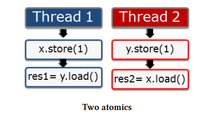
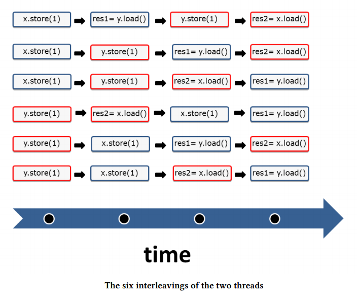

# 内存模型基础知识

从并发角度看，内存模型有两个主要方面：

- 什么是内存位置？
- 如果两个线程访问同一个内存位置会发生什么？

## 什么是内存位置？

根据 cppreference.com，内存位置是指：

- 标量类型的对象（算术类型、指针类型、枚举类型，或者 std::nullptr_t），
- 或者是最长的一段非零长度的连续位字段序列。

```c
struct S {
    char a;       // 内存位置 #1
    int b : 5;    // 内存位置 #2
    int c : 11,   // 内存位置 #2（继续）
        : 0,
        d : 8;    // 内存位置 #3
    int e;        // 内存位置 #4
    double f;     // 内存位置 #5
    std::string g; // 占用多个内存位置
};
S obj;
```

解释就是：

- `a` 是第一个内存位置，属于一个标量类型的对象。
- `b` 和 `c` 是位字段，它们属于同一个连续的内存位置 #2（因为它们是相邻的位字段）。
- 由于 `: 0` 的存在，后续的 `d` 会另起一个新的内存位置 #3。
- `e`、`f` 分别是单独的内存位置 #4 和 #5。
- `g` 是一个复杂类型的对象（`std::string`），可能占用多个内存位置。

从以上分析，可以得到如下关键信息：

- 每个变量都是一个对象；
- 标量类型占用一个内存地址；
- 相邻的位字段具有相同的内存地址（相邻位字段属于同一类型，且总大小未超过该类型的存储单元时，会连续存放，共用一个内存位置）；
- 变量至少占用一个内存地址。

## 如果两个线程访问同一个内存位置会发生什么？

如果两个线程访问同一个内存位置——比如相邻的位字段共享同一个内存位置——且至少有一个线程想要修改它，那么你的程序就会发生数据竞争，**除非**满足以下两种情况之一：

1. 该内存位置是通过原子操作进行修改的。
2. 一个访问在另一个访问之前发生（同步和互斥都可以做到）。

# C++ 内存模型需要处理的几个方面

- **原子操作（Atomic operations）**：能够无中断执行的操作。
- **操作的部分有序性（Partial ordering of operations）**：必须保持顺序，不能被重排的操作序列。
- **操作的可见效果（Visible effects of operations）**：保证对共享变量的操作对其他线程可见。

这个契约的基础是对原子操作的定义，它有两个特点：

- 它们本质上是原子的、不可分割的；
- 它们在程序执行中创建了同步和顺序的约束。

# Atomics

## 强内存模型

顺序一致性（Sequential consistency）提供两个保证：

- 程序中的指令按照编写的顺序执行。
- 所有线程上的所有操作都有一个全局的顺序。



这张图展示了两个线程。每个线程分别存储它自己的变量 `x` 或 `y`，然后加载对方的变量 `y` 或 `x`，并将结果存储到变量 `res1` 或 `res2` 中。

因为这些变量是原子的，所以操作是原子执行的。默认情况下，适用顺序一致性。

问题是：这些语句可能以什么顺序执行呢？

顺序一致性的第一个保证是，指令按照源代码中定义的顺序执行。比方说 Thread2 中的 y.store 代码不可能在 res2 = x.load() 后面去。

顺序一致性的第二个保证是，**所有线程的指令必须遵循一个全局顺序**。比方说在上面提到的例子中，线程 2 所观察到的线程 1 的操作顺序，必须与线程 1 实际执行它们的顺序一致。

好的，也许各自执行的顺序有所差异，但是所有线程看到的执行顺序必须是一致的。比方说下面是可能发生的六种情况，如果线程 1 看到的是图中第一行的那种执行顺序，线程 2 看到的也必然是图中第一行的那种执行顺序，不可能是其他的情况。



## 弱内存模型

如果程序员使用了**relaxed（宽松）语义**，这个契约的支柱就发生了剧烈的变化：

- 一方面，程序员要理解两个线程可能产生的各种交错执行就变得更加困难；
- 另一方面，系统拥有了更多优化执行的空间。

四个操作可能出现的组合方式就多得多。

一种违反直觉的行为是：**线程 1 可以看到线程 2 的操作顺序与线程 2 实际执行的顺序不同**，也就是说，不再有“全局唯一”的视图。

## 介于两者之间

使用 acquire-release 语义，程序员需要遵守的规则比顺序一致性要弱一些，但相应地，系统也获得了更多的优化空间。

acquire-release 语义是深入理解**多线程编程中同步和部分有序性**的关键。线程会在代码中的特定**同步点**进行同步。如果没有这些同步点，那么线程、任务或条件变量的行为都将是**未定义的**。


