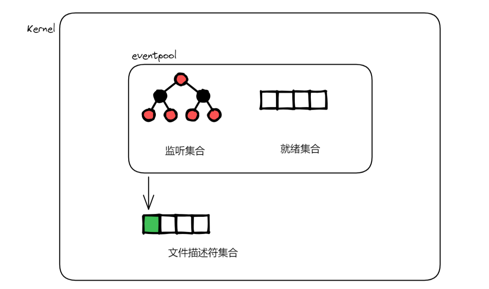
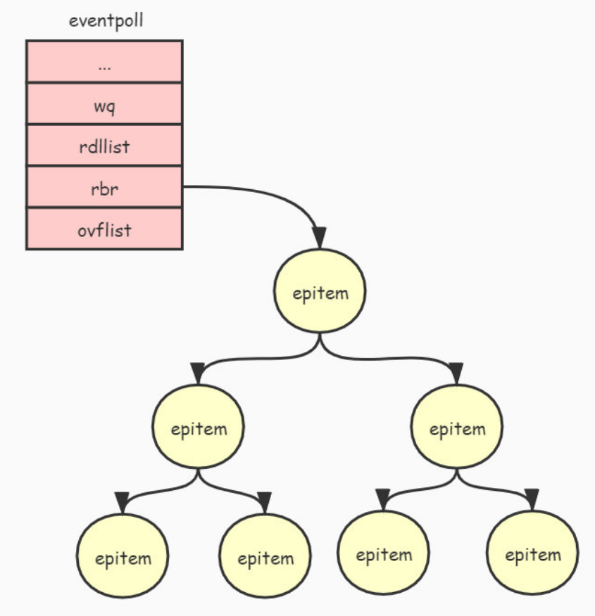
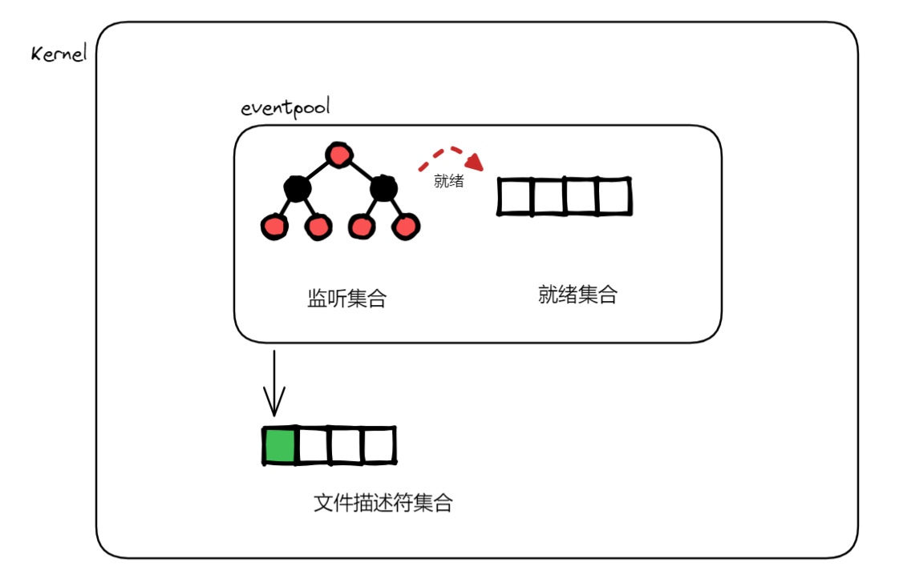
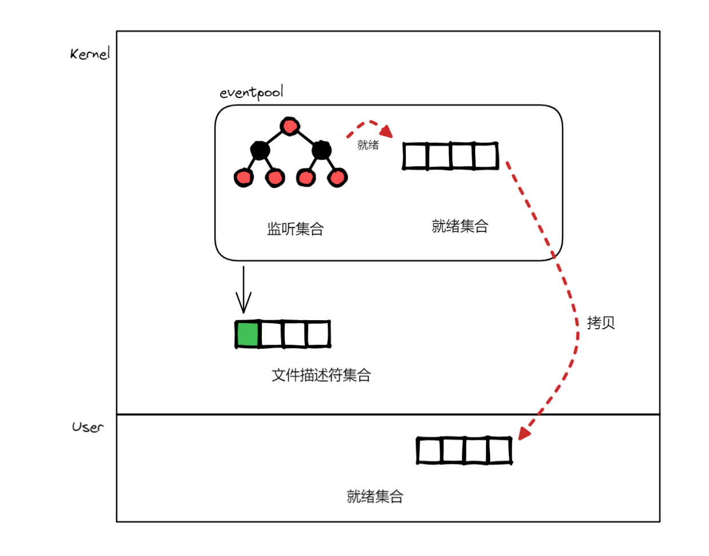
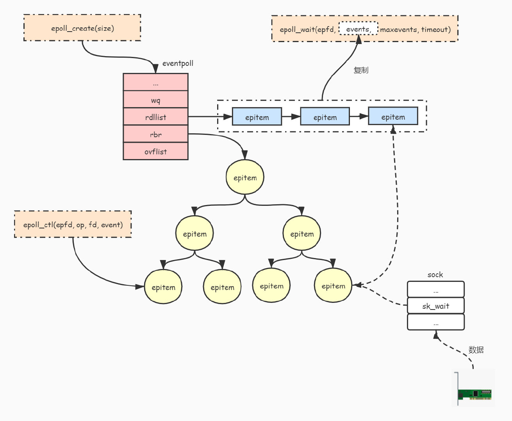

## 系统调用

`epoll_create`：创建一个 epoll 实例

```c++
#include <sys/epoll.h>

int epoll_create(int size);
```

epoll_create 中的参数 size 已被忽略，但它必须是大于零的值。

---

` epoll_ctl`：用于在 epoll 实例中添加、修改或删除文件描述符

```c++
#include <sys/epoll.h>

int epoll_ctl(int epfd, int op, int fd, struct epoll_event *event);
```

**`epfd`**: epoll_create 返回的 epoll 实例的文件描述符

**`op`**: 操作类型，指定你想要执行的操作，可以是以下之一：

- EPOLL_CTL_ADD：**添加**文件描述符到 epoll 实例中
- EPOLL_CTL_MOD：**修改**已存在的文件描述符的事件
- EPOLL_CTL_DEL：从 epoll 实例中**删除**文件描述符

**`fd`**: 需要添加（监视）、修改或删除（不再监视）的文件描述符

**`event`**: 指向 `epoll_event` 结构体的指针，定义了你希望监视的事件（读写事件）及事件发生时的处理方式

---

`epoll_wait`：等待 epoll 实例中的事件发生

```c++
#include <sys/epoll.h>

 int epoll_wait(int epfd, struct epoll_event *events, int maxevents, int timeout);
```

**`epfd`**: epoll_create 返回的 epoll 实例的文件描述符

**`events`**: 指向 epoll_event 结构体数组的指针。epoll_wait 会将发生的事件填充到这个数组中

**`maxevents`**: events 数组的大小，表示最多可以返回多少个事件

**`timeout`**: 超时时间（以毫秒为单位）。如果设置为 -1，epoll_wait 会无限等待直到有事件发生；如果设置为 0，epoll_wait 会立即返回，不会阻塞；其他值表示超时时间

当你调用 `epoll_wait` 时，它会阻塞，直到有事件发生，或者超时，或者被中断。调用成功的返回值是返回实际发生的事件数，这些实际发生的事件存储在 events 事件数组中，从这里取出来事件并处理。

---

epoll_ctl 和 epoll_wait 都出现 epoll_event 结构体

```c++
struct epoll_event {
    uint32_t events;  // 事件类型
    epoll_data_t data;  // 用户数据
};
```

**`events`**: 你希望监视的事件类型，可以是以下之一（或者它们的组合）：

- EPOLLIN：可读事件（常用）
- EPOLLOUT：可写事件（常用）
- EPOLLERR：错误事件
- EPOLLHUP：挂起事件
- EPOLLET：边缘触发模式（不设置默认是水平触发）
- EPOLLONESHOT：一次性事件

**`data`**: 你可以用来存储用户数据，通常是一个 union，可以存储 int、ptr 或其他数据类型

代码地址：[群聊](https://github.com/xiaoyangst/Code/tree/master/%E6%9D%82%E9%A1%B9/IO%E5%A4%9A%E8%B7%AF%E5%A4%8D%E7%94%A8/epoll/%E7%BE%A4%E8%81%8A)

## 原理

```c++
int epfd = epoll_create(EPOLL_SIZE);
```

epoll_create 完成两项工作：

- 创建并初始化一个 `eventpoll` 对象。
- 把 `eventpoll` 对象映射到一个文件句柄，并返回这个文件句柄。



我们实际看看内核中 evnetpoll 对象的核心成员：

```c++
struct eventpoll {
    ...
    wait_queue_head_t wq;				// 等待队列
    ...
    struct list_head rdllist;	// 就绪集合（双向链表）
    struct rb_root rbr;					// 监听集合（红黑树）
    ...
};
```

epoll_ctl 操作 rbr 来管理节点，epoll_wait 就是拷贝 rallist 得到就绪集合。



可以看到 rbr 上是一个一个的 epitem，但我们监听 文件描述符的时候，需要封装为 epitem。

```c++
struct epoll_event listen_ep;
listen_ep.data.fd = sock_fd;
listen_ep.events = EPOLLIN; 
epoll_ctl(epfd,EPOLL_CTL_ADD,sock_fd,&listen_ep);
```

通过 epoll_ctl 中的 EPOLL_CTL_ADD 操作把 epitem 添加到监听集合中，并且设置一个回调函数。当 socket 状态发生变化时，会触发调用这个回调函数，主要工作是把就绪的文件描述符添加到 eventpool 的就绪集合中，然后唤醒调用 epoll_wait 阻塞的进程。

哪个文件描述符触发，就会加入到就绪集合，内核也就知道具体是哪个文件描述符有变化，而之前的 select 方法是无法做到这点的。



我们要把内核中的就绪集合拷贝到用户态，需要创建一个 epoll_event 用以接收，然后调用 epoll_wait 来完成拷贝。

```c++
struct epoll_event events[BUFFER_SIZE];

int ep_num = epoll_wait(epfd,events,MAX_EVENTS,-1);
```

epoll_wait 接触阻塞有三种情况：

1. 被监听的文件集合中有就绪的文件
2. 设置了超时时间并且超时了
3. 接收到信号



至此，[归档](https://www.jxhs.me/2021/04/08/linux%E5%86%85%E6%A0%B8Epoll-%E5%AE%9E%E7%8E%B0%E5%8E%9F%E7%90%86/)如下：

1. 通过调用 `epoll_create()` 函数创建并初始化一个 `eventpoll` 对象。
2. 通过调用 `epoll_ctl()` 函数把被监听的文件句柄 (如socket句柄) 封装成 `epitem` 对象并且添加到 `eventpoll` 对象的红黑树中进行管理。
3. 通过调用 `epoll_wait()` 函数等待被监听的文件状态发生改变。
4. 当被监听的文件状态发生改变时（如socket接收到数据），会把文件句柄对应 `epitem` 对象添加到 `eventpoll` 对象的就绪队列 `rdllist` 中。并且把就绪队列的文件列表复制到 `epoll_wait()` 函数的 `events` 参数中。
5. 唤醒调用 `epoll_wait()` 函数被阻塞（睡眠）的进程。



## 注意点

1. 我们要监听一个文件描述符，一定要封装成 epoll_event，再加入监听。
2. epoll_wait 需要提供一个 epoll_event 数组，用来存储 内核中的就绪集合。
3. 对于不需要监听的文件描述符，记得通过 EPOLL_CTL_DEL 移除。尽管不移除好像也没关系，按理不被关心的它永远不会被触发了，但基于代码的严谨，应该移除。
4. [水平触发和边缘触发](https://xiaoyangst.github.io/2024/08/10/%E6%B0%B4%E5%B9%B3%E8%A7%A6%E5%8F%91%E5%92%8C%E8%BE%B9%E7%BC%98%E8%A7%A6%E5%8F%91/)。

