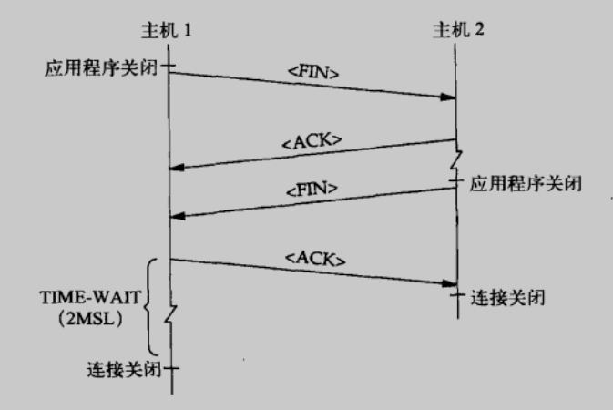

## 认识 TIME-WAIT

主机 2 关闭连接并释放资源。从主机 2 的角度来看，连接不再存在了。但主机 1 还没有关闭连接，而是会进入 TIME_WAIT状态，并在这个状态停留 2MSL，等待 2MSL智慧，主机 1 也将连接关闭，并释放其资源。

关于 TIME-WAIT 状态，还要弄清楚三点：

1. 主动关闭的那一端才会进入 TIME-WAIT 状态
2. RFC 将 MSL 定义为 2 分钟
3. 如果连接处于 TIME-WAIT 状态时有分组到达，就重启 2MSL 的定时器

## 为什么要使用它

1. 维护连接状态，以防主动关闭连接的那端发送的最后一条 ACK 丢失后照成另一端重新发送 FIN 信号
2. 为耗尽网络中所有此连接的“走失段”提供时间（确保在原有连接的所有分段从网络中消失之前，不会再次使用原来用过的套接字对，以此来防止这类问题的产生）

## TIME-WAIT 暗杀

不幸的时，TIME-WAIT 状态可以被提前终止，这被称为 TIME-WAIT 暗杀。它可能时“碰巧”产生的，也可能是故意造成的。不管是哪种情况，提前终止 TIME-WAIT 状态 都是不明智的。

### 碰巧发生的情况

首先来看看怎么会碰巧发生这种情况。当一条连接处于 TIME-WAIT 状态并收到一个 RST 时，应该立即将连接关闭。假设有一条处于 TIME-WAIT 状态的连接，并有一个原有的重复分段到达，而这个分段是 TCP 无法接受的（比如，序列号在当前接收窗口之外）。TCP 会以一个 ACK 响应，说明它所期待的序列号（就是对等实体的 FIN 之后的序列号）。但对等实体中已经没有这个连接的记录了，所以会以一个 RST 来进行 ACK。当这个 RST 回到连接处于 TIME-WAIT 状态的主机时，会使连接立即关闭--TIME-WAIT 状态被暗杀了。

可能会影响到原有连接的再生，还包含了对原有数据的错误接收，造成无线 ACK 循环的连接不同步现象，以及新连接的错误行终止。

### 故意造成的

另一种 TIME-WAIT 暗杀方式是故意造成的。如下所述，即使应用程序正在主动关闭连接，程序员也可以用套接字选项 SO_LINGER 迫使连接立即关闭。有时会推荐用这种可疑的方式使服务器跳出 TIME-WAIT状态，这样就可以在崩溃或终止之后重启服务器了。

---

⭐️内容取自译者陈涓、赵振平《TCP/IP高效编程：改善网络程序的44个技巧》，仅从中取出个人以为需要纪录的内容。不追求内容的完整性，却也不会丢失所记内容的逻辑性。如果需要了解细致，建议读原书。

