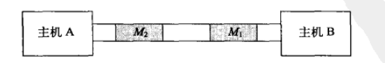
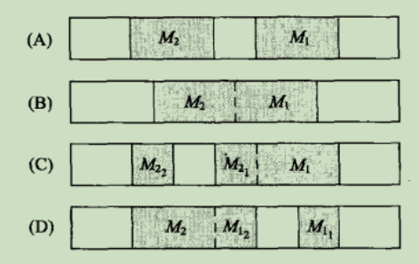
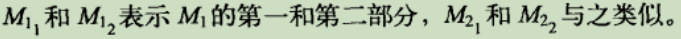
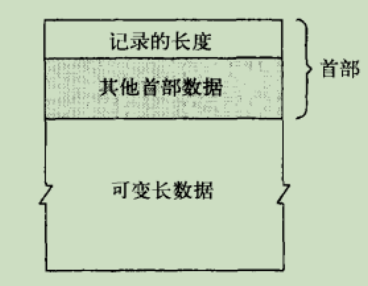

TCP 是一种流协议，这就意味着数据是以字节流的形式传递给接收者的，**没有固有的”报文”或”报文边界”的概念**。从这方面来说，读取 TCP 数据就像从串行端口读取数据一样——无法预先得知在一次指定的读调用中会返回多少字节。

## 流协议存在的问题

发送的数据没有边界，接收方可能对接收到的数据存在多读或少读的问题。为了说明这一点，我们假设在主机 A 和主机 B 的应用程序之间有一条 TCP 连接，主机 A 上的应用程序向主机 B 发送一条报文。进一步假设主机 A 有两条报文要发送，并两次调用 send 来发送，每条报文调用一次。很自然就会想到从主机 A 向主机 B 发送的两条报文是作为两个独立实体，在各自的分组中发送的。

但不幸的是，实际的数据传输过程很可能不会遵循这个模型。

主机A上的应用程序会调用send，我们假设这条写操作的数据被封装在一个分组中传送给B。**实际上，send通常只是将数据复制到主机A的TCP/IP栈中，就返回了。由TCP来决定（如果有的话）需要立即发送多少数据**。做这种决定的过程很复杂，取决于很多因素，比如发送窗口（当时主机B能够接收的数据量），拥塞窗口（对网络拥塞的估计），路径上的最大传输单元（沿着主机A和B之间的网络路径一次可以传输的最大数据量），以及连接的输出队列中有多少数据。

下图只显示了主机A的TCP封装数据时可能使用的诸多方法中的4种

现在，我们从主机 B 应用程序的角度来看这种情形。总的来说，主机 B 应用程序任意一次调用 recv 时，都不会对 TCP 发送给它的数据量做任何假设。比如，当主机 B 应用程序读取第一条报文时，可能会出现下列 4 种结果：

1. 没有数据可读，应用程序阻塞，或者 recv 返回一条指示说明没有数据可读。到底会发生什么情况取决于套接字是否标识为阻塞，以及主机B的操作系统为系统调用 recv 指定了什么样的语义
2. 应用程序获取了报文 M1 中的部分而不是全部数据。比如，发送端TCP像上图 D 那样对数据进行分组就会发生这种情况
3. 用程序获取了报文 M1 中所有的数据，除此之外没有任何其他内容。如果像上图 A 那样对数据分组就会发生这种情况
4. 应用程序获取了报文M1的所有数据，以及报文M2的部分或全部数据。如果像上图 B 或上图 C 那样对数据进行分组就会发生这种情况

注：实际可能的结果不止4种，但我们忽略了出错和EOF之类的结果。我们还假设应用程序读取了所有可读的数据。

TCP 是一个流协议（stream protocol），**尽管数据是以 IP 分组的形式传输的，但分组中的数据量与 send 调用中传送给 TCP 多少数据并没有直接关系**。而且，接收程序也没有什么可靠的方法可以判断数据是如何分组的，因为在两次 recv 调用之间可能会有多个分组到来。

**TCP会记录它发送了多少字节，以及确认的字节，但它不会记录这些字节是如何分组的**。实际上，有些实现在重传丢失分组的时候传送的数据可能比原来的多一些或少一些。

## 解决方法

- 固定报文长度
- 记录结束标记来分割记录，要注意在数据中如果出现结束标记，需要转义以表明此为数据而非结束标记
- 每条报文前面加一个首部，首部至少记录有实际数据的长度

---

⭐️内容取自译者陈涓、赵振平《TCP/IP高效编程：改善网络程序的44个技巧》，仅从中取出个人以为需要纪录的内容。不追求内容的完整性，却也不会丢失所记内容的逻辑性。如果需要了解细致，建议读原书。