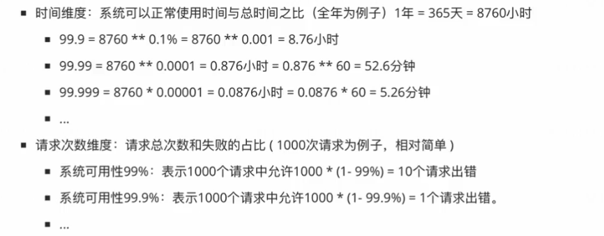
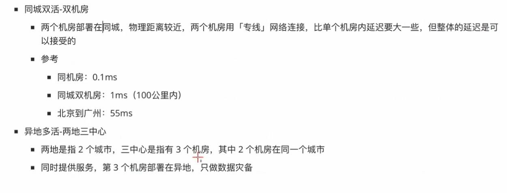

## 概述

（一）高并发

用QPS/TPS来衡量系统对任务的处理能力：

- **QPS**（Queries Per Second）：每秒**查询**数，指一台服务器每秒能够响应的查询次数
- **TPS**（Transactions Per Second）：每秒事务（**增删改**）数，可以是一个接口、多个接口、一个业务流程

QPS只是一个简单查询的统计，不能描述增删改等操作（TPS来描述）。如果只有查询操作，我们认为TPS = QPS

（二）高可用

**SLA**衡量一个系统可用性有多高，目标系统7 x 24不间断服务

大云厂商在宣传自己产品SLA时是多少个9

9 越多代表全年服务可用时间越长服务更可靠，停机时间越短

大厂多数业务 4个9是刚需，5个9是目标，6个9是理想

（三）高性能

**RT**来衡量系统的响应速度，程序处理速度非常快、延迟低、所占内存少、CPU占用率低

比如系统处理一个HTTP请求需要100ms，这100ms就是系统的响应时间

## 技术方案

（一）高并发和高性能

1. 负载均衡：常用的Nginx中间件就有实现
2. 缓存：有本地缓存和分布式缓存
3. 池化复用：线程池、连接池、内存池等
4. 异步：异步日志等
5. 预处理：你刷的视频即便后面有部分还没有看也会被提前获取
6. 分而治之：Master-Worker工作架构，可参考主从Reactor模型

（二）高可用

1. 集群架构：有节点故障会有其它节点顶替
2. 熔断降级：为了防止整个系统故障，抛弃一些非核心的接口和数据，返回兜底数据
3. 限流：访问频率或者并发请求超过承受范围，考虑限流来保证接口的可用性
4. 隔离：服务和资源相互隔离，比如网络资源、机器资源、线程资源等，不会因为某个服务的资源不足而抢占其它服务的资源
5. 多活架构：同城双活-双机房和异地多活-两地三中心

