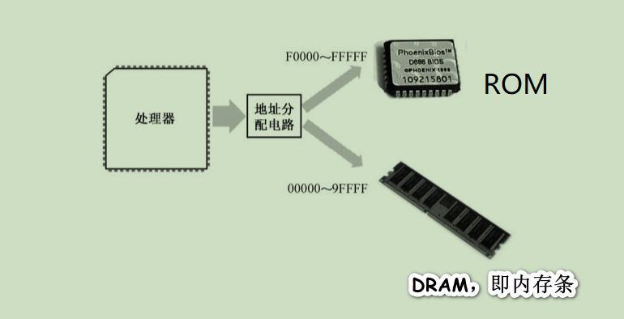
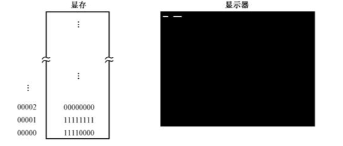
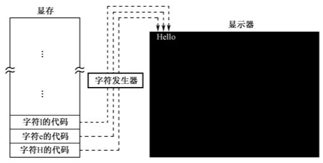
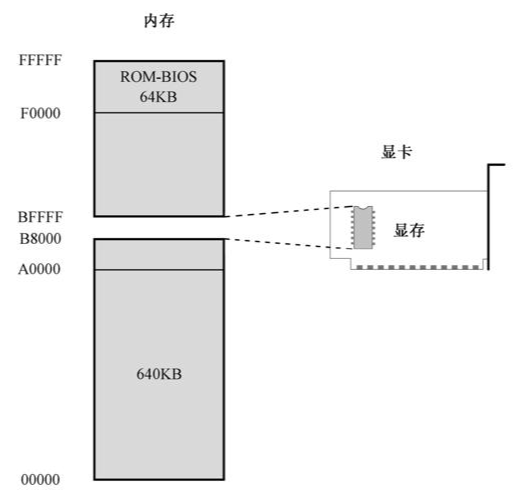

## 计算机的启动过程

在处理器众多的引脚中，有一个是 **RESET**，用于接受复位信号。每当处理器加电，或者 RESET 引脚的电平由低变高时，处理器都会执行硬件初始化，以及一个可选的内部自测试，然后将内部所有寄存器的内容初始化到预置的状态。

处理器的主要功能是取指令和执行指令，加电或者复位之后，它就会立刻尝试去做这样的工作。不过，在这个时候，内存中还没有任何有意义的指令和数据，它该怎么办呢？

### （一）内存的特点

为了节约成本，并提高容量和集成度，在内存中，每比特的存储都是靠一个极其微小的晶体管，外加一个同样极其微小的电容来完成的。可以想象，这样微小的电容，其泄漏电荷的速度当然也非常快。所以，个人计算机中使用的内存需要**定期补充电荷**，这称为刷新，这种存储器也称为*动态随机访问存储器（DRAM）*。**随机访问的意思是，访问任何一个内存单元的速度和它的位置（地址）无关**。比方说读写地址为0x00001的内存单元，和读写地址为0xFFFF0的内存单元，所需要的时间是一样的。

在内存刷新期间，处理器将无法访问它。这还不是最麻烦的，最麻烦的是，在它**断电之后，所有保存的内容都会统统消失**。所以，每当处理器加电之后，它无法从内存中取得任何指令。

### （二）基本输入输出系统

**INTEL 8086可以访问 1MB 的内存空间，地址范围为 0x00000到0xFFFFF**。出于各方面的考虑，计算机系统的设计者将这1MB的内存空间从物理上分为几个部分。

8086 有 20 根地址线，但并非全都用来访问 DRAM，也就是内存条。事实上，这些地址线经过分配，**大部分用于访问 DRAM，剩余的部分给了只读存储器（ROM）和外围的板卡**。

与 DRAM 不同，**ROM 不需要刷新，它的内容是预先写入的，即使掉电也不会消失，但也很难改变**。这个特点很有用，比如，可以将一些程序指令固化在 ROM 中，使处理器在每次加电时都自动执行。处理器醒来后不能饿着，这是很重要的。

> 在以 INTEL 8086 为处理器的系统中，ROM 占据着整个内存空间顶端的64KB，物理地址范围是 0xF0000～0xFFFFF，里面固化了开机时要执行的指令；DRAM 占据着较低端的 640KB，地址范围是 0x00000～0x9FFFF；中间还有一部分分给了其他外围设备，这个以后再说。

因为 8086 加电或者复位时，CS=0xFFFF，IP=0x0000，所以，它取的第一条指令位于物理地址 0xFFFF0，正好位于ROM中，那里固化了开机时需要执行的指令。

处理器取指令执行的自然顺序是从内存的低地址往高地址推进。如果从 0xFFFF0 开始执行，这个位置离 1MB 内存的顶端（物理地址 0xFFFFF）只有 16 字节的长度，一旦IP寄存器的值超过 0x000F，比如 IP=0x0011，那么，它与 CS 一起形成的物理地址将因为溢出而变成 0x00001，这将回绕到 1MB 内存的最底端。

所以，ROM 中位于物理地址 0xFFFF0 的地方，通常是一个跳转指令（jmp），它通过改变CS和IP的内容，使处理器从 ROM 中的较低地址处开始取指令执行。

这块 ROM 芯片中的内容包括很多部分，主要是进行硬件的诊断、检测和初始化。所谓初始化，就是让硬件处于一个正常的、默认的工作状态。最后，它还负责提供一套软件例程，让人们在不必了解硬件细节的情况下从外围设备（比如键盘）获取输入数据，或者向外围设备（比如显示器）输出数据。设备当然是很多的，所以这块 ROM 芯片只针对那些最基本的、对于使用计算机而言最重要的设备，而它所提供的软件例程，也只包含最基本、最常规的功能。正因为如此，这块芯片又叫基本输入输出系统(Base Input ＆ Output System, BIOS)ROM，简称 **ROM-BIOS。**

   ROM-BIOS 容量是有限的，当它完成自己的使命后，最后所要做的，就是从辅助存储设备读取指令数据，然后转到那里开始执行。基本上，这相当于接力赛中的交接棒。

### （三）一切从主引导扇区开始

ROM-BIOS 在完成自己的使命之前，最后要做的一件事是从外存储设备读取更多的指令来交给处理器执行。现实的情况是，对于 ROM-BIOS 来说，绝大多数时候，硬盘都是首选的外存储设备。

硬盘的第一个扇区是 0 面 0 道 1 扇区，或者说是 0 头 0 柱 1 扇区，这个扇区称为主引导扇区。如果计算机的设置是从硬盘启动的，那么，ROM-BIOS 将读取硬盘主引导扇区的内容，将它加载到内存地址 0x0000:0x7c00（也就是物理地址 0x07C00），然后用一个 jmp 指令跳到那里接着执行。

通常，主引导扇区的功能是继续从硬盘的其他部分读取更多的内容加以执行。像 Windows 这样的操作系统，就是采用这种接力的方法一步一步把自己运行起来的。

### （四）欢迎来到主引导扇区

如果硬盘是首选的启动设备，那么，ROM-BIOS将试图读取硬盘的0面0道1扇区。传统上，这就是主引导扇区(Main Boot Sector, MBR)。

读取的主引导扇区数据有 512 字节，ROM-BIOS 程序将它加载到逻辑地址 0x0000:0x7c00 处，也就是物理地址0x07c00 处，然后判断它是否有效。

 **一个有效的主引导扇区，其最后2字节应当是 0x55 和 0xAA **。ROM-BIOS 程序首先检测这两个标志，如果主引导扇区有效，则以一个段间转移指令 jmp 0x0000:0x7c00 跳到那里继续执行。

一般来说，主引导扇区是由操作系统负责的。**正常情况下，一段精心编写的主引导扇区代码将检测用来启动计算机的操作系统，并计算出它所在的硬盘位置。然后，它把操作系统的自举代码加载到内存，也用 jmp 指令跳转到那里继续执行，直到操作系统完全启动。**

## 试图写一段程序

在本章中，我们将试图写一段程序，把它编译之后写入硬盘的主引导扇区，然后让处理器执行。当然，仅仅执行还不够，还必须在屏幕上显示点什么，要不然的话，谁知道我们的程序是不是成功运行了呢？

### （一）在屏幕上显示文字

#### 显卡和显存

##### 图形模式

为了显示文字，通常需要两种硬件，一是显示器，二是显卡。显卡的职责是为显示器提供内容，并控制显示器的显示模式和状态，显示器的职责是将那些内容以视觉可见的方式呈现在屏幕上。

显卡控制显示器的最小单位是像素，一个像素对应着屏幕上的一个点。屏幕上通常有数十万乃至更多的像素，通过控制每个像素的明暗和颜色，我们就能让这大量的像素形成文字和美丽的图像。

显卡都有自己的存储器，因为它位于显卡上，故称显示存储器（Video RAM, VRAM），简称显存，要显示的内容都预先写入显存。和其他半导体存储器一样，显存并没有什么特殊的地方，也是一个按字节访问的存储器件。

对显示器来说，显示黑白图像是最简单的，因为只需要控制每个像素是亮，还是不亮。如果把不亮当成比特“0”，亮看成比特“1”，那就好办了。因为，只要将显存里的每个比特和显示器上的每个像素对应起来，就能实现这个目标。显卡的工作是周期性地从显存中提取这些比特，并把它们按顺序显示在屏幕上。如果是比特“0”，则像素保持原来的状态不变，因为屏幕本来就是黑的；如果是比特“1”，则点亮对应的像素。

下图就是显存的第 1 字节对应着屏幕左上角连续的 8 个像素；第 2 字节对应着屏幕上后续的 8 个像素，后面的依次类推。

第 1 字节的内容是 11110000，第 2 字节的内容是 11111111，其他所有的字节都是 00000000。在这种情况下，屏幕左上角先是显示 4 个亮点，再显示 4 个黑点，然后再显示 8 个亮点。因为像素是紧挨在一起的，所以我们看到的先是一条白短线，隔着一定距离（ 4 个像素）又是一条白长线。黑色和白色只需要1比特就能表示，但要显示更多的颜色，1 比特就不够了。现在最流行的，是用 24 比特，即 3 字节，来对应一个像素。因为 224=16777216，所以在这种模式下，同屏可以显示 16777216 种颜色，这称为真彩色。

##### 文本模式

但你也看到上面的这种方式的弊端，即操作显存里的比特，使得屏幕上能显示出字符的形状，是非常麻烦、非常烦琐的工作，因为你必须计算该字符所对应的比特位于显存里的什么位置。

为了方便，工程师们想出了一个办法。就像一个二进制数既可以是一个普通的数，也可以代表一条处理器指令一样，他们认为每个字符也可以表示成一个数。比如，数字 0x4C 就代表字符 “L”，这个数被称为是字符 “L” 的 ASCII 代码，后面会讲到。

我们可以将字符的代码存放到显存里，第1个代码对应着屏幕左上角第 1 个字符，第 2 个代码对应着屏幕左上角第 2 个字符，后面的依次类推。剩下的工作是如何用代码来控制屏幕上的像素，使它们或明或暗以构成字符的轮廓，这是字符发生器和控制电路的事情。

传统上，这种专门用于显示字符的工作方式称为文本模式。文本模式和图形模式是显卡的两种基本工作模式，可以用指令访问显卡，设置它的显示模式。在不同的工作模式下，显卡对显存内容的解释是不同的。

为了给出要显示的字符，处理器需要访问显存，把字符的 ASCII 码写进去。但是，显存是位于显卡上的，访问显存需要和显卡这个外围设备打交道。同时，多一道手续自然是不好的，这当中最重要的考量是速度和效率。为此，计算机系统的设计者们，这些敢想敢干的人，决定把显存映射到处理器可以直接访问的地址空间里，也就是内存空间里。

我们知道，8086 可以访问 1MB 内存。其中，0x00000～9FFFF 属于常规内存，由内存条提供；0xF0000～0xFFFFF 由主板上的一个芯片提供，即 ROM-BIOS。

这样一来，中间还有一个 320KB 的空洞，即 0xA0000～0xEFFFF。传统上，这段地址空间由特定的外围设备来提供，其中就包括显卡。因为显示的功能对于现代计算机来说实在是太重要了。

由于历史的原因，所有在个人计算机上使用的显卡，在加电自检之后都会把自己初始化为 80×25 的文本模式。在这种模式下，屏幕上可以显示 25 行，每行 80 个字符，每屏总共 2000 个字符。

所以，如上图所示，一直以来，0xB8000～0xBFFFF这段物理地址空间，是留给显卡的，由显卡来提供，用来显示文本。除非显卡出了毛病，否则这段空间总是可以访问的。如果显卡出了毛病怎么办呢？很简单，计算机一定不会通过加电自检过程，这就是传说中的严重错误，计算机是无法启动的，更不要说加载并执行主引导扇区的内容了。

### （二）初始化段寄存器

