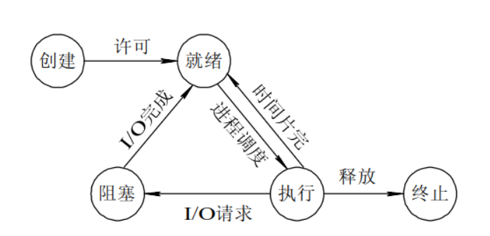
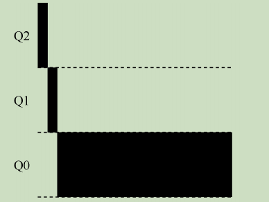
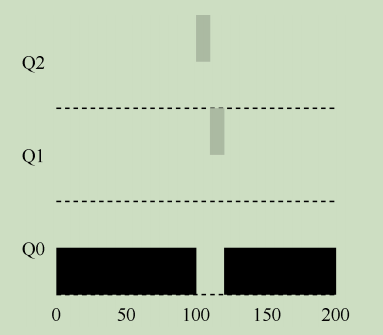
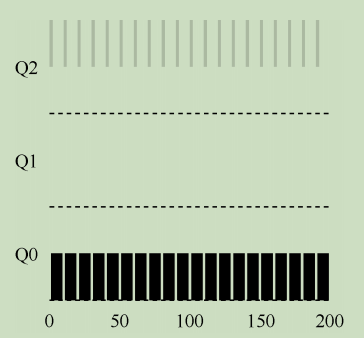
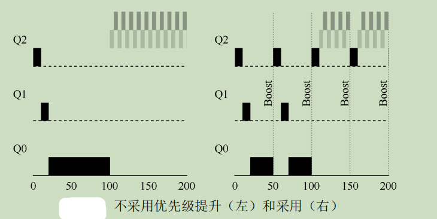
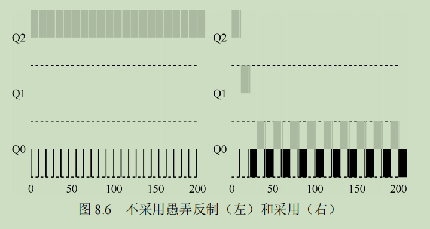
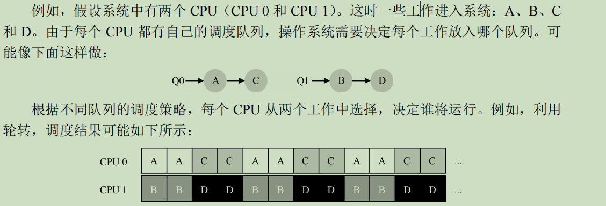

作者用分配桃子举例说明虚拟化，为了让这个例子更加合理，我们假定拿到🍑的人并不食用，仅是占有就心满意足了（当我后面谈食用或品尝也只是占有的意思，享用完之后就会归还）。每个小朋友（进程）都希望得到一个完整的桃子，可现实情况是篮筐中只有一个桃子，我需要为这个篮筐遮上一层布，“欺骗”小朋友这里面有很多很多的桃子（虚拟化），好让他们齐聚于此。我对每个伸手要桃子的小朋友说，你手里现在已经被分配一个完整的桃子，等你真正想要占有实体的时候我会具体的分配到你的手里。每个小朋友不可能一口吃掉这颗桃，等他需要品尝的时候，我就用小刀切割一块他所需的桃子交到他手里面（这是实际分配的，至于允诺的其它部分的桃子由于他暂时没有申请，视为我的可调用资源），给他慢慢享用。这样，其它小朋友来请求吃桃子的时候，我依旧能够满足他们的需求，因为我还有可调用资源。只要我不让他们看到这块布之后的桃子数量，他们永远都以为自己占有一个桃子。

## 抽象：进程

将指令编译成可执行程序，而进程就是正在运行的可执行程序，进程是操作系统为正在运行的程序提供的抽象。

事实表明，人们常常希望同时运行多个程序。比如：在使用计算机或者笔记本的时候，我们会同时运行浏览器、邮件、游戏、音乐播放器，等等。实际上，一个正常的系统可能会有上百个进程同时在运行。我们要完成的任务就是如何让一个CPU同时运行多个程序。

操作系统通过虚拟化CPU 来提供这种假象。通过让一个进程只运行一个**时间片**，然后**切换**到其他进程，操作系统提供了存在多个虚拟 CPU 的假象。这就是时分共享CPU 技术，允许用户如愿运行多个并发进程。潜在的开销就是性能损失，因为如果 CPU 必须共享，每个进程的运行就会慢一点。

为了理解构成进程的是什么，我们必须理解它的机器状态：程序在运行时可以读取或更新的内容。在任何时刻，机器的哪些部分对执行该程序很重要？

- 内存：指令存在内存中，正在运行的程序读取和写入的数据也在内存中。因此进程可以访问的内存（称为地址空间）是该进程的一部分
- 寄存器：许多指令明确地读取或更新寄存器，因此它们对于执行该进程很重要
- 持久性设备：程序也经常访问持久存储设备。此类 I/O 信息可能包含当前打开的文件列表

---

那么程序是如何转换为进程的？具体来说，操作系统如何启动并运行一个程序？进程创建实际如何进行？

操作系统运行程序必须做的第一件事是将代码和所有静态数据（例如初始化变量）加载到内存中，加载到进程的地址空间中。程序最初以某种可执行格式驻留在磁盘上。因此，将程序和静态数据加载到内存中的过程，需要操作系统从磁盘读取这些字节，并将它们放在内存中的某处，如下图所示：

现代操作系统惰性执行该过程，即仅在程序执行期间需要加载的代码或数据片段，才会加载（在举例桃子的时候我就特别强调过这件事情）。

将代码和静态数据加载到内存后，操作系统在运行此进程之前还需要执行其他一些操作。必须为程序的运行时栈分配一些内存。C程序使用栈存放局部变量、函数参数和返回地址。操作系统分配这些内存，并提供给进程。操作系统也可能会用参数初始化栈。具体来说，它会将参数填入 main()函数，即 argc 和 argv 数组。

操作系统也可能为程序的堆分配一些内存。在 C 程序中，堆用于显式请求的动态分配数据。程序通过调用 malloc()来请求这样的空间，并通过调用 free()来明确地释放它。

操作系统还将执行一些其他初始化任务，特别是与输入/输出（I/O）相关的任务。例如，在 UNIX 系统中，默认情况下每个进程都有 3 个打开的文件描述符，用于标准输入、输出和错误。这些描述符让程序轻松读取来自终端的输入以及打印输出到屏幕。

通过将代码和静态数据加载到内存中，通过创建和初始化栈以及执行与 I/O 设置相关的其他工作，OS 现在（终于）为程序执行搭好了舞台。然后它有最后一项任务：启动程序，在入口处运行，即 main()。**通过跳转到 main()例程，OS 将 CPU的控制权转移到新创建的进程中，从而程序开始执行**。

---

进程在给定时间可能处于的不同状态：

- 创建：需要获取系统资源创建进程管理块（PCB）完成资源分配，表示可被调度。进入就绪态（这个动作很快）
- 就绪：加入进程等待队列，等待被操作系统进程调度（分配CPU资源）。一旦被分配CPU资源，立即开始执行，即进入执行态
- 执行：进程运行中，如果时间片用完会进入到就绪态，即进入进程等待队列；如果在时间片范围内运行完成就进入终止态；如果运行过程中出现I/O请求等阻塞操作，将进入阻塞态
- 阻塞：I/O请求等阻塞操作完成后解除阻塞，进入就绪态，即进入进程等待队列
- 终止：进程结束，或出现错误，或被系统终止，进入终止状态。无法再执行

注：PCB记录进程的相关消息

## 机制：受限直接执行

为了虚拟化 CPU，操作系统需要以某种方式让许多任务共享物理 CPU，让它们看起来像是同时运行。基本思想很简单：运行一个进程一段时间，然后运行另一个进程，如此轮换。通过以这种方式时分共享CPU，就实现了虚拟化。

在构建这样的虚拟化机制时存在一些挑战：

- 性能：如何在不增加系统开销的情况下实现虚拟化
- 控制权：如何有效地运行进程，同时保留对 CPU 的控制

控制权对于操作系统尤为重要，因为操作系统负责资源管理。如果没有控制权，一个进程可以简单地无限制运行并接管机器，或访问没有权限的信息。

（一）问题1：受限制的操作

受限直接执行：只需直接在 CPU上运行程序即可。因此，当 OS 希望启动程序运行时，它会在进程列表中为其创建一个进程条目，为其分配一些内存，将程序代码（从磁盘）加载到内存中，找到入口点，跳转到那里，并开始运行用户的代码。

但是这种执行方式存在问题如下：

- 如果我们只运行一个程序，操作系统怎么能确保程序不做任何我们不希望它做的事，同时仍然高效地运行它？
- 当我们运行一个进程时，操作系统如何让它停下来并切换到另一个进程，从而实现虚拟化 CPU 所需的时分共享？

受限直接执行的问题非常明显，如果进程希望执行某种受限操作（如向磁盘发出 I/O 请求或获得更多系统资源），该怎么办？

对于 I/O 和其他相关操作，一种方法就是让所有进程做所有它想做的事情。但是，这样做导致无法构建许多我们想要的系统。例如，如果我们希望构建一个在授予文件访问权限前检查权限的文件系统，就不能简单地让任何用户进程向磁盘发出 I/O。如果这样做，一个进程就可以读取或写入整个磁盘，这样所有的保护都会失效。

因此我们引入两种模式，分别是**用户模式**和**内核模式**：

- 用户模式下运行的代码会**受到限制**。例如，在用户模式下运行时，进程不能发出 I/O 请求。这样做会导致处理器引发异常，操作系统可能会终止进程
- 内核模式下的所有行为皆**不受限制**，运行的代码可以做它喜欢的事，包括特权操作，如发出 I/O 请求和执行所有类型的受限指令

如果用户非要执行特权操作等内核模式下才能做到的事情，操作系统会提供**系统调用**解决这个难题。它允许内核小心地向用户程序暴露某些关键功能，例如访问文件系统、创建和销毁进程、与其他进程通信，以及分配更多内存。

要执行系统调用，程序必须**执行特殊的陷阱（trap）指令**。该指令同时**跳入内核并将特权级别提升到内核模式**。一旦进入内核，系统就可以执行任何需要的特权操作（如果允许），从而为调用进程执行所需的工作。完成后，操作系统调用一个**特殊的从陷阱返回指令**，如你期望的那样，该指令**返回到发起调用的用户程序中，同时将特权级别降低，回到用户模式**。具体流程为：

1. **保存上下文**：内核保存当前进程的上下文（寄存器状态等），以便在系统调用完成后能够恢复。
2. **调用内核功能**：内核根据请求的系统调用号找到相应的处理函数，并执行相应的操作。
3. **返回结果**：系统调用完成后，内核将结果（如返回值或错误码）传回用户态，并恢复进程上下文。
4. **恢复用户态**：最后，控制权返回用户程序，继续执行后续指令。

所以，一次系统调用的过程，其实是发生了两次 CPU 上下文切换，即 用户态 `->` 内核态 `->` 用户态。

内核根据请求的系统调用号找到相应的处理函数，那这个用以查询的地方叫什么？

内核通过在启动时设置**陷阱表**（trap table）来实现。当机器启动时，它在特权（内核）模式下执行，因此可以根据需要自由配置机器硬件。操作系统做的第一件事，就是告诉硬件在发生某些异常事件时要运行哪些代码。操作系统通常通过某种特殊的指令，通知硬件这些陷阱处理程序的位置。一旦硬件被通知，它就会记住这些处理程序的位置，直到下一次重新启动机器，并且硬件知道在发生系统调用和其他异常事件时要做什么（即跳转到哪段代码）。

（二）问题2：进程的切换

:palm_tree: 协作方式：等待系统调用

操作系统相信系统的进程会合理运行。运行时间过长的进程被假定会定期放弃 CPU，以便操作系统可以决定运行其他任务。但是这种方式太理想，容易被不怀好意的人利用，始终占用CPU资源。

事实证明，没有硬件的额外帮助，如果进程拒绝进行系统调用（也不出错），从而将控制权交还给操作系统，那么操作系统无法做任何事情。事实上，在协作方式中，当进程陷入无限循环时，唯一的办法就是使用古老的解决方案来解决计算机系统中的所有问题——重新启动计算机。

:palm_tree: 非协作方式：操作系统进行控制

前面介绍的协作方式不能保证CPU的控制权再次回到操作系统手里，利用**时钟中断**就能解决。时钟设备可以编程为每隔几毫秒产生一次中断。产生中断时，当前正在运行的进程停止，操作系统中预先配置的中断处理程序会运行。此时，操作系统重新获得 CPU 的控制权，因此可以做它想做的事：停止当前进程，并启动另一个进程。

既然操作系统已经重新获得了控制权，无论是通过系统调用协作，还是通过时钟中断更强制执行，都必须决定：是继续运行当前正在运行的进程，还是切换到另一个进程。这个决定是由**调度程序**做出的。

那这个从一个进程切换到另一个进程的过程，我们称之为进程的上下文切换（进程是由内核来管理和调度的，进程的切换只能发生在内核态）。

进程的上下文通常保存在操作系统的内核空间中，具体由操作系统的内核负责管理。当一个进程被挂起或切换到另一个进程时，**内核会保存该进程的上下文信息**，包括寄存器的值、程序计数器、堆栈指针、内存管理信息等。这些信息通常存储在一个称为进程控制块（PCB）的数据结构中。在进程调度时，操作系统会根据需要保存当前进程的上下文，并加载下一个要运行的进程的上下文，从而实现进程间的切换。

保存上下文和恢复上下文的过程开销是很大的，此外，考虑到进程之间的相互的保护，只有操作系统能操作其它进程和了解其它进程的状态，因此这个过程需要在内核态完成。另外，我们知道，现代操作系统通过 TLB来管理虚拟内存到物理内存的映射关系。如果发生运行时动态链接（进入系统态）、内存紧缩等情况，即虚拟内存更新后，TLB 也需要刷新，内存的访问也会随之变慢，不过这是进程上下文切换带来的副作用了。

## 进程调度：介绍

:pushpin: 先进先出（FIFO）

**谁先进入到队列中谁就会被先执行**。实现简单，但是如果前面的进程耗费时间长，会导致后面的进程饥饿（长期得不到执行，很可能还有短时间就能完成的进程）。

:pushpin:最短任务优先（SJF）

既然 FIFO 无法避免短作业的饥饿问题，那就**让短作业被提前执行**。可是这明显建立在多个任务同时到达的前提下，如果多个任务没有同时到达，还是会回退到 FIFO。

如下图所示，进程A先到达，B和C后到达，这个时候A已经在执行，B和C还是要等待A执行完成或时间片结束。

:pushpin:最短时间完成优先（STCF）

SJF遇到的问题是多任务不能保证同时到达，如果长任务在前短任务在后，就彻底回退到FIFO，没有丝毫进步。那么如果可以**抢占CPU资源**就能有改观，即短任务到达之后，暂时终止长任务，把CPU资源抢占过来，执行短任务，等到短任务执行完毕，再把CPU资源给到未完成的长任务。那是如何都不可能回退到FIFO了，这就是STCF。

---

事实上，对于许多早期批处理系统，这些类型的调度算法有一定的意义。然而，引入分时系统改变了这一切。

你看STCF抢占CPU资源来执行短任务，长作业就得一直等待，也进入到长期不能被执行的可能，对于响应时间和交互性也是相当糟糕的。假设你在终端前输入，不得不等待 10s 才能看到系统的回应，只是因为其他一些工作已经在你之前被调度：你肯定不太开心。

因此，我们还有另一个问题：如何构建对响应时间敏感的调度程序？

---

:pushpin:轮转

RR **在一个时间片内运行一个工作，然后切换到运行队列中的下一个任务，而不是运行一个任务直到结束**。它反复执行，直到所有任务完成。请注意，**时间片长度必须是时钟中断周期的倍数**。因此，如果时钟中断是每 10ms 中断一次，则时间片可以是 10ms、20ms 或 10ms 的任何其他倍数。

轮转的时间设置的值是需要权衡的，先假定这个值被设计的合理，那么轮转的问题就是进程间切换太频繁，尽管响应时间被优化，但是周转时间缺严重受到影响。

上下文切换的成本不仅仅来自保存和恢复少量寄存器的操作系统操作。程序运行时，它们在 CPU 高速缓存、TLB、分支预测器和其他片上硬件中建立了大量的状态。切换到另一个工作会导致此状态被刷新，且与当前运行的作业相关的新状态被引入，这可能导致显著的性能成本。

看来得到就意味着失去是不变的真理了，至少前面介绍的这些策略没一个不是这样的情况。

---

前面我们始终是没有引入I/O操作，但这个操作明显在现实系统中是常有的。

调度程序显然要在工作发起 I/O 请求时做出决定，因为当前正在运行的作业在 I/O 期间不会使用 CPU，它被阻塞等待 I/O 完成。调度程序还必须在 I/O 完成时做出决定。发生这种情况时，会产生中断，操作系统运行并将发出 I/O 的进程从阻塞状态移回就绪状态。

通过将每个 CPU 突发作为一项工作，调度程序确保“交互”的进程经常运行。当这些交互式作业正在执行 I/O 时，其他 CPU 密集型作业将运行，从而更好地利用处理器。

## 调度：多级反馈队列

MLFQ 中有许多独立的队列，每个队列有不同的优先级。任何时刻，一个工作只能存在于一个队列中。MLFQ 总是优先执行较高优先级的工作（即在较高级队列中的工作）。当然，每个队列中可能会有多个工作，因此具有同样的优先级。在这种情况下，我们就对这些工作采用轮转调度。

MLFQ 调度策略的关键在于如何设置优先级。MLFQ 没有为每个工作指定不变的优先级，而是根据观察到的行为调整它的优先级。例如，如果一个工作不断放弃CPU 去等待键盘输入，这是交互型进程的可能行为，MLFQ 因此会让它保持高优先级。相反，如果一个工作长时间地占用 CPU，MLFQ 会降低其优先级。通过这种方式，MLFQ 在进程运行过程中学习其行为，从而利用工作的历史来预测它未来的行为。

至此，我们得到了MLFQ的两条基本规则：

- 规则1：如果A的优先级 > B的优先级，运行A（不运行B）
- 规则2：如果A的优先级 = B的优先级，轮转运行A和B

仅仅只是这些规则是不行的，会让那些低优先级中的任务无法被执行或者很难被执行。因此，继续往下讨论并添加规则。

:punch: 尝试1：如何改变优先级？

- 规则3：工作进入系统时，放在最高优先级（最上层队列）
- 规则4a：工作用完整个时间片后，降低其优先级（移入下一个队列）
- 规则4b：如果工作在其时间片以内主动释放CPU，其优先级不变

我们基于以上这些规则，来看应对如下实例的情况。

:snowflake:实例1：单个长工作

受限进入优先级最高的队列Q2，时间片用完之后降级到Q1，时间片用完之后继续降级到最低优先级Q0，一直留在那里。

:snowflake:实例2：来了一个短工作

A（用黑色表示）在最低优先级队列执行（长时间运行的 CPU 密集型工作都这样）。B（用灰色表示）在时间 *T*=100 时到达，并被加入最高优先级队列。由于它的运行时间很短（只有 20ms），经过两个时间片，在被移入最低优先级队列之前，B 执行完毕。然后 A 继续运行（在低优先级）。

如果不知道工作是短工作还是长工作，那么就在开始的时候假设其是短工作，并赋予最高优先级。如果确实是短工作，则很快会执行完毕，否则将被慢慢移入低优先级队列，而这时该工作也被认为是长工作了。通过这种方式，MLFQ 近似于 SJF。

:snowflake:实例3：如果有I/O呢？

前面规则4b（如果工作在其时间片以内主动释放CPU，其优先级不变）就是针对I/O情况的，即阻塞会主动让出CPU，我们不会对该进程进行降级。

交互型工作 B（用灰色表示）每执行 1ms 便需要进行 I/O操作，它与长时间运行的工作 A（用黑色表示）竞争 CPU。MLFQ 算法保持 B 在最高优先级，因为 B 总是让出 CPU。如果 B 是交互型工作，MLFQ 就进一步实现了它的目标，让交互型工作快速运行。

那当前这些规则存在哪些不足呢？

- 饥饿问题：这是规则4b带来的饥饿问题，如果系统有“太多”交互型工作，就会不断占用CPU，导致长工作永远无法得到 CPU（它们饿死了）。
- 容易被恶意程序利用：进程在时间片用完之前，调用一个 I/O 操作（比如访问一个无关的文件），从而主动释放 CPU。如此便可以保持在高优先级，占用更多的 CPU 时间。
- 某些待遇无法享受：一个计算密集的进程可能在某段时间表现为一个交互型的进程。用我们目前的方法，它不会享受系统中其他交互型工作的待遇。

:punch: 尝试2：提升优先级？

- 规则5：经过一段时间S，就将系统中所有工作重新加入最高优先级队列

该规则解决了两个问题。首先，进程不会饿死——在最高优先级队列中，它会以轮转的方式，与其他高优先级工作分享 CPU，从而最终获得执行。其次，如果一个 CPU 密集型工作变成了交互型，当它优先级提升时，调度程序会正确对待它。

如下图所示，如果不采用优先级提升，长工作没过多久就掉入最低优先级，处于饥饿状态。而采用优先级提升之后，没过多久又会被加入到最高优先级，得到使用CPU的机会，避免长期处于饥饿状态。

既然我们引入时间S，那么设置多少合适呢？

:punch: 尝试3：更好的计时方式？

现在还有一个问题要解决：如何阻止调度程序被愚弄？可以看出，这里的元凶是规则4a 和 4b，导致工作在时间片以内释放 CPU，就保留它的优先级。那么应该怎么做？

这里的解决方案，是为 MLFQ 的**每层队列提供**更完善的 CPU 计时方式。调度程序应该记录一个进程在某一层中消耗的总时间，而不是在调度时重新计时。只要进程用完了自己的配额，就将它降到低一优先级的队列中去。不论它是一次用完的，还是拆成很多次用完。因此，我们重写规则 4a 和 4b。

- 规则4：一旦工作用完了其在某一层中的时间配额（无论中间主动放弃了多少次CPU），就降低其优先级（移入低一级队列）

没有规则 4 的保护时，进程可以在每个时间片结束前发起一次 I/O 操作，从而垄断 CPU 时间。有了这样的保护后，不论进程的 I/O 行为如何，都会慢慢地降低优先级，因而无法获得超过公平的 CPU 时间比例。

---

关于 MLFQ 调度算法还有一些问题。其中一个大问题是如何配置一个调度程序，例如，配置多少队列？每一层队列的时间片配置多大？为了避免饥饿问题以及进程行为改变，应该多久提升一次进程的优先级？这些问题都没有显而易见的答案，因此只有利用对工作负载的经验，以及后续对调度程序的调优，才会导致令人满意的平衡。

我们把前面的规则列举出来：

- 规则1：如果A的优先级 > B的优先级，运行A（不运行B）
- 规则2：如果A的优先级 = B的优先级，轮转运行A和B
- 规则3：工作进入系统时，放在最高优先级（最上层队列）
- 规则4：一旦工作用完了其在某一层中的时间配额（无论中间主动放弃了多少次CPU），就降低其优先级（移入低一级队列）
- 规则5：经过一段时间S，就将系统中所有工作重新加入最高优先级队列

MLFQ 有趣的原因是：它不需要对工作的运行方式有先验知识，而是通过观察工作的运行来给出对应的优先级。通过这种方式，MLFQ 可以同时满足各种工作的需求：对于短时间运行的交互型工作，获得类似于 SJF/STCF 的很好的全局性能，同时对长时间运行的CPU 密集型负载也可以公平地、不断地稳步向前。因此，许多系统使用某种类型的 MLFQ作为自己的基础调度程序。

## 调度：比例份额

比例份额算法基于一个简单的想法：调度程序的最终目标，是确保每个工作获得一定比例的 CPU 时间。

彩票调度背后是一个非常基本的概念：彩票数（ticket）代表了进程（或用户或其他）占有某个资源的份额。一个进程拥有的彩票数占总彩票数的百分比，就是它占有资源的份额。假设有两个进程 A 和 B，A 拥有 75 张彩票，B 拥有 25 张。因此我们希望 A 占用 75%的 CPU 时间，而 B 占用 25%。

假定彩票 100 张，调度程序抽取中奖彩票，这是从 0 和 99 之间的一个数，拥有这个数对应的彩票的进程中奖。假设进程 A 拥有 0 到 74 共 75 张彩票，进程 B 拥有 75 到 99 的 25 张，中奖的彩票就决定了运行 A 或 B。调度程序然后加载中奖进程的状态，并运行它。

尽管从调度结果来看，工作 B 运行了 20 个时间片中的 4 个，只是占了 20%，而不是期望的 25%。但是，这两个工作运行得时间越长，它们得到的 CPU 时间比例就会越接近期望。

彩票调度还提供了一些机制，以不同且有效的方式来调度彩票：

- 彩票货币：这种方式允许拥有一组彩票的用户以他们喜欢的某种货币，将彩票分给自己的不同工作。之后操作系统再自动将这种货币兑换为正确的全局彩票
- 彩票转让：通过转让，一个进程可以临时将自己的彩票交给另一个进程。这种机制在客户端/服务端交互的场景中尤其有用，在这种场景中，客户端进程向服务端发送消息，请求其按自己的需求执行工作，为了加速服务端的执行，客户端可以将自己的彩票转让给服务端，从而尽可能加速服务端执行自己请求的速度。服务端执行结束后会将这部分彩票归还给客户端
- 通货膨胀：利用通胀，一个进程可以临时提升或降低自己拥有的彩票数量。当然在竞争环境中，进程之间互相不信任，这种机制就没什么意义。一个贪婪的进程可能给自己非常多的彩票，从而接管机器。但是，通胀可以用于进程之间相互信任的环境。在这种情况下，如果一个进程知道它需要更多 CPU 时间，就可以增加自己的彩票，从而将自己的需求告知操作系统，这一切不需要与任何其他进程通信

关于彩票调度，还有一个问题没有提到，那就是如何为工作分配彩票？这是一个非常棘手的问题，系统的运行严重依赖于彩票的分配。假设用户自己知道如何分配，因此可以给每个用户一定量的彩票，由用户按照需要自主分配给自己的工作。然而这种方案似乎什么也没有解决——还是没有给出具体的分配策略。因此对于给定的一组工作，彩票分配的问题依然没有最佳答案。

还有，前面的彩票调度如果运行时间很短，会出现比例不匹配的情况，这是随机性导致的 。因此，我们下面学习一个确定性的公平分配算法，即步长调度。

系统中的每个工作都有自己的步长，这个值**与票数值成反比**。假设A、B、C 这 3 个工作的票数分别是 100、50 和 250，我们通过用一个大数分别除以他们的票数来获得每个进程的步长。比如用 10000 除以这些票数值，得到了 3 个进程的步长分别为 100、200 和 40。我们称这个值为每个进程的步长。每次进程运行后，我们会让它的计数器 [称为行程值] 增加它的步长，记录它的总体进展。

之后，调度程序使用进程的步长及行程值来确定调度哪个进程。基本思路很简单：当需要进行调度时，选择目前拥有最小行程值的进程，并且在运行之后将该进程的行程值增加一个步长。

可以看出，C 运行了 5 次、A 运行了 2 次，B 一次，正好是票数的比例——200、100 和 50。彩票调度算法只能一段时间后，在概率上实现比例，而步长调度算法可以在每个调度周期后做到完全正确。

但是彩票调度有一个步长调度没有的优势——不需要全局状态。假如一个新的进程在上面的步长调度执行过程中加入系统，应该怎么设置它的行程值呢？设置成 0 吗？这样的话，它就独占 CPU 了。而彩票调度算法不需要对每个进程记录全局状态，只需要用新进程的票数更新全局的总票数就可以了。因此彩票调度算法能够更合理地处理新加入的进程。

## 多处理器调度（高级）

（一）单队列调度

将所有需要调度的工作放入一个单独的队列中，我们称之为单队列多处理器调度（SQMS）。存在的缺陷如下：

- 缺乏可扩展性：为了保证在多CPU 上正常运行，调度程序的开发者需要在代码中通过加锁来保证原子性。锁可能带来巨大的性能损失，尤其是随着系统中的 CPU 数增加时。随着这种单个锁的争用增加，系统花费了越来越多的时间在锁的开销上，较少的时间用于系统应该完成的工作
- 缓存亲和性：假设我们有 5 个工作（A、B、C、D、E）和 4 个处理器，具体情况见下图。由于每个 CPU 都简单地从全局共享的队列中选取下一个工作执行，因此每个工作都不断在不同 CPU 之间转移，这与缓存亲和的目标背道而驰。

为了解决这个问题，大多数 SQMS 调度程序都引入了一些亲和度机制，尽可能让进程在同一个 CPU 上运行。保持一些工作的亲和度的同时，可能需要牺牲其他工作的亲和度来实现负载均衡。

这种调度中，A、B、C、D 这 4 个工作都保持在同一个 CPU 上，只有工作 E 不断地来回迁移（migrating），从而尽可能多地获得缓存亲和度。

综上可知，SQMS 调度方式有优势也有不足。优势是能够从单 CPU 调度程序很简单地发展而来，根据定义，它只有一个队列。然而，它的扩展性不好（由于同步开销有限），并且不能很好地保证缓存亲和度。

（二）多队列调度

正是由于单队列调度程序的这些问题，有些系统使用了多队列的方案，比如每个 CPU一个队列。我们称之为多队列多处理器调度（MQMS）。

在 MQMS 中，基本调度框架包含多个调度队列，每个队列可以使用不同的调度规则，比如轮转或其他任何可能的算法。当一个工作进入系统后，系统会依照一些启发性规则（如随机或选择较空的队列）将其放入某个调度队列。这样一来，每个 CPU 调度之间相互独立，就避免了单队列的方式中由于数据共享及同步带来的问题。

MQMS 比 SQMS 有明显的优势，它天生更具有可扩展性。队列的数量会随着 CPU 的增加而增加，因此锁和缓存争用的开销不是大问题。此外，MQMS 天生具有良好的缓存亲和度。所有工作都保持在固定的 CPU 上，因而可以很好地利用缓存数据。

但可能存在的问题是负载不均

从图中可以看出，A 获得了 B 和 D 两倍的 CPU 时间，这不是期望的结果。更糟的是，假设 A 和 C 都执行完毕，系统中只有 B 和 D。调度队列看起来如下：

最明显的答案是让工作移动，这种技术我们称为迁移（migration）。通过工作的跨 CPU迁移，可以真正实现负载均衡。

在这种情况下，单次迁移并不能解决问题。应该怎么做呢？答案是不断地迁移一个或多个工作。一种可能的解决方案是不断切换工作。

---

⭐️内容取自译者王海鹏《操作系统导论》，仅从中取出个人以为需要纪录的内容。不追求内容的完整性，却也不会丢失所记内容的逻辑性。如果需要了解细致，建议读原书