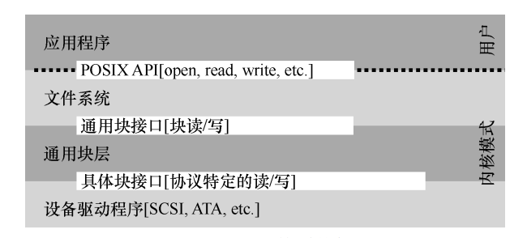
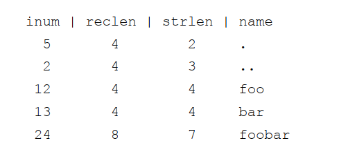

## I/O设备

下面你会对操作系统如何与设备交互有基本的理解。本章将介绍了两种技术，中断和 DMA，用于提高设备效率。我们还会介绍访问设备寄存器的两种方式， I/O 指令和内存映射 I/O。最后，我们还介绍了设备驱动程序的概念，展示了操作系统本身如何封装底层细节，从而更容易以设备无关的方式构建操作系统的其余部分。

### 系统架构

我们先看一个典型系统的架构。其中， CPU 通过某种内存总线或互连电缆连接到系统内存。图像或者其他高性能 I/O 设备通过常规的I/O 总线连接到系统，在许多现代系统中会是 PCI 或它的衍生形式。最后，更下面是外围总线，它们将最慢的设备连接到系统，包括磁盘、鼠标及其他类似设备。  

系统的设计采用了这种分层的方式，这样可以让要求高性能的设备（比如显卡）离 CPU 更近一些，低性能的设备离 CPU 远一些。将磁盘和其他低速设备连到外围总线的好处很多，其中较为突出的好处就是你可以在外围总线上连接大量的设备。

### 标准设备

现在来看一个标准设备（不是真实存在的），通过它来帮助我们更好地理解设备交互的机制。

可以看到一个包含两部分重要组件的设备：

1. 向系统其他部分展现的硬件接口。同软件一样，硬件也需要一些接口，让系统软件来控制它的操作。因此，所有设备都有自己的特定接口以及典型交互的协议。
2. 内部结构部分包含设备相关的特定实现，负责具体实现设备展示给系统的抽象接口。非常简单的设备通常用一个或几个芯片来实现它们的功能。更复杂的设备会包含简单的 CPU、一些通用内存、设备相关的特定芯片，来完成它们的工作。  

### 标准协议

如上图所示，一个（简化的）设备接口包含 3 个寄存器：一个状态（status）寄存器，可以读取并查看设备的当前状态；一个命令（command）寄存器，用于通知设备执行某个具体任务；一个数据（data）寄存器，将数据传给设备或从设备接收数据。通过读写这些寄存器，操作系统可以控制设备的行为。  

1. 通过轮训的方式持续读取 STATUS
2. 操作系统下发数据到数据寄存器
3. 写入命令到寄存器中，这样设备就知道数据已经准备好了，它应该开始执行命令
4. 操作系统再次通过不断轮询设备，等待并判断设备是否执行完成命令（有可能得到一个指示成功或失败的错误码）

这个简单的协议好处是足够简单并且有效。但是难免会有一些低效和不方便。我们注意到这个协议存在的第一个问题就是轮询过程比较低效，在**等待设备执行完成命令时浪费大量 CPU 时间，如果此时操作系统可以切换执行下一个就绪进程，就可以大大提高 CPU 的利用率**。    

### 利用中断减少 CPU 开销

有了中断后， CPU 不再需要不断轮询设备，而是向设备发出一个请求，然后就可以让对应进程睡眠，切换执行其他任务。当设备完成了自身操作，会抛出一个硬件中断，引发 CPU 跳转执行操作系统预先定义好的中断服务例程，或更为简单的中断处理程序。中断处理程序是一小段操作系统代码，它会结束之前的请求（比如从设备读取到了数据或者错误码）并且唤醒等待 I/O 的进程继续执行。  

如果我们不用中断，而是轮训，那么进程 CPU 会一直等待 I/O 操作完成，如下图所示：

但是，在 CPU 等待的这段时间完全可以把 CPU 资源让给其他进程，如果这边 I/O 完成再把 CPU 资源拿过来继续往下执行任务。在下面这个例子中，在磁盘处理进程 1 的请求时，操作系统在 CPU 上运行进程 2。磁盘处理完成后，触发一个中断，然后操作系统唤醒进程 1 继续运行。这样，在这段时间，无论CPU 还是磁盘都可以有效地利用。  

### 利用 DMA 进行更高效的数据传送  

进程 1 在运行过程中需要向磁盘写一些数据，所以它开始进行 I/O 操作，将数据从内存拷贝到磁盘（其中标示 c 的过程）。拷贝结束后，磁盘上的 I/O 操作开始执行，此时 CPU 才可以处理其他请求。  

也就是说将内存数据拷贝到磁盘，是 CPU 来完成。为了让 CPU 得到更好的利用，我们应该把这个工作，即将内存数据拷贝到磁盘交给其他人来完成，也就是我们要介绍的 DMA。DMA 引擎是系统中的一个特殊设备，它可以协调完成内存和设备间的数据传递，不需要 CPU 介入。  

DMA 工作过程如下。为了能够将数据传送给设备，操作系统会通过编程告诉 DMA 引擎数据在内存的位置，要拷贝的大小以及要拷贝到哪个设备。在此之后，操作系统就可以处理其他请求了。当 DMA 的任务完成后， DMA 控制器会抛出一个中断来告诉操作系统自己已经完成数据传输。

从时间线中可以看到，数据的拷贝工作都是由 DMA 控制器来完成的。因为 CPU 在此时是空闲的，所以操作系统可以让它做一些其他事情，比如此处调度进程 2 到 CPU 来运行。因此进程 2 在进程 1 再次运行之前可以使用更多的 CPU。  

### 设备交互的方法

你可能已经注意到了一个问题：我们还没有真正讨论过操作系统究竟如何与设备进行通信！

1. 用明确的 I/O 指令。这些指令规定了操作系统将数据发送到特定设备寄存器的方法，从而允许构造上文提到的协议。例如在 x86 上， in 和 out 指令可以用来与设备进行交互。当需要发送数据给设备时，调用者指定一个存入数据的特定寄存器及一个代表设备的特定端口。执行这个指令就可以实现期望的行为。
2. 内存映射 I/O（memory- mapped I/O）。通过这种方式，硬件将设备寄存器作为内存地址提供。当需要访问设备寄存器时，操作系统装载（读取）或者存入（写入）到该内存地址；然后硬件会将装载/存入转移到设备上，而不是物理内存。  

### 纳入操作系统：设备驱动程序  

在最底层，操作系统的一部分软件清楚地知道设备如何工作，我们将这部分软件称为设备驱动程序，所有设备交互的细节都封装在其中。

我们来看看 Linux 文件系统栈，理解抽象技术如何应用于操作系统的设计和实现。下图粗略地展示了 Linux 软件的组织方式。可以看出，文件系统（当然也包括在其之上的应用程序）完全不清楚它使用的是什么类型的磁盘。它只需要简单地向通用块设备层发送读写请求即可，块设备层会将这些请求路由给对应的设备驱动，然后设备驱动来完成真正的底层操作。尽管比较简单，但下图展示了这些细节如何对操作系统的大部分进行隐藏。  

### 中断和轮询各有应用场景

中断并不是适用于所有的场景，假如有一个非常高性能的设备，它处理请求很快：通常在 CPU 第一次轮询时就可以返回结果。此时如果使用中断，反而会使系统变慢：切换到其他进程，处理中断，再切换回之前的进程代价不小。因此，如果设备非常快，那么最好的办法反而是轮询。如果设备比较慢，那么采用允许发生重叠的中断更好。如果设备的速度未知，或者时快时慢，可以考虑使用混合策略，先尝试轮询一小段时间，如果设备没有完成操作，此时再使用中断。这种两阶段的办法可以实现两种方法的好处。  

另一个最好不要使用中断的场景是网络。网络端收到大量数据包，如果每一个包都发生一次中断，那么有可能导致操作系统发生活锁，即不断处理中断而无法处理用户层的请求。例如，假设一个 Web 服务器因为“点杠效应”而突然承受很重的负载。这种情况下，偶尔使用轮询的方式可以更好地控制系统的行为，并允许 Web 服务器先服务一些用户请求，再回去检查网卡设备是否有更多数据包到达。  

另一个基于中断的优化就是合并。设备在抛出中断之前往往会等待一小段时间，在此期间，其他请求可能很快完成，因此多次中断可以合并为一次中断抛出，从而降低处理中断的代价。当然，等待太长会增加请求的延迟，这是系统中常见的折中。  

## 磁盘驱动器

### 基本几何形状

盘片：是一个圆形坚硬的表面，通过引入磁性变化来永久存储数据。磁盘可能有一个或多个盘片。每个盘片有两面，每面都称为表面。这些盘片通常由一些硬质材料（如铝）制成，然后涂上薄薄的磁性层，即使驱动器断电，驱动器也能持久存储数据位。  

主轴（转轴）：所有盘片都围绕主轴连接在一起，主轴连接到一个电机，以一个恒定（固定）的速度旋转盘片（当驱动器接通电源时）。  

磁道：数据在扇区的同心圆中的每个表面上被编码。 我们称这样的同心圆为一个磁道（track）。一个表面包含数以千计的磁道，紧密地排在一起，数百个磁道只有头发的宽度。  

读写磁头：要从表面进行读写操作，我们需要一种机制， 使我们能够感应（即读取）磁盘上的磁性图案，或者让它们发生变化（即写入）。读写过程由磁头完成；驱动器的每个表面有一个这样的磁头。  

磁臂：磁头连接到单个磁盘臂上，磁盘臂在表面上移动，将磁头定位在期望的磁道上。  

---

图中的磁道和扇区容易看不清楚，这边单独拿出来，见下图：

盘面中一圈圈灰色同心圆为一条条磁道，从圆心向外画直线，可以将磁道划分为若干个弧段，每个磁道上一个弧段被称之为一个扇区（图践绿色部分）。扇区是磁盘的最小组成单元，通常是512字节。（由于不断提高磁盘的大小，部分厂商设定每个扇区的大小是4096字节）

### 简单的磁盘驱动器

该磁道只有 12 个扇区，每个扇区的大小为 512 字节（典型的扇区大小，回忆一下），因此用 0 到 11 的数字表示。这里的单个盘片围绕主轴旋转，电机连接到主轴。当然，磁道本身并不太有趣，我们希望能够读取或写入这些扇区，因此需要一个连接到磁盘臂上的磁头。

**（一）单磁道延迟：旋转延迟**

在我们的简单磁盘中，磁盘不必做太多工作。 具体来说，它必须等待期望的扇区旋转到磁头下。这种等待在现代驱动器中经常发生，并且是 I/O 服务时间的重要组成部分，它有一个特殊的名称：旋转延迟。

在这个例子中，如果完整的旋转延迟是 R，那么磁盘必然产生大约为 R/2 的旋转延迟，以等待 0 来到读/写磁头下面（如果我们从 6 开始）。对这个单一磁道，最坏情况的请求是第 5 扇区，这导致接近完整的旋转延迟，才能服务这种请求。  

**（二）多磁道：寻道时间**

到目前为止，我们的磁盘只有一条磁道，这是不太现实的。现代磁盘当然有数以百万计的磁道。因此，我们来看看更具现实感的磁盘表面，这个表面有 3 条磁道。在该图中，磁头当前位于最内圈的磁道上（它包含扇区 24～35）。下一个磁道包含下一组扇区（12～23），最外面的磁道包含最前面的扇区（0～11）。  

为了理解驱动器如何访问给定的扇区，我们现在追踪请求发生在远处扇区的情况，例如，读取扇区 11。

为了服务这个读取请求，驱动器必须首先将磁盘臂移动到正确的磁道（在这种情况下，是最外面的磁道），通过一个所谓的**寻道**过程。寻道之后，磁盘臂将磁头定位在正确的磁道上。如你所见，在寻道过程中，磁盘臂已经移动到所需的磁道上，并且盘片当然已经开始旋转，在这个例子中，大约旋转了 3 个扇区。因此，扇区 9 即将通过磁头下方，我们只能承受短暂的转动延迟，以便完成传输。当扇区 11 经过磁盘磁头时， I/O 的最后阶段将发生，称为**传输**，数据从表面读取或写入表面。

因此，我们得到了完整的 I/O 时间图：**首先寻道，然后等待转动延迟，最后传输**。  

### 磁盘调度

与任务调度不同，每个任务的长度通常是不知道的，对于磁盘调度，我们可以很好地猜测“任务”（即磁盘请求）需要多长时间。通过估计请求的查找和可能的旋转延迟，磁盘调度程序可以知道每个请求将花费多长时间， 因此（贪婪地）选择先服务花费最少时间的请求。

**（一）SSTF：最短寻道时间优先**

SSTF 按磁道对 I/O 请求队列排序，选择在最近磁道上的请求先完成。例如，假设磁头当前位置在内圈磁道上，并且我们请求扇区 21（中间磁道）和 2（外圈磁道），那么我们会首先发出对 21 的请求，等待它完成，然后发出对 2 的请求。

**（二）电梯（又称 SCAN 或 C-SCAN）**

因为它的行为像电梯，电梯要么向上要么向下，而不只根据哪层楼更近来服务请求。所以一开始选择最近的磁道之后就一直往下走，直到满足选定方向的所有请求。

上图是SCAN，SCAN 不一定要走到尽头才回头，而是满足选定方向的所有请求之后就回头了，当时下面的C-SCAN一定要走到尽头才回头，哪怕尽头没有要满足磁头需求。

**（三）SPTF：最短定位时间优先**

在这个例子中，磁头当前定位在内圈磁道上的扇区 30上方。因此，调度程序必须决定：下一个请求应该为安排扇区 16（在中间磁道上）还是扇区 8（在外圈磁道上）。接下来应该服务哪个请求？答案当然是“视情况而定”。

在现代驱动器中，正如上面所看到的，查找和旋转大致相当（当然，视具体的请求而定），因此 SPTF 是有用的，它提高了性能。然而，它在操作系统中实现起来更加困难，操作系统通常不太清楚磁道边界在哪， 也不知道磁头当前的位置（旋转到了哪里）。 因此， SPTF通常在驱动器内部执行。

## 廉价冗余磁盘阵列（ RAID）

RAID 这种技术使用多个磁盘一起构建更快、更大、更可靠的磁盘系统。从外部看， RAID 看起来像一个磁盘：一组可以读取或写入的块。在内部， RAID 是一个复杂的庞然大物，由多个磁盘、内存（包括易失性和非易失性）以及一个或多个处理器来管理系统。硬件 RAID 非常像一个计算机系统，专门用于管理一组磁盘。

与单个磁盘相比，RAID 具有许多优点。一个好处就是性能。并行使用多个磁盘可以大大加快 I/O 时间。另一个好处是容量。大型数据集需要大型磁盘。最后，RAID 可以提高可靠性。在多个磁盘上传输数据（无 RAID 技术）会使数据容易受到单个磁盘丢失的影响。通过某种形式的冗余，RAID 可以容许损失一个磁盘并保持运行，就像没有错误一样。  

### 接口和 RAID 内部

对于上面的文件系统， RAID 看起来像是一个很大的、（我们希望是）快速的、并且（希望是）可靠的磁盘。就像使用单个磁盘一样， 它将自己展现为线性的块数组，每个块都可以由文件系统（或其他客户端）读取或写入。

当文件系统向 RAID 发出逻辑 I/O 请求时， RAID 内部必须计算要访问的磁盘（或多个磁盘）以完成请求，然后发出一个或多个物理 I/O 来执行此操作。这些物理 I/O 的确切性质取决于 RAID 级别，我们将在下面详细讨论。

### 故障模型

要理解 RAID 并比较不同的方法，我们必须考虑故障模型。 RAID 旨在检测并从某些类型的磁盘故障中恢复。我们假设的第一个故障模型非常简单，并且被称为故障—停止故障模型。在这种模式下，磁盘可以处于两种状态之一：工作状态或故障状态。使用工作状态的磁盘时，所有块都可以读取或写入。相反，当磁盘出现故障时，我们认为它永久丢失。

我们暂时不必担心更复杂的“无声”故障，如磁盘损坏。我们也不必担心在其他工作磁盘上无法访问单个块（有时称为潜在扇区错误）。 稍后我们会考虑这些更复杂的（遗憾的是，更现实的）磁盘错误。

### 如何评估 RAID

容量：在给定一组 N 个磁盘的情况下， RAID 的客户端可用的容量有多少？没有冗余， 答案显然是 N。不同的是，如果有一个系统保存每个块的两个副本，我们将获得 N/2 的有用容量。

可靠性：给定设计允许有多少磁盘故障？根据我们的故障模型，我们只假设整个磁盘可能会故障。

性能：性能有点难以评估，因为它在很大程度上取决于磁盘阵列提供的工作负载。因此，在评估性能之前，我们将首先提出一组应该考虑的典型工作负载。  

### RAID 0 级：条带化

第一个 RAID 级别实际上不是 RAID 级别，因为没有冗余。但是，RAID 0 级因其更为人所知，可作为性能和容量的优秀上限，所以值得了解。

以轮转方式将磁盘阵列的块分布在磁盘上。这种方法的目的是在对数组的连续块进行请求时，从阵列中获取最大的并行性（例如，在一个大的顺序读取中）。我们将同一行中的块称为条带，因此，上面的块 0、 1、 2 和 3 在相同的条带中。

在这个例子中， 我们做了一个简化的假设， 在每个磁盘上只有 1 个块（每个大小为 4KB）放在下一个磁盘上。但是，这种安排不是必然的。在下面这个例子中，我们在每个磁盘上放置两个 4KB 块，然后移动到下一个磁盘。因此，此 RAID 阵列的大块大小为 8KB，因此条带由 4 个大块（或 32KB）数据组成。  

一方面，大块大小主要影响阵列的性能。另一方面，较大的大块大小减少了这种文件内的并行性，因此依靠多个并发请求来实现高吞吐量。但是，较大的大块大小减少了定位时间。因此，确定“最佳”的大块大小是很难做到的，因为它需要大量关于提供给磁盘系统的工作负载的知识。

### RAID 1 级：镜像

对于镜像系统，我们只需生成系统中每个块的多个副本。当然，每个副本应该放在一个单独的磁盘上。通过这样做，我们可以容许磁盘故障。在下面这个例子中，磁盘 0 和磁盘 1 具有相同的内容，而磁盘 2 和磁盘 3 也具有相同的内容。数据在这些镜像对之间条带化。

从镜像阵列读取块时， RAID 有一个选择：它可以读取任一副本。例如，如果对 RAID发出对逻辑块 5 的读取，则可以自由地从磁盘 2 或磁盘 3 读取它。但是，在写入块时，不存在这样的选择： RAID 必须更新两个副本的数据，以保持可靠性。但请注意，这些写入可以并行进行。例如，对逻辑块 5 的写入可以同时在磁盘 2 和 3 上进行。

### RAID 4 级：通过奇偶校验节省空间

基于奇偶校验的方法试图使用较少的容量，从而克服由镜像系统付出的巨大空间损失。

下面这是 5 个磁盘的 RAID-4 系统的例子。对于每一条数据，我们都添加了一个奇偶校验块，用于存储该条块的冗余信息。例如，奇偶校验块 P1 具有从块 4、5、 6 和 7 计算出的冗余信息。比方说磁盘 0 的 0 块如果损坏，可以利用磁盘 4 中 P0 通过计算推导出 磁盘 0 的 0 块的数据。

### RAID 5 级：旋转奇偶校验

RAID-5的工作原理与 RAID-4 几乎完全相同，只是它将奇偶校验块跨驱动器旋转。如你所见，每个条带的奇偶校验块现在都在磁盘上旋转，以消除 RAID-4 的奇偶校验磁盘瓶颈。

## 文件系统实现

### 思考方式

第一个方面是文件系统的数据结构。换言之，文件系统在磁盘上使用哪些类型的结构来组织其数据和元数据？我们即将看到的第一个文件系统（包括下面的VSFS）使用简单的结构，如块或其他对象的数组，而更复杂的文件系统使用更复杂的基于树的结构。

文件系统的第二个方面是访问方法。如何将进程发出的调用，如 open()、read()、 write()等，映射到它的结构上？在执行特定系统调用期间读取哪些结构？改写哪些结构？所有这些步骤的执行效率如何？

如果理解了这两个方面，可能就理解了文件系统基本工作原理。

### 整体组织

我们现在来开发 VSFS 文件系统在**磁盘上的数据结构**的整体组织。 

我们需要做的第一件事是将磁盘分成块（ block）。简单的文件系统只使用一种块大小，这里正是这样做的。我们选择常用的 4KB。

现在让我们考虑一下，为了构建文件系统，需要在这些块中存储什么。当然，首先想到的是用户数据。实际上，任何文件系统中的大多数空间都是（并且应该是）用户数据。我们将用于存放用户数据的磁盘区域称为数据区域，简单起见，将磁盘的固定部分留给这些块，例如磁盘上 64 个块的最后 56 个：

文件系统必须记录每个文件的信息。该信息是元数据的关键部分，并且记录诸如文件包含哪些数据块（在数据区域中）、文件的大小，其所有者和访问权限、访问和修改时间以及其他类似信息的事情。为了存储这些信息，文件系统通常有一个名为 **inode** 的结构。

为了存放 inode，我们还需要在磁盘上留出一些空间。我们将这部分磁盘称为 inode 表，它只是保存了一个磁盘上 inode 的数组。因此，假设我们将 64 个块中的 5 块用于 inode，磁盘映像现在看起来如下：

到目前为止，我们的文件系统有了数据块（ D）和 inode（ I），但还缺一些东西。你可能已经猜到，还需要某种方法来记录 inode 或数据块是空闲还是已分配。因此，这种分配结构是所有文件系统中必需的部分。

我们可以用一个空闲列表，指向第一个空闲块，然后它又指向下一个空闲块，依此类推。我们选择一种简单而流行的结构，称为位图， 一种用于数据区域（数据位图， data bitmap）， 另一种用于 inode 表（ inode位图， inode bitmap）。位图是一种简单的结构：每个位用于指示相应的对象/块是空闲（0）还是正在使用（1）。 

细心的读者可能已经注意到，在极简文件系统的磁盘结构设计中，还有一块。我们将它保留给超级块，在下图中用 S 表示。超级块包含关于该特定文件系统的信息，包括例如文件系统中有多少个 inode 和数据块等等。它可能还包括一些幻数，来标识文件系统类型（在本例中为 VSFS）。 

### 文件组织：inode

每个 inode 都由一个数字（称为 inumber）隐式引用，我们之前称之为文件的低级名称。在 VSFS（和其他简单的文件系统）中，给定一个 inumber，你应该能够直接计算磁盘上相应节点的位置。

在每个 inode 中，实际上是所有关于文件的信息：文件类型（例如，常规文件、目录等）、大小、分配给它的块数、保护信息（如谁拥有该文件以及谁可以访问它）、一些时间信息（包括文件创建、修改或上次访问的时间文件下），以及有关其数据块驻留在磁盘上的位置的信息（如某种类型的指针）。我们将所有关于文件的信息称为元数据。实际上，文件系统中除了纯粹的用户数据外，其他任何信息通常都称为元数据。

设计 inode 时，最重要的决定之一是它如何引用数据块的位置。常见的是**多级索引**。

为了支持更大的文件，文件系统设计者必须在 inode 中引入不同的结构。一个常见的思路是有一个称为间接指针（ indirect pointer）的特殊指针。它不是指向包含用户数据的块，而是指向包含更多指针的块，每个指针指向用户数据。因此， inode 可以有一些固定数量（例如 12 个）的直接指针和一个间接指针。如果文件变得足够大，则会分配一个间接块（来自磁盘的数据块区域），并将 inode 的间接指针设置为指向它。

毫不奇怪，在这种方法中，你可能希望支持更大的文件。为此，只需添加另一个指向inode 的指针：双重间接指针。该指针指的是一个包含间接块指针的块，每个间接块都包含指向数据块的指针。 因此，双重间接块提供了可能性，允许使用额外的 1024× 1024 个 4KB 块来增长文件，换言之，支持超过 4GB 大小的文件。不过，你可能想要更多，我们打赌你知道怎么办：三重间接指针。  

### 目录组织

在 VSFS 中（像许多文件系统一样），目录的组织很简单。一个目录基本上只包含一个二元组（条目名称， inode 号）的列表。对于给定目录中的每个文件或目录，目录的数据块中都有一个字符串和一个数字。 对于每个字符串， 可能还有一个长度（假定采用可变大小的名称）。

例如，假设目录 dir（ inode 号是 5）中有 3 个文件（ foo、 bar 和 foobar），它们的 inode号分别为 12、 13 和 24。 dir 在磁盘上的数据可能如下所示：

在这个例子中，每个条目都有一个 inode 号，记录长度（名称的总字节数加上所有的剩余空间），字符串长度（名称的实际长度），最后是条目的名称。请注意，每个目录有两个额外的条目： .（点）和 ..（点点）。点目录就是当前目录（在本例中为 dir），而点点是父目录（在本例中是根目录）。

删除一个文件（例如调用 unlink()）会在目录中间留下一段空白空间，因此应该有一些方法来标记它（例如，用一个保留的 inode 号，比如 0）。这种删除是使用记录长度的一个原因：新条目可能会重复使用旧的、更大的条目，从而在其中留有额外的空间。

### 空闲空间管理

文件系统必须记录哪些 inode 和数据块是空闲的，哪些不是，这样在分配新文件或目录时，就可以为它找到空间。因此，空闲空间管理对于所有文件系统都很重要。在 VSFS 中，我们用两个简单的位图来完成这个任务。

例如，当我们创建一个文件时，我们必须为该文件分配一个 inode。文件系统将通过位图搜索一个空闲的内容， 并将其分配给该文件。 文件系统必须将 inode 标记为已使用（用 1），并最终用正确的信息更新磁盘上的位图。分配数据块时会发生类似的一组活动。

### 访问路径：读取和写入

**（一）从磁盘读取文件**

打开一个文件（例如/foo/bar，读取它，然后关闭它）。当你发出一个 `open("/foo/bar", O_RDONLY)` 调用时，文件系统首先需要找到文件 bar 的 inode，从而获取关于该文件的一些基本信息（权限信息、文件大小等等）。为此，文件系统必须能够找到 inode，但它现在只有完整的路径名。文件系统必须遍历路径名，从而找到所需的 inode。

所有遍历都从文件系统的根开始，即根目录，它就记为 /。因此，文件系统的第一次磁盘读取是根目录的 inode。通常， 我们在其父目录中找到文件或目录的 i-number。 根没有父目录（根据定义）。因此，根的 inode 号必须是“众所周知的”。在挂载文件系统时，文件系统必须知道它是什么。在大多数 UNIX 文件系统中，根的 inode 号为 2。因此，要开始该过程，文件系统会读入 inode 号 2 的块（第一个 inode 块）。

一旦 inode 被读入，文件系统可以在其中查找指向数据块的指针，数据块包含根目录的内容。因此，文件系统将使用这些磁盘上的指针来读取目录，在这个例子中，寻找 foo 的条目。通过读入一个或多个目录数据块，它将找到 foo 的条目。一旦找到，文件系统也会找到下一个需要的 foo 的 inode 号（假定是 44）。

下一步是递归遍历路径名，直到找到所需的 inode。在这个例子中，文件系统读取包含 foo 的 inode 及其目录数据的块， 最后找到 bar 的 inode 号。 open()的最后一步是将 bar 的 inode 读入内存。然后文件系统进行最后的权限检查，在每个进程的打开文件表中，为此进程分配一个文件描述符，并将它返回给用户。

打开后，程序可以发出 read() 系统调用，从文件中读取。第一次读取（除非 lseek() 已被调用，则在偏移量 0 处）将在文件的第一个块中读取，查阅 inode 以查找这个块的位置。它也会用新的最后访问时间更新 inode。读取将进一步更新此文件描述符在内存中的打开文件表，更新文件偏移量，以便下一次读取会读取第二个文件块，等等。

另外请注意， open 导致的 I/O 量与路径名的长度成正比。对于路径中的每个增加的目录，我们都必须读取它的 inode 及其数据。更糟糕的是，会出现大型目录。在这里，我们只需要读取一个块来获取目录的内容，而对于大型目录，我们可能需要读取很多数据块才能找到所需的条目。

**（二）写入磁盘**

写入文件是一个类似的过程。首先，文件必须打开（如上所述）。其次，应用程序可以发出 write()调用以用新内容更新文件。最后，关闭该文件。

与读取不同，写入文件也可能会分配一个块（除非块被覆写）。当写入一个新文件时，每次写入操作不仅需要将数据写入磁盘，还必须首先决定将哪个块分配给文件，从而相应地更新磁盘的其他结构（例如数据位图和 inode）。因此，每次写入文件在逻辑上会导致 5 个 I/O：一个读取数据位图（然后更新以标记新分配的块被使用），一个写入位图（将它的新状态存入磁盘），再是两次读取，然后写入 inode（用新块的位置更新），最后一次写入真正的数据块本身。

考虑简单和常见的操作（例如文件创建），写入的工作量更大。要创建一个文件，文件系统不仅要分配一个 inode，还要在包含新文件的目录中分配空间。这样做的 I/O 工作总量非常大：一个读取 inode 位图（查找空闲 inode），一个写入 inode 位图（将其标记为已分配），一个写入新的 inode 本身（初始化它），一个写入目录的数据（将文件的高级名称链接到它的 inode 号），以及一个读写目录 inode 以便更新它。如果目录需要增长以容纳新条目，则还需要额外的 I/O（即数据位图和新目录块）。所有这些只是为了创建一个文件！

### 缓存和缓冲

如上面的例子所示，读取和写入文件可能是昂贵的，会导致（慢速）磁盘的许多 I/O。这显然是一个巨大的性能问题，为了弥补，大多数文件系统积极使用系统内存（ DRAM）来缓存重要的块。

现代系统采用动态划分方法。具体来说，许多现代操作系统将虚拟内存页面和文件系统页面集成到统一页面缓存中。通过这种方式，可以在虚拟内存和文件系统之间更灵活地分配内存，具体取决于在给定时间哪种内存需要更多的内存。  

现在想象一下有缓存的文件打开的例子。第一次打开可能会产生很多 I/O 流量，来读取目录的 inode 和数据，但是随后文件打开的同一文件（或同一目录中的文件），大部分会命中缓存，因此不需要 I/O。

我们也考虑一下缓存对写入的影响。尽管可以通过足够大的缓存完全避免读取 I/O，但写入流量必须进入磁盘，才能实现持久。因此，高速缓存不能减少写入流量，像对读取那样。虽然这么说，写缓冲（ write buffering，人们有时这么说）肯定有许多优点。首先，通过延迟写入，文件系统可以将一些更新编成一批（ batch），放入一组较小的 I/O 中。例如，如果在创建一个文件时， inode 位图被更新，稍后在创建另一个文件时又被更新，则文件系统会在第一次更新后延迟写入，从而节省一次 I/O。其次，通过将一些写入缓冲在内存中，系统可以调度（ schedule）后续的 I/O，从而提高性能。最后，一些写入可以通过拖延来完全避免。例如，如果应用程序创建文件并将其删除，则将文件创建延迟写入磁盘，可以完全避免（ avoid）写入。在这种情况下，懒惰（在将块写入磁盘时）是一种美德。

## 局部性和快速文件系统

超级块（S）包含有关整个文件系统的信息：卷的大小、有多少 inode、指向空闲列表块的头部的指针等等。磁盘的 inode 区域包含文件系统的所有 inode。最后，大部分磁盘都被数据块占用。  

### 性能不佳

主要问题是老 UNIX 文件系统将磁盘当成随机存取内存。数据遍布各处，而不考虑保存数据的介质是磁盘的事实，因此具有实实在在的、昂贵的定位成本。

更糟糕的是，文件系统最终会变得非常碎片化（fragmented），因为空闲空间没有得到精心管理。空闲列表最终会指向遍布磁盘的一堆块，并且随着文件的分配，它们只会占用下一个空闲块。结果是在磁盘上来回访问逻辑上连续的文件，从而大大降低了性能。

如你所见，可用空间被分成两块构成的两大块，而不是很好的连续 4 块。假设我们现在希望分配一个大小为 4 块的文件 E：

E 分散在磁盘上，因此，在访问 E 时，无法从磁盘获得峰值（顺序）性能。你首先读取 E1 和 E2，然后寻道，再读取 E3 和 E4。这个碎片问题一直发生在老UNIX 文件系统中，并且会影响性能。

另一个问题：原始块大小太小（512 字节）。因此，从磁盘传输数据本质上是低效的。较小的块是好的，因为它们最大限度地减少了内部碎片，但是由于每个块可能需要一个定位开销来访问它，因此传输不佳。

### 组织结构：柱面组

第一步是更改磁盘上的结构。 FFS 将磁盘划分为一些分组， 称为柱面组。因此，我们可以想象一个具有 10 个柱面组的磁盘：

通过在同一组中放置两个文件， FFS 可以确保先后访问两个文件不会导致穿越磁盘的长时间寻道。因此， FFS 需要能够在每个组中分配文件和目录。每个组看起来像这样：

### 策略：如何分配文件和目录

为了遵守规则， FFS 必须决定什么是“相关的”，并将它们置于同一个区块组内。相反，不相关的东西应该放在不同的块组中。

首先是目录的放置。 FFS 采用了一种简单的方法：找到分配数量少的柱面组（因为我们希望跨组平衡目录）和大量的自由 inode（因为我们希望随后能够分配一堆文件），并将目录数据和 inode 放在该分组中。当然，这里可以使用其他推断方法（例如，考虑空闲数据块的数量）。

对于文件， FFS 做两件事。首先，它确保（在一般情况下）将文件的数据块分配到与其 inode 相同的组中，从而防止 inode 和数据之间的长时间寻道（如在老文件系统中）。其次，它将位于同一目录中的所有文件，放在它们所在目录的柱面组中。因此，如果用户创建了 4个文件， /dir1/1.txt、 /dir1/2.txt、 /dir1/3.txt 和/dir99/4.txt， FFS 会尝试将前 3 个放在一起（同一组），与第四个远离（它在另外某个组中）。

### 大文件例外

在 FFS 中，文件放置的一般策略有一个重要的例外，它出现在大文件中。如果没有不同的规则，大文件将填满它首先放入的块组（也可能填满其他组）。以这种方式填充块组是不符合需要的，因为它妨碍了随后的“相关” 文件放置在该块组内，因此可能破坏文件访问的局部性。

因此，对于大文件， FFS 执行以下操作。在将一定数量的块分配到第一个块组（例如， 12 个块，或 inode 中可用的直接指针的数量）之后， FFS 将文件的下一个“大”块（即第一个间接块指向的那些部分）放在另一个块组中（可能因为它的利用率低而选择）。然后，文件的下一个块放在另一个不同的块组中，依此类推。

### 关于 FFS 的其他几件事

FFS 也引入了一些其他创新。特别是，设计人员非常担心容纳小文件。事实证明，当时许多文件大小为 2KB 左右， 使用 4KB 块虽然有利于传输数据， 但空间效率却不太好。 因此，在典型的文件系统上， 这种内部碎片可能导致大约一半的磁盘浪费。他们决定引入子块（sub-block），这些子块有 512 字节，文件系统可以将它们分配给文件。因此，如果你创建了一个小文件（比如大小为 1KB），它将占用两个子块，因此不会浪费整个 4KB 块。随着文件的增长，文件系统将继续为其分配 512 字节的子块，直到它达到完整的 4KB 数据。此时， FFS 将找到一个 4KB 块，将子块复制到其中，并释放子块以备将来使用。

FFS 引入的第二个巧妙方法，是针对性能进行优化的磁盘布局。那时候（在 SCSI 和其他更现代的设备接口之前），磁盘不太复杂，需要主机 CPU 以更加亲力亲为的方式来控制它们的操作。当文件放在磁盘的连续扇区上时， FFS 遇到了问题。具体来说，在顺序读取期间出现了问题。 FFS 首先发出一个请求，读取块 0。当读取完成时， FFS 向块 1 发出读取，为时已晚：块 1 已在磁头下方旋转，现在对块 1 的读取将导致完全旋转。

FFS 使用不同的布局解决了这个问题，通过每次跳过一块（在这个例子中），在下一块经过磁头之前， FFS 有足够的时间发出请求。实际上， FFS 足够聪明，能够确定特定磁盘在布局时应跳过多少块，以避免额外的旋转。这种技术称为参数化，因为 FFS 会找出磁盘的特定性能参数，并利用它们来确定准确的交错布局方案。

你可能会想：这个方案毕竟不太好。实际上，使用这种类型的布局只能获得 50%的峰值带宽，因为你必须绕过每个轨道两次才能读取每个块一次。幸运的是，现代磁盘更加智能：它们在内部读取整个磁道并将其缓冲在内部磁盘缓存中（由于这个原因，通常称为磁道缓冲区）。然后，在对轨道的后续读取中，磁盘就从其高速缓存中返回所需数据。因此，文件系统不再需要担心这些令人难以置信的低级细节。如果设计得当，抽象和更高级别的接口可能是一件好事。

FFS 还增加了另一些可用性改进。 FFS 是允许长文件名的第一个文件系统之一，因此在文件系统中实现了更具表现力的名称，而不是传统的固定大小方法（例如， 8 个字符）。此外，引入了一种称为符号链接的新概念。正如前面所讨论的那样，硬链接的局限性在于它们都不能指向目录（因为害怕引入文件系统层次结构中的循环），并且它们只能指向同一卷内的文件（即 inode 号必须仍然有意义）。符号链接允许用户为系统上的任何其他文件或目录创建“别名”，因此更加灵活。 FFS 还引入了一个原子 rename()操作，用于重命名文件。除了基本技术之外，可用性的改进也可能让 FFS 拥有更强大的用户群。  

## 崩溃一致性： FSCK 和日志

想象一下，为了完成特定操作，你必须更新两个磁盘上的结构 A 和 B。由于磁盘一次只为一个请求提供服务，因此其中一个请求将首先到达磁盘（A 或 B）。如果在一次写入完成后系统崩溃或断电，则磁盘上的结构将处于不一致的状态。因此，我们遇到了所有文件系统需要解决的问题。

### 解决方案 1：文件系统检查程序

早期的文件系统采用了一种简单的方法来处理崩溃一致性。基本上，它们决定让不一致的事情发生，然后再修复它们（重启时）。这种偷懒方法的典型例子可以在一个工具中找到：fsck。 它 是一个 UNIX 工具，用于查找这些不一致并修复它们。在不同的系统上，存在检查和修复磁盘分区的类似工具。

### 解决方案 2：日志（或预写日志）

更新磁盘时，在覆写结构之前，首先写下一点小注记（在磁盘上的其他地方，在一个众所周知的位置），描述你将要做的事情。写下这个注记就是“预写”部分，我们把它写入一个结构，并组织成“日志”。因此，就有了预写日志。

通过将注释写入磁盘，可以保证在更新（覆写）正在更新的结构期间发生崩溃时，能够返回并查看你所做的注记，然后重试。因此，你会在崩溃后准确知道要修复的内容（以及如何修复它），而不必扫描整个磁盘。因此，通过设计，日志功能在更新期间增加了一些工作量，从而大大减少了恢复期间所需的工作量。

### 解决方案 3：其他方法

Ganger 和 Patt 引入了一种称为软更新的方法。这种方法仔细地对文件系统的所有写入排序，以确保磁盘上的结构永远不会处于不一致的状态。例如，通过先写入指向的数据块，再写入指向它的 inode，可以确保 inode 永远不会指向垃圾。

另一种方法称为写时复制，并且在许多流行的文件系统中使用，包括 Sun 的 ZFS。这种技术永远不会覆写文件或目录。相反，它会对磁盘上以前未使用的位置进行新的更新。在完成许多更新后， COW 文件系统会翻转文件系统的根结构，以包含指向刚更新结构的指针。这样做可以使文件系统保持一致。

另一种方法是我们刚刚在威斯这星大学开发的方法。这种技术名为基于反向指针的一致性，它在写入之间不强制执行排序。为了实现一致性，系统中的每个块都会添加一个额外的反向指针。例如，每个数据块都引用它所属的 inode。访问文件时，文件系统可以检查正向指针（inode 或直接块中的地址）是否指向引用它的块，从而确定文件是否一致。如果是这样，一切都肯定安全地到达磁盘，因此文件是一致的。如果不是，则文件不一致，并返回错误。

## 日志结构文件系统（LFS）

写入磁盘时， LFS 首先将所有更新（包括元数据！）缓冲在内存段中。当段已满时，它会在一次长时间的顺序传输中写入磁盘，并传输到磁盘的未使用部分。LFS 永远不会覆写现有数据，而是始终将段写入空闲位置。由于段很大，因此可以有效地使用磁盘，并且文件系统的性能接近其峰值。

### 按顺序写入磁盘

想象一下，我们正在将数据块 D 写入文件。 将数据块写入磁盘可能会导致以下磁盘布局， 其中 D 写在磁盘地址 A0：

但是，当用户写入数据块时，不仅是数据被写入磁盘；还有其他需要更新的元数据（metadata）。在这个例子中，让我们将文件的 inode（I）也写入磁盘，并将其指向数据块 D。写入磁盘时，数据块和 inode 看起来如下图所示：

简单地将所有更新（例如数据块、 inode 等）顺序写入磁盘的这一基本思想是 LFS 的核心。如果你理解这一点，就抓住了基本的想法。但就像所有复杂的系统一样，魔鬼藏在细节中。

### 顺序而高效地写入

遗憾的是， （单单）顺序写入磁盘并不足以保证高效写入。实际上，你必须向驱动器发出大量连续写入（或一次大写入）才能获得良好的写入性能。

为了达到这个目的， LFS 使用了一种称为**写入缓冲**的古老技术。在写入磁盘之前， LFS 会跟踪内存中的更新。收到足够数量的更新时，会立即将它们写入磁盘，从而确保有效使用磁盘。

LFS 一次写入的大块更新被称为段（segment）。虽然这个术语在计算机系统中被过度使用，但这里的意思是 LFS 用来对写入进行分组的大块。因此，在写入磁盘时， LFS 会缓冲内存段中的更新，然后将该段一次性写入磁盘。只要段足够大，这些写入就会很有效。

上面是一个例子，其中 LFS 将两组更新缓冲到一个小段中。实际段更大（几 MB）。第一次更新是对文件 j 的 4 次块写入，第二次是添加到文件 k 的一个块。然后， LFS 立即将整个七个块的段提交到磁盘。

### 通过间接解决方案：inode 映射

我们已经设法将 inode 分散在整个磁盘上！更糟糕的是，我们永远不会覆盖，因此最新版本的 inode（即我们想要的那个）会不断移动。所以该如何寻找 inode 呢？

为了解决这个问题， LFS 的设计者通过名为 inode 映射（inode map， imap）的数据结构，在 inode 号和 inode 之间引入了一个间接层。imap 是一个结构， 它将 inode 号作为输入，并生成最新版本的 inode 的磁盘地址。因此，你可以想象它通常被实现为一个简单的数组，每个条目有 4 个字节（一个磁盘指针）。每次将 inode 写入磁盘时， imap 都会使用其新位置进行更新。

遗憾的是， imap 需要保持持久（写入磁盘）。这样做允许 LFS 在崩溃时仍能记录 inode 位置，从而按设想运行。因此有一个问题： imap 应该驻留在磁盘上的哪个位置？

LFS 将 inode 映射的块放在它写入所有其他新信息的位置旁边。因此，当将数据块追加到文件 k 时， LFS 实际上将新数据块，其 inode 和一段 inode 映射一起写入磁盘，如下所示：

在该图中， imap 数组存储在标记为 imap 的块中，它告诉 LFS， inode k 位于磁盘地址A1。接下来，这个 inode 告诉 LFS 它的数据块 D 在地址 A0。

### 检查点区域

我们如何很到 inode 映射，现在它的各个部分现在也分布在整个磁盘上？归根到底：文件系统必须在磁盘上有一些固定且已知的位置，才能开始文件查找。

LFS 在磁盘上只有这样一个固定的位置，称为检查点区域（checkpoint region， CR）。检查点区域包含指向最新的 inode 映射片段的指针（即地址），因此可以通过首先读取 CR 来找到 inode 映射片段。请注意，检查点区域仅定期更新（例如每 30s 左右），因此性能不会受到影响。 因此，磁盘布局的整体结构包含一个检查点区域（指向内部映射的最新部分）， 每个 inode映射块包含 inode 的地址， inode 指向文件（和目录），就像典型的 UNIX 文件系统一样。

### 从磁盘读取文件：回顾

为了确保理解 LFS 的工作原理，现在让我们来看看从磁盘读取文件时必须发生的事情：

1. 假设从内存中没有任何东西开始。我们必须读取的第一个磁盘数据结构是检查点区域。检查点区域包含指向整个 inode 映射的指针（磁盘地址），因此 LFS 读入整个 inode 映射并将其缓存在内存中
2. 在此之后，当给定文件的 inode 号时， LFS 只是在 imap 中查很 inode 号到inode 磁盘地址的映射，并读入最新版本的 inode
3. 要从文件中读取块，此时， LFS 完全按照典型的 UNIX 文件系统进行操作，方法是使用直接指针或间接指针或双重间接指针。在通常情况下，从磁盘读取文件时， LFS 应执行与典型文件系统相同数量的 I/O，整个 imap 被缓存，因此 LFS 在读取过程中所做的额外工作是在 imap 中查很 inode 的地址

### 目录如何

目录结构与传统的 UNIX 文件系统基本相同，因为目录只是（名称， inode号）映射的集合。例如，在磁盘上创建文件时， LFS 必须同时写入新的 inode，一些数据，以及引用此文件的目录数据及其 inode。请记住， LFS 将在磁盘上按顺序写入（在缓冲更新一段时间后）。因此，在目录中创建文件 foo，将导致磁盘上的以下新结构：

inode 映射的片段包含目录文件 dir 以及新创建的文件 f 的位置信息。因此，访问文件foo（具有 inode 号 f）时，你先要查看 inode 映射（通常缓存在内存中），找到目录 dir（A3）的 inode 的位置。然后读取目录的 inode，它给你目录数据的位置（A2）。读取此数据块为你提供名称到 inode 号的映射（foo， k）。然后再次查阅 inode 映射，很到 inode 号 k（A1）的位置，最后在地址 A0 处读取所需的数据块。

inode 映射还解决了 LFS 中存在的另一个严重问题， 称为递归更新问题。任何永远不会原地更新的文件系统（例如 LFS）都会遇到该问题，它们将更新移动到磁盘上的新位置。具体来说，每当更新 inode 时，它在磁盘上的位置都会发生变化。如果我们不小心，这也会导致对指向该文件的目录的更新，然后必须更改该目录的父目录，依此类推，一路沿文件系统树向上。

LFS 巧妙地避免了 inode 映射的这个问题。即使 inode 的位置可能会发生变化，更改也不会反映在目录本身中。事实上， imap 结构被更新，而目录保持相同的名称到 inumber 的映射。因此，通过间接， LFS 避免了递归更新问题。

### 一个新问题：垃圾收集

你可能已经注意到 LFS 的另一个问题；它会反复将最新版本的文件（包括其 inode 和数据）写入磁盘上的新位置。此过程在保持写入效率的同时，意味着 LFS 会在整个磁盘中分散旧版本的文件结构。我们（毫不客气地）将这些旧版本称为垃圾。

那么，应该如何处理这些旧版本的 inode、数据块等呢？可以保留那些旧版本并允许用户恢复旧文件版本（例如，当他们意外覆盖或删除文件时，这样做可能非常方便）。这样的文件系统称为版本控制文件系统，因为它跟踪文件的不同版本。但是， LFS 只保留文件的最新活版本。因此（在后台）， LFS 必须定期查很文件数据，索引节点和其他结构的旧的死版本，并清理（clean）它们。因此，清理应该使磁盘上的块再次空闲，以便在后续写入中使用。

实际上， LFS 清理程序按段工作，从而为后续写入清理出大块空间。基本清理过程的工作原理如下。 LFS 清理程序定期读入许多旧的（部分使用的）段，确定哪些块在这些段中存在，然后写出一组新的段，只包含其中活着的块，从而释放旧块用于写入。具体来说，我们预期清理程序读取 M 个现有段，将其内容打包（compact）到 N 个新段（其中 N < M），然后将 N 段写入磁盘的新位置。 然后释放旧的 M 段， 文件系统可以使用它们进行后续写入。

但是，我们现在有两个问题：

1. LFS 如何判断段内的哪些块是活的，哪些块已经死了？
2. 清理程序应该多久运行一次，以及应该选择清理哪些部分？

### 确定块的死活

我们首先关注这个问题。给定磁盘段 S 内的数据块 D， LFS 必须能够确定 D 是不是活的。为此， LFS 会为描述每个块的每个段添加一些额外信息。具体地说，对于每个数据块 D， LFS 包括其 inode 号（它属于哪个文件）及其偏移量（这是该文件的哪一块）。该信息记录在一个数据结构中，位于段头部，称为段摘要块。

根据这些信息，可以直接确定块的死活。对于位于地址 A 的磁盘上的块 D，查看段摘要块并找到其 inode 号 N 和偏移量 T。接下来，查看 imap 以找到 N 所在的位置，并从磁盘读取 N（可能它已经在内存中，这更好）。最后，利用偏移量 T，查看 inode（或某个间接块），看看 inode 认为此文件的第 T 个块在磁盘上的位置。如果它刚好指向磁盘地址 A，则 LFS可以断定块 D 是活的。如果它指向其他地方， LFS 可以断定 D 未被使用（即它已经死了），因此知道不再需要该版本。

上面是一个描述机制的图，其中段摘要块（标记为 SS）记录了地址 A0 处的数据块，实际上是文件 k 在偏移 0 处的部分。通过检查 imap 的 k，可以找到 inode，并且看到它确实指向该位置。

LFS 走了一些捷径，可以更有效地确定死活。例如，当文件被截断或删除时， LFS 会增加其版本号，并在 imap 中记录新版本号。通过在磁盘上的段中记录版本号， LFS 可以简单地通过将磁盘版本号与 imap 中的版本号进行比较，跳过上述较长的检查，从而避免额外的读取。

### 策略问题：要清理哪些块，何时清理

作者描述了一种试图分离冷热段的方法。热段是经常覆盖内容的段。因此，对于这样的段，最好的策略是在清理之前等待很长时间，因为越来越多的块被覆盖（在新的段中），从而被释放以供使用。相比之下，冷段可能有一些死块，但其余的内容相对稳定。因此，作者得出结论，应该尽快清理冷段，延迟清理热段，并开发出一种完全符合要求的试探算法。但是，与大多数政策一样，这只是一种方法，当然并非“最佳”方法。

### 崩溃恢复和日志

最后一个问题：如果系统在 LFS 写入磁盘时崩溃会发生什么？你可能还记得上一章讲的日志，在更新期间崩溃对于文件系统来说是棘手的，因此 LFS 也必须考虑这些问题。

在正常操作期间， LFS 将一些写入缓冲在段中，然后（当段已满或经过一段时间后），将段写入磁盘。 LFS 在日志（log）中组织这些写入，即指向头部段和尾部段的检查点区域，并且每个段指向要写入的下一个段。 LFS 还定期更新检查点区域（CR）。在这些操作期间都可能发生崩溃（写入段，写入 CR）。那么 LFS 在写入这些结构时如何处理崩溃？

我们先介绍第二种情况。为了确保 CR 更新以原子方式发生， LFS 实际上保留了两个CR，每个位于磁盘的一端，并交替写入它们。当使用最新的指向 inode 映射和其他信息的指针更新 CR 时， LFS 还实现了一个谨慎的协议。具体来说，它首先写出一个头（带有时间戳），然后写出 CR 的主体，然后最后写出最后一部分（也带有时间戳）。如果系统在 CR 更新期间崩溃， LFS 可以通过查看一对不一致的时间戳来检测到这一点。 LFS 将始终选择使用具有一致时间戳的最新 CR，从而实现 CR 的一致更新。

我们现在关注第一种情况。由于 LFS 每隔 30s 左右写入一次 CR，因此文件系统的最后一致快照可能很旧。因此，在重新启动时， LFS 可以通过简单地读取检查点区域、它指向的imap 片段以及后续文件和目录，从而轻松地恢复。但是，最后许多秒的更新将会丢失。

为了改进这一点， LFS 尝试通过数据库社区中称为前滚的技术，重建其中许多段。基本思想是从最后一个检查点区域开始，很到日志的结尾（包含在 CR 中），然后使用它来读取下一个段，并查看其中是否有任何有效更新。如果有， LFS 会相应地更新文件系统，从而恢复自上一个检查点以来写入的大部分数据和元数据。

## 数据完整性和保护

### 处理潜在的扇区错误

事实证明，潜在的扇区错误很容易处理，因为它们（根据定义）很容易被检测到。当存储系统尝试访问块，并且磁盘返回错误时， 存储系统应该就用它具有的任何**冗余机制**，来返回正确的数据。例如，在镜像 RAID 中，系统应该访问备用副本。在基于奇偶校验的RAID-4 或 RAID-5 系统中，系统应通过奇偶校验组中的其他块重建该块。因此，利用标准冗余机制，可以容易地恢复诸如 LSE 这样的容易检测到的问题。

### 检测讹误：校验和

即数据讹误导致的无声故障。在出现讹误导致磁盘返回错误数据时，如何阻止用户获取错误数据？

与潜在的扇区错误不同，检测讹误是一个关键问题。客户如何判断一个块坏了？一旦知道特定块是坏的，恢复就像以前一样： 你需要有该块的其他副本（希望没有讹误！）。因此，我们将重点放在**检测技术**上。

现代存储系统用于保持数据完整性的主要机制称为校验和（checksum）。校验和就是一个函数的结果，该函数以一块数据（例如 4KB 块）作为输入，并计算这段数据的函数，产生数据内容的小概要（比如 4 字节或 8 字节）。此摘要称为校验和。这种计算的目的在于，让系统将校验和与数据一起存储，然后在访问时确认数据的当前校验和与原始存储值匹配，从而检测数据是否以某种方式被破坏或改变。

发现了讹误，自然的问题是我们应该怎么做呢？如果存储系统有冗余副本，答案很简单：尝试使用它。如果存储系统没有此类副本，则可能的答案是返回错误。在任何一种情况下，都要意识到讹误检测不是神奇的子弹。如果没有其他方法来获取没有讹误的数据，那你就不走运了。

### 一个新问题：错误的写入

上述基本方案对一般情况的讹误块工作良好。但是，现代磁盘有几种不同的故障模式，需要不同的解决方案。

第一种感兴趣的失败模式称为“错误位置的写入”。这出现在磁盘和RAID 控制器中，它们正确地将数据写入磁盘，但位置错误。在单磁盘系统中，这意味着磁盘写入块 Dx 不是在地址 x（像期望那样），而是在地址 y（因此是“讹误的” Dy）。另外，在多磁盘系统中，控制器也可能将 Di， x 不是写入磁盘 i 的 x，而是写入另一磁盘 j。

毫不奇怪，答案很简单：在每个校验和中添加更多信息。在这种情况下，添加物理标识符（Physical Identifier，物理 ID）非常有用。

可以从磁盘格式看到，磁盘上现在有相当多的冗余：对于每个块，磁盘编号在每个块中重复，并且相关块的偏移量也保留在块本身旁边。但是，冗余信息的存在应该是不奇怪。冗余是错误检测（在这种情况下）和恢复（在其他情况下）的关键。一些额外的信息虽然不是完美磁盘所必需的，但可以帮助检测出现问题的情况。

### 最后一个问题：丢失的写入

遗憾的是，错误位置的写入并不是我们要解决的最后一个问题。具体来说，一些现代存储设备还有一个问题，称为丢失的写入（lost write）。当设备通知上层写入已完成，但事实上它从未持久，就会发生这种问题。因此， 磁盘上留下的是该块的旧内容，而不是更新的新内容。

一种经典方法[BS04]是执行写入验证，或写入后读取。通过在写入后立即读回数据，系统可以确保数据确实到达磁盘表面。然而，这种方法非常慢，使完成写入所需的 I/O 数量翻了一番。

某些系统在系统的其他位置添加校验和，以检测丢失的写入。例如， Sun 的 Zettabyte 文件系统（ZFS）在文件系统的每个 inode 和间接块中，包含文件中每个块的校验和。因此，即使对数据块本身的写入丢失， inode 内的校验和也不会与旧数据匹配。 只有当同时丢失对 inode和数据的写入时，这样的方案才会失败，这是不太可能的情况（但也有可能发生！）。

### 擦净

经过所有这些讨论，你可能想知道：这些校验和何时实际得到检查？当然，在应用程序访问数据时会发生一些检查，但大多数数据很少被访问，因此将保持未检查状态。未经检查的数据对于可靠的存储系统来说是个问题，因为数据位衰减最终可能会影响特定数据的所有副本。

为了解决这个问题，许多系统利用各种形式的磁盘擦净。通过定期读取系统的每个块，并检查校验和是否仍然有效，磁盘系统可以减少某个数据项的所有副本都被破坏的可能性。典型的系统每晚或每周安排扫描。

---

⭐️内容取自译者王海鹏《操作系统导论》，仅从中取出个人以为需要纪录的内容。不追求内容的完整性，却也不会丢失所记内容的逻辑性。如果需要了解细致，建议读原书
