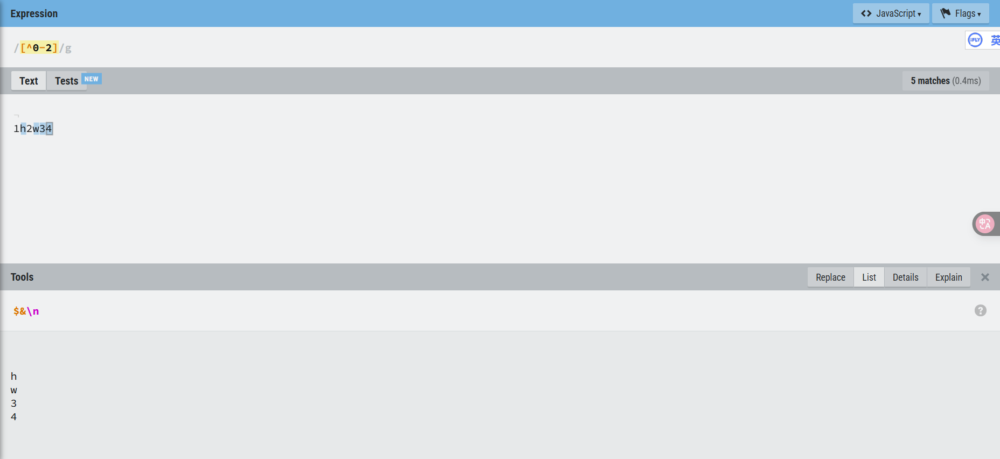
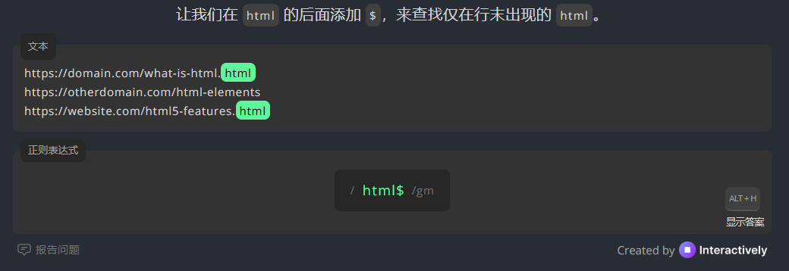

一种是查找特定的信息（搜索），另一种是查找并编辑特定的信息（替换）。事实上，从根本上来讲，这正是正则表达式的两种基本用途：**搜索**和**替换**。给定一个正则表达式，它要么匹配一些文本（进行一次搜索），要么匹配并替换一些文本（进行一次替换）。

# 推荐链接

https://regexr.com/：学习、构建和测试 正则表达式

https://regexlearn.com/zh-cn/：通过练习学习正则表达式

# 匹配单个字符

## 匹配普通文本


输入完整的一个单词 apple，它会完整匹配这个单词，并且严格区分大小写。尽管匹配的列表有多个结果，但从来是返回第一个匹配成功的结果。

如果要返回多个已经匹配成功的结果，对应编程语言应该也会提供相应的语法。至于不区分大小写问题，也应该有编程语言提供语法。

```c++
#include <iostream>
#include <regex>
#include <string>

int main() {
    std::string text = "Hello, world! hello Universe. HELLO again.";
    
    // 使用 regex_constants::icase 来实现不区分大小写
    std::regex pattern("hello", std::regex_constants::icase);

    // 通过迭代器遍历多个匹配成功的结果
    auto words_begin = std::sregex_iterator(text.begin(), text.end(), pattern);
    auto words_end = std::sregex_iterator();

    std::cout << "Found matches:\n";
    for (std::sregex_iterator i = words_begin; i != words_end; ++i) {
        std::smatch match = *i;
        std::cout << " - " << match.str() << '\n';
    }

    return 0;
}
```

## 匹配任意字符

`.` 可以匹配任意单个字符：


`.`字符可以匹配任意单个字符、字母、数字甚至是 `.`字符本身。

## 匹配特殊字符

尽管 `.` 字符可以匹配自身，但对于这种特殊字符，通常选择转移 `\` 来完成：


# 匹配一组字符

## 匹配多个字符中的某一个

如果希望一个词中的字符是只要是字符集中的一个就行，我们就将所有的可选字符写进中括号 `[]` 中：


## 利用字符集合区间

如果我们要匹配任意单个数字，依据现在的知识，肯定是 [0123456789]。

但是本小节可以简化为 [0-9]：


在同一个字符集合里可以给出多个字符区间。

比如说，下面这个模式可以匹配任何一个字母（无论大小写）或数字，但除此以外的其他字符（既不是数字也不是字母的字符）都不匹配：`[A-Za-z0-9]`

## 排除

字符集合通常用来指定一组必须匹配其中之一的字符。但在某些场合，我们需要反过来做，即指定一组不需要匹配的字符。换句话说，就是排除字符集合里指定的那些字符。

只需要在字符集的前面添加 `^`：



# 使用元字符

## 匹配空白字符

在进行正则表达式搜索的时候，我们经常会需要匹配文本中的非打印空白字符。比如说，你可能想把所有的制表符或换行符找出来。直接在正则表达式中输入这类字符是件棘手的事（至少可以这么说）。


## 匹配特定的字符类型

（1）匹配数字


（2）匹配字母数字


（3）匹配空白字符


（4）匹配十六进制和八进制


## 使用 POSIX 字符类


# 重复匹配

## 有多少个匹配

（1）匹配一个或多个字符

要想匹配某个字符（或字符集合）的一次或多次重复，只要简单地在其**后面加上**一个 `+` 字符就行了


（2）匹配零个或多个字符

你想匹配一个可有可无的字符，也就是该字符可以出现零次或多次的情况。这种匹配需要用 `*` 元字符来完成。`*` 的用法与`+`完全一样，只要把它放在某个字符（或字符集合）的后面


（3）匹配零个或一个字符

`?` 只能匹配某个字符（或字符集合）的零次或一次出现，最多不超过一次。`?` 非常适合匹配一段文本中某个特定的可选字符。


## 匹配的重复次数

前面的匹配无法控制力度：


为了解决这些问题并对重复性匹配有更多的控制权，正则表达式允许使用重复范围。

重复范围在 `{和}` 之间指定。

（1）具体的重复匹配

要想设置具体的匹配次数，把数字写在{和}之间即可。比如说，{2}意味着匹配前一个字符（或字符集合）2次。如果只能匹配1次，则不算是匹配成功。


说到底就是把前面的字符 e 变为 ee，所以匹配 beer。

等到后面学习到分组 `()` ，你就会明白含义。见下图：


它的含义就是匹配 bananabanana，而不是匹配两个 banana：


（2）区间范围

`{}`语法还可以用来为重复匹配次数设定一个区间范围，也就是**匹配的最小次数和最大次数**。区间必须以 {2,4}（最少重复 2 次，最多重复 4 次）这样的形式给出。


（3）匹配“至少重复多少次”

重复范围的最后一种用法是指定至少要匹配多少次（不指定最大匹配次数）。这种用法的语法类似于区间范围语法，**只是省略了最大值部分而已**。比如说，{3,}表示至少重复 3 次，换句话说，就是“重复 3 次或更多次”。


## 防止过度匹配

`*` 和 `+` 都是所谓的“贪婪型”元字符，其匹配行为是多多益善而不是适可而止。它们会尽可能地从一段文本的开头一直匹配到末尾，而不是碰到第一个匹配时就停止

在不需要这种“贪婪行为”的时候该怎么办？

答案是使用这些量词的“懒惰型”版本（之所以称之为“懒惰型”是因为其**匹配尽可能少的字符**，而非尽可能多地去匹配）。懒惰型量词的写法是**在贪婪型量词后面加上一个 ?**


贪婪：


懒惰：


# 位置匹配

## 单词边界

第一种边界（也是最常用到的）是由 `\b` 指定的单词边界。顾名思义，`\b` 用来匹配一个单词的开头或结尾。

重要的是要认识到，如果你想匹配一个完整的单词，就必须在要匹配的文本的前后都加上 `\b`。

`\B` 将匹配一个前后都不是单词边界的连字符。

## 字符串边界

字符串边界元字符有两个：`^` 代表字符串开头，`$` 代表字符串结尾。


`^` 和 `$` 是用来**锚定位置**的：确保匹配从头开始、到尾结束。

不加它们时，正则可以匹配局部。若你希望“整个字符串**只包含**某个格式”，就该用 `^...$`。

如上图中，虽然匹配的文本中有 hello，但是整个文本不是 hello，而是有其他的内容，也就没有匹配成功。

&nbsp;

`$` 放在要匹配的数据后面，就是说在一行中找到末尾出现该数据才算匹配成功，如果数据在一行内容中有，但是在前面或者中间出现都不算匹配成功，必须是末尾。

如下图中第二行是不会匹配出内容的。再有是匹配第一行，如果要多行记得开启多行模式，只不过下面这个是因为已经开启多行匹配模式 /regex/g**m**。



相应的 `^` 就是放在匹配数据的前面，那么这个数据必须在行首出现。


&nbsp;

补充一个多行模式：


如果不使用多行模式，下面不会匹配成功：


因为 `^` 和 `$` 只作用于整串的开头和结尾，`banana` 在中间行，不符合条件。

在使用时，`(?m)`必须出现在整个模式的最前面：


注意：前面使用这个网站，选择的 js 语法，但是它不支持多行匹配。所以改成 PCRE 规则就可以匹配，只是会在文本上显示匹配的内容。

还有哪些类似的模式修饰符？

| 修饰符 | 作用                           |
| ------ | ------------------------------ |
| `(?i)` | 忽略大小写（ignore case）      |
| `(?x)` | 忽略空格和允许注释（extended） |

# 使用子表达式

## 分组

子表达式是更长的表达式的一部分。划分子表达式的目的是为了将其视为单一的实体来使用。子表达式必须出现在字符`(和)`之间。


## 嵌套

子表达式允许嵌套。事实上，子表达式还可以多重嵌套，一层套一层。


匹配第一个分组 (10,20)，此分组内部还有匹配的两个分组 10 和 20。

# 反向引用

## 反向引用匹配

当你在正则表达式中使用 **圆括号 `()`** 捕获某个子表达式时，就可以在表达式的**后续部分使用反向引用**来重复这个子表达式的内容。

在正则中，反向引用用 `\1, \2, \3 ... 表示第1、2、3个捕获组`


就看第一个分组，() 捕获 ha，后面添加 \1 等价替换为 ha，所以匹配 ha-ha。因此，你可以把它理解为一个变量，\1 等于 ha。


&nbsp;

您可以对表达式进行分组，并确保它不被引用捕获。例如，下面有两个分组，但我们用 \1 引用的第一个组实际上是指向第二个组，因为第一个是未被捕获的分组。


# 环视

到目前为止，我们见过的正则表达式都是用来匹配文本的，但有时你可能想用正则表达式**标记要匹配的文本位置**（而不是文本自身）。这就要用到环视（能够前后查看）了。


其实，我只关心标题内容，而不关系两个标签。以现在的知识只能这样先分组，再把不相关的删除。

学习环视，可以只提出到标题内容。

## 向前查看

向前查看指定了一个必须匹配但不用在结果中返回的模式。向前查看其实就是一个子表达式，而且从格式上看也确实如此。向前查看模式的语法是一个以 `?=` 开头的子表达式，**需要匹配的文本跟在 = 的后面**。


## 向后查看

许多正则表达式实现还支持向后查看，也就是查看出现在已匹配文本之前的内容，向后查看操作符是`?<=`


## 结合向前查看和向后查看

向前查看和向后查看可以组合在一起使用：


## 否定式环视

否定式向前查看会向前查看不匹配指定模式的文本，否定式向后查看则向后查看不匹配指定模式的文本。


否定式向前查看：匹配不是以 `.jpg` 结尾的文件名

```c++
\b\w+\.(?!jpg\b)\w+\b
```

✅ `file.png`

✅ `image.gif`

❌ `photo.jpg`（不会匹配）

&nbsp;

否定式向后查看：匹配不以 `$` 开头的金额

```c++
(?<!\$)\d+(\.\d{2})?
```

✅ `100`、`23.50`（正常金额）

❌ `$100`、`$23.50`（带美元符号的不匹配）

&nbsp;

结合两种否定式：匹配不在 `<script>` 标签中的文本

```c++
(?<!<script[^>]*>).*?(?!</script>)
```

# 嵌入式条件（了解）


注：**标准 C++ `<regex>` 不支持嵌入条件语法**。

## 反引用条件

反向引用条件仅在一个前面的子表达式得以匹配的情况下才允许使用另一个表达式。

听起来很费解，我们还是用一个例子来说明：你需要把一段文本里的``标签全都找出来；不仅如此，如果某个``标签是一个链接（位于`<a>`和`</a>`标签之间）的话，你还要匹配整个链接标签。

```c++
(?(条件)then|else)
```

`条件`：通常是一个捕获组编号（如 `1`），或者一个 lookahead。

`then`：如果满足条件，执行这个部分

`else`：否则执行这个部分（可选）

## 环视条件

环视条件允许根据向前查看或向后查看操作是否成功来决定要不要执行表达式。环视条件的语法与反向引用条件的语法大同小异，只需把反向引用（括号里的反向引用编号）替换为一个完整的环视表达式就行了。

环视条件允许根据向前查看或向后查看操作是否成功来决定要不要执行表达式。环视条件的语法与反向引用条件的语法大同小异，只需把反向引用（括号里的反向引用编号）替换为一个完整的环视表达式就行了。
