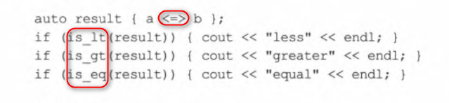
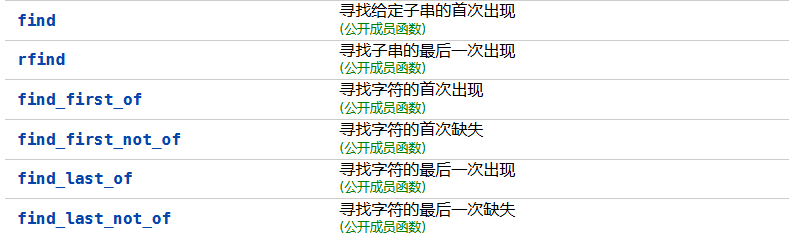
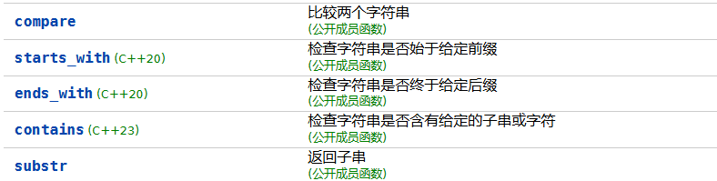

# constexpr


# std::initializer_list


# vector assign 操作

用于**一次性清空并重新赋值**一个 `vector`，替代传统的 `clear() + insert()`。

`assign` 会清空原 vector，不会保留原 vector 的容量；可以用来快速替换 vector 的内容。

## 第一种用法：assign(n, val)

将 vector 赋值为 `n` 个值为 `val` 的元素。

```c++
vector<int> v;
v.assign(5, 10);  // v = {10, 10, 10, 10, 10}
```

## 第二种用法：assign(first, last)

使用迭代器区间 `[first, last)` 给 vector 赋值。

```c++
vector<int> source = {1, 2, 3, 4};
vector<int> target;
target.assign(source.begin(), source.end());  // target = {1, 2, 3, 4}
```

这相当于：

```c++
target.clear();
target.insert(target.begin(), source.begin(), source.end());
```

# 把结构体放到 set 容器有什么要求？

要重载运算符 <，否则不让你存进去，因为 set 是有序的嘛。

```c++
struct Interval {
  int start, end;

  Interval(int s, int e) : start(s), end(e) {}

  bool operator<(const Interval &other) const {
	  if (start == other.start) {
		  return end < other.end;
	  }
	  return start < other.start;
  }
};
```

按理说，涉及到的元素必须全部参与到重载运算符中，否则可能去重出现不符合需求。

比方说，如果你只写：`return start < other.start`，那么那些 start 不同的当然视为不同的元素，但是 start 相同但是 end 不同的却被视为相同的元素，这显然不是我们期望的。

# 把结构体放到 unordered_set 容器有什么要求？

unordered_set 底层是哈希表，自然要涉及到的成员变量要添加额外的处理，就像前面的 set 集合那样：

- 提供 `==` 运算符重载：因为哈希容器要判断元素是否相等，你需要定义怎样认为两个结构体是“相等”的

```c++
struct Interval {
    int start, end;
    bool operator==(const Interval& other) const {
        return start == other.start && end == other.end;
    }
};
```

- 自定义哈希函数：哈希函数必须保证**相等的对象产生相同的哈希值**

```c++
struct IntervalHash {
    size_t operator()(const Interval& itv) const {
        return hash<int>()(itv.start) ^ (hash<int>()(itv.end) << 1);
    }
};

unordered_set<Interval, IntervalHash> s;	// 使用
```

# C++ 提供的哈希函数

在 C++ 中，标准库通过 `<functional>` 提供了泛型哈希函数 `std::hash<T>`。


代码示例：

```c++
#include <iostream>
#include <unordered_set>
#include <string>

using namespace std;

int main() {
    unordered_set<string> s;
    s.insert("apple");
    s.insert("banana");

    for (const auto& str : s) {
        cout << str << endl;
    }

    // 使用 std::hash 显式计算哈希值
    hash<string> str_hash;
    cout << "Hash of 'apple': " << str_hash("apple") << endl;

    return 0;
}
```

# C++ 20 的字符串比较改进

之前的 compare 函数的返回值很容易忘记是什么含义，在 C++ 20 得到改进：



# string 上的操作

## 查找



前两个是子串，后四个是字符，该如何理解？

这六个函数传参都是传的字符串，只不过前两个方法是要完整匹配到要匹配的字串才返回，而后面四个是以字符集合中的某个字符被找到就可以返回。

```c++
int main() {
	std::string s = "abcdeabcde";

	// 完整匹配字符或字串的起始下标
	std::cout << "find(\"bc\"): " << s.find("bc") << "\n";                  // 1
	std::cout << "rfind(\"cd\"): " << s.rfind("cd") << "\n";                // 7

	// 匹配字符集合中的任意一个字符的起始位置
	std::cout << "find_first_of(\"bd\"): " << s.find_first_of("bd") << "\n";       // 1 ('b')
	// 匹配不是字符集合中的任意一个字符的起始位置
	std::cout << "find_first_not_of(\"abc\"): " << s.find_first_not_of("abc") << "\n"; // 3 ('d')

	// 同上，只不过是从后面开始查
	std::cout << "find_last_of(\"bd\"): " << s.find_last_of("bd") << "\n";         // 8 ('b')
	std::cout << "find_last_not_of(\"abc\"): " << s.find_last_not_of("abc") << "\n";   // 9 ('d')
}
```

## 操作



## 插入

```c++
string& insert(size_t pos, const string& str);
string& insert(size_t pos, const string& str, size_t subpos, size_t sublen);
string& insert(size_t pos, const char* s);
string& insert(size_t pos, const char* s, size_t n);
string& insert(size_t pos, size_t n, char c);
iterator insert(const_iterator p, char c);
iterator insert(const_iterator p, size_t n, char c);
```

插入的方式有很多中，明显底层是会支持自动扩容和移动的，放心在任何有效位置插入即可。

# 注意 C++ 20 下 vector 的模板推导

```c++
vector strs = {"xy","name","www"};

strs[0][0] = 'w';	// 报错，因为 strs[0] 的类型是 const char*，不是 string
```

因此，你可以选择在每个字符串的双引号后面添加 s：

```c++
vector strs = {"xy"s,"name"s,"www"s};

strs[0][0] = 'w';	// 就不会报错了 
```

# string_view

string_view 就基本就是  const string & 的简单替代品，但不会产生开销。它不拥有数据（不负责内存分配与释放），也不会进行拷贝。

string_view 支持与 std::string 类似的接口。一个例外是缺少 c_str()，但 data() 是可用的。

另外，string_view 添加了 remove_prefix(size_t) 和 remove_suffix(size_t) 方法，前者将起始指针前移给定的偏移量来收缩字符串，后者则将结尾指针倒退到给定的偏移量来收缩字符串。

&nbsp;

除了可以避免拷贝，还可以兼容各种字符串类型，都可以不同写多个重载函数：

```c++
void print(std::string_view s);

print("literal");             // const char*
print(std::string("string")); // std::string
print({'a', 'b', 'c'});       // 也支持部分容器
```

&nbsp;

注意点：

1. `string_view` 只是“**观察者**”，它**不拥有数据**。如果它引用了一个即将销毁的对象，**就会悬垂**。所以，绝对要保证指向对象生命周期没有结束。
2. 默认不以 null 字符结尾（不像 C 字符串），调用 `data()` 返回的是裸指针，不保证有 `\0` 结束。所以不要把它传给 `strlen`、`printf("%s")` 等需要 null 结尾的函数。
3. 不适合长期保存 `char* + offset` 的结果，例如从一个临时字符串中“切”出一个视图，如果保存太久，就容易踩生命周期的雷。

&nbsp;

为了这点性能，这么多注意点，还要关心生命周期问题，太不让人省心了，还是老老实实去用 string。非得追求性能和方便，可以自己去实现 string。

# format 的使用

### 占位符 {} 自动匹配参数

```c++
std::format("Name: {}, Age: {}", "Alice", 30);
// 输出: Name: Alice, Age: 30
```

### 对齐与填充

```c++
std::format("[{:>8}]", "abc");   // 右对齐: [     abc]
std::format("[{:<8}]", "abc");   // 左对齐: [abc     ]
std::format("[{:^8}]", "abc");   // 居中:   [  abc   ]
std::format("[{:*^8}]", "abc");  // 居中填充 *: [**abc***]
```

### 数值格式

```c++
std::format("{:06}", 42);       // 输出: 000042（宽度6，前导0）
std::format("{:#x}", 255);      // 输出: 0xff（十六进制）
std::format("{:#08x}", 255);    // 输出: 0x0000ff
std::format("{:.2f}", 3.14159); // 输出: 3.14（保留2位小数）
```

# C++ 20 提供一些预定义的数学常量

C++20 在 `<numbers>` 头文件中引入了**一组标准数学常量**，让你可以直接使用精确的数学值，而无需手动定义或依赖第三方库。

所有常量都是 `constexpr`，可以用于编译期计算。

| 名称                       | 值（double 精度）  | 描述          |
| -------------------------- | ------------------ | ------------- |
| `std::numbers::e`          | 2.718281828459045  | 自然常数 e    |
| `std::numbers::log2e`      | 1.4426950408889634 | log₂^(e)^     |
| `std::numbers::log10e`     | 0.4342944819032518 | log₁₀^(e)^    |
| `std::numbers::pi`         | 3.141592653589793  | 圆周率 π      |
| `std::numbers::inv_pi`     | 0.3183098861837907 | π 分之 1      |
| `std::numbers::inv_sqrtpi` | 0.5641895835477563 | 根号 π 分之 1 |
| `std::numbers::ln2`        | 0.6931471805599453 | ln(2)         |
| `std::numbers::ln10`       | 2.302585092994046  | ln(10)        |
| `std::numbers::sqrt2`      | 1.4142135623730951 | 根号 2        |
| `std::numbers::sqrt3`      | 1.7320508075688772 | 根号 3        |
| `std::numbers::inv_sqrt3`  | 0.5773502691896257 | 根号 3 分之 1 |
| `std::numbers::egamma`     | 0.5772156649015329 | 欧拉常数 γ    |
| `std::numbers::phi`        | 1.618033988749895  | 黄金比例 φ    |


