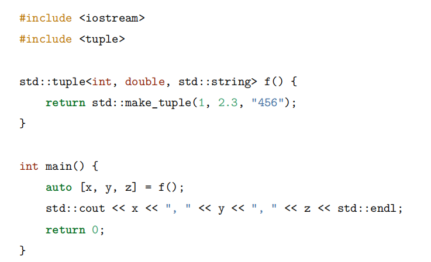
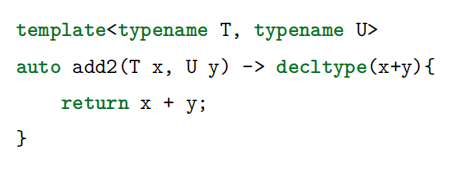
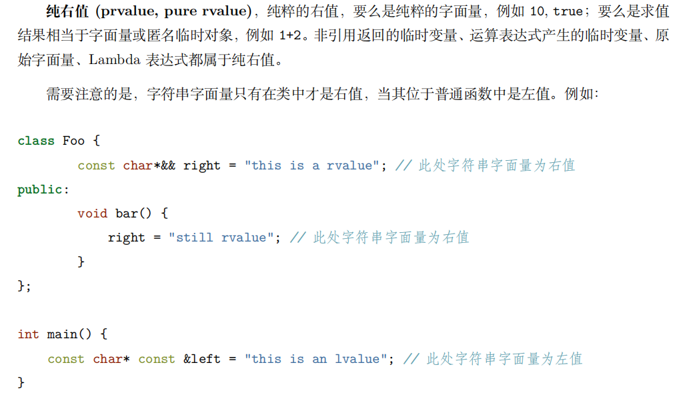
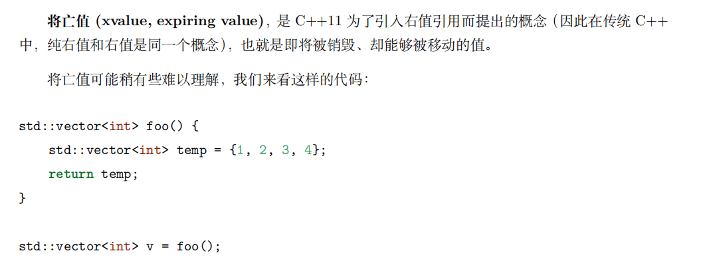

# 优先级队列的正确使用

## 优先级队列的使用

优先级队列默认是大顶堆，排在最前面的是最大的元素。

```c++
template <class T, class Container = vector<T>,  class Compare = less<typename Container::value_type> > 
class priority_queue;
```

重点看看第三个模板参数，跟进去：

```c++
struct less {
    using _FIRST_ARGUMENT_TYPE_NAME _CXX17_DEPRECATE_ADAPTOR_TYPEDEFS  = _Ty;
    using _SECOND_ARGUMENT_TYPE_NAME _CXX17_DEPRECATE_ADAPTOR_TYPEDEFS = _Ty;
    using _RESULT_TYPE_NAME _CXX17_DEPRECATE_ADAPTOR_TYPEDEFS          = bool;

    _NODISCARD constexpr bool operator()(const _Ty& _Left, const _Ty& _Right) const
        noexcept(noexcept(_STD _Fake_copy_init<bool>(_Left < _Right))) /* strengthened */ {
        return _Left < _Right;	// 核心代码
    }
};
```

如果我们想要优先级队列按照我们心中所想的排序，我们只需要重载 `operator <`；当然，你也可以给你的优先级队列的第三个模板参数直接替换成自己乐意的仿函数。

## 重载 <

我们前面已经看到源代码，结合大顶堆的思想，明显是如果 左边小于右边，那么右边的元素就会在大顶堆前面，也就优先被 pop 掉。

那么，我们在重载 < 就要记住这个特点。

```c++
struct FreNode {
	int freq;
	time_t times;
	FreNode() : freq(1), times(time(0)) {}
};

struct Node {
	int key;
	int value;
	FreNode node;
	Node(int k, int v) :key(k), value(v) {
	}
	~Node() {}
	int getvalue() {
		return value;
	}
	// 重载 operator <		// 频率越低，时间越小，优先被抛弃
	bool operator <(const Node& rhs) const {
		if (node.freq != rhs.node.freq) {	// 频率低的应该被抛弃，因此把频率低的放右边
			return node.freq > rhs.node.freq;
		}
		return node.times > rhs.node.times;	// 时间小的应该被抛弃，因此把时间小的放右边
	}
};
```

完整代码地址：

我们可以看见，优先级队列（这里以默认的大顶堆算法说明）不一定保证整个排序是从大到小，但是可以保证第一个元素一定是最大的。你加入或弹出都会自动保证这个状态更新。

但是你注意，我说的是加入或弹出的时候。优先队列 不支持直接更新元素，因此即使更新了 `freq` 和 `times`，优先队列中的排序不会自动更新。

## 仿函数

```c++
struct NodeCompare {
	bool operator()(const Node& lhs, const Node& rhs) const {
		if (lhs.node.freq != rhs.node.freq) {
			return lhs.node.freq > rhs.node.freq;  // 频率低的放右边
		}
		return lhs.node.times > rhs.node.times;  // 时间小的放右边
	}
};
```

使用方式：`priority_queue<Node,vector<Node>,NodeCompare> pq`

# const_cast的实际作用

const_cast 有两个功能：**加上const，去掉const**。

但是你绝对不要以为，一个 const 变量可以通过 const_cast 转换可以去除 const 属性并且可以修改对应的值或者对象。

实际上，它**只能用于指针和引用，而且常常用于函数的参数**。

```c++
void InputInt(int * num)
{
    cout<<*num<<endl;
}
int main()
{
    const int constant = 21;
    //InputInt(constant); //error C2664: “InputInt”: 不能将参数 1 从“const int”转换为“int *”
    InputInt(const_cast<int*>(&constant));
    system("pause");
}
```

由于我们的 InputInt 函数需要 int* 类型的参数，但是你传递的参数类型是 const int。

你可以通过 const_cast 给 constant 变量移除 const 属性，并且转换为 int * 类型的参数，就符合要求了。

const_cast 的目的并不是为了让你去修改一个本身被定义为 const 的值。因为这样做的后果是无法预期的。

在函数参数的传递上 const_cast 的作用才显现出来。

https://www.geeksforgeeks.org/const_cast-in-c-type-casting-operators/

# nullptr

nullptr 出现的目的是为了替代 NULL。

在某种意义上来说，传统 C++ 会把 NULL、0 视为同一种东西，这取决于编译器如何定义 NULL，有些编译器会将 NULL 定义为 ((void*)0)，有些则会直接将其定义为 0。

将 NULL 定义成 0 将导致 C++ 中重载特性发生混乱。

```c++
void foo(char*)
void foo(int)
```

当你调用 foo(NULL)，并不知道具体调用哪个。

nullptr 的类型为 nullptr_t，能够隐式的转换为任何指针或成员指针的类型，也能和他们进行相等或者不等的比较。

# if/switch 变量声明强化

```c++
if ( int x = 42; x > 0 )      /* 在 if 语句中声明 x */
{
	std::cout << "x is positive: " << x << std::endl;
} else {
	std::cout << "x is non-positive: " << x << std::endl;
}

/* std::cout << x;  // 错误：x 在此处不可见 */
```

```c++
switch ( int value = 2; value )      /* 在 switch 语句中声明 value */
{
case 1:
	std::cout << "Value is 1" << std::endl;
	break;
case 2:
	std::cout << "Value is 2" << std::endl;
	break;
default:
	std::cout << "Value is something else" << std::endl;
}

/* std::cout << value;  // 错误：value 在此处不可见 */
```

这种语法的好处是：

1. **减少作用域污染**：变量的作用范围仅限于 `if` 或 `switch` 语句块，不会影响外部代码。
2. **提高代码可读性**：变量的声明和使用更加紧密，避免无意义的全局作用域变量。
3. **避免错误**：变量不会在作用域外误用，降低潜在的 bug 发生概率。

适用场景：

- 需要在 `if` 语句或 `switch` 语句中使用一个临时变量。
- 该变量在 `if` 或 `switch` 之外不再需要，减少作用域污染。

# 结构化绑定

结构化绑定提供了类似其他语言中提供的多返回值的功能。

C++11 新增了 std::tuple 容器用于构造一个元组，进而囊括多个返回值。但缺陷是，C++11/14 并没有提供一种简单的方法直接从元组中拿到并定义元组中的元素，尽管我们可以使用 std::tie 对元组进行拆包，但我们依然必须非常清楚这个元组包含多少个对象，各个对象是什么类型，非常麻烦。

C++17 完善了这一设定：



语法：`auto [变量1, 变量2, ...] = 表达式`

表达式 必须是可以拆解的类型（如 `std::tuple`、`std::pair`、数组、结构体等）。

## 绑定 std::map 的 key-value 对

C++17 结构化绑定可以用于 `std::map` 的 `std::pair`，简化 `for` 循环遍历键值对。

```c++
std::map<std::string, int> data = { { "Alice", 25 }, { "Bob", 30 } };

for ( const auto & [name, age] : data )    /* 结构化绑定 */
{
	std::cout << name << " is " << age << " years old.\n";
}
```

**解析：**

- 以前 `for (const auto& pair : data) {}` 需要 `pair.first` 和 `pair.second` 来访问键值。
- 现在 `for (const auto& [name, age] : data) {}` 让代码更直观。

## 绑定 std::tuple 或 std::pair

```c++
#include <iostream>
#include <tuple>

int main() {
    std::tuple<int, double, std::string> tpl = {42, 3.14, "Hello"};

    auto [x, y, z] = tpl; // 结构化绑定
    std::cout << "x: " << x << ", y: " << y << ", z: " << z << std::endl;
    
    return 0;
}

```

**解析：**

- 以前需要用 `std::get<0>(tpl)` 访问 `tpl` 的第一个元素。
- 现在可以直接用 `auto [x, y, z] = tpl;` 一次性绑定所有成员，使代码更加直观。

## 绑定数组

```c++
#include <iostream>

int main() {
    int arr[3] = {10, 20, 30};

    auto [a, b, c] = arr; // 结构化绑定数组
    std::cout << "a: " << a << ", b: " << b << ", c: " << c << std::endl;
    
    return 0;
}

```

**注意：**

- 数组大小必须**固定**，不能用于动态数组（如 `std::vector`）。
- 如果数组大小**小于变量个数**，会报错。

## 绑定 struct 或 class

```c++
#include <iostream>
#include <string>

struct Person {
    std::string name;
    int age;
};

int main() {
    Person p = {"Alice", 25};

    auto [n, a] = p; // 结构化绑定
    std::cout << "Name: " << n << ", Age: " << a << std::endl;

    return 0;
}
```

**解析：**

- `Person` 的成员变量 `name` 和 `age` 被直接解构为 `n` 和 `a`。
- 适用于公共结构体（`public`），不能用于私有成员（`private`）。

## 结构化绑定的限制

**绑定后的变量是拷贝**（除非使用 `auto&` 绑定引用）。

**不能用于动态大小的容器**（如 `std::vector`）。

**不能用于 `private/protected` 成员**，除非提供 `friend` 访问或使用 getter。

**数组大小必须匹配**，不能多或少。

# decltype

decltype 关键字是为了解决 auto 关键字只能对变量进行类型推导的缺陷而出现的。

```c++
decltype(表达式)
```

还可以用于 返回值类型的推导：



只不过 C++11 要如此，C++14 后面已经支持让返回值类型为 auto 自动推导了。

# 委托构造

C++11 **允许构造函数调用同类的其他构造函数**:

```c++
class Test {
public:
    Test() : Test(10) {  // 1️⃣ 先调用 Test(int)
        std::cout << "Default constructor" << std::endl;
    }

    Test(int x) {  // 2️⃣ 初始化逻辑
        std::cout << "Parameterized constructor: " << x << std::endl;
    }
};

int main() {
    Test t;  // 调用 Test()
}
```

**被委托的构造函数**会先执行 **成员变量的初始化**，然后才执行当前构造函数的额外逻辑。

# 继承构造

允许子类直接继承基类的构造函数，而**无需手动在子类中重新定义构造函数**。

在子类中使用 `using` 关键字继承基类的构造函数：

```c++
class Base {
public:
    Base(int x) { std::cout << "Base(int) called: " << x << std::endl; }
};

class Derived : public Base {
public:
    using Base::Base;  // ✅ 继承 Base 的构造函数
};
```

继承后，`Derived` 具有 `Base` 的 **所有构造函数**，但不包括：

1. **拷贝构造函数**
2. **移动构造函数**
3. **析构函数**

```c++
#include <iostream>

class Base {
public:
    Base(int x) { std::cout << "Base(int): " << x << std::endl; }
    Base(int x, int y) { std::cout << "Base(int, int): " << x << ", " << y << std::endl; }
};

class Derived : public Base {
public:
    using Base::Base;  // ✅ 继承 Base 的构造函数
};

int main() {
    Derived d1(10);       // 调用 Base(int)
    Derived d2(20, 30);   // 调用 Base(int, int)
}
```

# override 和 final

**`override` 用于显示声明派生类的方法是覆盖基类的虚函数**。

如果基类中没有对应的虚函数，或者签名不匹配，编译器会报错，防止意外行为。

&nbsp;

**`final` 用于禁止类的继承或禁止重写某个虚函数**。

```c++
class Base {
public:
    virtual void foo() final {}  // ✅ 该函数不能被子类重写
};

class Derived : public Base {
public:
    // void foo() override {}  // ❌ 编译错误：Base::foo() 被 final 限制，不能重写
};
```

# 左值、右值的纯右值、将亡值、右值

左值：赋值符号左边的值，可以取地址符

右值：赋值符号右边的值，不可以取地址符

C++11 中为了引入强大的右值引用，将右值的概念进行了进一步的划分，分为：纯右值、将亡值。

纯右值：



将亡值：



temp 不会被拷贝一份返回，而是被 v 复制后，将立即被销毁，无法获取、也不能修改。

而将亡值就定义了这样一种行为：临时的值能够被识别、同时又能够被移动。

# noexcept

```c++
返回类型 函数名(参数列表) noexcept;
```

**声明**某个函数不会抛出异常。

如果有异常，程序会调用 `std::terminate()` 终止运行。

# static_assert

```c++
static_assert(常量表达式, "错误信息");
```

**常量表达式**：必须是 `true` 或 `false`，如果 `false`，编译器会报错。

**错误信息**（可选）：编译失败时显示的错误信息。

常量表达式得是 **编译期可计算的表达式**，如果表达式依赖运行时值，就会导致这个错误，见下：

```c++
int add(int n1, int n2) {
	return n1 + n2;
}

int main() {

	int re = add(1, 2);

	static_assert(re == 4);	// 不允许，因为 re 属于运行时才能计算出来的值

	return 0;
}
```

&nbsp;

如果是想要对自己的代码进行断言，就像 Gtest 那样，可以用 assert

```c++
int add(int n1, int n2) {
	return n1 + n2;
}

int main() {

	int re = add(1, 2);

	assert(re == 4);	// false 就报错

	return 0;
}
```

# std::variant

`std::variant` 是 C++17 引入的一个模板类，它提供了一种类型安全的方式来处理可能属于多个不同类型的值。

即一种类型安全的联合体，可以存储多种类型之一，并在需要时访问

与传统的联合体（`union`）不同，`std::variant` 不仅提供内存共享，还通过类型安全的方式管理多种可能的类型，可以避免常见的错误（例如访问错误类型的值）。

```c++
std::variant<T1, T2, T3, ...>  // 其中 T1, T2, T3 等是不同的类型
```

`std::variant` 能够存储在 `T1`, `T2`, `T3` 等不同类型中的任意一个。

&nbsp;

`std::variant` 适用于<font color="red">处理一个值可能属于多种类型</font>的情况。例如：

- 编写一个函数，它返回的值可能是多种不同类型中的一种。
- 在实现状态机时，不同的状态可以表示不同类型的数据。
- 处理不同类型的数据而不需要手动写类型判断逻辑。

&nbsp;

```c++
std::variant<int, float, std::string> v1;  // 空值，尚未存储任何类型
std::variant<int, float, std::string> v2 = 10;  // 存储一个 int 类型的值
std::variant<int, float, std::string> v3 = 3.14f;  // 存储一个 float 类型的值
std::variant<int, float, std::string> v4 = "Hello";  // 存储一个 std::string 类型的值
```

`std::get` 用于访问 `variant` 中存储的值。它要求你提供一个类型，如果当前存储的值是这个类型，就返回该值，否则抛出 `std::bad_variant_access` 异常。

`std::get_if` 返回指向存储类型的指针，如果当前 `variant` 存储的不是指定的类型，返回 `nullptr`。

```c++
std::variant<int, float, std::string> v = 10;
if (auto ptr = std::get_if<int>(&v)) {
    std::cout << "Value is: " << *ptr << std::endl;  // 输出: Value is: 10
}
```

`std::variant` 提供了一个 `index()` 成员函数，返回当前存储类型在 `variant` 中定义的索引（从 0 开始）。

```c++
std::variant<int, float, std::string> v = 3.14f;
std::cout << "Current type index: " << v.index() << std::endl;  // 输出: 1，因为 float 在第二位
```

`std::visit` 是一个更为强大的工具，它允许你通过访问 `variant` 存储的不同类型的值来调用相应的函数。你需要定义一个访问者对象，该对象重载了处理 `variant` 中不同类型的函数。

```c++
std::variant<int, float, std::string> v = 10;

auto visitor = [](auto&& arg) { std::cout << "Value: " << arg << std::endl; };

std::visit(visitor, v);  // 输出: Value: 10
```

# std::optional

```c++
std::optional<T>  // 其中 T 是你希望包装的类型
```

用 std::nullopt 表示没有有效值，这样我们就可以实现判断某个接口返回值是不是有实际意义的值。

`value()` 方法用于获取 `optional` 中存储的值，如果 `optional` 是空的，它会抛出一个 `std::bad_optional_access` 异常。

`value_or()` 方法在 `optional` 中没有值时，返回一个默认值。

```c++
std::optional<int> opt_int;  	  // 空值
int value = opt_int.value_or(5);  // 返回 5，因为没有值
```

`has_value()` 方法返回一个布尔值，指示 `optional` 是否包含一个有效值。

`emplace()` 可以用来修改 `optional` 中的值，或者为 `optional` 创建一个新值。

可以使用 `reset()` 或将 `optional` 重新赋值为 `std::nullopt`，使其不再存储值。

```c++
std::optional<int> opt_int = 10;
opt_int.reset();  // opt_int 被重置为 std::nullopt
// 或者
opt_int = std::nullopt;  // 也可以重置为没有值
```

# std::string_view

**避免复制：** 与 `std::string` 不同，`std::string_view` 不会复制字符串数据。它只是创建了一个指向原始数据的视图，因此在处理大型字符串时，可以避免不必要的内存分配。

**轻量级：** `std::string_view` 本身很小，它只包含一个指向字符数据的指针和一个表示数据长度的值。

**类型安全：** 虽然 `std::string_view` 是一个轻量级的字符串视图，但它保持类型安全，避免了直接操作 `char*` 数据时的潜在错误。

&nbsp;

使用场景：

**函数参数传递：** 当需要传递字符串给函数时，可以使用 `std::string_view`，避免了复制和不必要的内存分配。

```c++
void print(std::string_view sv) {
    std::cout << sv << std::endl;
}

std::string s = "Hello, world!";
print(s);  // 无需复制字符串
```

**处理 C 风格字符串和 `std::string`：** `std::string_view` 可以处理 `char*` 和 `std::string` 类型的数据，提供一个统一的接口来操作不同类型的字符串。

```c++
#include <iostream>
#include <string_view>
#include <string>

void print_string(std::string_view sv) {
    std::cout << "String View: " << sv << std::endl;
}

int main() {
    // C 风格字符串
    const char* cstr = "Hello, C-style string!";

    // std::string 对象
    std::string str = "Hello, std::string!";

    // 使用 std::string_view 从 C 风格字符串构造
    std::string_view sv1(cstr);
    print_string(sv1);  // 输出: String View: Hello, C-style string!

    // 使用 std::string_view 从 std::string 构造
    std::string_view sv2(str);
    print_string(sv2);  // 输出: String View: Hello, std::string!
}
```

# 编程风格真言

在实际工作中，程序并不会为每个需要创建的对象都提供一个不同的类，而是用一个类来表示一组对象。

如果<font color="red">派生类之间</font>的区别在于属性，则用数据成员来表示；如果在于行为，则用虚函数来表示。

并不是每一个问题都需要虚函数才能解决。使用数据成员来表示对象在属性上的区别也是一种不错的方法。程序员们不应该只是因为C++提供了更为复杂的编程技术而放弃那些标准的和可靠的编程技术。

类的接口也就是类的公有成员集合（public，对外提供），它决定了这个类创建的对象能够为程序其他部分中的客户代码提供什么样的服务。而类的实现则是完成了这些服务的功能，它们通常是作为类的私有成员被封装起来（private，只属于类本身，不给任何人访问），客户代码无法进行访问。

# 重载，覆盖（重写），隐藏（重定义）

重载：同一个类，函数名相同但是参数列表不同

重写：基类和派生类，函数名、参数列表和返回类型相同（基类的这个函数得是 virtual 修饰）

隐藏：基类和派生类，只要不构成重写都是隐藏（重定义）

注意：隐藏的**不光是类的成员函数**，还可以是**类的成员变量**

&nbsp;

**隐藏(重定义)与覆盖(重写)有什么区别？**

- virtual 的区别：隐藏的基类函数不需要用 virtual 修饰，而覆盖的基类函数必须要有 virtual 修饰；
- 参数列表区别：隐藏的基类和派生类的函数参数列表可以不同，而覆盖的基类和派生类的函数参数列表必须相同。

# 一个字符和数字如何拼接成字符串

##  方法 1：使用 std::to_string 和 + 操作符

```c++
int main() {
    char ch = 'A';
    int num = 123;

    std::string result = std::string(1, ch) + std::to_string(num);

    std::cout << result << std::endl;  // 输出: A123

    return 0;
}

```

## 方法 2：使用字符串流 std::stringstream

```c++
int main() {
    char ch = 'A';
    int num = 123;

    std::stringstream ss;
    ss << ch << num;

    std::string result = ss.str();
    std::cout << result << std::endl;  // 输出: A123

    return 0;
}

```

