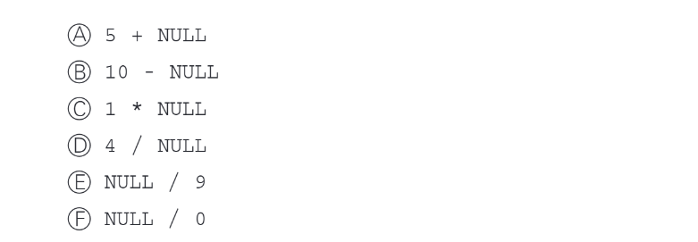
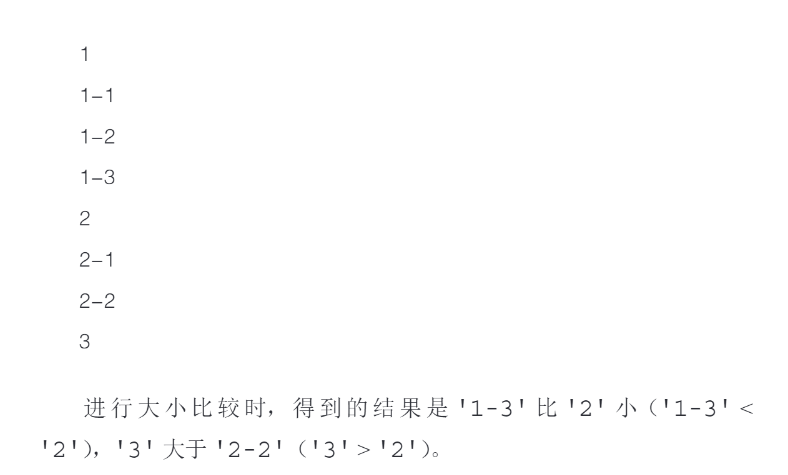

## 从结果中删除重复行

在 MySQL 中，要从 `SELECT` 查询结果中**删除重复行**，可以使用 `DISTINCT` 关键字。它会自动去除完全重复的记录。

```sql
SELECT DISTINCT column1, column2, ...
FROM table_name;
```

 注意事项：

1. `DISTINCT` 是作用于**整行**（即选定列）的，如果只是某个列重复而其他列不同，不会被去除。
2. 如果你只查一个列，比如 `SELECT DISTINCT name FROM employees;`，它只考虑 `name` 列重复。

## 为列设定别名

在 MySQL 中，你可以使用 `AS` 关键字或直接指定名字，**为列设定别名**（alias），以便让结果更清晰或便于在程序中处理。

```sql
SELECT column_name AS alias_name
FROM table_name;

或者 省略 AS

SELECT column_name alias_name
FROM table_name;
```

## 需要注意 NULL



实际上所有包含 NULL 的计算，结果肯定是 NULL。

## 比较运算符

| 运算符    | 描述               | 示例                   | 结果（布尔） |
| --------- | ------------------ | ---------------------- | ------------ |
| `IN`      | 是否在列表中       | `SELECT 3 IN (1,2,3);` | 1            |
| `IS NULL` | 是否为 NULL        | `SELECT NULL IS NULL;` | 1            |
| `LIKE`    | 模糊匹配（% 和 _） | `'abc' LIKE 'a%'`      | 1            |

## 字符串比较

按照字典序比较：




