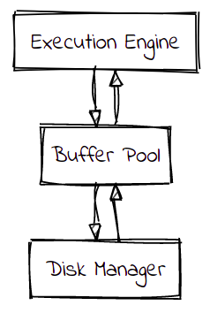
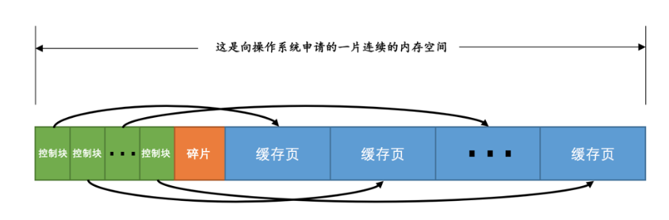
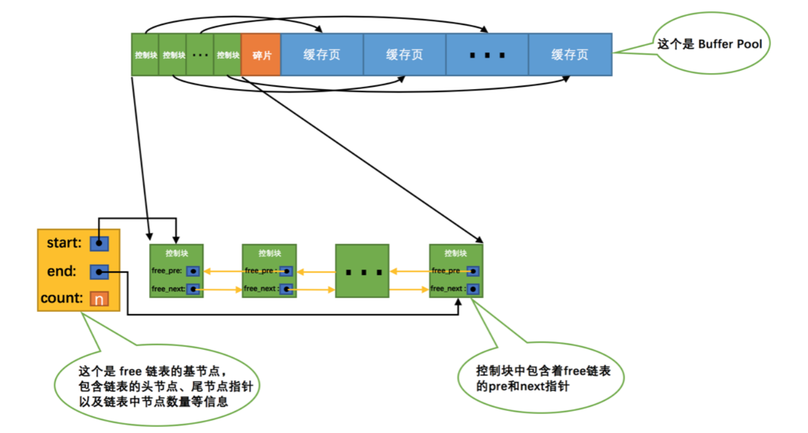
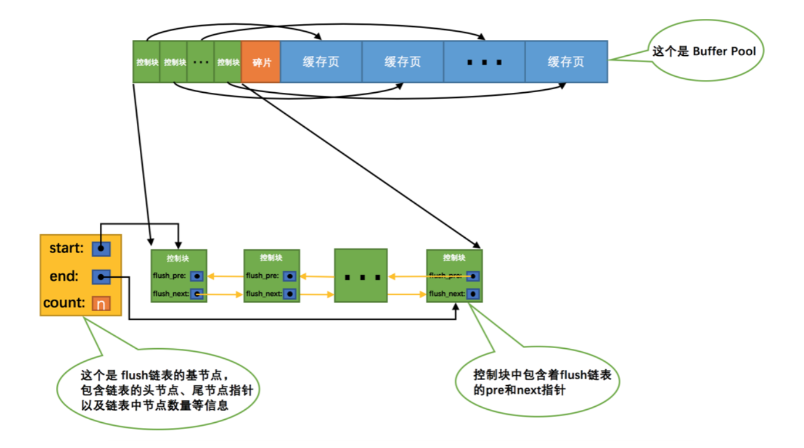
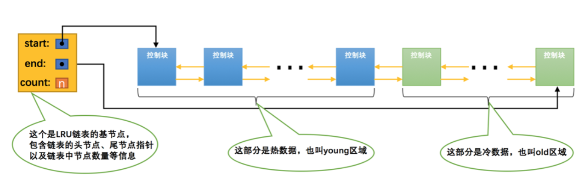
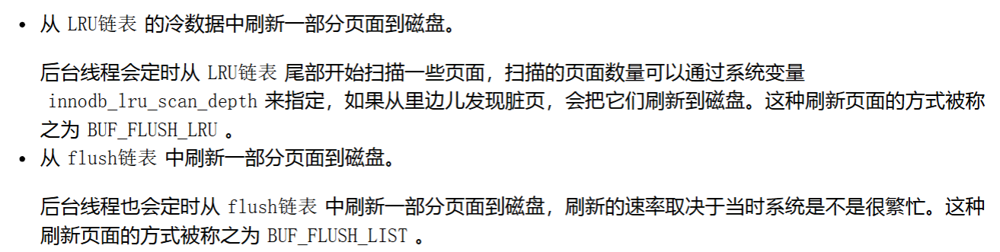

Innodb 存储引擎设计了一个缓冲池，可以让 MySQL 不是每次都从磁盘读取数据，直接从缓存中读取。

- **读取操作**：若需要的数据在 Buffer Pool 中（即命中缓存），就无需再访问磁盘。
- **写入操作**：先把数据写入 Buffer Pool 中的页，之后在合适的时机（如系统空闲时）再刷新到磁盘。

# Buffer Pool 缓存什么内容？

InnoDB 会把存储的数据划分为若干个「页」，以页作为磁盘和内存交互的基本单位，一个页的默认大小为 16KB。因此，Buffer Pool  同样需要按「页」来划分。

为了缓存磁盘中的页，选择 InnoDB 引擎的 MySQL 服务器启动时就向操作系统申请一片连续的内存，也就是 Buffer Pool。默认情况下是 128 MB，但是你可以配置参数来改动。

此时这些缓存页都是空闲的，之后随着程序的运行，才会有磁盘上的页被缓存到 Buffer Pool 中。在没有访问分配的这些内存的时候，操作系统并不会分配对应的物理内存，而是等到你真的要在内存中存储数据的时候，才给你实际分配。

要特别注意，即便你访问的是数据库中一行的记录，也会把整个「页」给读取进来。

为了方便管理缓存页，InnoDB 引入控制块（每个页对应的控制信息占用的一块内存称为一个控制块）。

每一个控制块都对应一个缓存页，那在分配足够多的控制块和缓存页后，可能剩余的那点儿空间不够一对控制块和缓存页的大小，这个用不到的那点儿内存空间就被称为碎片了（橙色块）。当然，如果你把Buffer Pool的大小设置的刚刚好的话，也可能不会产生碎片。

# 如何管理 Buffer Pool 

## free 链表

为了方便后续页缓存到 Buffer Pool 中的时候找到一个合适的位置，我们最好在某个地方记录一下Buffer Pool中哪些缓存页是可用的，这个时候缓存页对应的控制块就派上大用场了，我们可以把所有空闲的缓存页对应的控制块作为一个节点放到一个 free 链表中。

有了这个 free 链表之后事儿就好办了，**每当需要从磁盘中加载一个页到 Buffer Pool中 时，就从 free 链表中取一个空闲的缓存页**，并且把该缓存页对应的控制块的信息填上（就是该页所在的表空间、页号之类的信息），然后把该缓存页对应的free链表节点从链表中移除，表示该缓存页已经被使用了。

注意：基节点是管理 free 链表的，但是基节点占用的内存空间并不包含在 Buffer Pool 申请的一大片连续内存空间之内，而是一块单独申请的内存空间。

## 缓存页的哈希处理

我们如何判断缓存页在不在  Buffer Pool 中？如果存在就去找到它，如果不存在就去磁盘加载到  Buffer Pool 中。

涉及到查找，就联想到哈希表来查找是最合适的。以[表空间号+页号]作为 key 来定位一个 value [页]。

如果某些页的访问频率很高，InnoDB 会自动构建哈希索引以加速查询。哈希索引存储在 Buffer Pool 中的内存结构，不在磁盘中。

## flush 链表的处理

如果我们修改了 Buffer Pool 中某个缓存页的数据，那它就和磁盘上的页不一致了，这样的缓存页也被称为脏页。

虽然可以选择立即刷新，但是频繁如此操作会降低性能，通过 flush 链表记录脏页，过段时间一并刷新会更妥当。

## 某个缓冲页要么是在 free 链表，要么是在 flush 链表

如果一个缓冲页是空闲的， 那它肯定不可能是脏页。如果一个缓冲页是脏页，那它肯定就不是空闲的。

也就是说某个缓冲页要么是在 free 链表，要么是在 flush 链表。

## 缓存淘汰

Buffer Pool 大小是有限制的，肯定要具备缓存淘汰机制，尽可能淘汰很可能后续不再用到的缓存。

我们是按照某个比例将LRU链表分成两半的（比例可以通过参数配置），不是某些节点固定是 young 区域的，某些节点固定是 old 区域的，随着程序的运行，某个节点所属的区域也可能发生变化。

注：简单了解有这个机制即可，缓存淘汰可以做很多优化，你需要知道**优化目的**就是尽可能提高 Buffer Pool 的命中率。

## 刷新脏页到磁盘

后台有专门的线程每隔一段时间负责把脏页刷新到磁盘，这样可以不影响用户线程处理正常的请求。

主要刷新的两种路径：

## 什么情况下会触发刷新脏页到磁盘？

（1）Redo Log 写满

Redo Log 是环形日志，空间有限（通常为几百 MB）。当 Redo Log 即将写满时，必须刷新部分脏页，把它们写入磁盘，释放 Redo 空间

（2）后台线程周期性刷盘

InnoDB 有一个后台线程，每秒或每 N 秒会定期刷新部分脏页。

（3）空闲时刷盘

数据库空闲时（无活跃事务或低负载），InnoDB 会悄悄将一些脏页写入磁盘，减少突发高负载时的 I/O 压力。

（4）Buffer Pool 压力过大

当 Buffer Pool 快满，InnoDB 必须淘汰页，若要淘汰的是脏页，就必须先刷盘。结合 LRU 策略淘汰最久未使用的页。

## 总结

