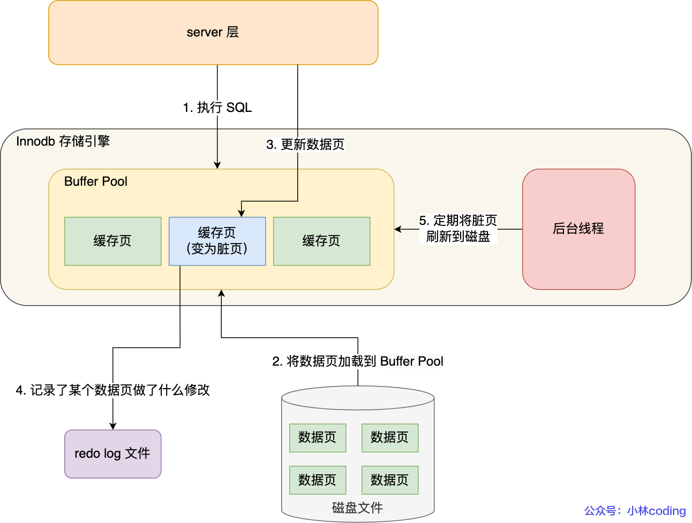
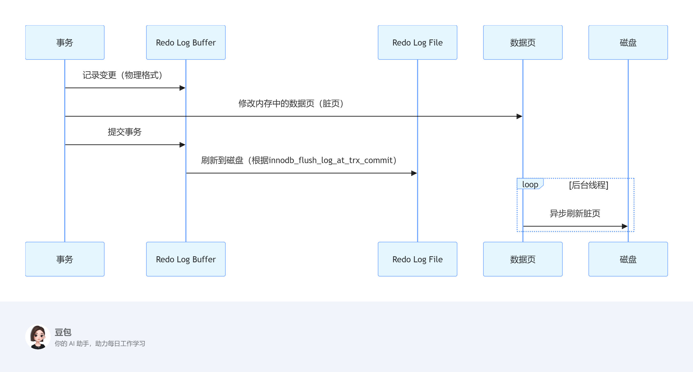
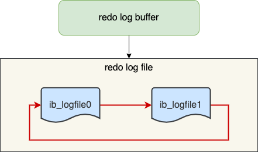

Buffer Pool 是基于内存的，如果突然断电，那么脏页就无法同步到磁盘中，导致最新的数据丢失，redo log 就是来解决这个问题。

redo log主要作用是确保 **事务的持久性**，即使系统崩溃，也能恢复已提交的事务。Redo Log 是一份 **物理日志**，记录的是对数据页的“修改后的值”。当数据库中的数据页被修改后，**这些修改会先记录到 redo log 中**，再异步地刷新到磁盘的数据文件中。

因为异步刷新到磁盘的时间是不确定的，之前我们学习 Buffer Pool 就知道是异步延迟刷新到磁盘，那么延迟刷新这段时间如果断电就会导致数据丢失。但是如果每次更新数据之后，都在 redo log 中记录一份，即便断电也不会丢失数据，因为可以利用 redo log 进行恢复。

## redo log 是立即写入磁盘的吗？

不是，redo log 也有自己的缓存 redo log buffer，会先把内容写到这个缓存里面。

假设你执行了一个 `UPDATE` 语句，整个 redo log 写入过程如下：

1. 修改页内容（在 **Buffer Pool** 中）
2. 生成 redo log，写入 **redo log buffer**
3. 事务提交时，把 redo log buffer 刷到磁盘 redo log 文件中（redo log 写入磁盘后，事务才算真正提交；也就是说，如果 redo log 没有写成功，代表事务没有完成，对数据的修改不作数，相当于用户的操作全部作废，啥也没干，不存在丢失数据和不丢失数据的说法，因为事务都没有成功；如果 redo log 写成功，那么 MySQL 保证即便是断电，也可以利用 redo log 恢复丢失的数据）
4. 后台线程将脏页写入到磁盘的数据文件中

## redo log 什么时候刷新磁盘

由参数 `innodb_flush_log_at_trx_commit` 控制的刷新时机：

| 值   | 含义                                                     | 刷盘时机           | 持久性 | 性能 |
| ---- | -------------------------------------------------------- | ------------------ | ------ | ---- |
| `0`  | 事务提交时不写磁盘，只写入 OS 缓存；后台线程每秒刷新一次 | **每秒刷新**       | 差     | 高   |
| `1`  | **每次事务提交时**，立刻将 redo log 写入磁盘             | **每次提交都刷盘** | 强     | 中   |
| `2`  | 事务提交时只写入 OS 缓存，由后台线程每秒刷新磁盘         | **每秒刷新**       | 较好   | 高   |

不管设置的哪个值，InnoDB 都有一个后台线程会**每秒将 redo log buffer 刷新到磁盘**，作为额外保障。

这里后台线程不是指把 Buffer Pool 落地，而是把 redo log buffer 落地到 redo log 磁盘文件中，不要理解错了。

## redo log 文件写满了怎么办？

如果 **redo log 文件写满了**，InnoDB 会**等待或阻塞事务**，直到旧的日志可以被覆盖。这是因为 redo log 是一个**固定大小的循环日志文件**，写满后不能继续写入，必须等前面的日志“过期”才行。

MySQL 的 InnoDB 使用两个（或多个）固定大小的文件，这些文件一起构成一个循环日志区域，称为 **log file group**。

Redo log 是连续写入的，写到末尾就从头循环写（但也不一定，得看允不允许）。

但是，只要有一个脏页（dirty page）还没刷到磁盘，对应的 redo log 就不能覆盖。因为**redo log 文件中还保存着关键的恢复信息，不能被复用**，否则宕机会导致数据丢失。

如果 redo log 被写满，而老日志又不能被覆盖（因为数据还没落盘），**InnoDB 会阻塞所有新的事务写入**，直到满足以下条件之一：

- **脏页被刷到磁盘**
- 对应的 redo log 被标记为“可复用”

##  总结

用户修改的数据，是在 Buffer Pool 中记录，等到合适的时机才回刷到磁盘中。

可是如果等待的这段时间断电，在没有任何预备措施的情况下，数据就无法恢复。

redo log 的目的就是让事务具有持久性，用户修改的数据记录到  Buffer Pool 中，还会在写入一份到 redo log buffer 中。

redo log buffer毕竟是在内存里面，也需要刷新到磁盘文件 redo log 文件中，而且成功刷新到磁盘文件 redo log 文件才算事务完成（这个点非常关键）。如果刷新失败，就没有任何数据产生，不存在数据丢失问题；如果刷新成功，MySQL 断电也可以利用 redo log 恢复数据。

