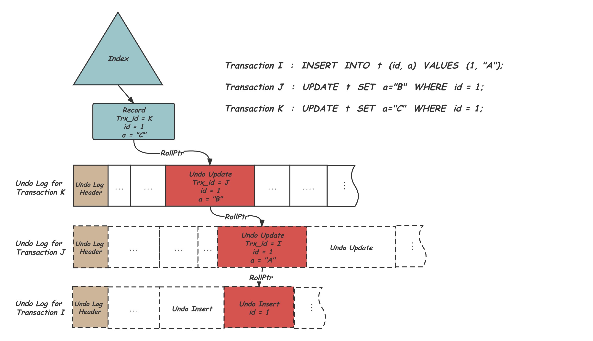

原子性要求事务中的所有操作要么全部成功，要么全部失败回滚。

当事务修改数据时，InnoDB 会先将原始数据（变更前的值）写入 undo Log。如果在执行的过程中，出现错误，可以利用 undo log 日志进行回滚，即 InnoDB 通过 undo Log 中的信息将数据恢复到事务开始前的状态。

因此，事务四大特性中的原子依赖于 undo log 的实现。

一条记录的每一次更新操作产生的 undo log 格式都有一个 roll_pointer 指针和一个 trx_id 事务 id：

- 通过 trx_id 可以知道该记录是被哪个事务修改的;
- 通过 roll_pointer 指针可以将这些 undo log 串成一个链表，这个链表就被称为版本链；

