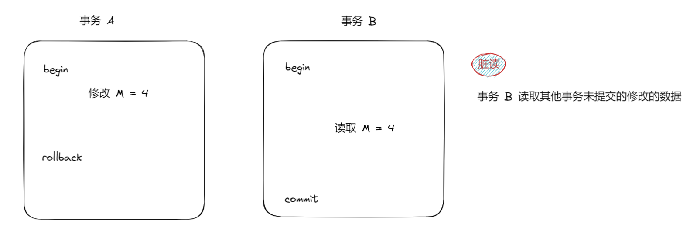
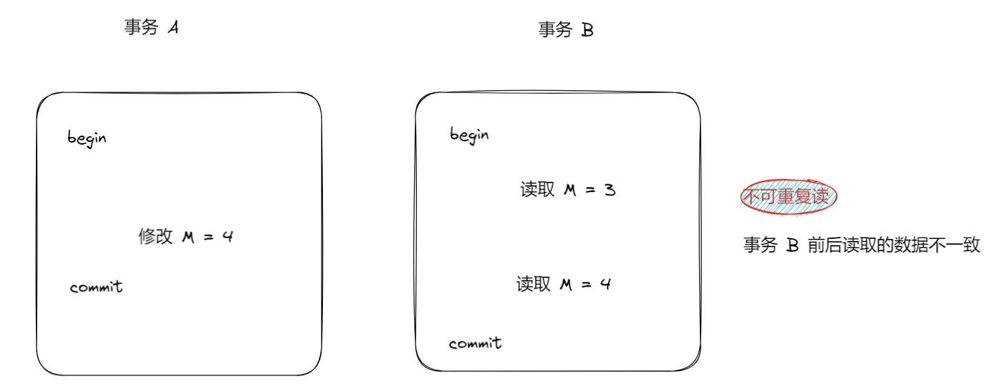
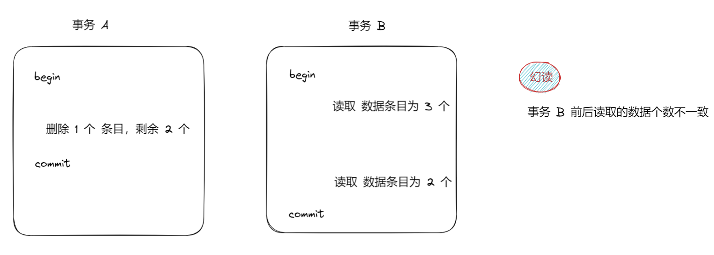

构成事务的三个操作：开启事务、回滚事务（非必须）、提交。

```sql
eg:
-- start transaction: -- 开启事务
begin; -- 开启事务
update account set money = money+200 where name like '%黄四郎%';

update account set money = money+200 where name like '%家族2%';
update account set money = money+200 where name like '%家族3%';
update account set money = money+200 where name like '%家族4%';
rollback; -- 回滚事务之后，之前所有的操作都会失效。

update account set money = money-800 where name like '张麻子';
commit; -- 提交事务之后，从开启事务到提交事务之间所有的操作才会生效。
```

# 事务的四大特性

（一）原子性

事务要么执行成功，要么执行失败。

（二）隔离性

事务之间互不影响。多个事务并发执行时，每个事务都不能看到其他事务的中间状态。

（三）持久性

一旦事务提交后或者回滚，事务对数据库的改变应该是永久性的。

（四）一致性

事务的执行会使数据库从一个一致性状态转变到另一个一致性状态。

```tex
当进行资金转账操作时，需要确保以下一致性要求：

1-账户余额不会变成负数。
2-交易记录需要在转账成功后才能插入。

如果一个事务用于从账户 A 转账到账户 B，它的执行步骤可能是：

1-检查账户 A 的余额是否足够。
2-从账户 A 中扣除转账金额。
3-向账户 B 添加转账金额。
4-在交易表中记录此次转账。

在这个过程中，如果在第 2 步中发生了错误（例如，账户 A 的余额不足），那么整个事务应该被回滚，确保账户的状态保持一致。
```

# 隔离级别

## 数据操作可能遇到的问题

### 脏读

一个事务读取到了另外一个事务还没提交的数据。

事务很有可能执行失败而导致回退，那么修改的数据如果被读取，但最后该修改命令被回退，那么其他事务在这个期间读取到修改的数据就属于脏数据，即脏读现象。

我们也可以说是事务没有被完整被执行导致可能出现的脏读现象。



### 不可重复读

在同一个事务内，针对同一个数据，前后读取的数据不一样。

第一次读取的数据是数据库最新的数据，但是到下一次读的这段时间，该数据被其他数据修改，导致下一次读的数据和最开始读的数据不一致。



### 幻读

在一个事务内，任何一条数据的内容前后读取一致, 但是数据条数前后不一定一致。

这次不会对数据内容进行任何修改或增加，而是针对数据本身的增加和删除，导致前后数据条数前后不一定一致的现象。



## 读未提交

定义：事务中的修改，即使没有提交，对其他事务也都是可见的。

会产生脏读、幻读、不可重复读。

因为没有提交，导致数据可能遇到的三种问题都会出现。

## 读已提交

定义：一个事务开始之后，只能看到自己的修改 和 别的已经提交的事务的修改。

会产生幻读、不可重复读。不会产生脏读。

脏读是读取未提交的数据，但是读已提交就是只能读取已经提交的数据，那必然是不存在脏读了。

## 可重复读

定义：一个事务开始之后，保证多次读取某同样的记录结果保持一致。

会产生幻读问题。不会产生脏读和不可重复读。

从名字你就知道解决可重复读了，既然可重复读没有问题，那就意味着反复读的数据必然一致，那么更不可能存在脏读现象了。

由于只是读取的数据始终保持一致，但没有承诺读取的数据条目相同，还存在幻读问题。

说到幻读，这里要提及一下，即 MySQL 的 InnoDB 存储引擎**解决了部分幻读问题，可并没有完全解决幻读问题**。下面简单看一看：

| id   | name |      | age  |
| ---- | ---- | ---- | ---- |
| 1    | xy   |      | 18   |
| 2    | lisy |      | 20   |

我们假定有事务 A 和 事务 B。事务 B 先读取数据条目，发现有两条数据，此后事务 A 插入一条数据，事务 B 读取数据条目依旧是 两条数据，但这并非完全解读了幻读问题。这个时候你从现象看是两条数据，以为不存在幻读，因为前后数据条目一致，你就准备在 id = 3 插入数据，发现根本插不进去，因为里面这个位置早已经被插入数据了。所以我们说 MySQ L的 InnoDB 存储引擎解决了部分幻读问题/可并没有完全解决幻读问题。

## 串行化

定义：会在读取的每一行数据上都加上锁, 以保证事务的先后顺序，那么就不存在多个事务同时执行情况。

不会出现任何数据的错误现象，是非常严格的隔离级别。

## 总结


