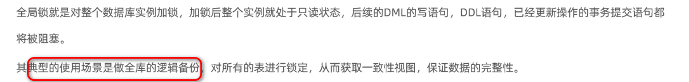
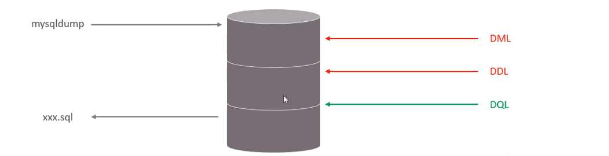
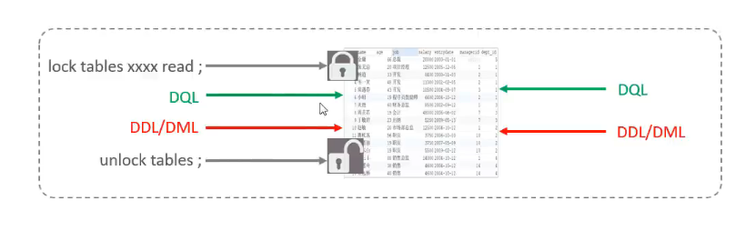
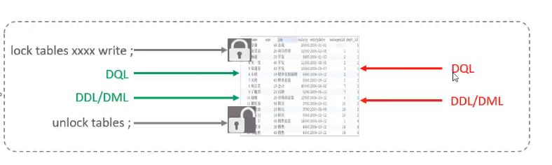
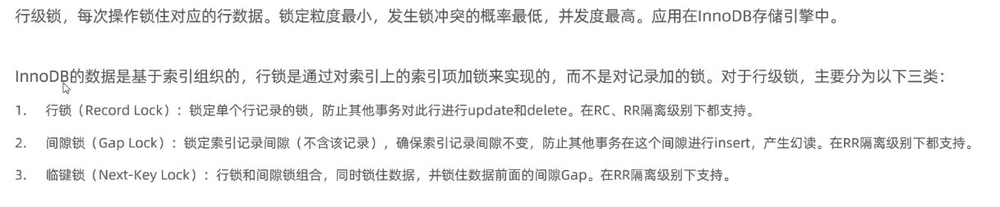
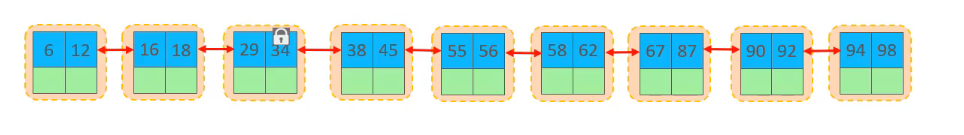
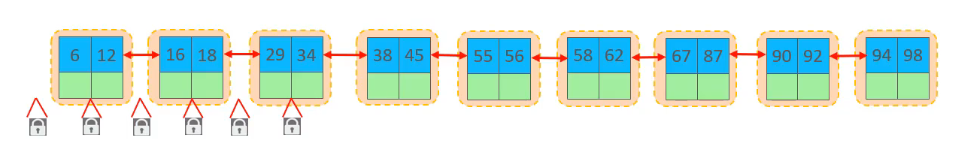
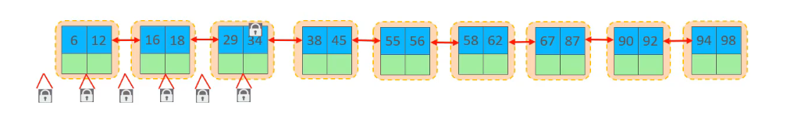

# 全局锁--锁定数据库中所有的表

## 全局锁与备份



全局锁的过程中，数据库可以被查询，但是不可以被写入（增加、更新、删除）数据：



全局锁备份存在哪些问题，为什么不推荐？


对于 InnoDB 引擎，推荐使用 **一致性快照 + 事务隔离级别** 来实现逻辑备份，而不是全局锁。

核心原因在于它能在**不阻塞读写操作**的前提下保证数据一致性。

```sql
mysqldump --single-transaction --master-data=2 --all-databases > backup.sql
```

这条命令的做法：

- 开一个事务（默认 **可重复读** 隔离级别）；

- 获取一致性快照；

- 不加全局锁，但保证数据逻辑一致。

&nbsp;

全局锁会导致数据库进入 “只读模式”，所有写操作（如订单提交、用户注册）被阻塞。

一致性快照通过 MVCC 实现**读写并行**，即读操作基于历史版本数据，不阻塞写操作；写操作生成新数据版本，不影响已存在的快照。可见一致性快照可在短时间内创建快照，后续备份操作基于快照异步进行，不影响数据库正常运行，提升吞吐量。

# 表级锁--每次操作锁住整张表

## 表锁

表锁是最简单的锁机制，**作用于整个表**。当一个线程对表加锁后，其他线程只能等待。

支持表共享读锁和表独占写锁。

表共享读锁：支持并发读，但是不支持写数据（当前线程和其他线程都不可以）。



表独占写锁：当前线程可以读和写，但是其他线程不可以读和写。



## 元数据锁

元数据锁是**自动加锁机制**，用于保护表的结构（元数据），防止 DDL 与 DML 并发冲突。

对所有表操作都加 MDL。

- 读操作（SELECT）会自动加 **MDL 读锁（共享锁）**；
- 写操作（INSERT/UPDATE）也会自动加 **读锁**；
- DDL 操作（ALTER/DROP）会自动加 **MDL 写锁（排他锁）**。

## 意向锁

意向锁是 InnoDB 的**表级锁**，用于配合**行锁**使用，表明事务对表中某些行加了什么类型的锁。


**注意**：意向锁之间不会互斥。

如果没有「意向锁」，那么加「独占表锁」时，就需要遍历表里所有记录，查看是否有记录存在独占锁，这样效率会很慢。

那么有了「意向锁」，由于在对记录加独占锁前，先会加上表级别的意向独占锁，那么在加「独占表锁」时，直接查该表是否有意向独占锁，如果有就意味着表里已经有记录被加了独占锁，这样就**不用去遍历表里的记录**。


# 行级锁--每次操作锁住对应的行数据



## 行锁

锁定单个行记录的锁，阻止其他事务修改这行，但是不防止插入操作（可能导致幻读）。



两种类型：


共享锁和共享锁可以兼容，但是不和排它锁兼容。排它锁不和任何锁兼容。


## 间隙锁

**间隙锁**锁定一个范围（两个值之间的“空隙”），但不锁任何现有记录。防止其他事务**在该范围内插入新记录**，从而避免**幻读**。



## 临键锁

**临键锁 = 行锁 + 间隙锁**，也就是“锁住某行 + 这行前面的间隙”。



