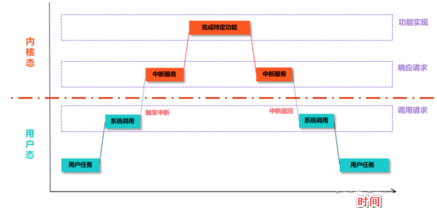

进程在调用系统调用的时候，就像一个被打了麻药，整个进程的执行被暂停（昏睡过去），暂时把自身的控制权给内核。等系统调用完成，进程又继续执行之前的指令，至于是不是立即得到执行，要看具体情况：

- **阻塞状态**：如果系统调用需要等待某个事件发生（如等待 I/O 操作完成、等待资源可用等），进程会进入阻塞状态。在阻塞状态下，进程暂停执行，直到所等待的事件完成或条件满足，此时进程会被唤醒并转换到就绪状态。
- **就绪状态**：若系统调用只是获取一些信息或执行一些不需要长时间等待的操作，并且执行完成后进程具备了继续运行的条件，那么进程会进入就绪状态，等待系统调度程序将其调度到 CPU 上继续执行。
- **运行状态**：如果系统调用本身就是进程正在执行的一部分，且执行系统调用后进程继续在 CPU 上运行，那么进程仍处于运行状态。不过这种情况相对较少，因为大多数系统调用会因涉及到资源等待或其他因素而使进程暂时离开运行状态。
- **终止状态**：在某些情况下，如果系统调用引发了错误或异常，导致进程无法继续正常执行，进程可能会进入终止状态。例如，系统调用中出现了无效的参数、访问了非法的内存地址等严重错误，操作系统可能会终止该进程。

系统调用提供给应用程序的**调用请求接口**，调用请求中执行了**软中断的指令**，应用程序使用调用请求后，**处理器会产生一个中断，中断服务得到执行**，中断服务根据**调用号**执行特定的功能实现函数。
