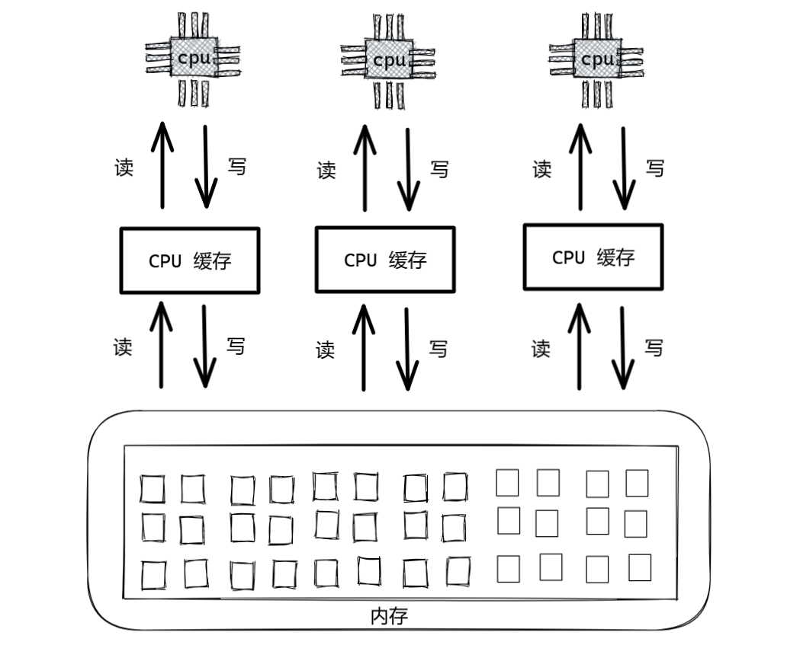

# 原子性

**原子性是指一个操作或者多个操作，要么全部执行并且执行的过程不会被任何因素打断，要么就都不执行。**

单线程中的代码肯定是原子性的，Redis 就是利用这个特点把命令的执行放在单线程中，而避免加锁带来的性能损耗。

# 可见性

**可见性是指当多个线程访问同一个变量时，一个线程修改了这个变量的值，其他线程能够立即看得到修改的值。**

在并发编程中，由于不同线程可能在不同的处理器核心上执行，并且每个核心都有自己的缓存，所以一个线程对变量的修改可能不会立即在其他线程的缓存中更新，从而导致可见性问题。

注：CPU 缓存又叫高速 CPU  缓存

如上图所示，每个 CPU（处理器）都有自己的缓存组件，它们在读写的时候会优先考虑自己的缓存，而不是实际存储数据的内存，导致对不同 CPU 对同一块内存上的变量进行操作，除了自己以外的其他 CPU 不可见。

导致出现这个的原因如下：

**缓存本地副本**：每个核心会将共享变量从主内存加载到自己的缓存中，后续操作直接在缓存中进行。

**延迟写回主内存**：缓存中的数据修改不会立即同步到主内存，可能积累一段时间后批量写回。

# 有序性

**有序性是指程序执行的顺序按照代码的先后顺序执行。**

但在实际的并发执行过程中，为了提高性能，编译器和处理器可能会对指令进行重排序，导致程序的执行顺序与代码编写的顺序不一致。不过，这种重排序不会影响单线程程序的执行结果，但在多线程环境下可能会引发问题。