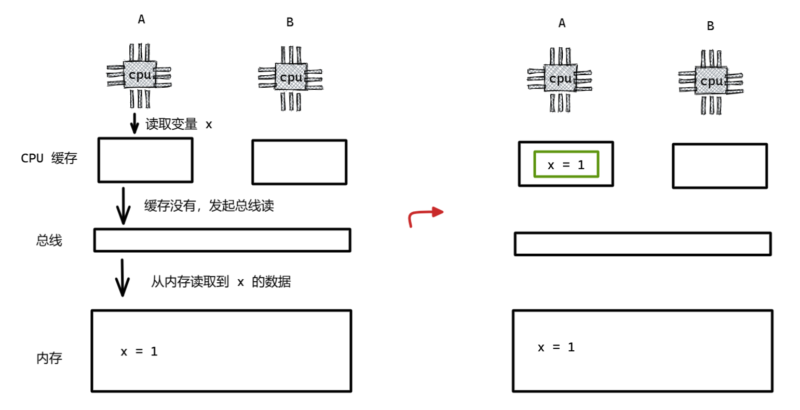

在 [003]并发编程的三大特征 章节中的可见性就演示多处理器存在缓存一致性问题。

**问题 1**：一个 CPU 修改内存数据，其他 CPU 并不知晓。此 CPU 修改的数据是针对自己的 CPU 换成来做，就算直接写入内存，其他 CPU 也未必能看到，因为其他 CPU 也有自己的 CPU 缓存，同样忽视掉内存的变化。这就导致一个 CPU 修改内存数据，其他 CPU 读不到最新的数据，只能读到旧的数据，导致程序可能出现不正确的结果。

**问题 2**：在多个 CPU 同时读取和修改 CPU 的时候，如何保证这几个 CPU 操作的顺序性。一旦不能保证整个修改操作的顺序性，那么就可能导致先写后读的两个请求，反映到内存就成为先读后写的结果，从而没有读取到最新的数据；又或者两个写数据的请求顺序被调换，可能出现脏写。

# MESI 协议（常见）

## **E（Exclusive，独占）**

缓存行数据与主内存一致，且未被其他 CPU 缓存。

读取不必担心数据不是最新的，修改不必马上同步到主存，这就是独占状态下的缓存。

## **S（Shared，共享）**

缓存行数据与主内存一致，可被多个 CPU 缓存。

如果当前缓存行出于共享状态，说明不止一个 CPU 有这个缓存，但是这个数据还没有被人修改过，是最新的，

所以，共享状态下的缓存行是可以直接读取到。如果要修改当前缓存行的数据，就必须通知其他 CPU 让它们的数据失效，否则其他 CPU 就会读到旧数据。

## **M（Modified，已修改）**

Modified 是一个中间状态，出于 Modified 状态的数据说明该数据是最新的，还没有同步到主存中去，这个状态下的数据是最新的，并且其他 CPU 缓存都是 Invalid 状态。必须在写回主内存后才能被其他核 CPU 访问。

## **I（Invalid，无效）**

缓存行数据已失效，需从主内存重新加载。

当数据出于 Invalid 状态，那么说明数据被别人修改了，自己当前缓存中的对应数据已经失效，那么此时读取数据就必须从主存或者其他换成了该数据的 CPU 获取，修改也同理。

# 参考链接

https://zhuanlan.zhihu.com/p/84500221

