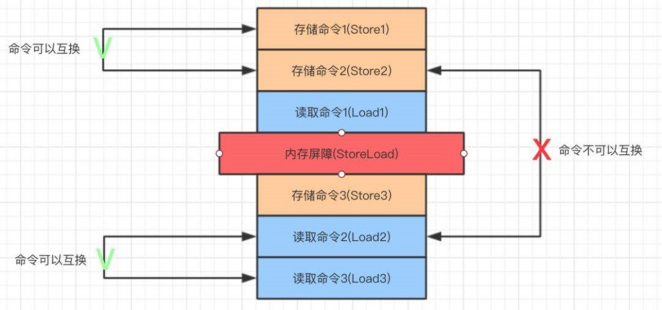

现代 CPU 和编译器为了**提高性能**，会对内存读写进行 **乱序执行** 或 **优化重排**。

这在单线程中没问题，但在**多线程/多核系统**中会引发严重的同步问题。

内存屏障就是强制顺序的“路障”，即在我之前的所有读写，必须完成后才能进行我之后的操作。

不同处理器架构提供了不同的内存屏障指令，这里只介绍 x86：

- `mfence`：全屏障，确保所有内存操作完成。
- `lfence`：读屏障，确保所有读操作完成。
- `sfence`：写屏障，确保所有写操作完成。

