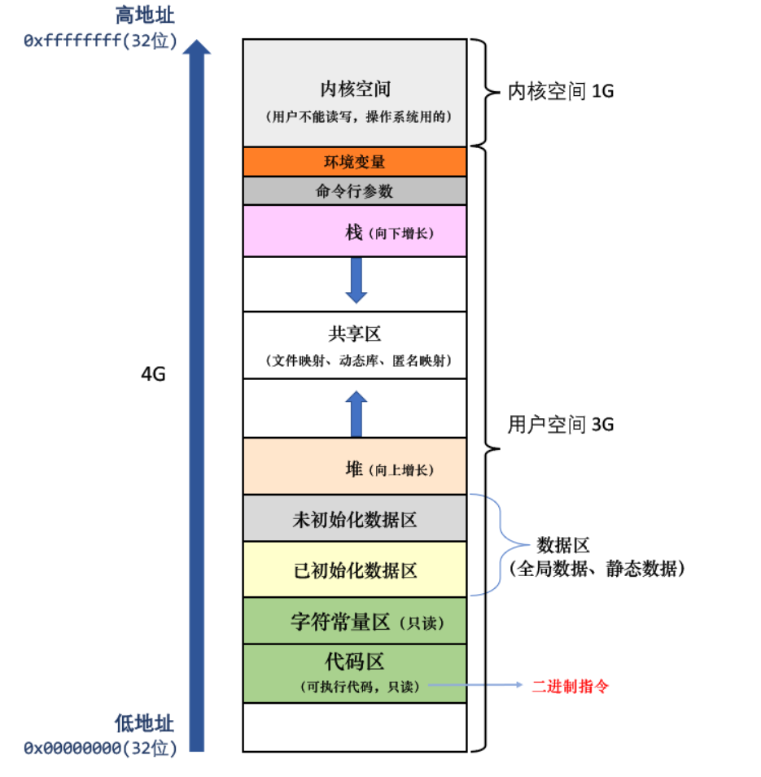

```c++
55bc517fc000-55bc517fd000 r--p 00000000           /root/a.out // ELF 文件的头
55bc517fd000-55bc517fe000 r-xp 00001000           /root/a.out // 代码区
55bc517fe000-55bc517ff000 r--p 00002000           /root/a.out // 字符常量区
55bc517ff000-55bc51800000 r--p 00002000           /root/a.out // 未初始化全局数据区
55bc51800000-55bc51801000 rw-p 00003000           /root/a.out // 已初始化全局数据区
55bc6da50000-55bc6da71000 rw-p 00000000           [heap] // 堆区
7f130cdb4000-7f130cdb8000 rw-p 00000000
7f130cdb8000-7f130cdbb000 r--p 00000000           /usr/lib/x86_64-linux-gnu/libgcc_s.so.1 // 共享区
7f130d33c000-7f130d33d000 rw-p 00000000 
7ffce654f000-7ffce6570000 rw-p 00000000           [stack] // 栈区
7ffce65c2000-7ffce65c5000 r--p 00000000           [vvar]
7ffce65c5000-7ffce65c6000 r-xp 00000000           [vdso]
ffffffffff600000-ffffffffff601000 --xp 00000000   [vsyscall]
```

示意图：



**vvar 是什么？**

提供一些只读的内核变量，供用户空间读取（如系统启动时间、时间戳等）

**vdso 是什么？**

原本这些系统调用需要 syscall，但 syscall 成本高。`vdso` 是一块内核映射到用户空间的共享代码，允许这些函数在**用户空间执行而无需陷入内核**，极大提升性能。

**vsyscall 是什么 ？**

在老的 Linux 版本中（2.6 时代），为 32-bit 程序提供极快的系统调用，也就是调用这些系统调用不用进入内核中。

在新内核中已基本被 `vdso` 替代。