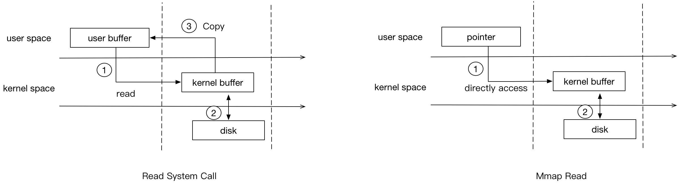

**mmap** 是一种内存映射文件技术，它能够将文件或设备内容直接映射到进程的虚拟地址空间，使得进程可以像访问普通内存一样对文件进行读写操作。

进程的虚拟地址空间会与磁盘上的文件建立起映射关系（并不会立即分配内存，而是在实际访问的时候发生缺页才回分配这块内存来存储磁盘上的文件）。当进程访问映射区域的内存时，如果对应的物理内存尚未加载，系统就会触发 **缺页中断**，进而从磁盘将数据加载到物理内存中。

传统的 I/O 操作需要经历 “磁盘→内核缓冲区→用户空间” 这样两次数据拷贝过程，而 mmap 则是直接让用户空间的虚拟地址与文件数据建立映射，不需要将内核缓冲区数据拷贝到用户空间，就可以在用户空间访问到数据。这样一来，文件读写就跟内存操作一样直观，无需繁琐的 IO 操作代码，内核会负责在内存和磁盘之间同步数据。



多个进程可以同时映射同一个文件，这样它们之间就能通过修改映射区域来实现数据的共享，这也就使得 mmap 成为了一种轻量级的进程间通信（IPC）机制。

&nbsp;

总的来说，mmap 可以快速创建一块内存空间，来存储数据（通过 fd 文件描述符来指向数据，且需要设置开辟空间的大小）。从此，我们就可以像访问内存一样访问磁盘数据，避免一次数据拷贝到用户空间。

```c
// 创建内存映射
void *mmap(void *addr, size_t length, int prot, int flags, int fd, off_t offset);

// 解除内存映射
int munmap(void *addr, size_t length);

// 同步映射区域到磁盘
int msync(void *addr, size_t length, int flags);
```

## 数据同步问题

| 情况          | 是否写回磁盘 | 是否需要手动同步                      |
| ------------- | ------------ | ------------------------------------- |
| `MAP_PRIVATE` | ❌ 否         | 无需同步，改的是副本                  |
| `MAP_SHARED`  | ✅ 可能会     | 最好用 `msync()` 显式同步，避免丢数据 |

## 和 sendfile 的区别

| 项目         | `mmap`                                   | `sendfile`                                 |
| ------------ | ---------------------------------------- | ------------------------------------------ |
| 主要用途     | 将文件映射到内存，像访问内存一样操作文件 | 将文件内容直接从一个文件描述符发送到另一个 |
| 是否用户可控 | ✅ 需要开发者控制读写行为                 | ❌ 系统全权处理拷贝传输                     |
| 可修改数据   | ✅ 可以读写内存中的内容                   | ❌ 仅发送数据，不能修改内容                 |
| 使用方式     | `mmap()` + `read()`/写入/处理逻辑        | `sendfile(out_fd, in_fd, ...)`             |

`mmap`：

- 优点：适合需要**处理文件内容**、**部分读取**、**搜索/修改**等操作。
- 缺点：需要开发者显式控制映射、同步、访问权限，开发复杂度高。

`sendfile`：

- 优点：适合**简单文件转发**（如下载），无需用户态干预，**极致高效**。
- 缺点：无法处理文件内容，也无法做过滤、加密、修改等逻辑。


