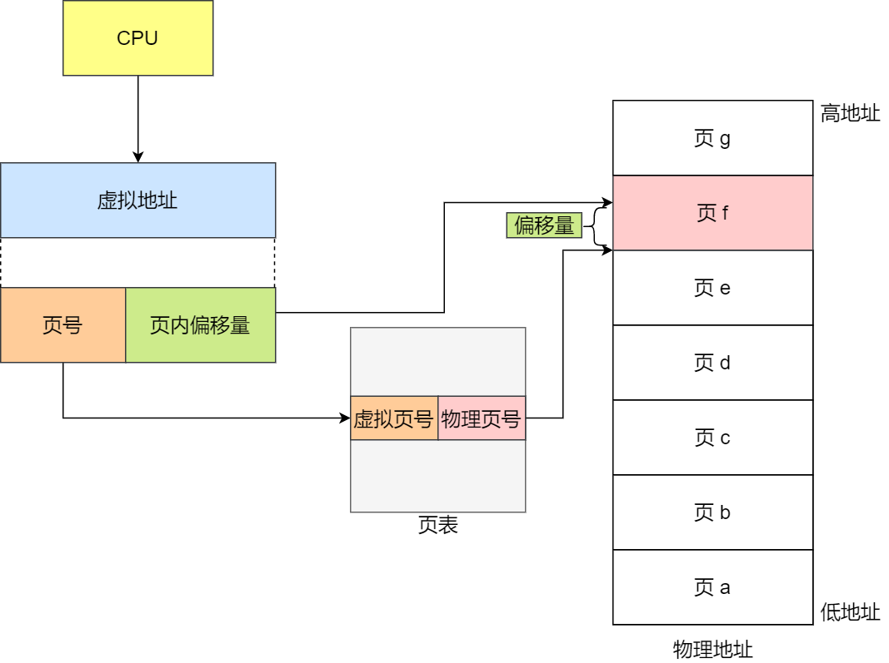
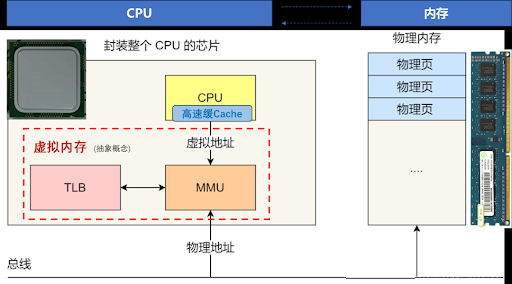

每个进程的虚拟地址空间被划分为**虚拟页**，物理内存划分为**物理页框**，系统通过**页表**建立虚拟页与物理页框的映射关系。

当进程访问虚拟地址时，内存管理单元（MMU）先解析出虚拟页号和页内偏移量，通过查询 TLB（快表）或页表获取对应的物理页框号（就像哈希表结构，key 是 虚拟页号，value 是物理页号），将其与偏移量组合得到物理地址后访问内存；若虚拟页未映射到物理内存（缺页），则触发缺页中断，系统从磁盘交换区将该页数据加载到物理内存的空闲页框中，更新页表和 TLB 后重新完成地址转换。

TLB 缓存和 CPU 高速缓存虽然缓存，但是缓存的内容不同，功能也就不同。TLB 缓存 虚拟地址到物理地址的映射，CPU 高速缓存缓存物理地址存储的数据。

程序访问一个虚拟地址。**先查 TLB** 是否有该地址的映射，若命中，快速得到物理地址。有了物理地址后，**再查 CPU Cache** 是否缓存了这个物理地址上的数据。如果 Cache 命中，直接使用；否则访问主内存。

