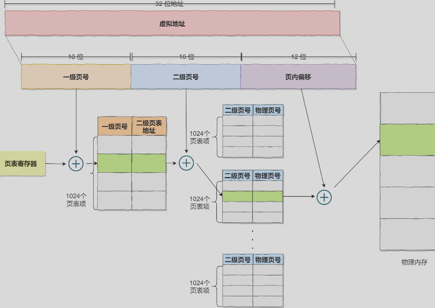
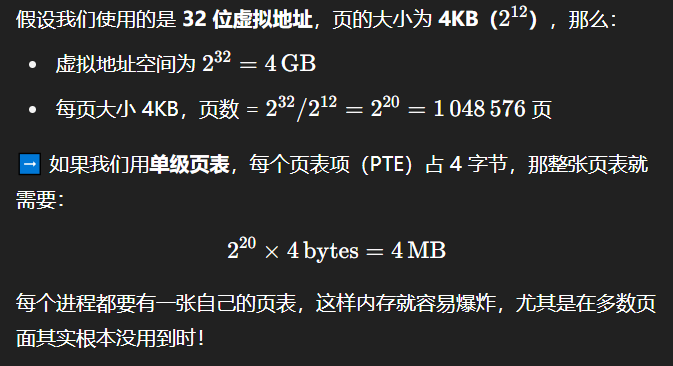

**多级页表是操作系统为解决单级页表内存占用过高问题**而设计的内存管理方案，其核心思想是通过**分层映射**减少页表本身占用的物理内存。

当 CPU 访问一个虚拟地址时：

1. **取高 10 位（A）**：在一级页表中找对应的项（这是指向二级页表的指针）
2. **再取中间 10 位（B）**：在该二级页表中找到页表项，得到**物理页框号**
3. **最后低 12 位（C）**：是页内偏移，结合物理页框构成真正的物理地址

如果某个二级页表没有被用过，对应的一级页表项就可以是 NULL 或无效，不占空间！

&nbsp;

通过一级页表找到二级页表，通过二级页表找到...，知道找到最后一个 N 级页表中记录的物理页号，然后结合虚拟地址中的页内偏移得到物理地址。

之所以如此，是单级页表浪费空间：

