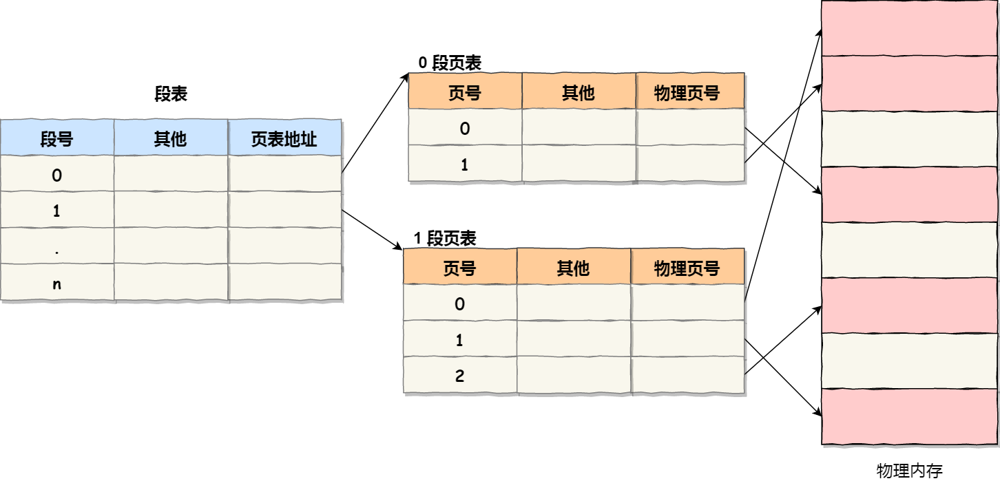

Intel x86 早期处理器（80286、80386）支持段页式管理，而现代操作系统，尤其在 **64 位系统** 中，**纯分页 + 多级页表结构** 是绝对主流。

- **分段管理**：将程序划分为若干逻辑段（如代码段、数据段、栈段），每个段有独立的段名和长度，地址空间是二维的（段号 + 段内偏移量），便于实现模块化编程和内存保护。
- **分页管理**：将内存划分为固定大小的页框（物理块），程序划分为同样大小的页（逻辑块），地址空间是一维的（页号 + 页内偏移量），通过页表实现逻辑地址到物理地址的映射，提高内存利用率。

&nbsp;

注：操作系统为每个进程维护**独立的段表**，段号的有效性仅局限于该进程的段表。