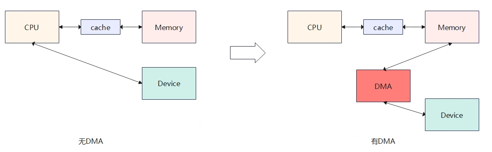

传统数据传输需 CPU 亲自搬运数据（如通过中断方式），引入 DMA 技术就是把数据拷贝的任务从 CPU 手中接手，让 CPU 资源去处理其他事务。

但是，这绝不是说从磁盘中拷贝数据到内存的任务中 CPU 就一点不参与。DMA 传输过程由 **DMA 控制器（DMAC）** 主导，CPU 仅需在传输前配置参数（如源地址、目标地址、传输长度等），传输完成后处理中断即可。也就是说开始传输之前的准备工作和传输完成之后的收尾工作由 CPU 来完成，而数据从磁盘拷贝到内存的过程由 DMA 完成。

- 传输方式分为两种：
  - **单字节传输**：每次传输一个单位数据后释放总线，允许 CPU 短暂介入。
  - **块传输**：一次性传输完所有数据后再释放总线，效率更高但可能长时间占用总线。

DMA 直接通过系统总线（地址总线、数据总线）在设备和内存间传输数据，避免了 CPU 寄存器中转的开销，适合大块数据（如磁盘文件读写、视频流传输）的高效传输。

在 DMA 传输期间，DMA 控制器会暂时接管系统总线，阻止 CPU 或其他设备访问总线（称为 **总线窃取** 或 **周期窃取**），确保数据传输的连续性。

