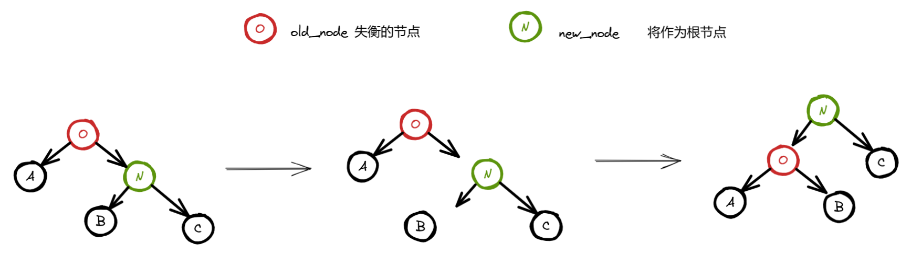
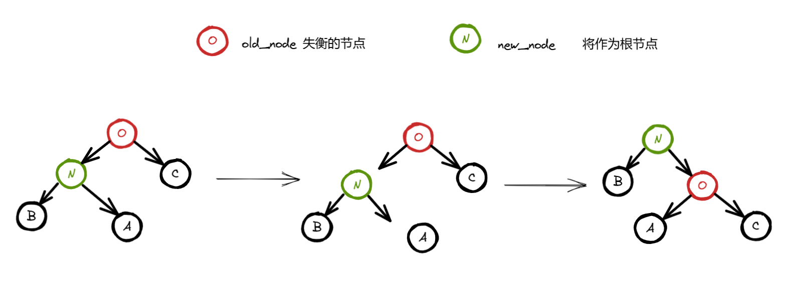
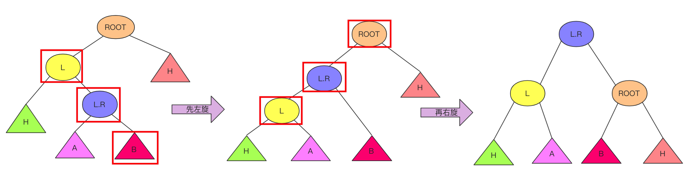
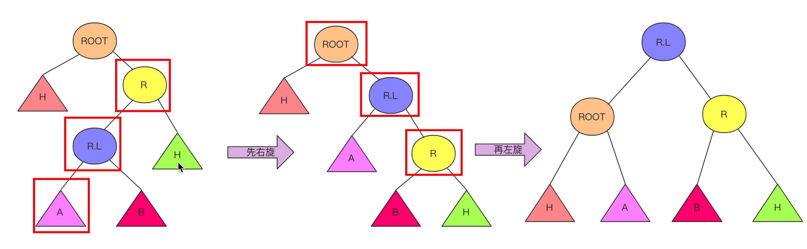
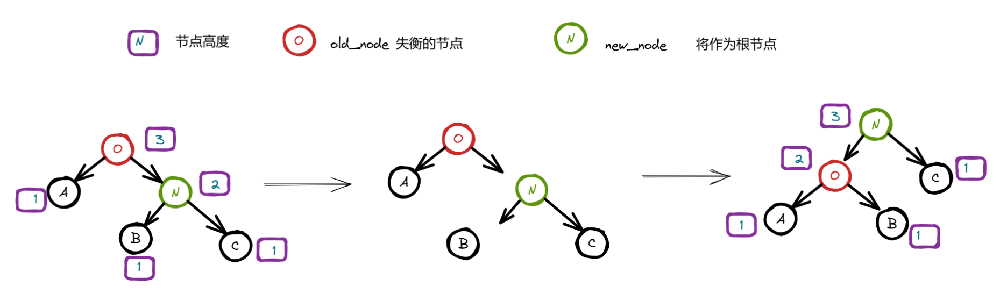
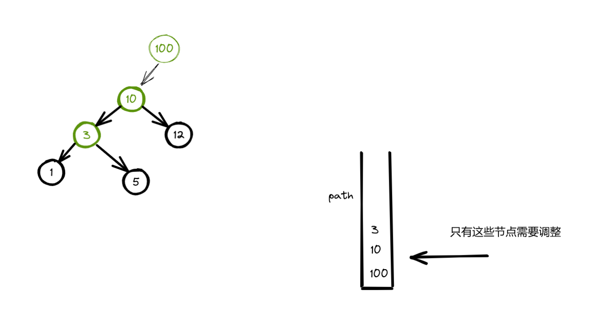
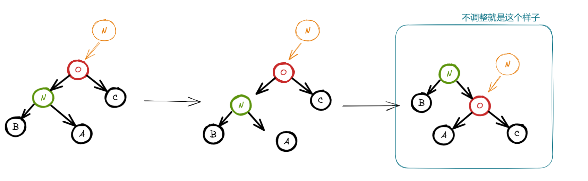
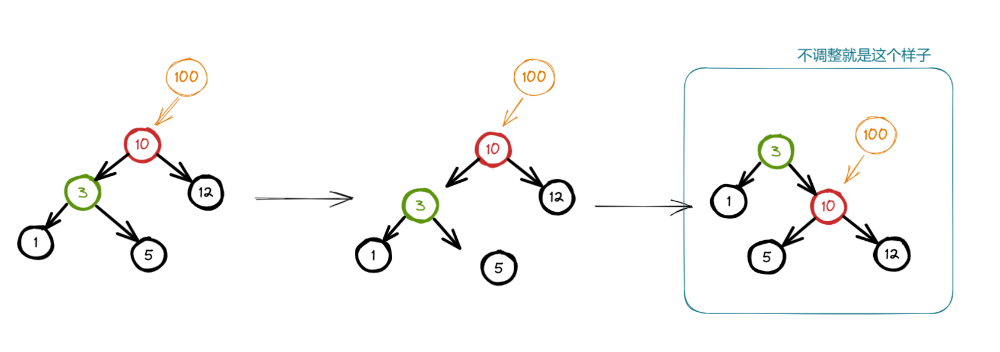
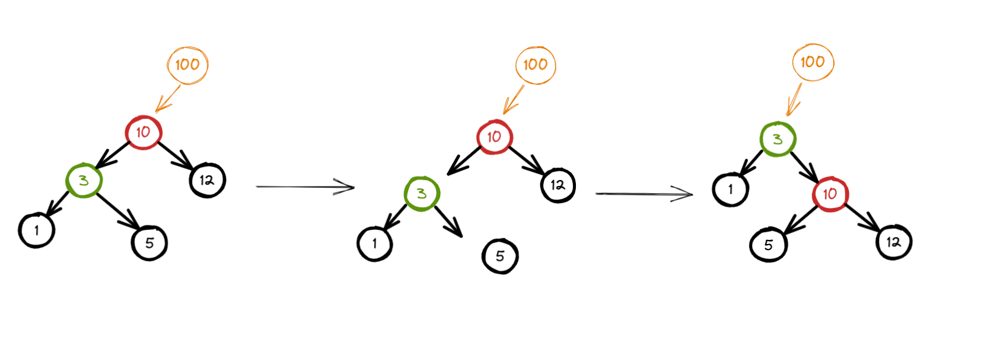

通过实时调整树的结构，确保左右子树的高度差（称为**平衡因子**）的范围在`[-1,1]`，从而保证树的高度始终保持在对数级别（O (log n)），进而使得插入、删除、查找等操作的时间复杂度稳定在 O (log n)。

# 关键点就是平衡因子和旋转操作

## 平衡因子

对于树中的**任意节点**，其平衡因子等于 **左子树高度减去右子树高度**。

$$\text{BF(节点) = 高度(左子树) - 高度(右子树)}$$

- **BF = 0**：左右子树高度相等，节点平衡。
- **BF = 1**：左子树比右子树高 1 层，轻度左偏。
- **BF = -1**：右子树比左子树高 1 层，轻度右偏。
- **|BF| > 1**：节点失衡，需通过旋转调整（如 AVL 树中必须调整，红黑树则允许更宽松的条件）。

在 AVL 树中，根据失衡节点的平衡因子及其子节点的平衡因子，可确定旋转类型：

- **案例 1**：若节点 BF = 2（左子树过高），且左子节点 BF ≥ 0（左子树左重或平衡）→ **右旋转**。
- **案例 2**：若节点 BF = 2，且左子节点 BF = -1（左子树右重）→ **左右旋转**（先左旋转左子节点，再右旋转当前节点）。
- **案例 3**：若节点 BF = -2（右子树过高），且右子节点 BF ≤ 0（右子树右重或平衡）→ **左旋转**。
- **案例 4**：若节点 BF = -2，且右子节点 BF = 1（右子树左重）→ **右左旋转**（先右旋转右子节点，再左旋转当前节点）。


## 旋转操作

旋转操作的最终结果不会打乱二叉排序树的特点，即当前节点的值大于其左节点的值，小于其右节点的值。

### 左旋（RR）



代码：

```c++
TreeNode *leftRotate(TreeNode *cur) {
	auto cur_right = cur->right;
	auto cur_right_left = cur_right->left;
	cur->right = cur_right_left;
	cur_right->left = cur;
	updateHeight(cur);
	updateHeight(cur_right);
	return cur_right;
}
```


### 右旋（LL）



代码：

```c++
TreeNode *rightRotate(TreeNode *cur) {
	auto cur_left = cur->left;
	auto cur_left_right = cur_left->right;
	cur_left->right = cur;
	cur->left = cur_left_right;
	updateHeight(cur);
	updateHeight(cur_left);
	return cur_left;
}
```


### 先左旋后右旋

先左旋之后，降级为 LL 形式，再进行右旋。



代码：

```c++
updateHeight(cur); // 确保是正确的高度信息，然后再去判断是否需要旋转
auto curBalanceFactor = balanceFactor(cur);
if (curBalanceFactor > 1) {
	if (balanceFactor(cur->left) < 0) {
		cur->left = leftRotate(cur->left);
	}
	return rightRotate(cur);
}
```


### 先右旋后左旋

先右旋之后，降级为 RR 形式，再进行左旋。



代码：

```c++
updateHeight(cur); // 确保是正确的高度信息，然后再去判断是否需要旋转
auto curBalanceFactor = balanceFactor(cur);
if (curBalanceFactor < -1) {
	if (balanceFactor(cur->right) > 0) {
		cur->right = rightRotate(cur->right);
	}
	return leftRotate(cur);
}
```


## AVL中每个节点的高度是怎么算的?

每个节点的高度（Height）是指从该节点到其最远叶子节点的路径上的边数或节点数。

（1）以边为单位

```c++
    3          高度：2（边数：3→1→0 或 3→4→5，共 2 条边）
   / \
  1   4        高度：1（边数：1→0 或 4→5，共 1 条边）
   \   \
    0   5      高度：0（叶子节点，边数为 0）
```

（2）以节点为单位

```c++
    3          高度：3（节点数：3→1→0 或 3→4→5，共 3 个节点）
   / \
  1   4        高度：2（节点数：1→0 或 4→5，共 2 个节点）
   \   \
    0   5      高度：1（叶子节点，节点数为 1）
```

&nbsp;

计算公式：父节点的高度 = 其左右子树高度的最大值 + 1

**错误**写法：

```c++
void updateHeight(TreeNode *node) {
	node->height = max(node->left->height, node->right->height) + 1;
}
```

**正确**写法：

```c++
int height(TreeNode *node) {
	node ? node->height : 0;
}
void updateHeight(TreeNode *node) {
	node->height = max(height(node->left), height(node->right)) + 1;
}
```

## 如何判断是否已经失衡？

如果节点是空的，不可能失衡；如果节点不是空，就用左子树的高度（如果存在） - 右子树的高度（如果存在）。

只要返回的结果在 [-1,1] 区间，就没有失衡。

```c++
int height(TreeNode *node) {
	node ? node->height : 0;
}
int balance(TreeNode *node) {
	node ? height(node->left) - height(node->right) : 0;
}
```

## 高度更新问题

如果当前节点的左右子树的结构完全不变，并且左右子树的高度也没有改变，则当前节点的高度不需要更新。

```c++
height(node) = max(height(node->left), height(node->right)) + 1;
```

所以：

- 如果 **左右子树结构不变**，但**某个子树的高度发生了变化**（例如子树发生了旋转或插入），那么当前节点的高度**仍然需要更新**；
- 只有在左右子树的 **结构不变 + 高度也没变** 的情况下，才**可以跳过更新高度**。



上面是左旋的操作，可以看到只有节点 O 和节点 N 的高度发生变化，需要重新更新两个节点的高度。

那什么情况下会导致节点的高度发生变化？

节点高度发生变化的 **根本原因**：**一个节点的高度发生变化，是因为它的左右子树中有一个的高度发生了变化。**

回看之前的那个公式， 只有当 `N->left` 或 `N->right` 的高度发生变化时，`N` 的高度才有可能变。

常见会导致节点高度发生变化的情况：

- 删除节点：删除一个节点，会先去寻找，寻找过程中的路径上的节点，会在删除指定节点之后高度下降（发生变化），这是因为路径上的节点彼此之间是父子关系。删除节点之后，高度发生变化，可能导致不平衡，才会有利用栈去回溯过程的旋转操作，而旋转操作内部还会对节点的高度进行纠正。
- 添加节点：添加一个节点，会先去寻找添加节点的位置，尽管总是在叶子节点后面插入，但是寻找的过程中路径上的节点要记录下来。增加节点，会导致此路径上的节点的高度增加（发生变化），这是因为路径上的节点彼此之间是父子关系。增加节点之后，高度发生变化，可能导致不平衡，才会有利用栈去回溯过程的旋转操作，而旋转操作内部还会对节点的高度进行纠正。

综上所述，增加和删除节点是导致高度发生变化的原因，选择操作是为了修正高度的正确性同时达到平衡。经过公式推导，只有只有当 `N->left` 或 `N->right` 的高度发生变化时，`N` 的高度才有可能变。所以，为什么记录路径上的节点再进行回溯就可以，而不关心其它节点，因为只有父子关系才有在某个节点被删除或增加之后导致高度变化，其他的节点不受影响。

但是，这里的父子关系是指路径上的父子关系，举例说明：



尽管节点 1 和 节点 3 有父子关系，但是节点 1 不会参与高度更新。

## 插入

当给一棵本就平衡的 AVL 树中插入一个新节点 P 的时候，从节点 P 到根节点的路径上，每个节点为根的子树的高度都可能增加 1，即平衡因子发生改变。

所以执行一次插入操作后，都需要沿路径向根节点回溯，修改各节点的平衡因子，而如果遇到了哪一个节点的 bf 变成 2 或 -2 的时候就要进行平衡化处理，即调整棵树的高度。

&nbsp;

插入的思路和二叉搜索树一致，只是 AVL 树插入之后要额外考虑树的平衡和节点正确指向的问题。

```c++
TreeNode *insert(TreeNode *root, const K &key, const V &val) {
	if (root == nullptr) {
		size_++;
		return new TreeNode(key, val);
	}
	// 至少有一个节点
	std::stack<TreeNode *> path;
	auto cur = root;
	// 找到插入位置并完成插入
	while (true) {
		path.push(cur);
		// 记录走过的节点路径，这些节点会在插入一个节点之后而改变高度，进而引发是否失衡问题
		if (key < cur->key) {
			// 按理要从左边继续探索
			// 如果当前节点没有左节点，可直接作为它的左节点
			if (cur->left == nullptr) {
				size_++;
				auto new_node = new TreeNode(key, val);
				cur->left = new_node;
				break;
			}
			cur = cur->left;
		} else if (key > cur->key) {
			// 按理要从右边继续探索
			// 如果当前节点没有右节点，可直接作为它的右节点
			if (cur->right == nullptr) {
				size_++;
				auto new_node = new TreeNode(key, val);
				cur->right = new_node;
				break;
			}
			cur = cur->right;
		} else if (key == cur->key) {
			// update，这就是为什么不需要单独写一个 update
			cur->val = val;
			return root;
		}
	}
	// 回溯平衡节点
	return backBalance(root, key, path);
}
```

最让人疑惑不解的是 backBalance 中的代码，好好解析，后面删除阶段就不赘述了。

```c++
TreeNode *backBalance(TreeNode *root, K key, std::stack<TreeNode *> &path) {
	while (!path.empty()) {
		auto cur = path.top();
		path.pop();
		// 平衡当前节点，会导致当前节点的位置和其他节点的位置发生变化
		// 平衡的任务完成之后，还有一件事情要去处理，那就是 最新的 cur 究竟应该作为其父节点的左孩子，还是右孩子
		// 如果没有父亲节点，那就不用考虑前面的问题
		cur = balance(cur);
		if (!path.empty()) {
			// 如果不是根节点，就要调整，因为旋转导致节点位置变化，对应地值也发生变化
			auto parent = path.top();
			if (key < parent->key) {
				parent->left = cur;
			} else {
				parent->right = cur;
			}
		} else {
			root = cur;
		}
	}
	return root;
}
```

下图中调整的节点就是根节点，所以不需要在平衡的任务完成之后，额外去处理其他工作。


那如果不是根节点，也就是它存在父节点的话，平衡的任务完成之后，还有其他事情要处理，那就是 parent 要指向最新的 cur，最新的 cur 要考虑作为其父节点的左孩子，还是右孩子的问题。



可见，不调整是不正确的。

由于，我的图示中没有体现出二叉排序树的左小右大的原则，可能无法很好的展示，下面把内容以数字的形式来存储，再进行展示。



现在我们知道，平衡当前节点，会导致当前节点的位置和其他节点的位置发生变化。如果当前节点有父节点 parent，平衡的任务完成之后，还有后续事情要去处。那就是 parent 要指向最新的 cur；最新的 cur 要考虑作为其父节点的左孩子，还是右孩子，这点根据二叉排序树特性来处理就可以。



有的人可能就会有疑问，如果 parent 的 left 指向 cur，难道 parent 的 left 最先不是指向其他的节点，这不会导致其他节点丢失吗？

你注意看图中，在没有平衡之前，parent 的 left 指向节点 10，平衡之后还是用 parent 的 left 执行最新的平衡的节点，尽管节点不同，但是不存在说丢失其他节点。

这是因为，在平衡之前，平衡后的当前节点 cur 究竟是该作为 parent 的右节点还是左节点早就已经确定了。而下面这部分代码只是用来找到本就已经确定的位置：

```c++
auto parent = path.top();
if (key < parent->key) {
	parent->left = cur;
} else {
	parent->right = cur;
}
```


## 删除

删除的思路和二叉搜索树一致，只是 AVL 树删除之后要额外考虑树的平衡和节点正确指向的问题。

前面增加一个节点，可能导致其他节点高度增加，而删除可能导致其他节点高度减少，要解决的问题是一样的。

二叉搜索树中最难的就是删除，删除行为中有很多要点：记录待删除节点的父节点，寻找中序后继节点等。

通过 exist 方法先找到要删除的节点，同时记录要删除的节点的父节点。接着就是找到中序后继节点，将含有左右两节点的降级为只有单个或没有孩子节点进行处理。（和二叉树删除一致，只是要记录走过的路径节点，用于后面平衡）

处理完成之后，就调用 banlance 平衡 AVL 树。

```c++
TreeNode *remove(TreeNode *root, K key) {
	if (!root) return nullptr;
	std::stack<TreeNode *> path;
	TreeNode *parent = nullptr;
	// 找到目标节点和其父节点
	auto cur = exist(root, key, path, parent);
	if (!cur) return root;
	auto remove_node = cur;
	if (cur->left && cur->right) {
		// 找中序后继
		TreeNode *successor = cur->right;
		TreeNode *successor_parent = cur;
		while (successor->left) {
			successor_parent = successor;
			path.push(successor);
			// 走的节点要加入到路径中
			successor = successor->left;
		}
		// 替换当前节点内容
		cur->key = successor->key;
		cur->val = successor->val;
		// 准备删除 successor
		remove_node = successor;
		parent = successor_parent;
	}
	// 已经从两个节点降级为处理单个节点
	// 为什么优先考虑它的左节点？
	TreeNode *child = remove_node->left ? remove_node->left : remove_node->right;
	if (parent == nullptr) {
		// 删除的是根节点，没有父节点的节点就是根节点
		delete remove_node;
		size_--;
		return child;
	} else {
		if (parent->left == remove_node) {
			parent->left = child;
		} else {
			parent->right = child;
		}
		delete remove_node;
		size_--;
	}
	// 回溯平衡路径
	return backBalance(root, key, path);
}
```


