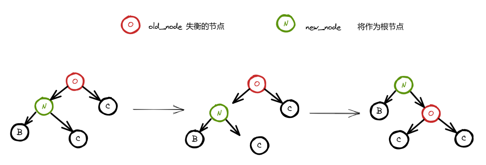

通过实时调整树的结构，确保左右子树的高度差（称为**平衡因子**）的范围在`[-1,1]`，从而保证树的高度始终保持在对数级别（O (log n)），进而使得插入、删除、查找等操作的时间复杂度稳定在 O (log n)。

# 关键点就是平衡因子和旋转操作

## 平衡因子

对于树中的**任意节点**，其平衡因子等于 **左子树高度减去右子树高度**。

$$\text{BF(节点) = 高度(左子树) - 高度(右子树)}$$

- **BF = 0**：左右子树高度相等，节点平衡。
- **BF = 1**：左子树比右子树高 1 层，轻度左偏。
- **BF = -1**：右子树比左子树高 1 层，轻度右偏。
- **|BF| > 1**：节点失衡，需通过旋转调整（如 AVL 树中必须调整，红黑树则允许更宽松的条件）。

在 AVL 树中，根据失衡节点的平衡因子及其子节点的平衡因子，可确定旋转类型：

- **案例 1**：若节点 BF = 2（左子树过高），且左子节点 BF ≥ 0（左子树左重或平衡）→ **右旋转**。
- **案例 2**：若节点 BF = 2，且左子节点 BF = -1（左子树右重）→ **左右旋转**（先左旋转左子节点，再右旋转当前节点）。
- **案例 3**：若节点 BF = -2（右子树过高），且右子节点 BF ≤ 0（右子树右重或平衡）→ **左旋转**。
- **案例 4**：若节点 BF = -2，且右子节点 BF = 1（右子树左重）→ **右左旋转**（先右旋转右子节点，再左旋转当前节点）。


## 旋转操作

旋转操作的最终结果不会打乱二叉排序树的特点，即当前节点的值大于其左节点的值，小于其右节点的值。

### 左旋


代码：


### 右旋



代码：


### 先左旋后右旋


### 先右旋后左旋


## AVL中每个节点的高度是怎么算的?

每个节点的高度（Height）是指从该节点到其最远叶子节点的路径上的边数或节点数。

（1）以边为单位

```c++
    3          高度：2（边数：3→1→0 或 3→4→5，共 2 条边）
   / \
  1   4        高度：1（边数：1→0 或 4→5，共 1 条边）
   \   \
    0   5      高度：0（叶子节点，边数为 0）
```

（2）以节点为单位

```c++
    3          高度：3（节点数：3→1→0 或 3→4→5，共 3 个节点）
   / \
  1   4        高度：2（节点数：1→0 或 4→5，共 2 个节点）
   \   \
    0   5      高度：1（叶子节点，节点数为 1）
```

&nbsp;

计算公式：父节点的高度 = 其左右子树高度的最大值 + 1

**错误**写法：

```c++
void updateHeight(TreeNode *node) {
	node->height = max(node->left->height, node->right->height) + 1;
}
```

**正确**写法：

```c++
int height(TreeNode *node) {
	node ? node->height : 0;
}
void updateHeight(TreeNode *node) {
	node->height = max(height(node->left), height(node->right)) + 1;
}
```

## 如何判断是否已经失衡？

如果节点是空的，不可能失衡；如果节点不是空，就用左子树的高度（如果存在） - 右子树的高度（如果存在）。

只要返回的结果在 [-1,1] 区间，就没有失衡。

```c++
int height(TreeNode *node) {
	node ? node->height : 0;
}
int balance(TreeNode *node) {
	node ? height(node->left) - height(node->right) : 0;
}
```

## 只要当前节点的左右结构不变，就不需要更新树的高度

## 平衡为 AVL 树

## 插入

当给一棵本就平衡的 AVL 树中插入一个新节点 P 的时候，从节点 P 到根节点的路径上，每个节点为根的子树的高度都可能增加 1，即平衡因子发生改变。

所以执行一次插入操作后，都需要沿路径向根节点回溯，修改各节点的平衡因子，而如果遇到了哪一个节点的 bf 变成 2 或 -2 的时候就要进行平衡化处理，即调整棵树的高度。


