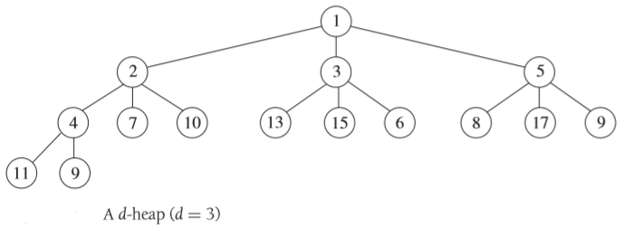

前置文章：[优先队列](https://xiaoyangst.github.io/posts/70c94b1a.html)

你可能认为堆一定是二叉树。毕竞，二叉搜索树是最常见的一种树，并且这种树在本质上也和顺序相关。

事实证明，没有任何理由要求分支因子 1 是固定的并且一定等于 2。实际上，任何大于 2 的值也都可以用于堆，而且可以使用相同的数组来进行存储。



对于 d 叉堆来说，分支因子为整数 d > 1，堆的三个不变量如下：

1. 每个节点最多有 d 个子节点。

2. 堆的树表示是一棵左对齐的完全树。换言之，第 i 个子树的高度至多等于其左侧兄弟节点 (从 0 到 i - 1，其中 1 < i ≤ d) 的高度。

3. 每个节点在以该节点为根节点的子树中拥有最高优先级。

分支因子越大，树的高度就越小（与分支因子是对数收缩关系）。但是，在每一层上需要进行比较的子节点数量也会随着分支因子的增长而线性增长。因此可以想象，在分支因子为1000的情况下，工作性能并不理想（并且当元素少于1001个时，就会退化为线性搜索）。

在实践中，通过剖析和性能测试得出的结论是，**在大多数情况下，D = 4 是最好的折中方案**。

## 寻找最佳分支因子

如果打算寻找适用于所有情况的分支因子 D 的最佳值，那么你注定会感到失望。

在某种程度上，理论可以帮助我们得到最佳值的范围。可以证明，这个最佳值不能大于 5。

实际上，D 的最佳值取决于实现的细节以及将被存放在堆中的数据的细节。堆的最佳分支因子只能凭经验逐用例确定，但不会有在所有情况下都最佳的分支因子。具体的值取决于实际数据和插入／删除操作的比例，或取决于诸如计算优先级与复制元素相比代价有多高昂等因素。

根据以往的经验，二叉堆从来都不是最快的，5 叉堆（对于少量领域）则很少比二叉堆快，最佳选择通常是 3 叉堆或 4 叉堆，具体取决千一些细微差别。

## 分支因子和内存的关系

对于表现都非常好的两个分支因子，推荐使用较大的那个。这是因为在寻找堆的最佳分支因子时，还有另一个需要考虑的因素：引用的局部性。

当堆的大小大于可用缓存或可用内存时，或者在涉及缓存和多级存储的情况下，平均而言，二叉堆相比d叉堆会出现更多的缓存未命中或页面错误。简单来说，这是因为子节点被存储在集群中，而在插入或删除时，会检查所有到达节点的所有子节点，所以分支因子越大，堆就越短、越宽，局部性原则也就越适用。

## 代码实现

```c++
#include <iostream>
#include <vector>
#include <functional> // 用于 std::greater<> 和 std::less<>

template <typename T, typename Compare = std::less<T>> // 默认小顶堆
class DaryHeap {
private:
    std::vector<T> heap;
    int d; // d 叉堆的分支因子
    Compare cmp;

    int parent(int i) { return (i - 1) / d; }
    int child(int i, int k) { return d * i + k + 1; }

    void heapifyUp(int i) {
        while (i > 0 && cmp(heap[parent(i)], heap[i])) { 
            std::swap(heap[i], heap[parent(i)]);
            i = parent(i);
        }
    }

    void heapifyDown(int i) {
        while (true) {
            int bestIndex = i;
            for (int k = 0; k < d; ++k) {
                int childIndex = child(i, k);
                if (childIndex < heap.size() && cmp(heap[bestIndex], heap[childIndex])) {
                    bestIndex = childIndex;
                }
            }
            if (bestIndex == i) break;
            std::swap(heap[i], heap[bestIndex]);
            i = bestIndex;
        }
    }

public:
    DaryHeap(int d, Compare cmp = Compare()) : d(d), cmp(cmp) {
        if (d < 2) throw std::invalid_argument("d 叉堆的 d 必须大于 1");
    }

    void push(T value) {
        heap.push_back(value);
        heapifyUp(heap.size() - 1);
    }

    void pop() {
        if (heap.empty()) throw std::out_of_range("堆为空，无法删除");
        heap[0] = heap.back();
        heap.pop_back();
        if (!heap.empty()) heapifyDown(0);
    }

    T top() {
        if (heap.empty()) throw std::out_of_range("堆为空，无法获取堆顶");
        return heap[0];
    }

    bool empty() const { return heap.empty(); }

    void printHeap() {
        for (const T& val : heap) std::cout << val << " ";
        std::cout << std::endl;
    }
};
```


