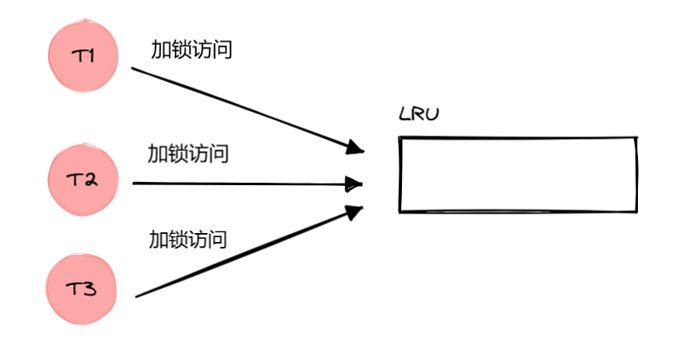
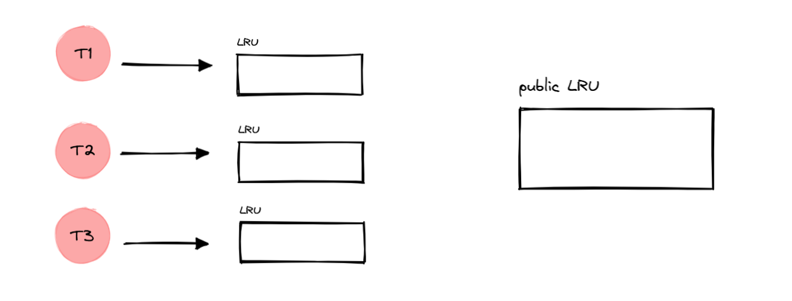
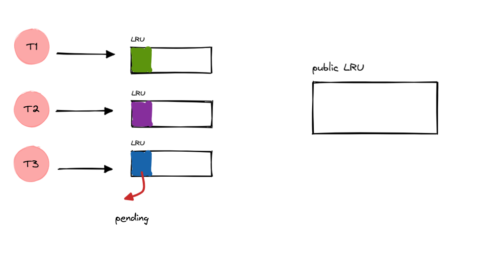
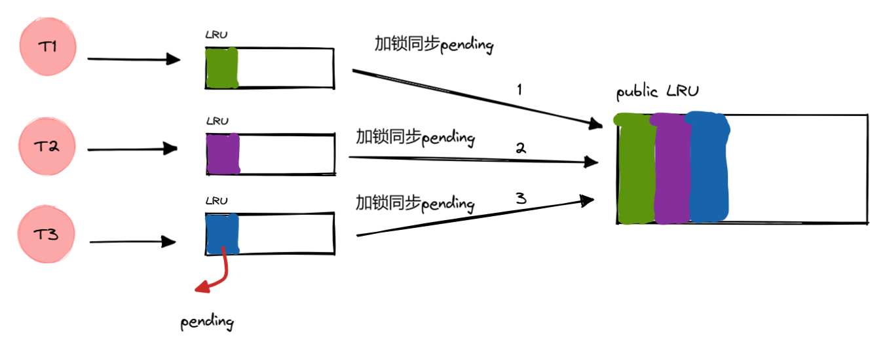
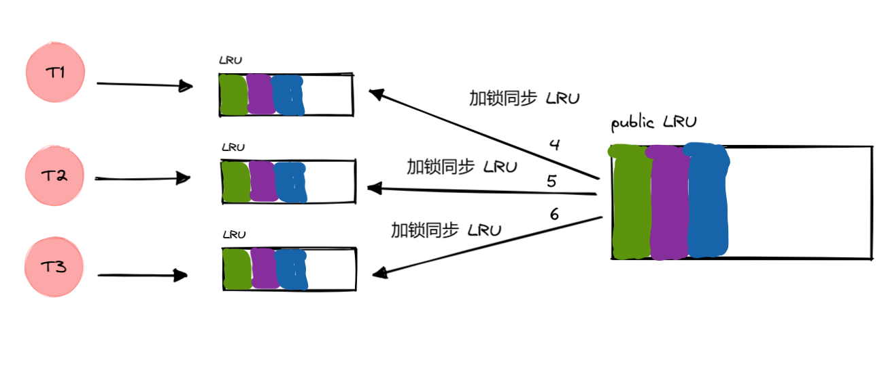
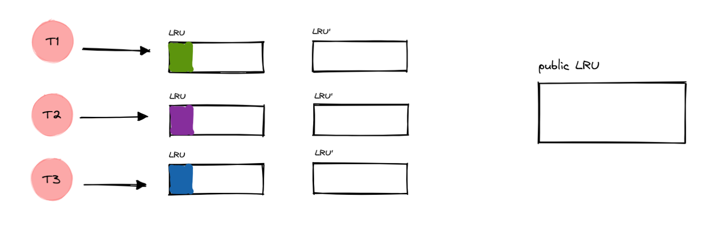
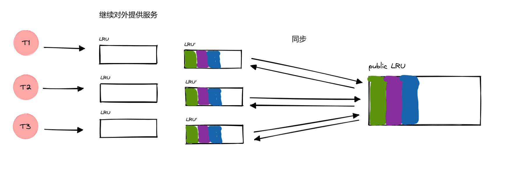
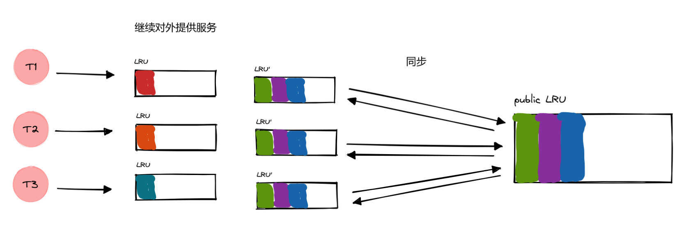
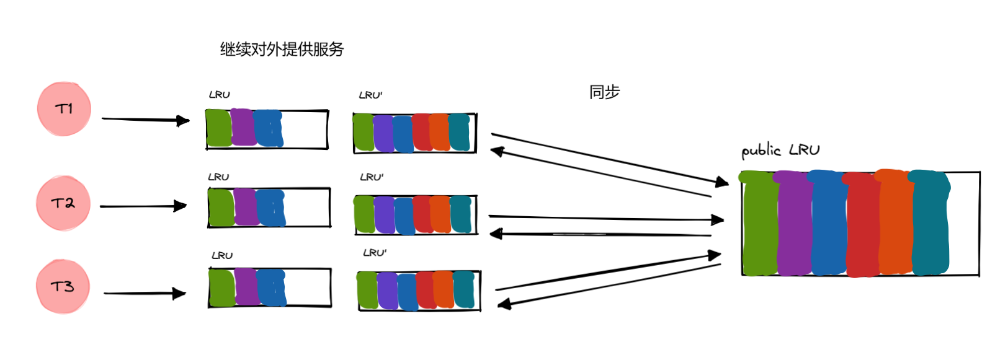
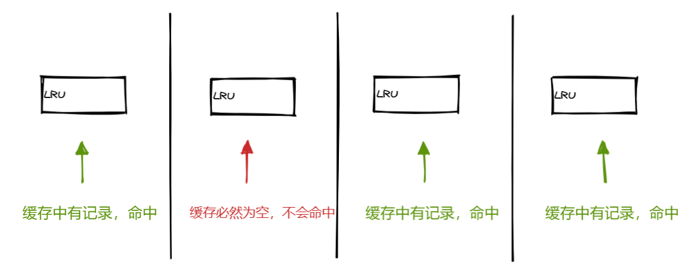

# LRU（Least Recently Used） 内存淘汰

首先淘汰最长时间未被使用的页面。


实现代码：

```c++
#include <list>
#include <unordered_map>
#include <optional>
#include <string>
#include <stdexcept>

using namespace std;

class LRUCache {
public:
    explicit LRUCache(int capacity) : capacity_(capacity) {
        if (capacity_ <= 0) {
            throw invalid_argument("Capacity must be greater than 0");
        }
    }

    optional<string> get(const string& key) {
        auto it = findUMap_.find(key);
        if (it != findUMap_.end()) {
            // 更新最近使用位置
            dataList_.splice(dataList_.begin(), dataList_, it->second);
            return it->second->second;
        }
        return nullopt;
    }

    void put(const string& key, const string& val) {
        auto it = findUMap_.find(key);
        if (it != findUMap_.end()) {
            // 更新数据及位置
            it->second->second = val;
            dataList_.splice(dataList_.begin(), dataList_, it->second);
            return;
        }

        // 淘汰逻辑
        if (dataList_.size() >= capacity_) {
            auto& last = dataList_.back();
            findUMap_.erase(last.first);
            dataList_.pop_back();
        }

        // 插入新数据
        dataList_.emplace_front(key, val);
        findUMap_[key] = dataList_.begin();
    }

private:
    int capacity_;
    list<pair<string, string>> dataList_;	// key,value
    unordered_map<string, list<pair<string, string>>::iterator> findUMap_;	// key,迭代器
};
```

关键说明：

- get 和 put 都会导致 缓存更新
- put 时，如果缓存中有数据，就更新数据，还要记得更新到链表头部
- unordered_map 存储 list 元素的迭代器，因为 splice 操作的第三个参数需要迭代器，这样才能更新链表的记录
- splice 第一个参数表示要移动到的位置，第三个参数表示要移动的元素位置（迭代器）

# LFU （Least Frequently Used）内存淘汰

首先淘汰一定时期内被访问次数（频次）最少的页。

因此，LFU 的实现会比 LRU 麻烦一些，要给缓存中的元素额外添加一些信息。


代码实现：

```c++
#include <unordered_map>
#include <list>	
#include <set>	
#include <memory>
#include <algorithm>
using namespace std;


// 缓存的节点信息
struct Node {
    int key, val, freq;
    Node(int _key, int _val, int _freq) : key(_key), val(_val), freq(_freq) {}
};
class LFUCache {
    int minfreq, capacity;
    unordered_map<int, list<Node>::iterator> cache_table;
    unordered_map<int, list<Node>> freq_table;
    int update(int key) {
		auto it = cache_table.find(key);
        list<Node>::iterator node = it->second;
        int val = node->val, freq = node->freq;
        freq_table[freq].erase(node);
        if (freq_table[freq].size() == 0) {
            freq_table.erase(freq);
            if (minfreq == freq) minfreq += 1;
        }
        freq_table[freq + 1].push_front(Node(key, val, freq + 1));
        cache_table[key] = freq_table[freq + 1].begin();

        return val;
    }
public:
    LFUCache(int _capacity) {
        minfreq = 0;
        capacity = _capacity;
        cache_table.clear();
        freq_table.clear();
    }

    int get(int key) {
        if (capacity == 0) return -1;

        auto it = cache_table.find(key);
        if (it == cache_table.end()) return -1;

        return update(key);
    }

    void put(int key, int value) {
        if (capacity == 0) return;
        auto it = cache_table.find(key);
        if (it == cache_table.end()) {
            // 缓存已满，淘汰
            if (cache_table.size() == capacity) {
                auto it2 = freq_table[minfreq].back();
                cache_table.erase(it2.key);
                freq_table[minfreq].pop_back();
                if (freq_table[minfreq].size() == 0) {
                    freq_table.erase(minfreq);
                }
            }
            freq_table[1].push_front(Node(key, value, 1));
            cache_table[key] = freq_table[1].begin();
            minfreq = 1;
        }
        else {
            list<Node>::iterator node = it->second;
			node->val = value;
			update(key);
        }
    }
};
```

# LRU缓存设计

## 公共LRU缓存

```c++
class LRU {
  using cacheList = std::list<std::pair<std::string, std::unordered_set<std::string>>>;
  using cacheMap = std::unordered_map<std::string, cacheList::iterator>;
 public:
  LRU(unsigned int capacity);
  void put(std::string key, std::string value);
  std::optional<std::unordered_set<std::string>> get(std::string key);
 private:
  unsigned int m_capacity;
  cacheList m_cache;
  cacheMap m_map;
};
```

多个线程加锁访问主线程中的一个 LRU 缓存，同时只能有一个线程能工作，其他线程等待锁，不能工作。



## 私有LRU缓存+公共LRU缓存

```c++
using cacheList = std::list<std::unordered_map<std::string, std::set<std::string>>>;
using cacheMap = std::unordered_map<std::string, cacheList::iterator>;
class LRU {
 public:
  explicit LRU(unsigned int capacity);
  void put(const std::string& key,const std::set<std::string>& value);
  std::optional<std::set<std::string>> get(const std::string& key);
  cacheList getPending(); // cacheManager 需要
  cacheList getCache();
  void clearPending();
 public:
  void clearAll();
 private:
  unsigned int m_capacity;
  cacheList m_cache;
  cacheList m_pending;	// 增量缓存
  cacheMap m_map;
};
```

每个线程独有一个自己的 LRU 缓存，主线程中有一个公共的 LRU 缓存，需要考虑缓存的一致性问题。



这个时候是初始状态，各个 LRU 缓存中都没有记录，因此所有请求都不会命中缓存，不管你是在哪个线程下。

因此，在没有同步之前（定时器定时同步），所有的请求数据会先去读磁盘，然后缓存到 Redis，再缓存到 pending 中。



过一段时间，定时器就会触发同步缓存的回调。逐一把各个线程中 LRU 内部的 pending 缓存同步到公共 LRU，最后再把公共 LRU 缓存逐一同步给各个线程的 LRU 缓存，并清空 pending 缓存。

同步期间，无法对外提供搜索服务，因为所有的 LRU 缓存都被加锁了，直到收集完所有 pending 并最终同步到所有子线程的 LRU 缓存中，才能提供服务。

```c++
void TcpServer::synWebPage() {
  std::lock_guard<std::mutex> lock(m_WMtx);
  // 收集 pending
  for (const auto &webpage : m_web_page_server) {
    std::cout << "开始收集" << std::endl;
    for (const auto &item : webpage->getPending()) {	// getPending 函数内部加锁
      for (const auto &page_set : item) {
        m_Wlru->put(page_set.first, page_set.second);
      }
    }
    webpage->m_lru->clearPending();
  }

  // 同步 LRU
  for (const auto &webpage : m_web_page_server) {
    std::cout << "开始同步" << std::endl;
    for (const auto &item : m_Wlru->getCache()) {	    // getCache 函数内部加锁
      for (const auto &word_set : item) {
        webpage->m_lru->put(word_set.first, word_set.second);
      }
    }
  }
}
```

流程如下：

加锁同步 pending



收集完所有线程的 pending 缓存（增量缓存），加锁同步给所有线程，并清空 pending，用于以后继续记录后面没有命中的增量缓存。



明显看到，同步期间，我们是无法对外提供服务的，有必要优化这个问题。

## 更新和同步分离

从现在开始一个线程 有两个 LRU，LRU 用于对外提供服务，LRU‘ 用于后续同步缓存给公共 LRU，并再次同步回来。

然后把 LRU 和 LRU’ 进行交换即可，在交换期间需要进行短暂的加锁，禁止对外提供服务的时间大大缩减。



开始交换 LRU 和 LRU’，期间要加锁，但这个过程很快，因为只是交换两个指针的指向。



明显看到有个问题，就是会有一次缓存失效的问题。你看第一次交换之后，所有 LRU 都是空的，得等到下一次交换的时候才能命中缓存。



又来到 交换的时候，这一次交换会让之前的缓存得以有效。并且在下一次同步的时候，哪怕是交换，之前的缓存依旧有效（只要没有超过大小，导致被淘汰）。



由此可见，这种方式虽然性能有所提升，但是最近一次的 pending 缓存会在交换之后无法被命中，因为要先去同步到公共 LRU，才能有机会同步过来。

但是往后都会有效，只要 LRU 缓存没有触发淘汰机制。



