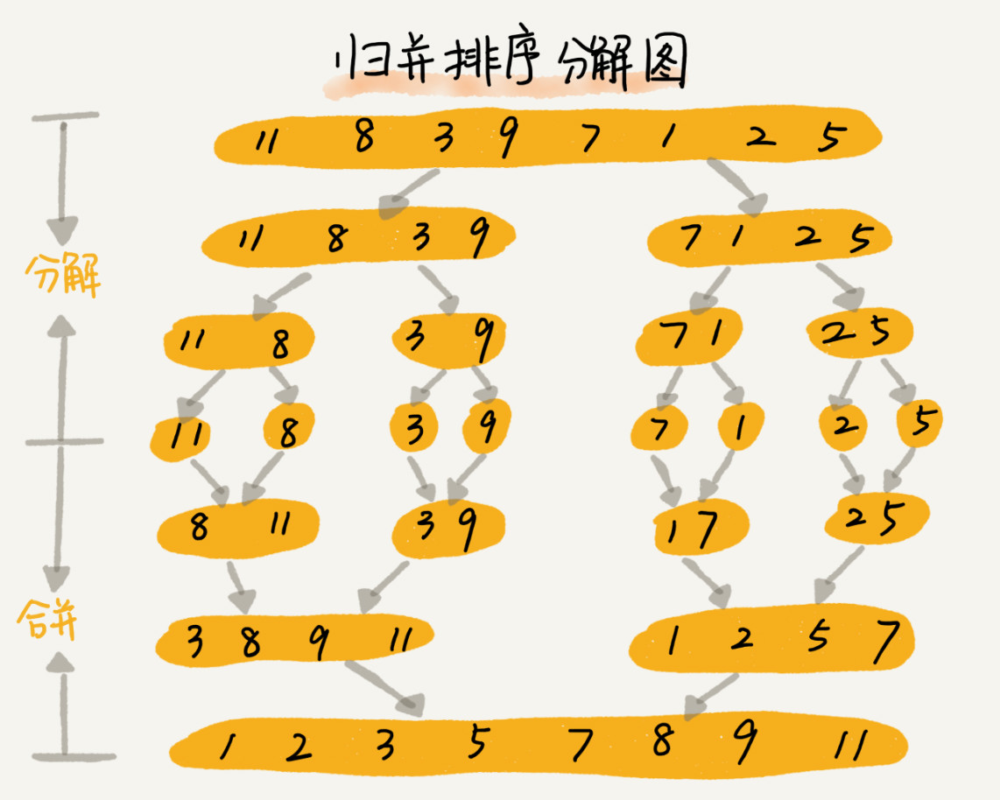
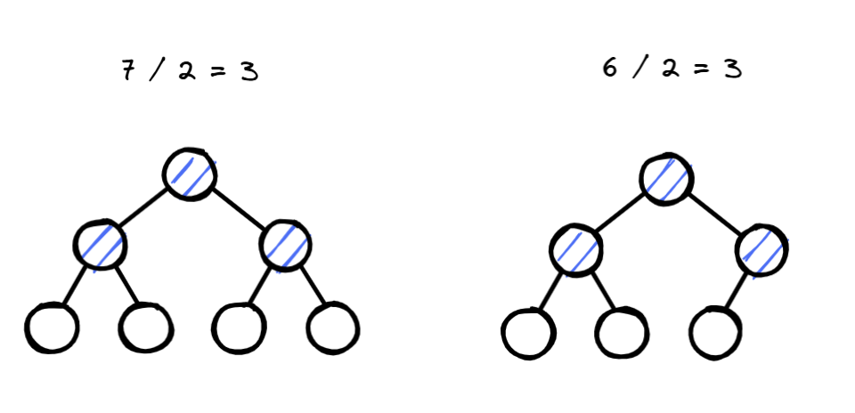
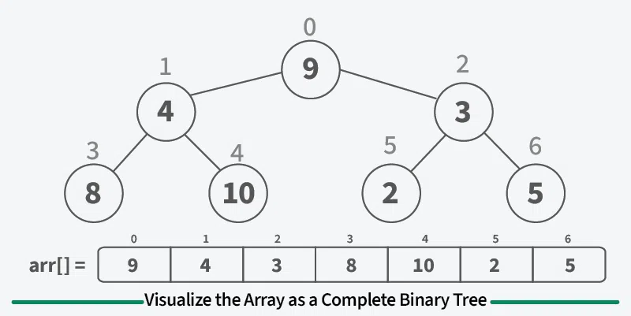
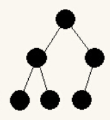

# 快速排序

```c++
int partition(std::vector<int> &data, int left, int right) {
    int base = data[left];
    int src_left = left, src_right = right;

    // 先右后左
    while (left < right) {
        while (left < right && data[right] >= base) {    // 找到一个右边可用于交换的元素
            right--;
        }
        while (left < right && data[left] <= base) {     // 找到一个左边可用于交换的元素
            left++;
        }
        std::swap(data[left], data[right]);        // 既然已经找到符合交换的两个元素，那就交换吧，来继续满足 左小右大 原则
    }
    std::swap(data[left], data[src_left]);
    return left;
}

void QuickSort(std::vector<int> &data, int left, int right) {
    if (left >= right) return;
    int mid = partition(data, left, right);
    QuickSort(data, left, mid - 1);
    QuickSort(data, mid + 1, right);
}

void QuickSort(std::vector<int> &data) {
    if (data.empty()) return;
    QuickSort(data, 0, data.size() - 1);
}
```

## 步骤

1. 选择排序区间的第一个元素作为基准，每次排序结果是小于等于基准元素的在左边，大于等于基准元素的右边
2. 左指针指向排序区间第一个元素，右指针指向排序区间的最后一个元素
3. 从右往左遍历，直到遇到第一个小于基准元素 A
4. 从左往右遍历，直到遇到第一个大于基准元素 B
5. 交换得到的两个元素（A 和 B）
6. 重复 2-5 步骤
7. 直到退出循环，交换排序区间第一个元素 和 左指针或右指针指向的元素。

## 遇到的问题

partition 中找到已经不合规的两个元素，即 left 下标指向的元素 大于 base 值，right 下标指向的元素 小于 base 值。

交换两个元素，达到符合 右小左大的原则。

我接着往下写，就想着既然之前两个不合法的元素现在通过 swap 已经合法，那就得接着往下找，left + 1 和 right - 1 来继续匹配元素。

但是这样就会出现段错误，即让退出循环后的那个 swap 操作出现段错误，根本原因是 left + 1 可能出现数组越界。

合理的行为就是 swap 两个不合法元素之后，不进行 left + 1 和 right - 1 来继续匹配元素。直接继续进入下一轮循环，反正之前交换的元素已经合法，会帮我们完成继续往下匹配，找到不合法的元素。

## 优化

在数组中选取三个候选元素（通常为数组的首、尾、中点元素），**并将这三个候选元素的中位数作为基准数**。这样一来，基准数“既不太小也不太大”的概率将大幅提升。当然，我们还可以选取更多候选元素，以进一步提高算法的稳健性。采用这种方法后，时间复杂度劣化至 O(n2) 的概率大大降低。

```c++
//  选取三个候选元素的中的一个数 作为基准数
//  这个基准数应该介于另外两个数之间
int medianThree(std::vector<int> &data, int left, int mid, int right) {
    int left_val = data[left], mid_val = data[mid], right_val = data[right];
    if ((left_val <= mid_val && mid_val <= right_val)
        || (right_val <= mid_val && mid_val <= left_val)) {
        return mid;
    }
    if ((mid_val <= left_val && left_val <= right_val)
        || (right_val <= left_val && left_val <= mid_val)) {
        return left;
    }
    return right;
}

int partition(std::vector<int> &data, int left, int right) {
    int mid = left - ((left - right) / 2);
    int median = medianThree(data, left, mid, right);  // 得到一个合理的 base
    std::swap(data[median], data[left]);
    int base = data[left];
    int src_left = left, src_right = right;

    // 先右后左
    while (left < right) {
        while (left < right && data[right] >= base) {    // 找到一个右边可用于交换的元素
            right--;
        }
        while (left < right && data[left] <= base) {     // 找到一个左边可用于交换的元素
            left++;
        }
        std::swap(data[left], data[right]);        // 既然已经找到符合交换的两个元素，那就交换吧，来继续满足 左小右大 原则
    }
    std::swap(data[left], data[src_left]);
    return left;
}
```

# 归并排序

```c++
void merge(std::vector<int> &data, int left, int mid, int right) {
    std::vector<int> tmp(right - left + 1);

    // 将有序的两个数组 从小到大依次加入到 tmp 中
    // 你可能疑惑哪里来的两个无序数组？[left,mid] [mid+1,right]
    
    // 先把左数组的起始下标，右数组的起始下标 记录下来
    int left_index = left, right_index = mid + 1, index = 0;
    
    // 开始比较，谁小就依次保存它
    while (left_index <= mid && right_index <= right) {
        data[left_index] <= data[right_index] ? tmp[index++] = data[left_index++] : tmp[index++] = data[right_index++];
    }
    // 可能某一个数组还有元素没有被处理完毕
    while (left_index <= mid) {
        tmp[index++] = data[left_index++];
    }
    while (right_index <= right) {
        tmp[index++] = data[right_index++];
    }
    // 把排序后的结果保存到 data 数组中去
    int k = 0;
    for (int i = left; i <= right;) {
        data[i++] = tmp[k++];
    }
}

void mergeSort(std::vector<int> &data, int left, int right) {
    if (left >= right) return;  // 只有一个元素，就停止继续递归
    int mid = left - ((left - right) / 2);
    mergeSort(data, left, mid);
    mergeSort(data, mid + 1, right);
    merge(data, left, mid, right);
}

void mergeSort(std::vector<int> &data) {
    if (data.empty()) return;
    mergeSort(data, 0, data.size() - 1);
}
```

## 步骤

1. 申请空间，使其大小能用来存放左右数组
2. 设定两个指针，最初位置分别为两个左右数组的起始位置
3. 比较两个指针所指向的元素，选择相对小的元素放入到合并空间，并移动指针到下一位置
4. 重复步骤 3 直到某一指针达到序列尾
5. 将另一序列剩下的所有元素直接复制到合并序列尾
6. 把存放有序数据的临时数组中的数据赋值到待排序数组中

## 浅谈

给你看到力扣题目：[88. 合并两个有序数组](https://leetcode.cn/problems/merge-sorted-array/)

归并排序中的 merge 实现就可以解决到这道题目，但有个问题却容易让人产生疑惑，什么时候这两个数组居然是有序了？

mergeSort 的 递归分割行为，保证两个数组最初的有序性（一个数组中只有一个元素的情况下，这个数组就必然是有序），但如果光有这个函数是不够的，还得 merge  把两个有序数组合并成一个有序数组才可以，这就能让下一次 merge 行为依旧是 合并两个有序数组的行为。



注：不谈归并优化，原地 merge 过于复杂，不推荐

# 堆排序

大根堆：当前节点大于等于左右孩子

小根堆：当前节点小于等于左右孩子

```c++
// 从下标 0 开始，尽管网上有的下标从 1 开始（公式好推导）

int getLeft(int i) {
    return 2 * i + 1;
}

int getRight(int i) {
    return 2 * i + 2;
}

// 下沉
void siftDown(std::vector<int> &data, int len, int cur) {
    while (true) {
        // 判断当前节点 当前节点左节点 当前节点右节点 谁最大
        int max_index = cur;
        int left_index = getLeft(cur);
        int right_index = getRight(cur);
        if (left_index < len && data[max_index] < data[left_index]) {
            max_index = left_index;
        }
        if (right_index < len && data[max_index] < data[right_index]) {
            max_index = right_index;
        }
        // 此刻 max_index 指向 三个节点中的最大节点

        if (max_index != cur) { // 只要 max_index != cur，就表明 max_index 已经被更改，那就意味着 还有堆化的必要
            std::swap(data[max_index], data[cur]);
            cur = max_index;
        } else {
            break;
        }
    }
}

void heapSort(std::vector<int> &data) {
    // 先把数组堆化（大顶堆）,得到一个 当前节点 大于等于 左右节点
    // 排除叶子节点，从后往上取出节点，每个节点进行一次 siftDown
    for (int i = (data.size() / 2) - 1; i >= 0; i--) {
        siftDown(data, data.size(), i);
    }
    // 再进行堆排序
    // 依次 把堆顶元素和堆底元素进行交换
    // 这时候的堆底元素往后将不参与排序，堆顶元素已经破坏堆，需要将堆顶元素进行 siftDown
    int len = data.size() - 1;
    for (int i = len; i > 0; --i) {
        std::swap(data[0], data[i]);
        siftDown(data, i, 0);
    }
}
```

## 步骤

1. 将无序数组堆化
1. 构建最大堆，通过将最大的元素放在未排序数组的末尾来对数组进行排序

## 排序之前为什么要堆化？

那先看看堆排序的思路，即将最大的元素放在未排序数组的末尾来对数组进行排序。

堆化可以保证，当前节点大于左右孩子节点（叶子节点没有左右孩子，可理解为必然大于左右孩子）。那么通过一次堆化行为，能够让堆排序顺理成章。但是，每排序一次，就会导致堆不规范，这也是为什么每次排序之后，都要 siftDown 一次。

我们是把堆顶元素和堆底元素进行交换达到排序效果，由于交换之后，堆底的元素已经排序完成，从此以后，不再纳入排序范围内。但是堆顶的元素此刻并不规范，但除此之外的其他待排序节点都是规范的，因此每次排序完成之后，都要 siftDown 一次 就是针对交换后的堆顶节点。

## 代码中值得提及的地方

### 第一个问题：为什么堆化只操作已有节点的一半？

堆化究竟是在干啥？就是把一个数组看成一个具有完全二叉树性质的一棵树，只要所有节点具备大于左右孩子节点的性质，那就堆化成功。

由于叶子节点不存在左右孩子节点，所以没有必要对叶子节点纳入到堆化范围。



### 第二个问题：为什么从后往前选择节点 siftDown ？

**子树已经是堆**：

当你从后往前调整时，对于每个非叶节点，其左右子节点已经在之前的步骤中被调整成堆。这意味着，在对当前节点进行 siftDown 调整时，可以确保其子树已经满足堆的性质，从而更容易将整个子树调整成一个堆。

**避免重复调整**：

叶节点和子树中已经是堆的部分无需再次调整。从最后一个非叶节点开始可以确保每次调整时只需要处理当前节点与其子节点的关系，避免了不必要的重复操作，提高了整体构建堆的效率。

## 注意

将数组视为一颗完全二叉树：



对于大小为 n 的数组，根位于索引 0 处，索引 i 处元素的左子项 位于 2i + 1，右子项位于 2i + 2 处。

我在这里特别强调完全二叉树是有原因的，首先看看它的定义：如果二叉树除了最后一层有缺失外，其它是满的，且最后一层缺失的叶子结点只出现在右侧，则这样的二叉树叫完全二叉树。

也就是说如有有个节点下面只有一个节点，那么这个节点应该作为左节点，而不是右节点，就像下面这样：



但这并不是说堆一定是完全二叉树，平时使用完全二叉树的原因是易于存储，并且便于索引，也就是说堆利用完全二叉树的性质。

# 参考文章

https://www.hello-algo.com/chapter_sorting/quick_sort/#1153

https://www.geeksforgeeks.org/heap-sort/
