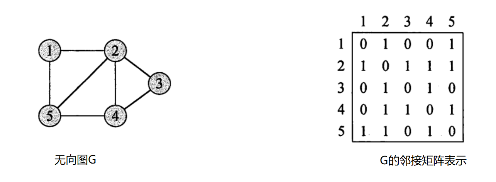
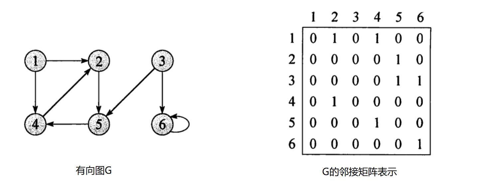
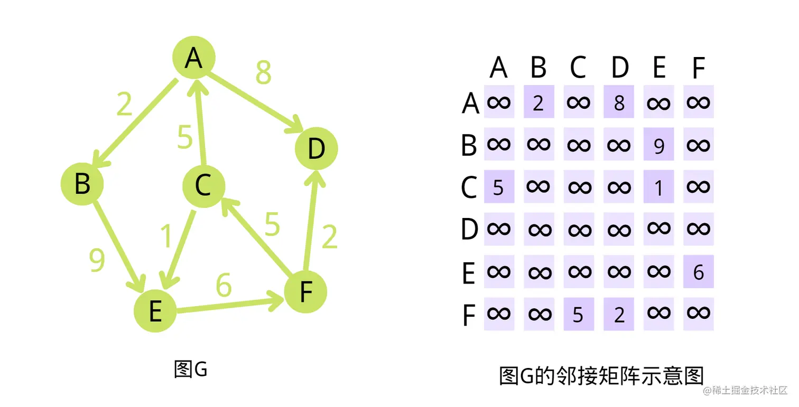
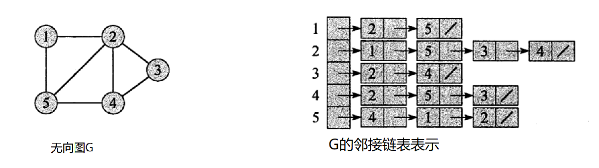
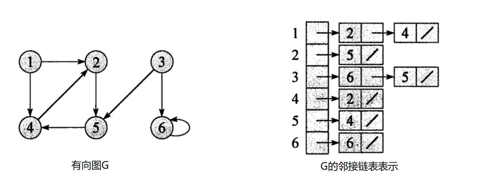
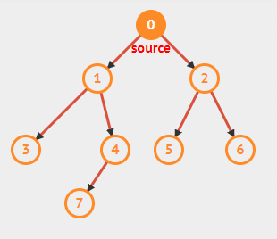

# 图的存储结构

## 邻接矩阵

### 无向图

如果顶点 vi 和 vj 之间存在一条边，则` A[i][j]=A[j][i]=1`。

如果顶点 vi 和 vj 之间不存在边，则 `A[i][j]=A[j][i]=0`。



无向图的邻接矩阵是**对称矩阵**，即 `A[i][j]=A[j][i]` ，这是因为无向图的边没有方向，若 vi 到 vj 有边，那么 vj 到 vi 也必然有边。

### 有向图

如果存在一条从顶点 vi 到顶点 vj 的有向边，则 `A[i][j]=1`。

如果不存在从顶点 vi 到顶点 vj 的有向边，则 `A[i][j]=0`。



有向图的领接矩阵不一定是对称的，因为顶点 vi 到顶点 vj 有方向，但是顶点 vj 到顶点 vi 不一定有。

### 带权图



对于带权图（包括带权有向图和带权无向图），邻接矩阵中的元素 `A[i][j]` 存储的是顶点 vi 到顶点 vj 的边的权值。

如果顶点 vi 和 vj 之间存在边，`A[i][j]` 存储该边的权值 w。

如果顶点 vi 和 vj之间不存在边，通常用一个**特殊值**（如无穷大 ∞，在编程实现中可以用一个足够大的数来表示）表示，同时 `A[i][i]=0`（表示顶点到自身的距离为 0）。

## 邻接表

### 无向图



### 有向图



更多存储结构，推荐文章：https://subingwen.cn/data-structure/graph/

# 图的遍历

栈实现深度优先搜索，队列实现广度优先搜索。

## 深度优先搜索



部分代码：

```c++
class Graph {
 public:
  explicit Graph(size_t nodeNum) : nodeNum_(nodeNum) {
	  graph_.resize(nodeNum_);
  }

  // 添加边
  void addEdge(int u, int v) {
	  if (u >= 0 && u < nodeNum_ && v >= 0 && v < nodeNum_) {
		  graph_[u].push_back(v);
		  graph_[v].push_back(u);
	  }
  }
 private:
  size_t nodeNum_;
  std::vector<std::vector<int>> graph_;
};
```

### 递归方式实现

1. 随意选择一个起始顶点作为当前顶点，并将其标记为已访问。
2. 递归地访问当前顶点的所有未访问过的邻接顶点。
3. 当当前顶点的所有邻接顶点都被访问过后，回溯到上一个顶点。
4. 重复步骤 2 和 3，直到所有可达的顶点都被访问。

```C++
  void recursionDFS(int start,std::unordered_set<int>& visited){
	  visited.insert(start);	// 表示已经访问过
	  for (int i : graph_[start]) {	// 访问与 start 相邻的节点
		  if (visited.find(i) == visited.end()) {	// 如果没有访问过,递归访问
			  recursionDFS(i, visited);
		  }
	  }
  }
```

### 栈方式实现

1. 随意选择一个起始顶点，将其压入栈中，并标记为已访问。
2. 当栈不为空时，弹出栈顶顶点。
3. 将该顶点的所有未访问过的邻接顶点压入栈中，并标记为已访问。
4. 重复步骤 2 和 3，直到栈为空。

```c++
  void stackDFS(int start,std::unordered_set<int>& visited){
	  std::stack<int> s;
	  s.push(start);
	  visited.insert(start);
	  while (!s.empty()) {
		  int node = s.top();
		  s.pop();
		  for (int i : graph_[node]) {
			  if (visited.find(i) == visited.end()) {
				  s.push(i);
				  visited.insert(i);
			  }
		  }
	  }
  }
```

## 广度优先搜索


步骤：

1. 选择起始顶点：任选图中的一个顶点作为起始点，将其标记为已访问，并将其加入到一个队列中。
2. 队列操作 –> 当队列不为空时，执行以下操作：
   - 从队列的头部取出一个顶点。
   - 访问该顶点的所有未被访问过的邻接顶点，将这些邻接顶点标记为已访问，并将它们依次加入到队列的尾部。
3. 结束条件：重复上述队列操作，直到队列为空，此时图中所有可达顶点都已被访问。

```c++
  void BFS(int start, std::unordered_set<int> &visited) {
	  std::queue<int> q;
	  q.push(start);
	  visited.insert(start);
	  while (!q.empty()) {
		  int node = q.front();
		  q.pop();
		  for (int i : graph_[node]) {
			  if (visited.find(i) == visited.end()) {
				  q.push(i);
				  visited.insert(i);
			  }
		  }
	  }
  }
```

