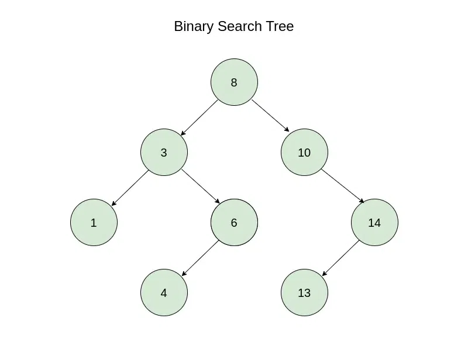
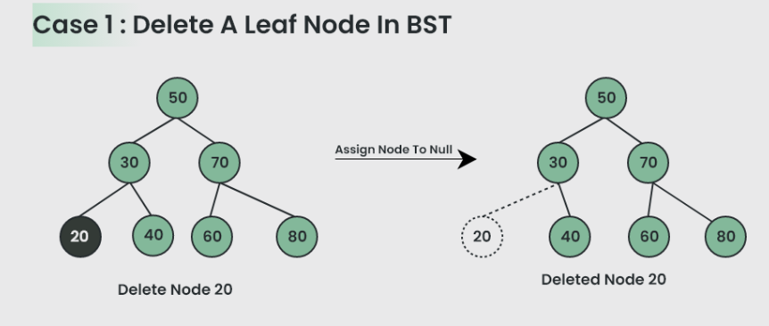
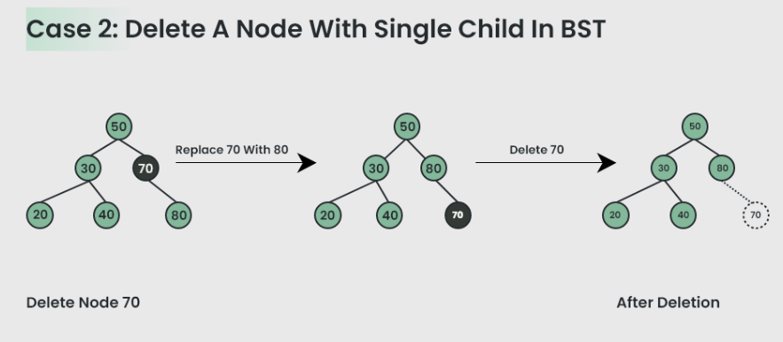
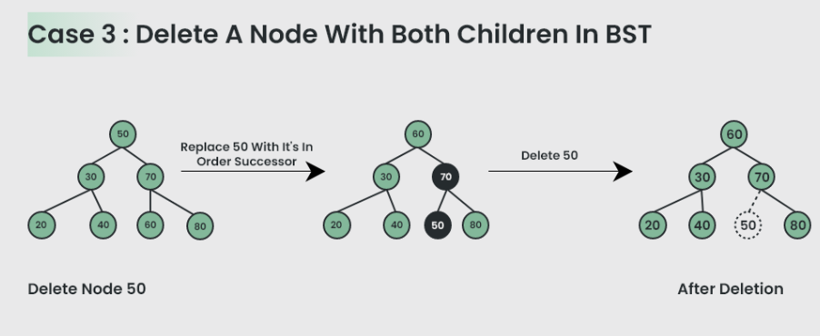
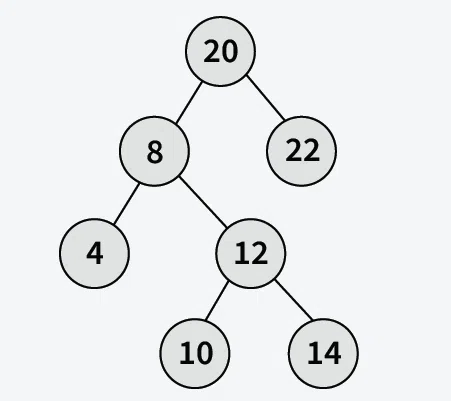

值：左子树 < 父节点 < 右子树

完整代码地址：[基于二叉搜索数实现 map](https://github.com/xiaoyangst/Code/tree/master/%E6%95%B0%E6%8D%AE%E7%BB%93%E6%9E%84/%E5%9F%BA%E4%BA%8E%E4%BA%8C%E5%8F%89%E6%90%9C%E7%B4%A2%E6%95%B0BST%E5%AE%9E%E7%8E%B0Map/BSTSearch)

# 基于二叉搜索数实现 map

可视化：https://www.cs.usfca.edu/~galles/visualization/BST.html

## 节点定义

```c++
template<typename K,typename V>
struct TreeNode
{
  std::pair<K,V> data;
  TreeNode* left;	// 左子树
  TreeNode* right;	// 右子数
  TreeNode* parent;	// 父节点
  TreeNode(const K& k,const V& v,TreeNode* parent = nullptr)
      : data(std::make_pair(key,val))
      , left(nullptr)
      , right(nullptr)
      , parent(parent) {}
};
```

## 搜索

从 BST 的根开始，将目标值（要搜索的值 key）与根节点的值进行比较：

1. 如果目标值等于根节点的值，返回 data
2. 如果目标值小于根节点的值，则向左递归，因为较小的值位于 BST 的左子树上
3. 否则，如果目标值大于根节点的值，则向右递归，因为较大的值位于 BST 的右子树上
4. 重复上面的步骤，直到无法再遍历为止

```c++
TreeNode<K, V> *find( const K &target )
{
	TreeNode<K, V> *find_node = root;
	while ( find_node )
	{
		auto cur = find_node->data.first;
		if ( target < cur )
		{
			find_node = find_node->left;
		} else if ( target > cur )
		{
			find_node = find_node->right;
		} else {
			return find_node;
		}
	}
	return(nullptr);
}
```

## 插入

遍历树，通过将要插入的值（目标值）与当前节点的值进行比较来找到插入点：

1. 如果目标值小于当前节点的值，则移动到左子树
2. 如果目标值大于当前节点的值，则移动到右子树
3. 重复上述步骤，<font color="red">直到到达叶子节点</font>

插入具有目标值的新节点。如果目标值小于父节点的值，则将其插入到左侧，否则插入到右侧。

```c++
void insert( const K &key, const V &val )
{
	auto new_node = new TreeNode<K, V>( key, val );
	if ( root == nullptr )
	{
		root = new_node;
		return;
	}

	TreeNode<K, V>	*cur	= root;
	TreeNode<K, V>	*parent = nullptr;

	while ( cur )
	{
		auto cur_key = cur->data.first;
		parent = cur;
		if ( key < cur_key )
		{
			cur = cur->left;
		} else if ( key > cur_key )
		{
			cur = cur->right;
		} else { /* 节点已存在，更新 val 即可 */
			root->data.second = val;
			return;
		}
	}
	if ( key < parent->data.first )
	{
		parent->left = new_node;
	} else {
		parent->right = new_node;
	}
	new_node->parent = parent;		// 记录父节点
}
```

## 删除（考虑三种情况）

第一种情况：删除叶子节点



第二种情况：删除的节点有单个节点

> [!WARNING]
>
> 通过更改指针的指向彻底删除节点（节点位于树中，不是单纯 delete 然后置为 nullptr），不要忘记更新相关节点的成员变量信息。



第三种情况：删除的节点有两个节点

> [!WARNING]
>
> 降级为叶子节点进行处理，不要忘记更新相关节点的成员变量信息。



> [!WARNING]
>
> 上面的三种删除情况，务必考虑删除节点为根节点的情况。

从根节点开始，寻找目标节点（要删除的节点），如果目标节点小于当前节点则向左移动，如果目标节点大于当前节点则向右移动。重复此步骤，直到找到目标节点或到达空节点。

当找到目标节点时，处理以下3种情况进行删除：

1. 如果目标节点是叶子节点，只需将其删除
2. 如果目标节点有 1 个子节点，则用其子节点**替换**目标节点并**删除**目标节点
3. 如果目标节点有  2  个子节点
   1. 找到目标节点的右子树中最小的节点（或左子树中最大的节点），我这里选择右子树中最小的节点 mininum
   2. 将目标节点替换为 mininum
   3. 已经降级为叶子节点，按照前面叶子节点方式处理即可

```c++
void erase( const K &key )
{
	if ( root == nullptr )
		return;

	TreeNode<K, V> *target = find( key );
	if ( target == nullptr )
		return;

	/* 优先处理两个子节点的，将其降级为叶子节点 */
	if ( target->left && target->right )
	{
		TreeNode<K, V> *successor = mininum( target->right );
		target->data	= successor->data;
		target		= successor;
	}

	TreeNode<K, V>	*child	= target->left ? target->left : target->right;
	TreeNode<K, V>	*parent = target->parent;

	/* 如果是单个子节点，更新最新的 parent 节点 */
	if ( child )
	{
		child->parent = parent;
	}

	/* 考虑根节点的情况 */
	if ( parent )
	{
		parent->left == target ? parent->left = child : parent->right = child;
	}else{
		root = child;
	}

	delete target;
	target = nullptr;
}
```

# 中序后继节点

首先要确定中序遍历的后继:

- 如果该节点有右子节点, 那么后继是其右子节点的子树中最左端的节点（就是之前我们实现找右子树中最小值的那种方法）
- 如果该节点没有右子节点, 那么后继是离它最近的祖先, 该节点在这个祖先的左子树内



如图所示：8 的中序后继为 10，10 的中序后继为 12，14 的中序后继为 20。

我们都知道，二叉搜索树的中序遍历是有序的：4，8，10，12，14，20，22。

这时候你就明白 中序后继 的含义，你自己看，8 后面的一个节点是 10，因此我们讲 8 的中序后继为 10。

```c++
TreeNode<K, V> *mininum( TreeNode<K, V> *node )
{
	while ( node->left != nullptr )
	{
		node = node->left;
	}
	return node;
}


TreeNode<K, V> * Inorder_Successor( TreeNode<K, V> *node )
{
	if ( node->right ) /* 存在右子树 */
	{
		return mininum( node->right );
	}

	TreeNode<K, V> * parent = node->parent;
	while ( parent && parent->left != node )
	{
		node	= parent;
		parent	= parent->parent;
	}
	return parent;
}
```

# 推荐文章

[Binary Search Tree in C++](https://www.geeksforgeeks.org/cpp-binary-search-tree/)