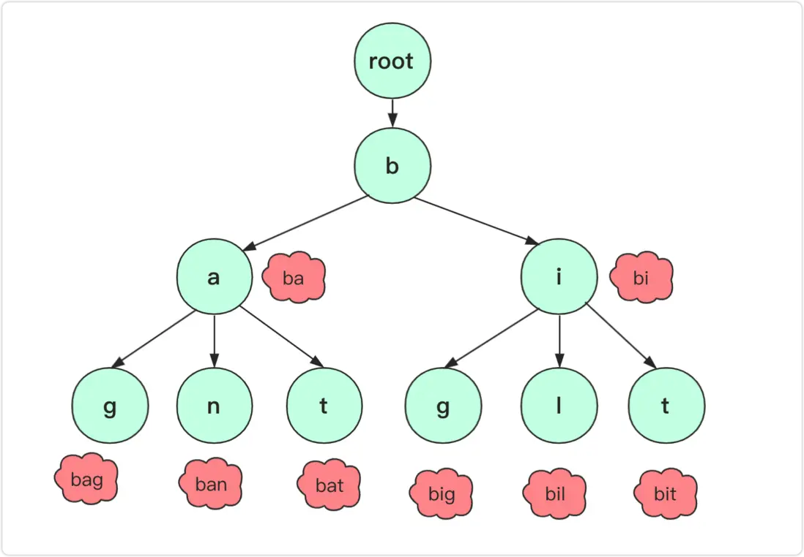
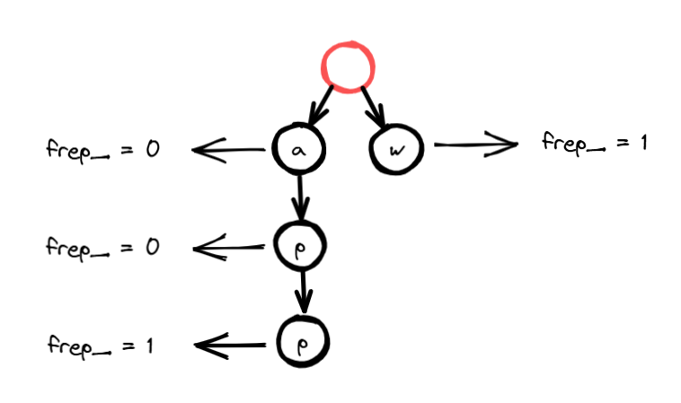

性质：

- 它是一棵多叉树，每个节点代表一个字符。**根节点不包含字符**，除根节点外的每个节点都包含一个字符
- 从根节点到某一节点的路径上经过的字符连接起来，即为该节点对应的字符串
- 每个节点可能有多个子节点，每个子节点对应一个不同的字符
- 通常在表示字符串集合的字典树中，会有一些特殊标记来表示某个节点是否是一个字符串的结尾

```c++
struct Node {
  explicit Node(char ch, size_t freq = 0) : ch_(ch), freq_(freq) {}

  char ch_;
  size_t freq_;
  unordered_map<char, Node *> children_;
};
```

完整代码：[字典树](https://github.com/xiaoyangst/Code/tree/master/%E6%95%B0%E6%8D%AE%E7%BB%93%E6%9E%84/%E5%AD%97%E5%85%B8%E6%A0%91/TrieTree)

# 插入

```c++
  void insert(const string &word) {
	  if (word.empty()) return;

	  auto curNode = root_;
	  for (const auto &ch : word) {
		  auto it = curNode->children_.find(ch);
		  if (it == curNode->children_.end()) {    // 不存在就新增节点
			  curNode->children_[ch] = new Node(ch);
		  }
		  curNode = curNode->children_[ch];        // 移动到下一个节点
	  }
	  curNode->freq_++;
  }
```

遍历字符串的每个字符，如果当前节点中没有该字符就新增。

当遍历完成，curNode 就是记录字符串的末尾字符，频率加 1，代表当前字符添加成功。

特别注意，除了记录添加字符串的末尾字符的节点频率加 1，其余频率为默认值 0：



# 查找

```c++
  int search(const string &word) {
	  if (word.empty()) return 0;
	  auto curNode = root_;
	  for (const auto &ch : word) {
		  auto it = curNode->children_.find(ch);
		  if (it == root_->children_.end()) {
			  return 0;
		  }
		  curNode = curNode->children_[ch];
	  }
	  return curNode->freq_;
  }
```

如果 频率 为 0，代表不存在该字符串的记录。

# 删除

```c++
  void remove(const string &word) {
	  if (word.empty()) return;
	  if (search(word) == 0) return;    // 确保删除的单词是存在的

	  remove(root_, word, 0);
  }
  
  Node *remove(Node *curNode, const string &word, size_t depth) {
	  if (curNode == nullptr) return nullptr;
	  if (depth == word.size()) {
		  if (curNode->freq_ > 0) {
			  curNode->freq_ = 0;    // 表示删除字符串
		  }
		  if (curNode->children_.empty()) {    // 后面没有连接任何字符，该节点可以移除了
			  delete curNode;
			  curNode = nullptr;
		  }
		  return curNode;
	  }

	  auto it = curNode->children_.find(word[depth]);
	  auto node = remove(it->second, word, depth + 1);
	  if (node == nullptr) {
		  curNode->children_.erase(it);	// 删除当前节点记录的某个子节点
	  }

	  if (curNode->children_.empty() && curNode->freq_ < 1) {	// 表面当前节点没有存在的必要，可删除了
		  delete curNode;
		  curNode = nullptr;
	  }
	  return curNode;
  }
```

通过前面的 search 方法确保有字符串的记录，才去考虑删除。

depth 既可以获取当前要查询的字符，还可以知道什么时候不再往下继续查询，到删除的必要了。

如果 当前节点 的 freq_ > 0，置为 0 就代表删除该字符。

可是这远远不够，还需要删除这些字符连接起来的节点，但是也不能一股气全部删除，还是要考虑删除的情景：

- 当要删除的单词是其它单词的前缀时，只需将该节点的 freq 设置为 0 即可，不需要删除该节点及其子节点。例如，字典树中有 apple 和 app，若要删除 app，则只需将 app 对应的节点的 freq 设为 0，apple 仍然保留。 
- 若要删除的单词和其它单词有公共前缀，该路径上的公共前缀需要保留，删除公共前缀之后的部分即可。例如，字典树中有 app 和 apple，若要删除 apple，app 仍然会保留。
- 如果删除的单词后面没有后缀，可以递归从后往前删除，直到遇到当前节点依旧是其他节点的前缀位置。

# 前缀匹配

```c++
  vector<string> prefix(const string &word) {    // 根据前缀匹配单词集合
	  vector<string> res;
	  if (word.empty()) return res;

	  auto curNode = root_;
	  for (const auto ch : word) {
		  auto it = curNode->children_.find(ch);
		  if (it == root_->children_.end()) {    // 没有完全匹配该前缀
			  return res;
		  }
		  curNode = curNode->children_[ch];
	  }

	  if (curNode->freq_ > 0) {    // 如果前缀本身也构成一个单词，加入
		  res.push_back(word);
	  }

	  //拿到前缀节点后，收集后面所有的完整字符
	  nodeBack(curNode, const_cast<string &>(word), res);
	  return res;
  }

  void nodeBack(Node *curNode, string &word, vector<string> &wordVec) {
	  if (curNode == nullptr) return;
	  for (auto &child : curNode->children_) {
		  word.push_back(child.first);
		  nodeBack(child.second, word, wordVec);
		  if (child.second->freq_ > 0) {
			  wordVec.push_back(word);
		  }
		  word.pop_back();
	  }
  }
```

先把用户输入的前缀匹配一下，这是最根本的。

用户输入的前缀也可以视为一个单词，如果 freq_ 大于 0，添加到 容器中。

接下来 nodeBack 函数开始递归收集 前缀后面的所有字符串并添加到容器中，这里用到回溯的思想。

# 输出全部字符串

```c++
  void preOrder() {        //前序遍历输出所有单词
	  vector<string> res;
	  string word;
	  auto root = root_;
	  nodeBack(root, word, res);
	  for (const auto &str : res) {
		  cout << str << endl;
	  }
  }
```

理解前面的 nodeBack 也就不难，字典树的根节点是不包含任何字符的，作为第一个参数，就可以把所有字符串都收集起来了。