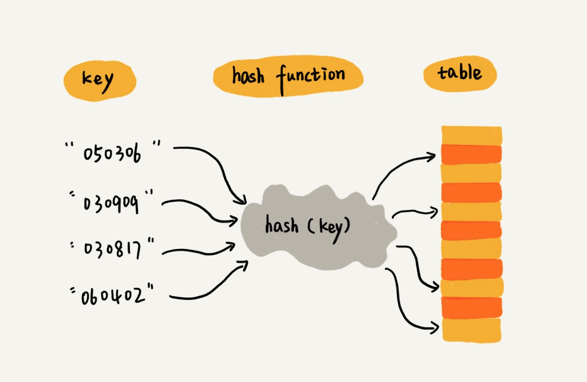
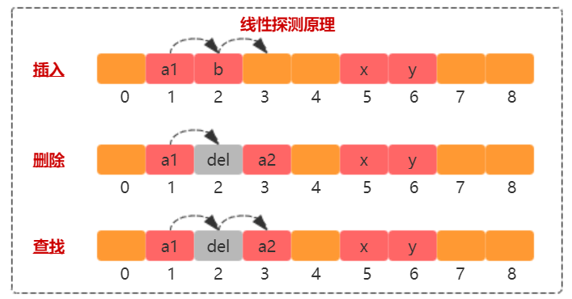
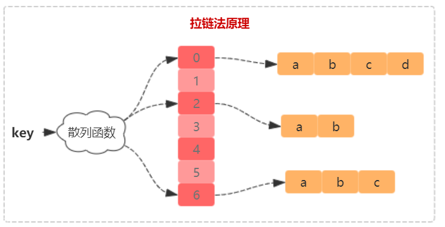
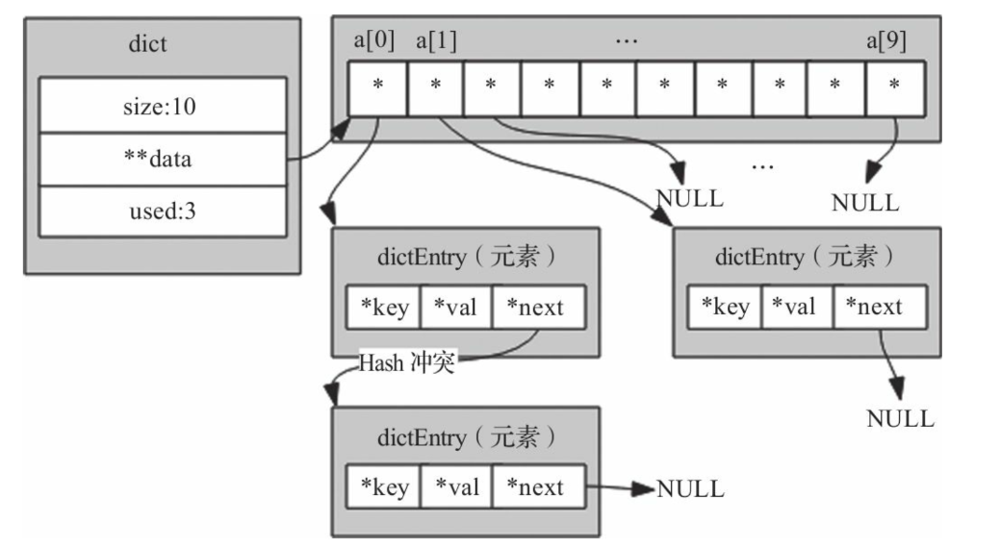
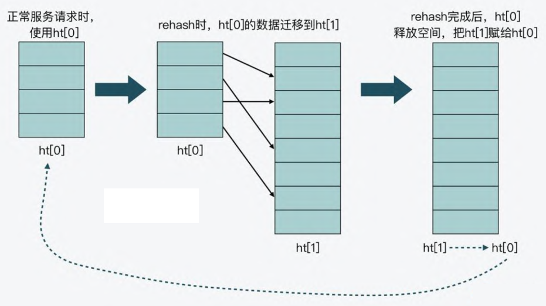
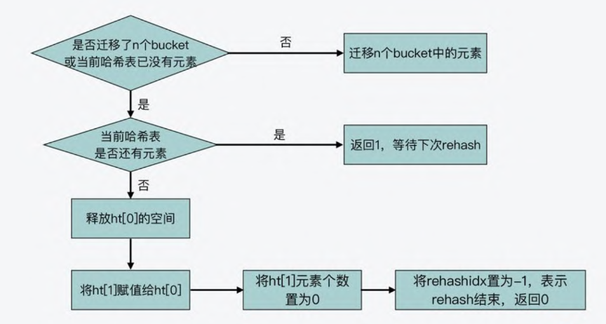
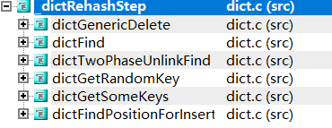

使用哈希查找算法分为两步：

1. 用散列函数将被查找的键（key）转换为哈希表的一个索引。理想情况下，不同的键都能转换成不同的索引值。实际上我们需要面对两个或多个键都会散列到相同的索引值的情况。
2. 处理碰撞冲突的过程。常见的两种方式：拉链法和线性探测法。

# 哈希函数

一般拥有如下特征：

1. 相同的输入经哈希计算后得出相同输出。
2. 不同的输入经哈希计算后一般得出不同输出值，但也可能会出现相同输出值。



我们要找的散列函数应该易于计算并且能够均匀分布所有的键。

# 哈希冲突以及解决方案

## 线性探测



插入：插入元素 a2，哈希计算得到的索引发现和 a1 存在冲突（即已经被占用），往后寻找，发现下一个位置被 b 占用，继续往下寻找到 arr[3] 有空位，存储 a2。

删除：删除元素 a2，哈希计算得到索引， 发现并不是要删除的元素，继续往下找，找到 arr[3] 并标记为 del。之所以不实际删除，是数组只能从后往前覆盖，这就打乱整个哈希表的记录了，故标记为 del 即可。

查找：查找元素 a2，哈希计算得到索引， 发现并不是要查找的元素，继续往下找，找到 arr[3]，返回查询结果。

## 拉链法



插入不同元素相同哈希的结果，通过单链表串联起来。对于删除和查找很容易理解，不多赘述。

# Redis 字典的实现



## 结构体

```c++
struct dictEntry {
    void *key;
    union {
        void *val;
        uint64_t u64;
        int64_t s64;
        double d;
    } v;
    struct dictEntry *next;
};
```

dictEntry 成员 v 的设计是一种节省内存的开发小技巧。因为当值为整数或双精度浮点数时，由于其本身就是 64 位，就可以不用指针指向了，而是可以直接存在键值对的结构体中，这样就避免了再用一个指针，从而节省了内存空间。

```c++
struct dict {
    dictEntry **ht_table[2];  		 // 哈希表数组，包含两个哈希表，用于实现渐进式 rehash
    unsigned long ht_used[2];		 // 每个哈希表中已有元素个数
    long rehashidx; 				// rehash 的索引，如果 rehashidx == -1，表示当前没有进行 rehash
    signed char ht_size_exp[2]; 	 // 哈希表大小，即多少个 bucket
    int16_t pauseAutoResize; 		 // 如果 > 0 则不允许自动调整大小（<0 表示编码错误），即禁止 rehash
};
```

- 首先，在正常服务请求阶段，所有的键值对写入哈希表 `ht_table[0]`
- 接着，当进行 rehash 时，键值对被迁移到哈希表 `ht_table[1]`
- 最后，当迁移完成后，ht_table[0] 的空间会被释放，并把 ht_table[1] 的地址赋值给 ht_table[0]，ht_table[1] 的表大小设置为 0。这样一来，又回到了正常服务请求的阶段，ht_table[0] 接收和服务请求，ht_table[1] 作为下一次 rehash 时的迁移表



## rehash

### 什么时候触发 rehash？

_dictExpandIfNeeded 只有在 dictFindPositionForInsert 中被调用，即插入数据或修改数据的时候。

```c
/* Expand the hash table if needed */
static void _dictExpandIfNeeded(dict *d) {
    if (d->pauseAutoResize > 0) return;	// 禁止 rehash，直接返回

    dictExpandIfNeeded(d);	// 关键看这个
}
```

dictExpandIfNeeded 可看出三个可扩容的条件：

1. 哈希表 ht_table[0] 大小为 0
2. 哈希表允许扩容，并且 ht_table[0] 已有元素大于等于 ht_table[0] 的大小
3. 哈希表虽然不允许扩容，但是 ht_table[0] 已有元素 和 ht_table[0] 的大小 比例大于等于 dict_force_resize_ratio（4）就说明哈希表已经严重负载，得扩容

```c
int dictExpandIfNeeded(dict *d) {
    /* 如果正在进行增量 rehash，直接返回，不进行扩展 */
    if (dictIsRehashing(d)) return DICT_OK;

    /* 如果哈希表为空，则扩展到初始大小 */
    if (DICTHT_SIZE(d->ht_size_exp[0]) == 0) {
        dictExpand(d, DICT_HT_INITIAL_SIZE);
        return DICT_OK;
    }

    if ((dict_can_resize == DICT_RESIZE_ENABLE &&
         d->ht_used[0] >= DICTHT_SIZE(d->ht_size_exp[0])) ||
        (dict_can_resize != DICT_RESIZE_FORBID &&
         d->ht_used[0] >= dict_force_resize_ratio * DICTHT_SIZE(d->ht_size_exp[0])))
    {
        /* 如果当前字典类型允许调整大小，则扩展哈希表 */
        if (dictTypeResizeAllowed(d, d->ht_used[0] + 1))
            dictExpand(d, d->ht_used[0] + 1);
        return DICT_OK;
    }
    
    return DICT_ERR;
}
```

dict_can_resize 代表是否开启 rehash。updateDictResizePolicy 会根据实际情况来判断是否需要 rehash。

```c
void dictSetResizeEnabled(dictResizeEnable enable) {
    dict_can_resize = enable;
}

void updateDictResizePolicy(void) {
    /* 如果当前进程本身是一个 fork 产生的子进程，则完全禁止哈希表扩容 */
    if (server.in_fork_child != CHILD_TYPE_NONE)
        dictSetResizeEnabled(DICT_RESIZE_FORBID);
    /* 如果存在正在运行的子进程（如 RDB、AOF 或模块后台进程），避免哈希表扩容 */
    else if (hasActiveChildProcess())
        dictSetResizeEnabled(DICT_RESIZE_AVOID);
    /* 如果没有子进程，则允许哈希表自由调整大小 */
    else
        dictSetResizeEnabled(DICT_RESIZE_ENABLE);
}
```

### 渐进式 rehash 如何进行？

哈希表在执行 rehash 时，由于 Hash 表空间扩大，原本映射到某一位置的键可能会被映射到一个新的位置上，因此，很多键就需要从原来的位置拷贝到新的位置。而在键拷贝时，由于 Redis 主线程无法执行其他请求，所以键拷贝会阻塞主线程，这样就会产生 rehash 开销。

为了降低 rehash 开销，Redis 就提出了渐进式 rehash 的方法。

渐进式 rehash 的意思就是<font color="red"> Redis 并不会一次性把当前哈希表中的所有键，都拷贝到新位置，而是会分批拷贝，每次的键拷贝只拷贝哈希表中一个 bucket 中的哈希项</font>。这样一来，每次键拷贝的时长有限，对主线程的影响也就有限了。

dictRehash 的核心代码：

```c
// 执行 N 步增量 rehashing。如果仍然有键需要从旧哈希表迁移到新哈希表，则返回 1，否则返回 0。
// d 代表哈希表，n 代表处理桶的个数
int dictRehash(dict *d, int n) {
    int empty_visits = n * 10; /* 最大允许访问的空桶数量。 */
    unsigned long s0 = DICTHT_SIZE(d->ht_size_exp[0]); /* 旧哈希表的大小 */
    unsigned long s1 = DICTHT_SIZE(d->ht_size_exp[1]); /* 新哈希表的大小 */

    /* 进行 N 步 rehashing，直到处理完旧哈希表中的所有键 */
    while (n-- && d->ht_used[0] != 0) {

        /* 跳过空桶，最多访问 empty_visits 次空桶 */
        while (d->ht_table[0][d->rehashidx] == NULL) {
            d->rehashidx++;
            if (--empty_visits == 0) return 1;
        }

        /* 将当前桶的所有键迁移到新哈希表 */
        rehashEntriesInBucketAtIndex(d, d->rehashidx);

        /* 迁移完成后，继续处理下一个桶 */
        d->rehashidx++;
    }

    /* 如果 rehashing 仍未完成，则返回 1，否则返回 0 */
    return !dictCheckRehashingCompleted(d);
}
```

需要注意的是，一次 rehashing 步骤是将一个桶（可能包含多个键，因为使用了链式存储）。从旧哈希表迁移到新哈希表。然而，由于部分哈希表可能由空桶组成，该函数不能保证每次调用都能 rehash 至少一个桶，因为它最多会访问 N*10 个**空桶**。这样做是为了避免该函数执行的工作量无法界定，从而可能导致长时间阻塞。

我们不知道哈希表中究竟已经有多少个 桶，通过这种不一次性把所有哈希表中的数据都拷贝来新哈希表中，避免长时间阻塞。



dictRehash 会被两个函数调用，即 dictRehashMicroseconds 和 _dictRehashStep。

```c
static void _dictRehashStep(dict *d) {
    if (d->pauserehash == 0) dictRehash(d, 1);	// 每次只对一个 bucket 执行rehash
}
```

调用情况：



_dictRehashStep 函数由字典的常见查找或更新操作调用，使哈希表在被主动使用时 自动从 旧哈希表 迁移到 新哈希表。

下面再看看 dictRehashMicroseconds 函数，会利用空闲时间调用该函数，即在服务器空闲时，利用 CPU 剩余时间逐步完成哈希表数据迁移，**减少一次性 rehashing 的性能开销**。

```c
int dictRehashMicroseconds(dict *d, uint64_t us) {
    // 如果 rehashing 被暂停，则直接返回 0
    if (d->pauserehash > 0) return 0;

    monotime timer;
    elapsedStart(&timer); // 记录起始时间
    int rehashes = 0;

    // 持续执行 rehash，每次处理 100 个键
    while (dictRehash(d, 100)) {
        rehashes += 100; // 记录已处理的键数

        // 如果执行时间超过 us，则终止 rehashing
        if (elapsedUs(timer) >= us) break;
    }
    return rehashes; // 返回实际 rehash 的键数量
}
```


# CPP 手写哈希表

## 拉链法

完整代码地址：[拉链法解决哈希冲突](https://github.com/xiaoyangst/Code/tree/master/%E6%95%B0%E6%8D%AE%E7%BB%93%E6%9E%84/%E5%AE%9E%E7%8E%B0%E6%B5%B7%E9%87%8F%E6%95%B0%E6%8D%AE%E5%BF%AB%E9%80%9F%E6%9F%A5%E6%89%BE%E4%B9%8B%E5%93%88%E5%B8%8C%E8%A1%A8/HashTableLink)

```c++
#include <vector>
#include <list>
#include <iostream>
#include <functional> // std::hash

template<typename Key, typename Val>
class HashTableLink {
  using HashTable = std::vector<std::list<std::pair<Key, Val>>>;

 public:
  HashTableLink() : hash_table_(INIT_TABLE_SIZE), elements_(0) {}

  // 插入
  void insert(const Key &key, const Val &val) {
      if (isRehash()) {
          rehash();
      }

      auto index = hashFun(key);
      auto &find_list = hash_table_[index];

      for (auto &item : find_list) {
          if (item.first == key) {
              item.second = val;
              return;
          }
      }

      find_list.emplace_back(key, val);
      ++elements_;
  }

  // 删除
  bool remove(const Key &key) {
      auto index = hashFun(key);
      auto &find_list = hash_table_[index];

      for (auto it = find_list.begin(); it != find_list.end(); ++it) {
          if (it->first == key) {
              find_list.erase(it);
              --elements_;
              return true;
          }
      }

      return false;
  }

  // 查找
  bool find(const Key &key, Val &val) const {
      auto index = hashFun(key);
      const auto &find_list = hash_table_[index];

      for (const auto &item : find_list) {
          if (item.first == key) {
              val = item.second;
              return true;
          }
      }
      return false;
  }

 private:
  // 哈希函数
  int hashFun(const Key &key) const {
      return std::hash<Key>{}(key) % hash_table_.size();
  }

  // 是否需要 rehash
  bool isRehash() const {
      return (static_cast<double>(elements_) / hash_table_.size()) >= LOAD_FACTOR_THRESHOLD;
  }

  // rehash
  void rehash() {
      //　两倍扩容
      auto new_size = hash_table_.size() * 2;
      HashTable new_hash_table(new_size);

      // 旧哈希表中元素 通过重新计算 哈希，并加入到 新哈希表中
      for (const auto &bucket : hash_table_) {
          for (const auto &pair : bucket) {
              int newIndex = std::hash<Key>{}(pair.first) % new_size;   // 容易犯错，误认为可以直接调用 hashFun
              new_hash_table[newIndex].emplace_back(pair);
          }
      }

      hash_table_ = std::move(new_hash_table);
  }

 private:
  const int INIT_TABLE_SIZE = 10;               // 初始哈希表大小
  const double LOAD_FACTOR_THRESHOLD = 0.75;    // 负载因子阈值
  HashTable hash_table_;                        // 哈希表
  size_t elements_;                             // 元素数量
};
```

容易犯错的地方 rehash：`int newIndex = std::hash<Key>{}(pair.first) % new_size`

旧哈希表中元素 通过重新计算 哈希，并加入到 新哈希表中。这个过程中 哈希计算不能再用 之前写好的 hashFun，因为 hashFun 中的 hash_table_ 的 size 还没有被更新，得用当前 new_size 参与计算才合理。

## 线性探测

完整代码地址：[线性探测解决哈希冲突](https://github.com/xiaoyangst/Code/tree/master/%E6%95%B0%E6%8D%AE%E7%BB%93%E6%9E%84/%E5%AE%9E%E7%8E%B0%E6%B5%B7%E9%87%8F%E6%95%B0%E6%8D%AE%E5%BF%AB%E9%80%9F%E6%9F%A5%E6%89%BE%E4%B9%8B%E5%93%88%E5%B8%8C%E8%A1%A8/HashTableArray)

```c++
#include <vector>
#include <iostream>
#include <functional>
#include <optional>

template<typename Key, typename Val>
class HashTableArray {
 private:
  struct Entry {    // 单个元素
    Key key;
    Val value;
    bool isActive = false;  // 标记是否已经被使用

    Entry(const Key &k, const Val &v) : key(k), value(v), isActive(true) {}
  };

  using Table = std::vector<std::optional<Entry>>;

 public:
  HashTableArray() : table_(INIT_TABLE_SIZE), elements_(0) {}

  // 插入
  void insert(const Key &key, const Val &val) {
      if (isRehashNeeded()) {
          rehash();
      }

      size_t index = findSlot(key);

      if (!table_[index].has_value()) {
          table_[index] = Entry(key, val);
          ++elements_;
      } else {
          table_[index]->value = val; // 存在则更新
      }
  }

  // 删除
  bool remove(const Key &key) {
      size_t index = findSlot(key);

      // 有值 且 不是删除状态
      if (table_[index].has_value() && table_[index]->isActive) {
          table_[index]->isActive = false;
          --elements_;
          return true;
      }
      return false;
  }

  // 查找
  bool find(const Key &key, Val &val) const {
      size_t index = findSlot(key);
      if (table_[index].has_value() && table_[index]->isActive) {
          val = table_[index]->value;
          return true;
      }
      return false;
  }

 private:
  // 哈希函数
  size_t hashFun(const Key &key) const {
      return std::hash<Key>{}(key) % table_.size();
  }

  // 线性探测寻找插入/查找位置
  size_t findSlot(const Key &key) const {
      size_t index = hashFun(key);
      while (table_[index].has_value() && table_[index]->key != key) {
          index = (index + 1) % table_.size();
      }
      return index;
  }

  // 是否需要 rehash
  bool isRehashNeeded() const {
      return static_cast<double>(elements_) / table_.size() >= LOAD_FACTOR_THRESHOLD;
  }

  // rehash
  void rehash() {
      size_t new_size = table_.size() * 2;
      Table new_table(new_size);

      for (auto &entry : table_) {
          if (entry.has_value() && entry->isActive) {
              size_t index = std::hash<Key>{}(entry->key) % new_size;
              while (new_table[index].has_value()) {
                  index = (index + 1) % new_size;
              }
              new_table[index] = std::move(entry);
          }
      }

      table_ = std::move(new_table);
  }

 private:
  const size_t INIT_TABLE_SIZE = 10;
  const double LOAD_FACTOR_THRESHOLD = 0.75;
  Table table_;
  size_t elements_;
};
