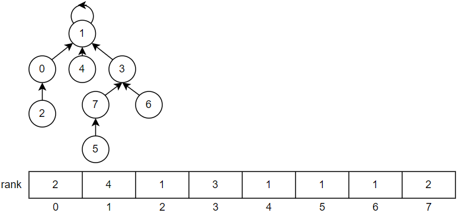
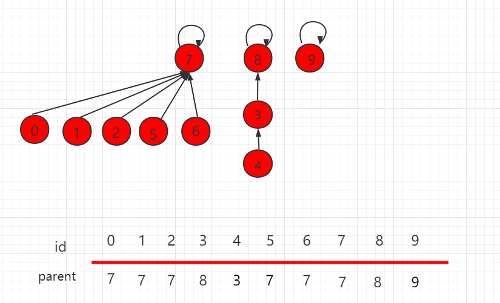
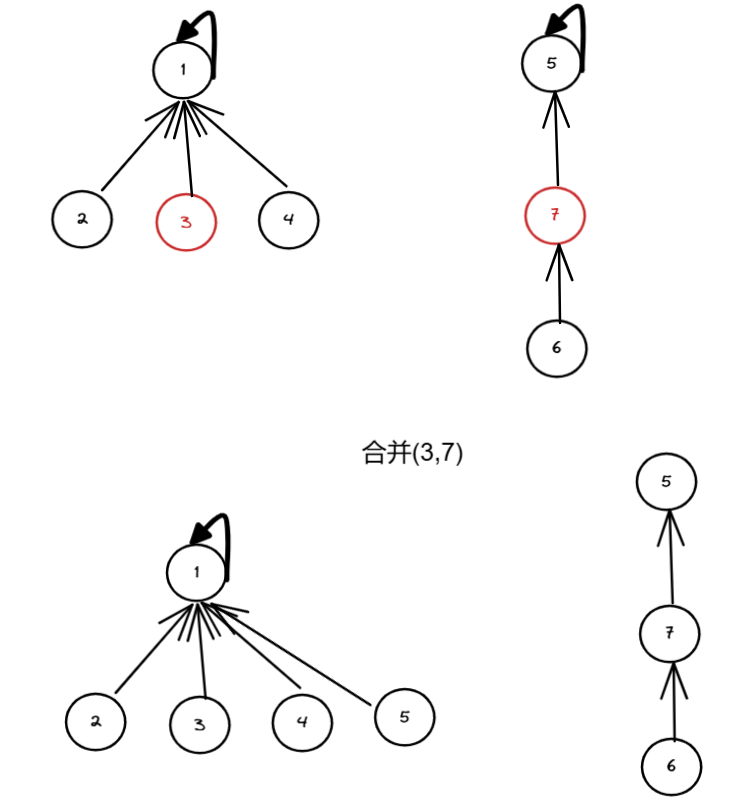
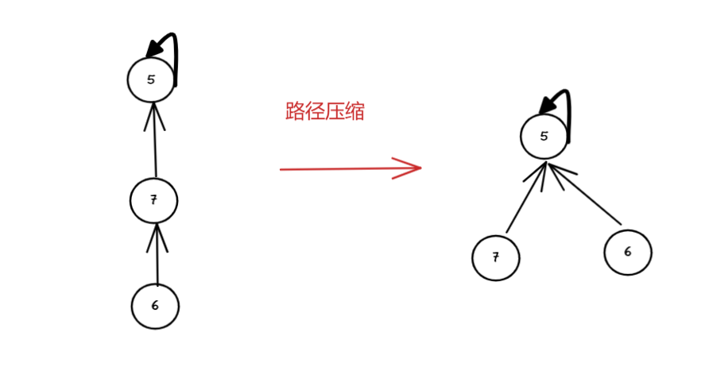
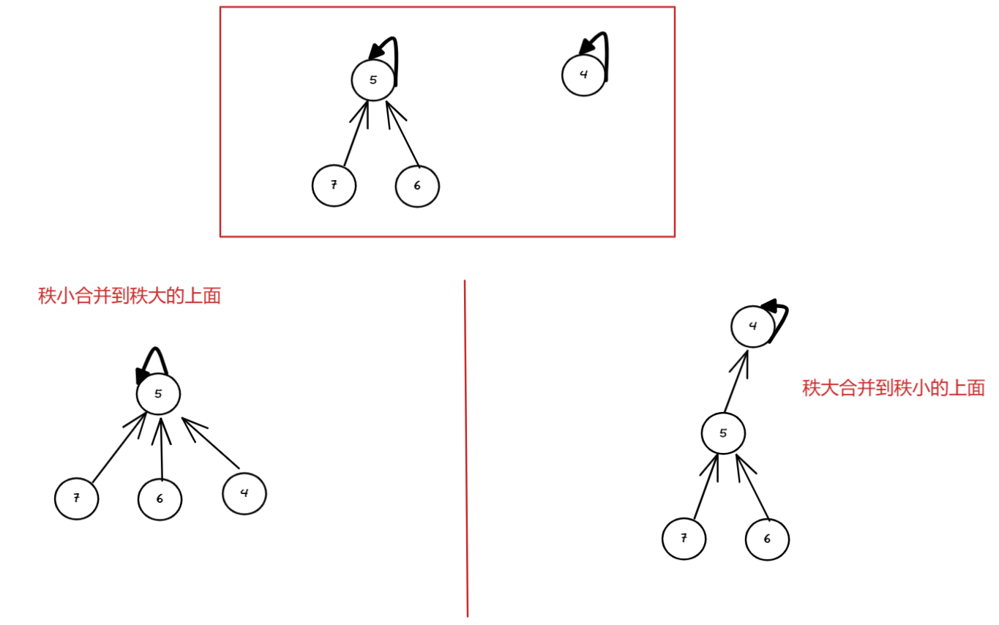

并查集的思想是用一个数组表示了整片森林（parent），树的根节点唯一标识了一个集合，我们只要找到了某个元素的的树根，就能确定它在哪个集合里。


并查集常见的存储方式是使用数组来模拟树结构，利用数组存储每个元素的父节点信息。

数组的下标对应元素编号，数组中存储的值代表该元素的父节点编号。通过不断查找元素的父节点，最终找到根节点，以此确定元素所属的集合。

代码地址：[并查集](https://github.com/xiaoyangst/Code/tree/master/%E6%95%B0%E6%8D%AE%E7%BB%93%E6%9E%84/%E5%B9%B6%E6%9F%A5%E9%9B%86)

# 没有任何优化的实现

```c++
#include <vector>

class UnionFind {
 public:
  explicit UnionFind(int size) {
	  parent_.reserve(size);
	  for (int i = 0; i < size; ++i) {
		  parent_[i] = i;
	  }
  }

  // 查找
  int find(int index) {
	  while (index != parent_[index]) {
		  index = parent_[index];
	  } //该元素的父节点就是它本身，说明该元素是根节点，查找结束，返回该元素
	  return index;
  }

  // 合并两个集合
  void unionSet(int x, int y) {
	  if (x < 0 || y < 0 || x > parent_.size() || y > parent_.size()) {
		  return;
	  }

	  // 找到各自的根节点
	  auto x_root = find(x);
	  auto y_root = find(y);

	  // 可以选择把 x集合 合并到 y 集合
	  // 也可以选择把 y集合 合并到 x 集合
	  if (x_root != y_root) {
		  parent_[y_root] = x_root;
	  }
  }

  // 判断两个元素是否属于同一个集合
  bool isConnected(int x, int y) {
	  return find(x) == find(y);
  }

 private:
  std::vector<int> parent_;
};
```

一个元素所在的集合由其记录的**根节点**下标来表示，两个不同的元素的根节点下标相同，代表属于同一集合。

如下图中 3 、4 、8 同属于同一个集合。



在合并两个集合的时候，只要选择一方的根节点信息设置为另一方的根节点信息，就相当于合并两个集合。

如下图合并 3 所在的集合 和 7 所在的集合。



# 优化

## 查询优化--路径压缩

通过前面那张图，你可以看到，每次查找根节点，都要从下往上去查。

但既然都属于同一个集合了，何不全部指向同一个元素，这样查找就更加快速。见下图：



代码：

```c++
  int find(int index) {
	  while (index != parent_[index]) {
		  parent_[index] = find(parent_[index]);	// 通过递归找到根节点，递归返回过程中把同一条路径的父节点就全部变成根节点了
	  }
	  return parent_[index];
  }
```

## 合并优化--按秩合并

秩可以理解为**集合的**某种“高度”或“规模”。

在合并两个集合时，**将秩较小的集合合并到秩较大的集合中**，这样可以尽量保持树的平衡性，避免树的高度过高，从而提高查找和合并操作的效率。

因此额外添加一个名为 rank_ 的数组，此数组的下标与并查集节点在数组中的位置一一对应，以此建立起明确的映射关系



可见，秩小合并到秩大的上面去，高度更小，后面 find 方法效率更高。

如果两个秩相等，也就随意安排，但需要改变 rank_ 的记录.如 x_parent 合并到 y_parent，就需要 `rank_[x_parent]++`。

代码：

```c++
  explicit UnionFind(int size) {
	  parent_.resize(size);
	  rank_.resize(size, 1);  
	  for (int i = 0; i < size; ++i) {
		  parent_[i] = i;
	  }
  }  
  void unionSet(int x, int y) {
	  if (x < 0 || y < 0 || x >= parent_.size() || y >= parent_.size()) {
		  return;
	  }

	  // 找到各自的根节点
	  auto x_root = find(x);
	  auto y_root = find(y);

	  // 按秩合并
	  if (x_root != y_root) {
		  if (rank_[x_root] < rank_[y_root]) {
			  parent_[x_root] = y_root;
		  } else if (rank_[y_root] < rank_[x_root]) {
			  parent_[y_root] = x_root;
		  } else {
			  parent_[y_root] = x_root;
			  rank_[x_root]++;
		  }
	  }
  }
```
