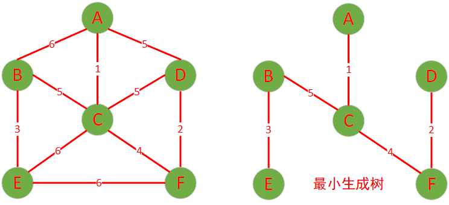
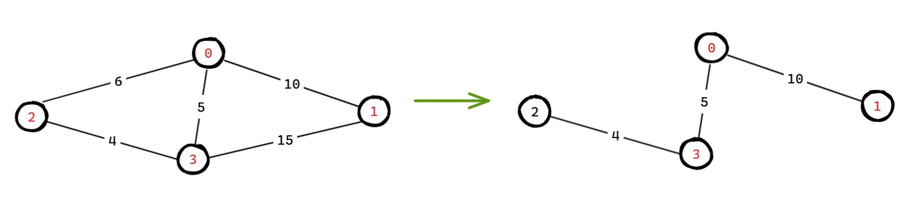
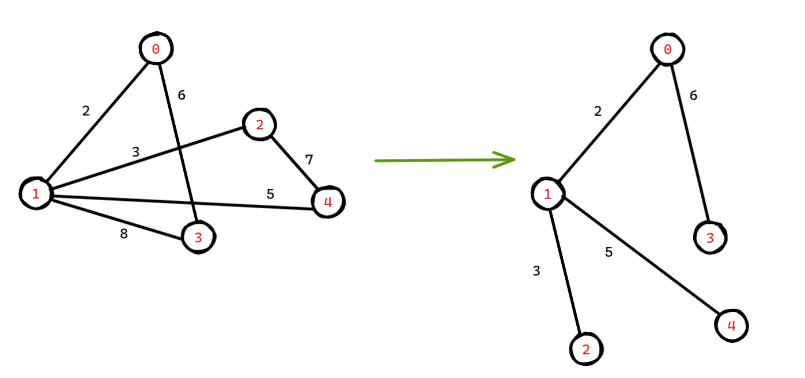

# 最小生成树的性质

- 包含图中所有的节点
- 边数是 n - 1（n 代表节点总数）
- 子图中不包含任何回路（无环），即不存在一条从某个顶点出发，经过若干条边后又回到该顶点的路径
- 这个子图是连通的，也就是说对于图中任意两个顶点，都存在一条路径可以从一个顶点到达另一个顶点

- 在所有可能的生成树中，总边权（边的权值之和）最小



# 克鲁斯卡尔算法（并查集）

基本思想：每次选取权值最小的边，加入生成树中，只要不构成环，直到所有点连通。

代码地址：[克鲁斯卡尔算法](https://github.com/xiaoyangst/Code/tree/master/%E6%95%B0%E6%8D%AE%E7%BB%93%E6%9E%84/%E6%9C%80%E5%B0%8F%E7%94%9F%E6%88%90%E6%A0%91/%E5%85%8B%E9%B2%81%E6%96%AF%E5%8D%A1%E5%B0%94%E7%AE%97%E6%B3%95)

## 基本步骤

1. 排序边：把图中所有的边按照权重从小到大进行排序，**每次选择一条权重最小的边**
2. 初始化并查集：为图中的**每个顶点创建一个独立的集合**（创建一个并查集即可），用于后面判断加入边是否会形成环
3. 选择边：从排序好的边列表中依次选取边，如果该边的两个顶点不在同一个集合（即加入这条变不会形成环），则将这条边加入最小生成树的边集，并将这两个顶点所在的集合合并
4. 重复步骤 3：不断重复步骤 3，直到最小生成树的边数到达 n - 1，此时就得到了图的最小生成树

## 为什么并查集可以判断是否有环？

假设我们尝试加入边 `(0, 3)`，并查集当前状态：

- `find(0) = 0`
- `find(3) = 3`
- 因为 `0 ≠ 3`，所以不成环，可以加入，并执行 `union(0, 3)` 把它们并在一起。

之后再来一条边 `(3, 0)`：

- `find(3) = 0`
- `find(0) = 0`
- 因为相同 → **表示已有路径相连，加这条边会成环**，所以拒绝它。

## 代码实现

```c++
struct Edge {
  int from;
  int to;
  int weight;

  Edge(int from, int to, int weight) : from(from), to(to), weight(weight) {}

  bool operator<(const Edge &other) const {
	  return weight > other.weight;
  }
};

class UnionFind {
 public:
  explicit UnionFind(int size) : parent(size) {
	  for (int i = 0; i < size; ++i) {
		  parent[i] = i;
	  }
  }

  int find(int x) {
	  if (x != parent[x]) {
		  parent[x] = find(parent[x]);
	  }
	  return parent[x];
  }

  void merge(int x1, int x2) {
	  auto new_x1 = find(x1);
	  auto new_x2 = find(x2);
	  if (new_x1 != new_x2) {
		  parent[new_x1] = new_x2;
	  }
  }

 private:
  vector<int> parent;
};

int kruskal(int n, priority_queue<Edge> &edges, list<Edge> &mst) {
	UnionFind union_find(n);
	int total_weight = 0;

	while (!edges.empty()) {
		auto item = edges.top();
		edges.pop();
		if (union_find.find(item.from) != union_find.find(item.to)) {    // 不在同一个集合中
			union_find.merge(item.from, item.to);
			mst.push_back(item);            // 记录优先加入的边
			total_weight += item.weight;    // 记录总的权重

			if (mst.size() == n - 1) {		// 最小生成树已经完成
				break;
			}
		}
	}
	return total_weight;
}
```

示意图：



## 为什么代码中必须判断当前边的数量是否等于 n - 1？

**可以不判断，但效率低**。

如果不加这句，程序会继续遍历所有边，即使已经找到了完整的最小生成树。

这 **不会影响正确性**，但会造成**不必要的计算**，尤其是在边很多（例如稠密图）时，效率会差很多。

# 普里姆算法

基本思想：从一个点出发，每次选择连接当前生成树和“外部”最近的一条边，直到所有点被包含在树中。

代码地址：[普里姆算法](https://github.com/xiaoyangst/Code/tree/master/%E6%95%B0%E6%8D%AE%E7%BB%93%E6%9E%84/%E6%9C%80%E5%B0%8F%E7%94%9F%E6%88%90%E6%A0%91/%E6%99%AE%E9%87%8C%E5%A7%86%E7%AE%97%E6%B3%95)

## 基本步骤

1. 选择起始顶点：任意选择一个顶点作为起始点，将其加入最小生成树的顶点集合（用一个**数组 `visited[]`** 标记哪些点已经在生成树中）
2. 选择最小边：使用优先队列维护当前顶点所有可以连接树的边，每次就从优先队列中取出权重最小的边，我们就可以拿到当前顶点（from）对应的另一个顶点（to）。如果这条边连接的点（to）还不在生成树中（没有被访问过），就加进去，并把这个点所有的出边加入优先队列中
3. 重复步骤 3，直到所有点都加入生成树

## 代码实现

```c++
struct Edge {
  int from;
  int to;
  int weight;

  Edge(int from, int to, int weight) : from(from), to(to), weight(weight) {}

  bool operator<(const Edge &other) const {
	  return weight > other.weight;
  }
};

int prim(int n, vector<vector<Edge>> &edges, list<Edge> &mst) {
	// 把所有定点设置为从未访问
	vector<bool> visited(n, false);
	int total_weight = 0;

	// 随意选择一个顶点
	// 将选择的顶点设置为已访问，并且把能连接的边加入优先队列，选择权重最小的一条边
	visited[0] = true;
	priority_queue<Edge> pq;
	for (const Edge &e : edges[0]) {
		pq.push(e);
	}

	while (!pq.empty()) {
		auto [from, to, weight] = pq.top();
		pq.pop();

		if (visited[to]) continue;    // 已经访问过

		mst.emplace_back(from, to, weight);    // 记录已访问的边
		total_weight += weight;

		// 下面就是访问 to 顶点
		visited[to] = true;
		for (const auto &edge : edges[to]) {
			if (!visited[edge.to]) {    // 只加入未访问的边
				pq.push(edge);
			}
		}
	}
	return total_weight;
}
```

示意图：



# 两种算法的区别

| 特性/维度        | **Kruskal 算法**                     | **Prim 算法**                               |
| ---------------- | ------------------------------------ | ------------------------------------------- |
| **思路核心**     | 贪心选边：每次选最小边（不成环）     | 贪心扩展点：从已选顶点延伸最小边            |
| **数据结构依赖** | **并查集**（检测是否成环）           | **优先队列（堆）** + 访问标记               |
| **图结构依赖**   | 边集（Edge List）                    | 邻接表或邻接矩阵                            |
| **适合图类型**   | **稀疏图**（边少，节点多）           | **稠密图**（边多）                          |
| **边处理方式**   | 全局排序后按权重选取边               | 从当前树延展，按权重扩展                    |
| **终止条件**     | 选满 n−1 条边                        | 所有点都加入生成树                          |
| **环路处理**     | 用并查集避免构成环                   | 用 visited 数组避免重复访问                 |
| **灵活性**       | 易用于处理离线边集、边是输入重点的图 | 更适合点-邻接结构清晰的网络拓扑、地图等场景 |
| **起点依赖性**   | 与起点**无关**                       | 与起点**有关**（不同起点结果结构可能不同）  |

## 既可以应用于有向图，也可以应用于无向图？

**不可以直接用于有向图。两者都**主要**用于**无向图的最小生成树（MST）问题。

## 图的存储不同

**Kruskal 算法** 是以边为单位，而 **Prim 算法** 是以顶点为单位，两者在存储图结构的时候有所不同：

```c++
// Kruskal 算法

vector<Edge> edges = {
	{0, 1, 10},
	{0, 2, 6},
	{0, 3, 5},
	{1, 3, 15},
	{2, 3, 4}
};

// Prim 算法

graph[0].emplace_back(0, 1, 2);
graph[1].emplace_back(1, 0, 2);

graph[0].emplace_back(0, 3, 6);
graph[3].emplace_back(3, 0, 6);
```

## 树的结构可能不同，权重值不变

**Kruskal 算法** ：树的结构确定，权重确定

**Prim 算法** ：树的结构不确定，权重确定

Prim 算法选择不同的起始点，会导致树的结构不确定，但是 Kruskal 算法 的边的选择是唯一的。
