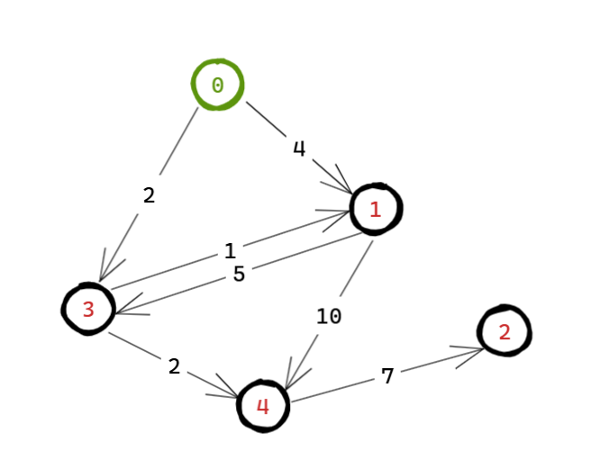

# 迪杰斯特拉算法

基本思想：**贪心地**选择当前距离起点最近的点，然后“更新”其相邻节点的最短路径。

1. 起初，起点到自己的距离为 0，其余为正无穷（暂时不知道最短路径，初始化为正无穷）
2. 使用优先队列（小根堆）维护当前最短路径的节点值
3. 每次从队列中取出当前距离最小的点 from
4. 遍历 from 的每一个邻居 to， 如果 `dist[to] > dist[from] + weight(to,from)`，则更新并加入堆
5. 重复直到所有点都处理完

```c++
struct Edge {
  int from = 0;
  int to = 0;
  int distance = 0;

  Edge(int from, int to, int distance) : from(from), to(to), distance(distance) {}
};

using NodeInfo = pair<int, int>;    // distance（距离） from（顶点）

vector<int> dijkstra(int start, vector<vector<Edge>> &graph) {
	// 起初，起点到自己的距离为 0，其余为正无穷
	int n = graph.size();
	vector<int> dist(n, numeric_limits<int>::max());
	dist[start] = 0;
	// 把起始顶点加入优先级队列，探索开始
	priority_queue<NodeInfo, vector<NodeInfo>, greater<>> pq;
	pq.emplace(0, start);

	while (!pq.empty()) {
		auto [cur_distance, cur_from] = pq.top();
		pq.pop();

		if (cur_distance > dist[cur_from]) continue;    // 已经有更短的路径

		for (auto &edge : graph[cur_from]) {    // 访问 node 的所有邻居
			auto [from, to, distance] = edge;
			if (dist[to] > dist[cur_from] + distance) {    // 有更短的路径出现，更新
				dist[to] = dist[cur_from] + distance;
				pq.emplace(dist[to], to);
			}
		}
	}

	return dist;
}
```

由于我们会重复将更新后的点压入堆中，可能一个点会出现多次（旧的和新的）。

因此：`if (d > dist[u]) continue; // 忽略旧的、不再有效的路径`

示意图：



测试结果：

```tex
start : 0 -->  dest : 0  min distance : 0
start : 0 -->  dest : 1  min distance : 3
start : 0 -->  dest : 2  min distance : 11
start : 0 -->  dest : 3  min distance : 2
start : 0 -->  dest : 4  min distance : 4
```

# 弗洛伊德算法

**多源最短路径算法**，用于求出 **图中任意两个点之间的最短路径**，无论起点终点是谁，都能一并计算出来。

**枚举中转点 k**，检查从 i 到 j 的路径是否可以通过 k 来“走得更短”。

令 `dist[i][j]` 表示点 `i` 到点 `j` 的最短路径距离：

```c++
dist[i][j] = min(dist[i][j], dist[i][k] + dist[k][j])
```

由于时间复杂度是 O(n^3)，所以一般只用于 **n ≤ 500** 的小图。


# 贝尔曼 - 福特算法


# A* 启发式搜索


# SPFA 算法